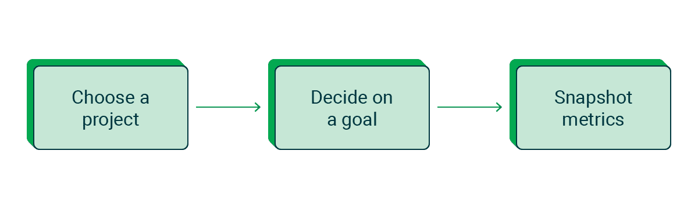
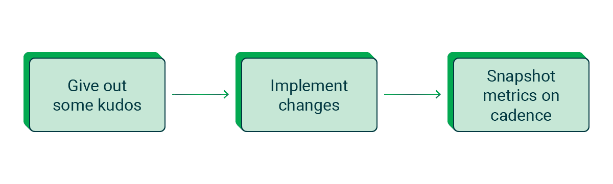

# 如何查看您的 CircleCI 配置

> 原文：<https://circleci.com/blog/review-your-circleci-configuration/>

配置文件可能需要一些时间来设置，但是在初始推送之后，它们很容易被遗忘。“如果它没有坏，就不要修复它”是许多开发人员对他们的配置文件采取的一种常见方法。但是当涉及到您的持续集成管道时，小的改变可以带来巨大的好处。在 CircleCI，我们推出新功能和更新的速度比以往任何时候都快，定期检查和更新您的配置可以显著缩短工作流程持续时间。

为了帮助投资了我们的支持计划的客户充分利用 CircleCI，我们的 DevOps 客户工程(DCE)团队定期提供配置文件审查。DCE 团队审查了数百个配置文件，并创建了一个可用于任何项目的流程。在本文中，我们将介绍 DCE 的审核流程，以便您能够进行自己的配置审核。你可以成为减少管道反馈回路的人。想象一下，你的团队能够在倒满咖啡的时间内，而不是在吃午饭的时间内，推送代码和接收反馈。

## 什么是配置审查？

配置审查不仅仅是查看 YAML 文件。它应该被视为一个关键过程，被计划出来，并记录在案。我们建议选择一个项目并至少每年进行一次评审，如果不是每六个月一次的话，然后将结果记录在团队其他成员可以访问的文档中。记录基线度量、评审期间做了什么，以及结果可以说与评审本身一样有价值。有了这些信息，您的团队可以建立一个特定于您的用例的 CI 知识库，并可以用于未来的评审或新项目。

配置审查的主要目标是分析您项目的配置文件，以确保与您的度量目标相比，管道以最佳方式运行。我们的 [Insights 仪表盘](https://circleci.com/docs/insights/#overview)是在此过程中跟踪指标的绝佳方式。如果您的团队使用另一个度量应用程序，您可以使用我们的 [Insights API](https://circleci.com/docs/api/v2/#tag/Insights) 将数据拉入其中。为您的团队执行配置审查也是了解 CircleCI 如何工作的一个好方法。我们建议利用这段时间记录特性如何与您的用例一起工作，以及它们是如何在您的工作流中实现的。

## 准备配置审查

在开始审查您的配置之前，有几个重要的步骤将有助于确保您的审查是有效的。在准备阶段，您需要选择一个要评审的项目，确定您的评审目标，并建立一些基准指标来衡量您向目标迈进的进度。

### 选择要审阅的项目和工作流

大多数团队都有不止一个项目，审查多个项目配置可能会让人不知所措。当 DCE 与客户一起审查他们的配置文件时，我们一起决定要关注的特定项目。选择项目的三大原因是:

*   高信用消费
*   长工作流程持续时间
*   过于复杂的配置

选择一个项目还有很多其他原因。也许这是对其他项目的概念验证，一个已经有一段时间没有接触过的项目，或者一个有着令人担忧的度量标准的项目。

### 决定目标

选择一个项目后，您需要为评估确定一个目标。您是否希望通过缩短工作流程来提高开发人员的工作效率？信用消费需要优化吗？自从上次检查配置以来，您可能正在考虑实现新的 CircleCI 特性。

无论您的团队选择什么目标，都要写下来，以便将来进行评审的任何人都可以理解评审使用了哪种方法。

### 利用洞察力收集基线指标

既然你已经设定了目标，你如何知道你的评估过程是否成功呢？

CircleCI 是为数不多的能够洞察团队指标的 CI 工具之一。使用 Insights 工具，您需要收集项目和/或工作流的四个关键指标:

*   持续时间
*   吞吐量
*   接通率
*   平均恢复时间

如果您想了解更多关于我们为什么认为这是四个关键指标的信息，我们建议通读我们的[软件交付状态报告(2022)](https://circleci.com/resources/2022-state-of-software-delivery/) ，在那里我们将对它们进行更详细的分析。

这些指标可能并不是跟踪你的目标成功所必需的，但是记下它们来设定一个基线是有帮助的。在实现了对配置文件的更改之后，我们将获取额外的指标快照，并将它们与这个快照进行比较，以查看更改是如何实现的。

这也是确定哪些指标对这个项目很重要的好时机。每个项目都是不同的，所以用来决定每个项目成功的标准也是不同的。如果你正在优化信用消费，那么持续时间是一个很好的衡量标准，因为它会直接影响信用。如果您的目标是整体效率，那么除了持续时间之外，您还需要关注使用 Docker 执行器的作业的资源使用情况。

除了这四个关键指标之外，可能还有其他对单个工作流很重要的指标。其中许多，像[古怪的测试](https://circleci.com/docs/insights-tests/#flaky-tests)和信用使用，都包含在 Insights 中。如果洞察工具中添加了您感兴趣的指标，[请告诉我们](https://circleci.canny.io/insights)。

## 查看您的 CircleCI 配置文件

一旦您确定了您的目标并记录了您的基线指标，您就准备好开始评审的实质内容了。如果您想通过回顾来了解更多关于您的 pipelines 和/或 CircleCI 的信息，建议您通读下一部分，以便更熟悉您团队的用例。如果您对团队的管道工作方式感到满意，可以直接跳到配置文件。

### 了解您的工作流程

如果您不熟悉 CircleCI 和/或您团队的工作流程，我们建议您从 Insights 仪表盘开始查看项目。在审查配置时，对工作流中的预期内容及其结果有一个大致的了解是很有帮助的。使用 Insights 工具，您可以查看项目中特定工作流和作业的指标。Insights dashboard 最多显示最近 100 次工作流运行，您可以调查任何异常运行。还建议单击最近 10 次左右的工作流运行，以确保作业以一致的方式运行。回顾每项工作中的步骤、它们的输出以及它们各自的度量标准也有助于确定任何不一致之处。

## 深入配置文件

在 UI 中打开配置文件将使您能够访问 CircleCI 自动提供的任何通知横幅或建议。不要觉得你需要先解决这些问题。请记下它们，以便稍后我们深入查看配置文件时使用。在整个评估过程中，记录与您的目标相关的变化以及出现的任何问题及其答案。这也是记录任何可以解决的小问题的好时机，比如过时的注释或不一致的命名约定。

在这一点上，如果您觉得更舒服，可以随意切换到您最喜欢的代码编辑器。你花时间设置这些颜色是有原因的。在回顾过程中，我们将在工作流/作业用户界面和配置文件之间切换，以便同时打开两者。如果您还没有，请不要忘记在 UI 中至少打开一次配置文件，以查看任何重要的通知。

### 配置文件布局

CircleCI 的配置文件不要求配置文件版本、设置、orb、作业或工作流的特定顺序。如何组织他们取决于你的团队。然而，以下形式对许多团队来说是成功的:

*   配置文件版本(当前为 2.1)
*   设置，如果您的团队使用[动态配置](https://circleci.com/docs/dynamic-config/)
*   定制逻辑，例如:
    *   球
    *   命令
    *   因素
    *   YAML 锚
*   乔布斯
*   工作流程
    *   提交触发的工作流
    *   工作流设置为通过预定管道触发

### 定制的逻辑、执行器和球体

配置文件版本和使用 setup boolean 非常简单，所以让我们回顾一下 CircleCI 提供的各种定制选项，从定制逻辑开始。

#### 定制逻辑

定制逻辑包括[命令](https://circleci.com/docs/configuration-reference/#commands-requires-version-21)，[参数](https://circleci.com/docs/configuration-reference/#parameters-requires-version-21)，[执行器](https://circleci.com/docs/configuration-reference/#executors-requires-version-21)，YAML 锚点。您很可能需要保留您当前使用的所有参数，但是最好回顾一下它们，看看另一个特性，比如 [contexts](https://circleci.com/docs/contexts/) ，是否会更合适。命令、执行器和 YAML 锚我们可以做得更多。当您需要时，在配置文件中编写快速定制确实很容易，但是在您添加了一些之后，它会开始降低配置文件的可读性。这就是球体可以帮忙的地方。

#### 球

如果你的团队还没有使用[球体](https://circleci.com/docs/orb-intro/)，它们会非常方便。本质上，它们是 YAML 逻辑的包，可以用命令访问，而不用在配置文件中写出完整的逻辑。已经有很多经过认证的第三方 orb 可用，搜索一下 [orb 注册表](https://circleci.com/developer/orbs)看看哪些对你的技术有帮助是个好主意。

如果你的团队不愿意使用公共球，CircleCI 还提供了[私有球](https://circleci.com/blog/building-private-orbs/)来限制一个球只能被你的组织使用。orb 对于从配置文件中提取冗长的代码、多次使用的代码或者在多个项目中使用的代码非常有用。当您浏览配置文件时，考虑您可以向 orb 传输什么。

如果您的团队已经在使用 orb，您将需要检查您正在使用的 orb 是否有任何更新的版本。在 orb 注册表中的 orb 页面上可以找到其他可用的命令、作业或其他功能。

#### 实施者

CircleCI 提供了各种各样的[执行环境选项](https://circleci.com/docs/executor-types/)供您选择，因此查看当前正在使用的选项是实现您的查看目标的一个很好的方式。

作为第一步，检查执行环境是否有更新是一个好主意。假设你的团队正在使用一个[便利 Docker 镜像](https://circleci.com/docs/circleci-images/)，去[镜像库](https://circleci.com/developer/images?imageType=docker)看看有什么更新。如果你的团队没有使用这些图片，为什么不检查一下呢？它们被很好地缓存，这减少了启动时间。如果您正在使用另一个执行环境，您可以在[配置参考文档](https://circleci.com/docs/configuration-reference/#docker-machine-macos-windows-executor)中找到可用选项的列表，并检查是否有任何更新。

除了检查应该使用哪个执行器之外，您还可以确认当前使用的[资源类](https://circleci.com/docs/configuration-reference/#resourceclass)是否适合这项工作。当使用 Docker executor 时，CircleCI 提供了[在作业生命周期](https://circleci.com/blog/optimize-resources-dashboard/)中监控资源消耗的能力，这对于这一阶段的审查非常方便。您还可以在 Insights 的“任务”选项卡上查看多次运行的任务资源使用历史记录。我们希望在将来为其他执行环境添加相同的特性，但是现在，如果您使用的是除 Docker 之外的 executor，您将需要自己在作业中添加资源日志。

默认情况下，新作业将使用更大的资源类，因此对于像林挺或 API 调用这样的简单作业，可以考虑降低资源类的大小。我们建议总是在配置文件中设置您自己的资源类，而不是使用默认的。

### 工作和功能

每个[作业](https://circleci.com/docs/jobs-steps/)都是独特的，因此很难提供关于如何在作业级别进行优化的一揽子建议。好消息是 CircleCI 提供了相当多的关于工作中发生的事情的可见性。您想要首先查看哪个作业取决于您，但是最终，您会想要查看 UI 中的每个作业，以确认它是否按预期工作，并查看是否可以根据您的配置审查目标来优化它。

首先在 CircleCI 中打开作业，并逐一检查每个步骤。检查作业的多次运行以确认某项内容是否为异常值会很有帮助。使用这种方法可能会遇到的一些常见问题有:

如果缩短持续时间是您的目标之一，那么考虑引入或增加作业的并行性是一个好主意。与测试分割一起使用， [parallelism](https://circleci.com/docs/parallelism-faster-jobs/#specifying-a-jobs-parallelism-level) 可以极大地减少持续时间，这取决于设置测试需要多长时间。如果您的目标是信用优化，考虑是否可以减少使用的容器数量。

当您浏览您的作业时，您可能会发现相同的测试正在不同的执行环境中运行。为了帮助提高配置可读性，考虑是否可以利用[矩阵作业](https://circleci.com/docs/configuration-cookbook/#use-matrix-jobs-to-run-multiple-os-tests)。你可能还会发现，逻辑在不同的工作中不断重复。这是 orbs 可以提供帮助的另一个地方，通过提取逻辑，使它不仅可用于这个项目，而且可用于您的整个组织。

根据您最后一次进行配置审查的时间，可能已经发布了一些新的特性，您的团队可以利用这些特性。我们的[公开路线图](https://circleci.com/product-roadmap/)和我们的[变更日志](https://circleci.com/changelog/)是很好的资源，可以看看最近都有什么。虽然 CircleCI 上的所有特性在配置文件中都是可用的，但另一个资源是[配置文件参考](https://circleci.com/docs/configuration-reference/)，在那里你可以读到任何你不熟悉的特性。

### 工作流程

与工作类似，[工作流](https://circleci.com/docs/workflows/)往往是独特的。虽然有像构建-测试-部署这样的标准工作流，但是每个组织都有自己的设置方法。与 jobs 一样，首先在 CircleCI 中打开工作流。

当您查看工作流程时，需要记住一些一般提示，其中最主要的是工作顺序是否符合您当前的需求。也许你可以通过加速失败或者将较短的测试放在较长的测试之前来给你的开发人员提供反馈。当您的某些作业可以并行运行时，它们可能会按顺序运行。为你的团队创造合适的需求可能需要一些实验，这没关系。Insights dashboard 提供了许多功能和指标，可以帮助您决定哪个工作流设置适合您。

最后，如果你正在使用任何[过滤](https://circleci.com/docs/configuration-reference/#jobfilters)或[逻辑语句](https://circleci.com/docs/configuration-reference/#logic-statements)，你将想要确认它们是否按预期工作。如果您不使用这些功能，请考虑将它们添加到您的工作流中，以帮助确保作业仅在需要时运行，例如仅在默认分支上运行的部署作业。看看他们，看看他们是否适合你的团队。

## 事后审查

既然审查已经完成，还需要采取一些步骤，但最困难的部分已经完成。干得好！

### 适时给予的应得的赞扬

当您在进行配置评审时，您团队中的某个人可能已经实现了一些节省每个人时间的东西。也许在另一个项目中有一些你没有意识到的有用的逻辑。如果你确实发现了一些很酷的东西，那就把它归功于实现它的人。每个人的工作都应该得到认可，包括你做的评估。

### 实施变更

实施变革时，确定预期的结果很重要。如果您的团队决定增加某项工作的并行性，单独测试这一变化可能是个好主意，这样度量就不会被其他变化所掩盖。如果您发现有多个变更具有较小的预期结果，请在测试时随意将它们组合在一起。为这些变更创建一个测试分支将允许您快速确定一个变更将如何在短期内影响您的度量，并允许您测试各种程度的变更，例如不同的并行级别。

### 比较指标

无论您选择哪种方式来实施变更，在变更之前和之后定期使用洞察力来进行度量都是一个好主意。一旦进行了更改，建议以逐渐增加的时间间隔拍摄项目度量的快照。这不仅会证实或否定预期的结果，而且还允许您监控任何指标的波动。

仍然不相信 Insights 如何帮助您检查和优化您的配置文件？查看[我们的 Insights 团队如何使用 Insights 来执行他们自己的配置审查](https://circleci.com/blog/how-the-insights-team-uses-insights-to-optimize-pipelines/)。

## 结论

在整个过程中，您已经学习了如何使用 Insights 来为项目设定目标，审查 CircleCI 配置文件，并实施变更以达到那些指标目标。我们发现 CircleCI 提供了您需要的一切，从见解到 UI 横幅建议，帮助您完成配置审查之旅。我希望这里已经为您展示了深入研究您团队的配置文件的价值。

如果你做到了这一步，恭喜你！你可能已经注意到这个过程可能相当复杂，并对自己说，“我没有时间做这个，但我看到了好处。”好消息是，我们之前谈到的那些 DevOps 客户工程师可以为您的团队进行配置审查。我们的 DCE 已经完成了大量配置审查，并针对各种使用情形汇编了最佳实践数据。除了配置审查，我们还提供许多增值服务供您的团队利用，包括帮助项目迁移到 CircleCI 和功能培训。如果您的团队希望与我们的 DCE 会面进行配置审查，请随时联系我们的[销售团队来升级您的支持计划](https://circleci.com/support/plans/)。