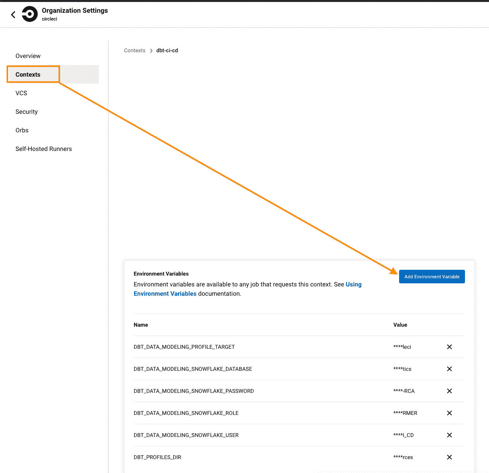
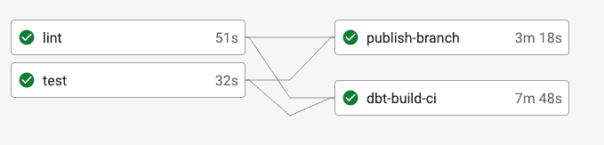
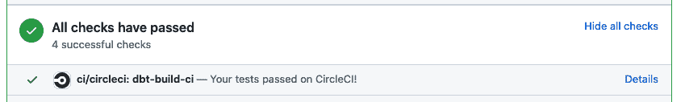

# 与 CI/CD | CircleCI 并行运行 dbt 测试

> 原文：<https://circleci.com/blog/run-dbt-tests-in-parallel/>

软件开发周期中的一个困难挑战是提高开发速度，同时确保代码质量保持不变。近年来，数据世界已经采用软件开发实践来测试部署前的数据更改。测试过程可能非常耗时，并且容易出现意外错误。

例如，在 CircleCI，我们的数据团队在规模上使用 [dbt](https://www.getdbt.com/product/what-is-dbt/) 。直到最近，我们一直在经历由 dbt 云中的长时间测试运行导致的部署瓶颈。为了解决这个问题，我们建立了 CircleCI 来自动测试和部署我们的数据变更，以便我们能够尽快地向我们的数据消费者交付高质量的数据模型版本。在本帖中，我们将带您了解如何使用 CircleCI 和 [dbt](https://www.getdbt.com/product/what-is-dbt/) 根据生产副本自动测试您的数据更改，以确保数据完整性并提高您的开发速度。

本教程假设你是一个活跃的 CircleCI 用户。如果你是这个平台的新手，你可以[注册一个免费账户](https://circleci.com/signup/)并按照我们的[快速入门指南](https://circleci.com/docs/getting-started-guide-experimental/)进行设置。

## dbt 是什么？

dbt 是一个数据转换工具，它允许数据人员将模块化的 SQL 与软件工程的最佳实践相结合，以实现可靠、迭代和快速的数据转换。您可以通过 dbt CLI(命令行界面)或 dbt Cloud 与 dbt 进行交互。在 CLI 版本中，您可以完全控制您的数据项目配置，并能够根据需要发布文档，而 dbt Cloud 提供了一个用户界面，可以为您设置一些配置并自动生成 dbt 文档。

## 为什么 dbt 在数据工程和分析中有用？

dbt 是一个强大的数据工具，允许您遍历表的变化，而无需手动修改 UPSERT 语句。您可以用模块化的方式编写 SQL，并使用参数化查询或 dbt 提供的本机测试函数来配置数据测试。它有助于跟踪您的数据依赖性，并集中您的数据转换和文档，确保重要业务指标的单一来源。此外，它允许您在将数据发布到生产环境之前，测试您对数据的假设，以确保数据的完整性。

## dbt 云中的并发问题

通过使用 dbt [slim CI 函数](https://docs.getdbt.com/docs/dbt-cloud/using-dbt-cloud/cloud-enabling-continuous-integration#slim-ci)，您可以使用 dbt Cloud 为您的数据测试建立一个[持续集成和持续交付(CI/CD)管道](https://circleci.com/blog/what-is-a-ci-cd-pipeline/)。您可以将它连接到您的 GitLab 或 GitHub 存储库，并配置测试作业在每个新的 pull 请求时触发。测试作业状态将直接出现在拉式请求中，以帮助您提高审核流程的效率。

但是，当前的 dbt 云 CI/CD 流程存在一些问题。首先，dbt Cloud CI/CD 流程目前一次只允许一个作业，如果有多个拉请求合并到生产中，这会降低部署速度。它适用于只有一两个活跃 dbt 贡献者的小型数据团队，但当我们的分析部门开始扩展，分析师开始更频繁地贡献和部署 dbt 时，它就会显示出它的局限性。对于大型数据部署，它可能会使所有其他部署变慢一整天。

此外，当拉请求中有多个提交时，dbt 云测试不能[自动取消冗余工作流](https://circleci.com/docs/skip-build/#auto-cancelling/)，这会影响分析开发的测试速度。

## 如何使用 CircleCI 并行运行 dbt 测试并启用自动取消

通过使用 CircleCI、dbt 和雪花，针对生产数据运行并行 dbt 测试和自动取消冗余工作流变得可行。概括地说，这些步骤是:

1.  为 dbt CI 作业创建一个 dbt 概要文件，以验证您的数据模型和测试。
2.  配置 dbt 来设置自定义模式，以允许 pull 请求在其各自的容器中运行数据模型和数据测试。
3.  在 CircleCI 中设置一个 Python 环境，为 dbt 测试做准备。
4.  在 CircleCI 中设置 dbt 运行和测试，以测试修改后的数据文件。

### 创建 dbt 概要文件

首先，在`profiles.yml`中配置一个 dbt-ci 概要文件:

```
circleci:
    # use user and password auth
    type: snowflake
    account: "nxa13674.us-east-1"
    user: "{{ env_var('DBT_DATA_MODELING_SNOWFLAKE_USER', 'not_set') }}"
    password: "{{ env_var('DBT_DATA_MODELING_SNOWFLAKE_PASSWORD', 'not_set') }}"
    role: "{{ env_var('DBT_DATA_MODELING_SNOWFLAKE_ROLE', 'not_set') }}"
    database: "{{ env_var('DBT_DATA_MODELING_SNOWFLAKE_DATABASE', 'not_set') }}"
    warehouse: "XSMALL_WAREHOUSE"
    schema: "public"
    query_tag: "circleci_dbt" 
```

之后，转到 CircleCI 组织设置页面，设置一个 [CircleCI 上下文](https://circleci.com/docs/contexts/#creating-and-using-a-context/)，安全地共享项目中的环境变量。该上下文被命名为`dbt-ci-cd`，因此您可以在 CircleCI YAML 文件中引用它。



### 在 dbt 中设置自定义模式

接下来，设置一个 [dbt 定制模式](https://docs.getdbt.com/docs/building-a-dbt-project/building-models/using-custom-schemas)宏，以允许 pull 请求在容器化的环境中运行数据模型和数据测试:

1.  在您的 dbt 项目的根目录中创建`macros/get_custom_schema.sql`来定制模式配置。
2.  在`get_custom_schema.sql`文件中复制并粘贴下面的代码:

```


   
   
       {# replace everything except letter and number in branch name to be underscore#}
       
       
       
           z_pr_{{ git_branch }}_{{ default_schema }}
       
           z_pr_{{ git_branch }}_{{default_schema}}_{{ custom_schema_name | trim }}
       
   
       
           {{ default_schema }}
       
           {{ custom_schema_name | trim }}
       
 
```

它将在 CircleCI CI 流程中使用标准模式格式`z_pr_<the branch name>_<default schema>`构建 dbt 数据模型，以将 CI 流程生成的数据模型容器化。

### 配置 CircleCI 管道以测试 dbt 数据

最后，为 dbt 配置 CircleCI。

CircleCI 的工作流程是在您的 dbt 项目根目录下的`.circleci/config.yml`下的 [YAML 文件](https://circleci.com/blog/what-is-yaml-a-beginner-s-guide/)中定义的。默认情况下，CircleCI 会在每次提交到存储库时自动触发测试过程，也可以手动触发。以下是设置流程的步骤:

1.  在您的 dbt 项目的根目录中创建`.circleci/config.yml`
2.  复制并粘贴下面的 YAML，以设置您的 dbt CI 流程。我们在 CircleCI 使用[poems](https://python-poetry.org/)来管理我们的 Python 依赖，但是你可以使用任何你喜欢的 Python 依赖管理工具。dbt CI 流程使用 [dbt 的 state:modified run 方法](https://docs.getdbt.com/reference/node-selection/methods#the-state-method)在生产环境中运行和测试修改后的 dbt 数据模型。

```
commands:
 setup-python-dependencies:
   description: Setup the python environment for testing and linting
   steps:
     - checkout:
         path: ~/project
     - restore_cache:
         keys:
           - v1-poetry-cache-{{ arch }}-{{ .Branch }}-{{ checksum "poetry.lock" }}
           - v1-poetry-cache-{{ arch }}-{{ .Branch }}
           - v1-poetry-cache
     - run: echo "export PATH=$HOME/.poetry/bin:$PATH" >> $BASH_ENV
     - run: curl -sSL https://raw.githubusercontent.com/python-poetry/poetry/master/get-poetry.py | python -
     - run: poetry install
     - save_cache:
         key: v1-poetry-cache-{{ arch }}-{{ .Branch }}-{{ checksum "poetry.lock" }}
         paths: /virtualenvs

jobs:
  dbt-build-ci:
	executor: python
	steps:
  	- setup-python-dependencies
  	- run: poetry run dbt deps --project-dir resources
  	- run:
      	name: compile dbt manifest in master branch
      	# use --target prod so the --defer will work correctly
      	command: |
        	git checkout master
        	poetry run dbt debug --project-dir resources --target prod
        	poetry run dbt compile --project-dir resources --target prod
        	mv resources/target/manifest.json .
  	- run: git checkout ${CIRCLE_BRANCH}
  	# separate run and test because "dbt build" will fail all downstream if upstream tests fail. We still want to see all tests results if the test failure is from production
  	# currently there is a version bug with state:modified.body, we will add state:modified.body back once we update dbt to be 1.0.4;
  	- run: poetry run dbt run --models state:modified --defer --state ~/project --exclude tag:skip-ci --project-dir resources -x
  	- run: poetry run dbt test --models state:modified --defer --state ~/project --exclude tag:skip-ci --project-dir resources

workflows:
  commit:
  	- dbt-build-ci:
      	context: dbt-ci-cd
      	filters:
        	branches:
          	ignore:
            	- master 
```

### 在 CI/CD 管道中运行并行 dbt 测试

一旦您将您的变更推送到您的版本控制工具，CircleCI 将自动为您启动测试过程。单个任务可以并行运行。



现在你有一个成功的构建！



## 结论

您已经成功地在持续集成管道中设置了数据测试工作流！随着您的数据团队开始扩展，在发布到生产环境之前测试您的数据更改是一个重要的步骤。它帮助数据团队更快地迭代，并确保涉众对数据的信任。在持续集成管道中运行数据模型测试可以帮助您的数据团队扩展其工程和分析过程。

如果您有兴趣了解更多关于 CircleCI 的信息，并加入我们的数据团队，了解我们如何将软件开发流程应用于数据，请查看我们招聘页面上的[空缺职位。](https://circleci.com/careers/jobs/)