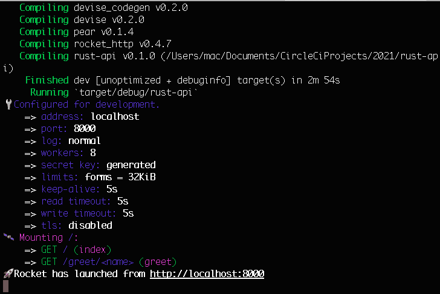
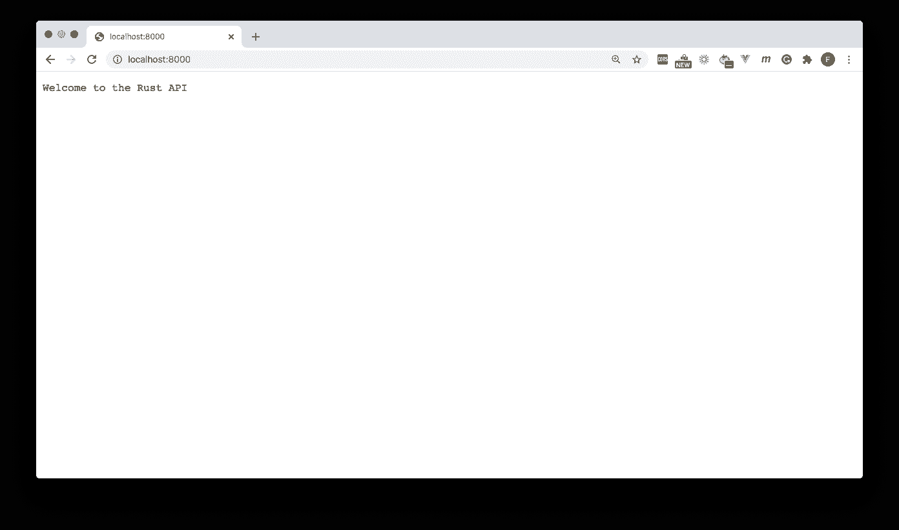
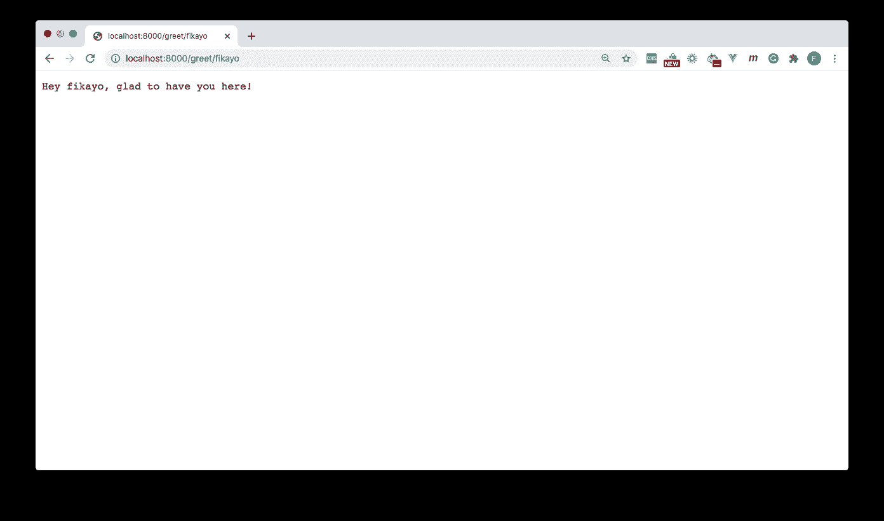
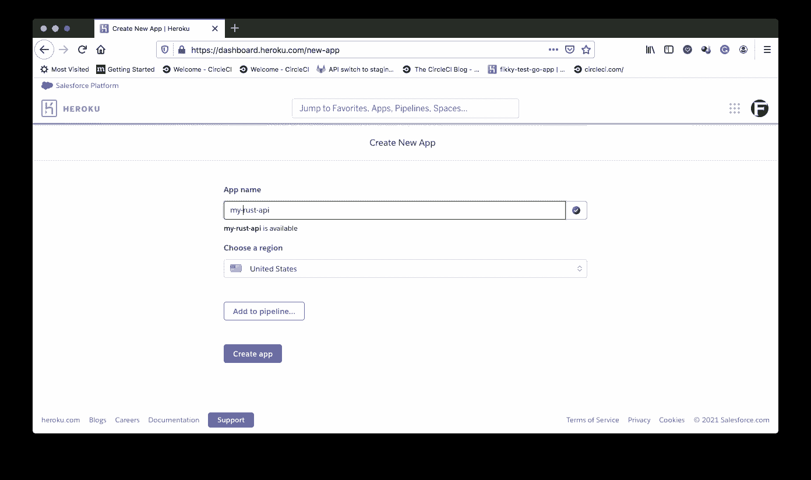
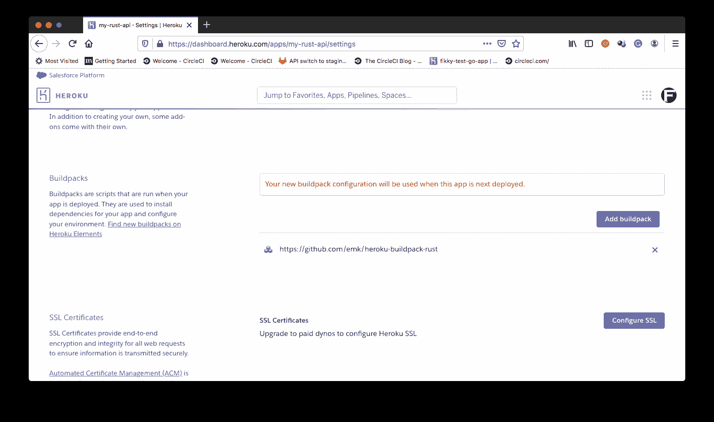
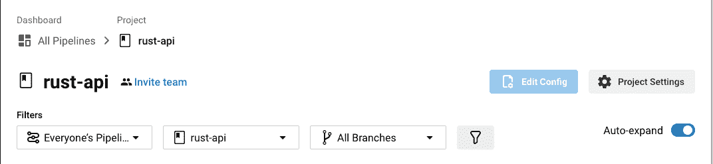
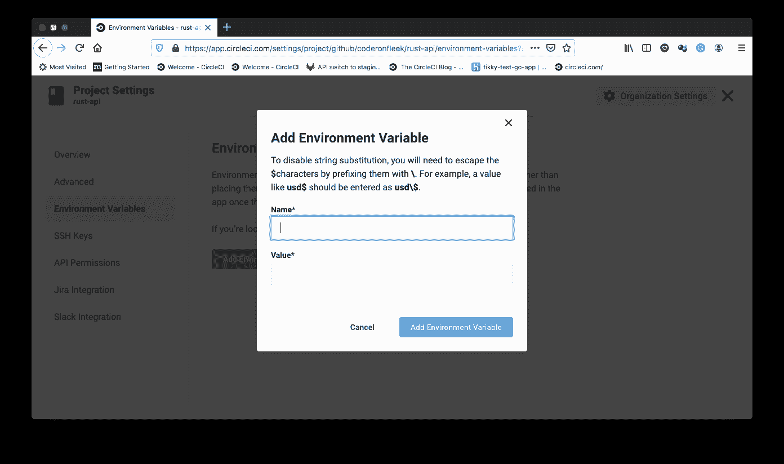
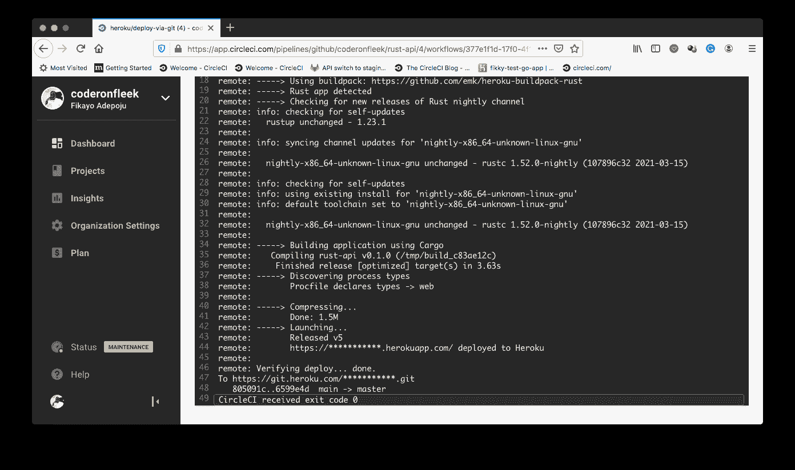
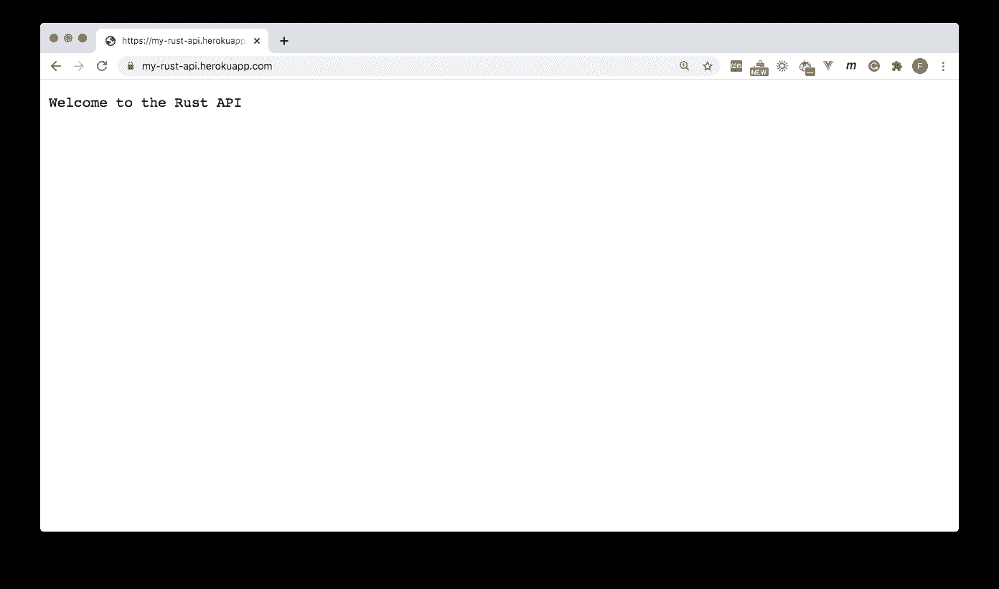
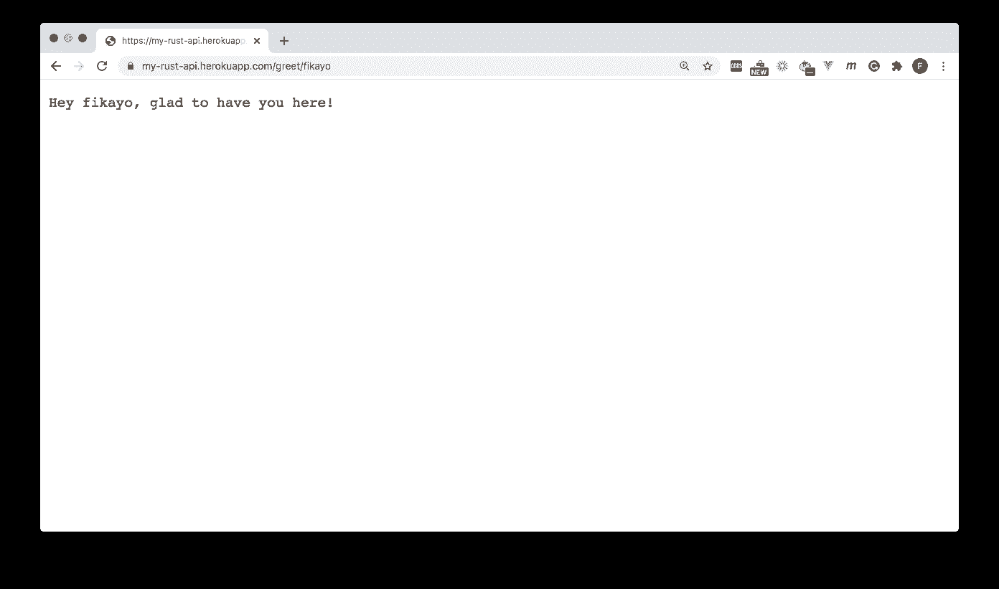

# 持续部署 Rust 应用程序| CircleCI

> 原文：<https://circleci.com/blog/rust-cd/>

Rust 是一种速度极快、记忆效率高的语言，大约在十年前首次出现。随着 [WebAssembly](https://developer.mozilla.org/en-US/docs/WebAssembly) 的流行，Rust 最近获得了很大的动力，这种语言允许像 C++、C 和 Rust 这样的语言在 web 浏览器中运行。这使得开发人员能够构建高性能的应用程序，并为 web 应用程序提供 web 平台上没有的本机功能。

在本教程中，您将学习如何将 Rust 应用程序部署到托管平台。然后，您将通过构建一个[连续部署管道](https://circleci.com/blog/what-is-a-ci-cd-pipeline/)来自动化其部署。管道将确保应用程序的更改在被推送到您的远程存储库后得到部署。

## 先决条件

要完成本教程，需要做一些事情:

1.  铁锈的基本知识
2.  [Rust](https://www.rust-lang.org/) 安装在你的系统上(在这里找到安装说明
3.  [Heroku](https://heroku.com/) 账号
4.  [CircleCI](https://circleci.com/signup/) 账户
5.  [GitHub](https://github.com/) 账户

所有这些安装和设置，我们可以开始教程。

## 创建 Rust API 项目

首先，通过运行以下命令创建一个新的 Rust 应用程序:

```
cargo new --bin rust-api 
```

这将在`rust-api`文件夹中快速搭建一个基本的 Rust 应用程序。标志指定我们正在构建一个应用程序而不是一个库。一旦这个过程完成，用`cd rust-api`进入文件夹的根目录。

您将使用[火箭](https://rocket.rs/)包构建一个简单的 API 项目。Rocket 提供了一个用 Rust 开发 web 应用的 API。火箭需要`nightly`版本的 Rust。您可以通过在系统的任何地方运行以下命令来全局设置/安装`nightly`版本:

```
rustup default nightly 
```

如果您愿意，您可以通过在项目的根目录下运行以下命令，只为您正在处理的项目设置`nightly`版本:

```
rustup override set nightly 
```

当`nightly`版本设置好后，打开项目根目录下的`Cargo.toml`文件。将火箭添加为依赖项:

```
.....

[dependencies]
rocket = "0.4.7" 
```

web API 将包含两个端点:

*   根(`/`)端点发送欢迎消息
*   `greet`端点接受 URL 参数`name`并以问候作为响应

找到文件`src/main.rs`并用以下代码替换其内容:

```
#![feature(proc_macro_hygiene, decl_macro)]

#[macro_use] extern crate rocket;

#[get("/")]
fn index() -> &'static str {
    "Welcome to the Rust API"
}

#[get("/greet/<name>")]
fn greet(name: String) -> String {
    format!("Hey {}, glad to have you here!", name)
}

fn main() {
    rocket::ignite().mount("/", routes![index,greet]).launch();
} 
```

这段代码定义了两个路由处理函数，每个路由一个:

*   `index`函数向客户端返回一条欢迎消息
*   `greet`函数将`name` URL 参数作为其参数，并返回一个包含问候消息中的`name`的字符串

`main`函数实例化`rocket`web package，装载定义的路由，并启动 web 应用程序。

要运行此项目，请转到应用程序的根目录，并运行:

```
cargo run 
```

这将引导 web 服务器，并在 CLI 上显示以下消息，表明服务器已启动并正在运行。



然后，您可以访问这两个端点。





现在您已经有了一个用 Rust 构建的工作 web API，您可以将它部署到 web 上了。

## 创建 Heroku 应用程序

要部署 Rust API，您需要设置一个 Heroku 应用程序来托管该应用程序。导航到你的 [Heroku 账号管理控制台](https://dashboard.heroku.com/)，进入**新建**->-**新建 app** 。创建一个新的应用程序，给它起一个你喜欢的名字。



记下您刚刚输入的应用程序名称；在本教程的后面部分，您将需要用到它。在你的仪表盘的 [**账户设置**部分找到你的 Heroku API 密匙，并记下来。在教程的后面，您将需要它。](https://dashboard.heroku.com/account)

最后，安装 Rust buildpack。构建包是在部署应用程序时运行的脚本。在这个练习中，您将需要`https://github.com/emk/heroku-buildpack-rust`构建包。

转到 Heroku 应用程序的设置页面，向下滚动到 **Buildpacks** 。点击**添加构建包**。在弹出的界面上，将`https://github.com/emk/heroku-buildpack-rust`链接输入输入栏，然后点击**保存更改**。



## 为部署设置 CircleCI 项目

要在 CircleCI 上设置您的项目，您首先需要[将项目推送到 GitHub](https://circleci.com/blog/pushing-a-project-to-github/) 。

接下来，转到 CircleCI 仪表板上的 Add Projects 页面。


点击**设置项目**按钮。


在设置页面上，点击 **Use Existing Config** 表示您将手动添加一个配置文件，并且不使用示例。系统会提示您下载管道的配置文件或开始构建。


点击**开始建造**。此构建将失败，因为您尚未设置配置文件。我们稍后将完成这项任务。

现在我们需要为刚刚添加的项目设置环境变量。这将为项目提供对 Heroku 应用程序进行部署的认证访问。

确保您的项目是当前选定的项目。点击位于 Pipelines 页面右上角的**项目设置**按钮，进入您的项目设置。



您现在应该在项目设置页面上。在这个页面上，点击侧面菜单中的**环境变量**。

在环境变量页面上，点击**添加环境变量**。



添加这些环境变量:

*   `HEROKU_APP_NAME`是您的 Heroku 应用程序的名称(在本教程中为`cci-rust-api`
*   `HEROKU_API_KEY`是你的 Heroku 账号 API 密匙(可以在 Heroku 账号设置下的账号标签下找到)

现在，您已经在 CircleCI 控制台上为部署到 Heroku 做好了一切准备。

## 自动化 Rust API 应用程序的部署

您的 Rust 配置管理至关重要。配置 Rust 应用程序以部署到 Heroku，这包括为部署设置应用程序和创建部署管道。这个过程有三个步骤:

1.  创建一个`Procfile`来指导 Heroku 如何运行应用程序
2.  创建一个`RustConfig`文件来定义 Heroku 要使用的 Rust 版本(`nightly`)
3.  创建配置管道文件

在 Rust 项目的根目录下，创建一个`Procfile`。添加此命令:

```
web: ROCKET_PORT=$PORT ./target/release/rust-api 
```

该命令指示 Heroku 运行位于`./target/release/rust-api`的构建应用程序的发布版本。通常，这足以让 Heroku 运行大多数 Rust 应用程序。然而，Heroku 使用动态端口，您需要告诉 Rocket 将 web 应用程序绑定到该端口。在指定应用程序的构建位置之前，添加命令`ROCKET_PORT=$PORT`。这将 rocket 的端口环境变量`ROCKET_PORT`设置为 Heroku 在部署时分配的动态端口`$PORT`。

接下来，在项目的根目录下创建文件`RustConfig`。添加这一行:

```
VERSION=nightly 
```

### 创建部署管道脚本

在这个脚本中，我们将使用 [CircleCI 的 Heroku orb](https://circleci.com/developer/orbs/orb/circleci/heroku) 将应用程序从您的 GitHub 存储库直接部署到 Heroku。orb 是易于使用的包，它抽象了许多样板文件和复杂的命令和工作流。使用 orbs 提供了一个开发人员友好的 API，可以在配置文件中使用。

在项目的根目录下，创建一个名为`.circleci`的文件夹，并在其中创建一个名为`config.yml`的文件。在`config.yml`里面，输入这个代码:

```
version: 2.1
orbs:
  heroku: circleci/heroku@0.0.10
workflows:
  heroku_deploy:
    jobs:
      - heroku/deploy-via-git 
```

在这个配置中，Heroku orb `circleci/heroku@0.0.10`被拉入，它提供了对一组强大的 Heroku 作业和命令的访问。其中一个任务是`heroku/deploy-via-git`，它直接从 GitHub repo 向 Heroku 帐户部署应用程序。这项工作已经负责安装 Heroku CLI、安装项目依赖项、运行构建脚本和部署应用程序。它还获取您的环境变量，以便顺利部署到 Heroku 应用程序。

是时候运行部署设置了。提交对项目的所有更改，并推送到您的远程 GitHub 存储库。这将触发部署管道，您应该会获得一个成功的构建。


单击构建作业`heroku/deploy-via-git`查看部署的详细信息。



有时，成功的构建并不完全等同于成功的部署。Heroku 平台本身还有很多可以出错的地方。为了确认你真的成功部署了，进入你的 Heroku 应用仪表板，点击**打开应用**。这将在 Heroku 指定的 URL `https://[APP_NAME].herokuapp.com`打开应用程序。对于本教程，这将是`https://cci-rust-api.herokuapp.com/`。欢迎消息确认部署成功。





干得好！

## 管理您的 Rust API 部署及其他

Rust 编程语言为 web 应用程序带来了大量强大的功能。它能够轻松地与诸如 [Node.js](https://nodejs.org/) 之类的框架集成，这使得开发人员能够为 Node.js 应用程序和整个 web 添加更多的性能。在本教程中，您已经学习了如何通过使用 CircleCI 建立到 Heroku 的部署管道来轻松部署 Rust 应用程序。这些知识为您提供了另一个易于使用的工具集来添加到您的 Rust 设置中。

为了扩展你的知识面，学习如何[为 Rust 应用](https://circleci.com/blog/rust-ci/)建立持续集成。从开始到结束，你可以为你的团队增加 Rust 的价值，这样你就可以更快地构建更好的应用。

要开始将你所学到的应用到你自己的工作中，今天就注册参加你的 [CircleCI 免费试用](https://circleci.com/signup/)。

编码快乐！

* * *

Fikayo Adepoju 是 LinkedIn Learning(Lynda.com)的作者、全栈开发人员、技术作者和技术内容创建者，精通 Web 和移动技术以及 DevOps，拥有 10 多年开发可扩展分布式应用程序的经验。他为 CircleCI、Twilio、Auth0 和 New Stack 博客撰写了 40 多篇文章，并且在他的个人媒体页面上，他喜欢与尽可能多的从中受益的开发人员分享他的知识。你也可以在 Udemy 上查看他的视频课程。

[阅读 Fikayo Adepoju 的更多帖子](/blog/author/fikayo-adepoju/)