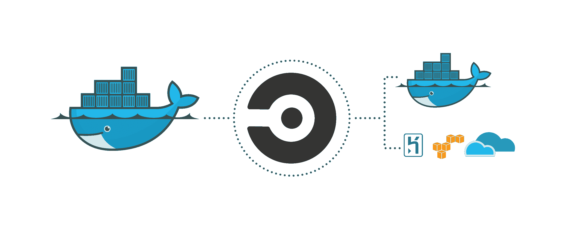

# 向 CircleCI 2.0 - CircleCI 问好

> 原文：<https://circleci.com/blog/say-hello-to-circleci-2-0/>

**来自出版商的说明:**您已经找到了我们的一些旧内容，这些内容可能已经过时和/或不正确。尝试在[我们的文档](https://circleci.com/docs/)或[博客](https://circleci.com/blog/)中搜索最新信息。

* * *

*更新:截至 2017 年 7 月 11 日，CircleCI 2.0 已出测试版，正式发布。你可以在这里阅读更多。*

今天我们将发布 CircleCI 2.0 的封闭测试版。2.0 是一个高度可定制的强大平台，包括一流的容器支持。它将帮助各种规模的团队实现 CI 和 CD 带来的更多好处。新的和扩展的 CircleCI 2.0 功能使团队能够做最好的工作，并保持在软件开发的前沿。

如今，围绕软件的制作和交付方式正在发生范式转变，从单一架构和稳定的发布周期到微服务、容器和持续交付。自从 CircleCI 五年前成立以来，我们的客户使用的技术和方法数量呈指数级增长。我们迅速采取行动来满足这些要求，并在此过程中学到了很多东西。

下面先睹为快，看看 2.0 的一些关键特性:

### 本机 Docker 支持

有了 CircleCI 2.0，我们把 Docker 当成了一等公民。如果能和 Docker 一起用，就能和 CircleCI 2.0 一起用。您可以从容器注册表中提取任何图像。您还可以构建映像并将其推送到 Docker 注册表或部署环境中。您甚至可以在任何注册表上使用现有的 docker 文件和图像。您可以控制何时/是否更新或更改您的构建。你可以使用 Docker 生态系统中的任何工具。

### 灵活的资源分配

我们认识到持续部署不是万能的。使用 CircleCI 2.0，团队可以轻松地配置他们的资源(计算/内存)，以最大限度地满足他们对特定构建的需求。

### 可定制的图像

CircleCI 2.0 为开发人员提供了高度可定制的构建映像。这使得团队可以根据他们的需求制作轻量级或复杂的图像。支持任何语言、任何框架和任何数据库。

### 本地构建

一个新的“本地构建”特性让你可以在本地启动容器和调试应用程序，减少了调试构建所需的时间。

## 我们还在为 2.0 计划什么？

除了这些特性之外，CircleCI 2.0 将具有显著更快的构建性能、更智能的测试分割、更全面的缓存等等。

我们将在测试版和正式版中推出新功能，但使 CircleCI 成为最受欢迎的 CI 平台之一的东西将会保留。CircleCI 2.0 将继续拥有用户友好的 UI、 [SSH 访问](https://circleci.com/docs/1.0/ssh-build/)、[通知](https://circleci.com/docs/1.0/web-notifications/)、洞察、[并行](https://circleci.com/docs/1.0/setting-up-parallelism/)、GitHub 和 Bitbucket 集成、OS X 和安卓支持、与 Slack/HipChat/JIRA 的集成，以及出色的客户支持。

## 请求封闭测试版邀请

如果您有兴趣了解 CircleCI 2.0 能为您和您的团队做些什么，请[在此](/signup/)注册。我们将在未来几周内逐步增加功能和客户，并在我们开放更多测试项目时向您发送邀请。

*更新:截至 2017 年 7 月 11 日，CircleCI 2.0 已出测试版，正式发布。你可以在这里阅读更多。*