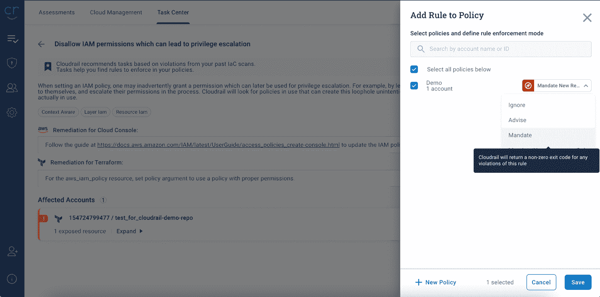
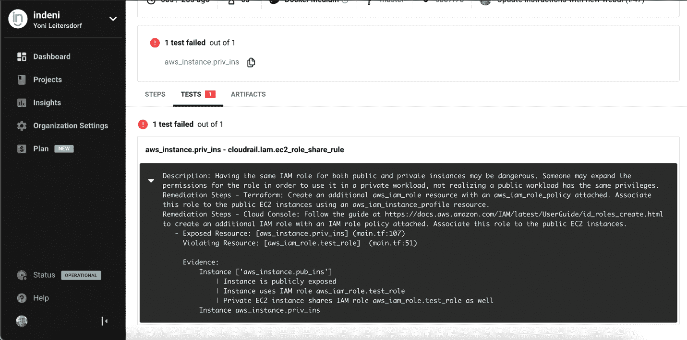

# 使用 Indeni | CircleCI 向 CI 管道添加 IaC 安全扫描

> 原文：<https://circleci.com/blog/scanning-iac-in-your-pipeline/>

使用 CircleCI，有许多不同的 CI/CD 流可以实现自动化。其中一个流程是使用基础设施即代码(IaC)来构建云环境。例如，您可以使用 CircleCI 来自动化构建 Terraform 计划并应用它们的过程，以便在 AWS、Azure、GCP 和其他云环境中创建大规模的生产设置。

能够在构建环境之前扫描 IaC 具有巨大的好处。例如，您可以检查您的代码，看看基础设施是否符合您的云安全需求。这使您能够在管道中更早地发现安全漏洞，此时解决它们更容易且更具成本效益。这是一个被称为“左移”测试的概念。在这篇文章中，我们将仔细研究如何在 CircleCI 中使用 Indeni Cloudrail(一个 IaC 安全分析工具)来实现左移测试。

## 先决条件

*   GitHub 账号有 Terraform 代码，[比如这个例子](https://github.com/indeni/cloudrail-demo)
*   一个[圆](https://circleci.com/signup/)的账户
*   云帐户(在本例中，我们将使用 AWS 帐户)
*   添加了 API 密钥和您的云帐户的 Cloudrail 帐户

在我们的例子中，我们将使用一些 Terraform 代码来构建一个 RDS 数据库，该数据库向公共互联网公开。显然，这是一个大禁忌，所以我将展示如何通过在您的管道中包含 Cloudrail 来发现这种错误。我们将选择的地形代码[在此处可用。](https://github.com/indeni/cloudrail-demo/blob/master/test/aws/terraform/public_access_db_rds/individual-instance/vpc-controlled-public/main.tf)。当然，您可以使用任何想要的 Terraform 代码示例。

## 为 Terraform 设置 CircleCI 配置

我们的第一步是将 Terraform 计划添加到您的 CircleCI 工作流中。首先，我们将使用一个 CircleCI 配置文件来创建一个 Terraform 计划。该计划列出了 Terraform 将在您的 AWS 帐户中创建的资源:

```
version: 2.1
workflows:
  main:
    jobs:
      - tf_plan
jobs:
  tf_plan:
    working_directory: /tmp/test_tf
    docker:
      - image: hashicorp/terraform:0.13.5
    steps:
      - checkout
      - run:
          name: terraform init & plan
          command: |
            cd test/aws/terraform/public_access_db_rds/individual-instance/vpc-controlled-public
            terraform init -input=false
            terraform plan -out plan.out 
```

为了让 Terraform 计划成功运行，您需要设置提供对 AWS 的访问的环境变量:`AWS_ACCESS_KEY_ID`和`AWS_SECRET_ACCESS_KEY`。如果您现在尝试运行您的管道，作业应该会成功完成，输出会详细说明 Terraform 将要构建的内容。


## 将 Cloudrail 作为作业添加到工作流中

是时候将 Cloudrail 作业添加到工作流中了。这里的目标是让 Cloudrail 检查计划，看看是否有任何正在构建的东西不符合您组织的政策。这是 CircleCI 配置现在的样子:

```
version: 2.1

# For more details about how to use this Orb, please see:
# https://circleci.com/developer/orbs/orb/indeni/cloudrail
orbs:
  cloudrail: indeni/cloudrail@2.0.2

workflows:
  main:
    jobs:
      # Cloudrail requires a Terraform plan as an input, so we must create a plan first.
      - tf_plan
      - security_check_terraform:
          requires:
            - tf_plan

jobs:
  tf_plan:
    working_directory: /tmp/test_tf
    docker:
      # The example TF code we use here only works in v0.13, however Cloudrail supports 0.14 as well.
      - image: hashicorp/terraform:0.13.5
    steps:
      - checkout
      - run:
          name: terraform init & plan
          command: |
            cd test/aws/terraform/public_access_db_rds/individual-instance/vpc-controlled-public
            terraform init -input=false
            terraform plan -out plan.out
      # This persistence is important in order to pass the plan.out to Cloudrail
      - persist_to_workspace:
          root: .
          paths:
            - .
  security_check_terraform:
    executor: cloudrail/default
    steps:
      # This loads the plan.out file:
      - attach_workspace:
          at: .
      - run: # Tests must be in a sub directory, per https://support.circleci.com/hc/en-us/articles/360021624194-Test-summary-troubleshooting
          name: Create test result directory (if not exists)
          command: |
            mkdir test_results
      # This will run Cloudrail and produce Junit test results. The idea is that if there are any rules
      # that are set to MANDATE, and they find violations, we will have "failed" tests in the Junit output.
      # This will then cause CircleCI to stop the pipeline and list the failed tests, allowing dev's to fix
      # the violations.
      # Note that Cloudrail has other output formats as well, please see the Orb documentation for more information.
      # Also note that rules that are set to ADVISE (which is the default) will _not_ be included in the output by default.
      - cloudrail/scan_terraform_junit:
          cloud-account-id: $AWS_ACCOUNT_ID
          cloudrail_api_key: $CLOUDRAIL_API_KEY
          plan_output_file: test/aws/terraform/public_access_db_rds/individual-instance/vpc-controlled-public/plan.out
          tf_directory: test/aws/terraform/public_access_db_rds/individual-instance/vpc-controlled-public
          junit-output-file: test_results/cloudrail-junit.xml
      - store_test_results:
          path: test_results
      - store_artifacts:
          path: test_results/cloudrail-junit.xml 
```

您可能会注意到这里添加了两个额外的环境变量:

*   `CLOUDRAIL_API_KEY`是您开户时从 Cloudrail 收到的 API 密钥
*   `AWS_ACCOUNT_ID`是此 Terraform 工作流的目标 AWS 客户的 ID

现在在 CircleCI 中再次运行工作流，Cloudrail 成功运行，并显示结果摘要。在这个阶段，所有的违规都被认为是警告，因为我们还没有为`Mandate`设置任何规则。`Mandate`设置告诉 Cloudrail，如果违反了特定的规则，就停止管道，这迫使开发人员在继续之前修复问题。


正如你所看到的，当 Cloudrail 第一次被使用时，它并没有中断工作流。相反，它会查看正在发生的事情并生成评估，而不会阻止任何事情。一开始这很好，但是要让开发人员真正解决问题，您需要制定强制性的规则。

## 使用 Cloudrail 实施安全控制

本节介绍在 Cloudrail 中查看评估和修改强制配置。CircleCI 中 Cloudrail 的输出包含一个到 Cloudrail 中评估的链接。单击该链接。


Cloudrail 发现了一些违规行为。这些现在都被认为是警告，因为规则被设置为“建议”。Cloudrail 可以建议我们应该将哪些规则设置为“强制”。



现在，我们已经创建了一个策略，并设置了一些强制规则，我们可以继续并再次运行我们的工作流。

## 在 CircleCI 中与 Cloudrail 的输出交互

跳回 CircleCI 控制台，再次运行工作流。这一次，Cloudrail 的工作失败了。


它失败了，因为 Cloudrail 发现违反了规定的规则。这就是 Cloudrail 的目标:如果资源违反了公司的安全策略，就阻止它们被供应。当发生这样的故障时，CircleCI 会通知开发人员管道出现故障，并向他们指出 Cloudrail 扫描失败的特定资源。

通过 Cloudrail 的 JUnit 输出和 CircleCI 集成，开发人员可以通过点击 Test 选项卡轻松找出失败的原因。在这里，开发人员可以看到失败的原因，以及如何修复问题的说明。



一旦他们解决了问题，开发人员就可以推送他们的更改并再次触发工作流。这一次，Terraform 计划将通过，工作流将成功完成。

## 结论

基础设施即代码为开发团队带来了新的机会，可以运行得更快，提供更有弹性的环境。云技术有助于实现这一点，但也将关键用户数据暴露给潜在的黑客和坏人。使用 CircleCI 和 Cloudrail，开发团队可以确保他们的基础设施以可预测和一致的方式部署，没有潜在的漏洞。这允许开发人员在提高他们构建的应用程序的安全性的同时保持速度。

Yoni Leitersdorf 是领先的安全基础设施自动化公司 Indeni 的创始人兼首席执行官。Indeni 有一个名为 Cloudrail 的云安全分析新解决方案，它与 CircleCI 集成在一起。要了解 CircleCI 客户如何使用 Indeni 扫描基础设施代码文件并通过在必要时停止管道来实施安全策略，请阅读最新的新闻稿。