# 在 Node.js 应用程序| CircleCI 中为 MongoDB 安排数据库备份

> 原文：<https://circleci.com/blog/schedule-mongo-db-cleanup/>

> 本教程涵盖:
> 
> 1.  为 Node.js 应用程序设置 MongoDB 备份
> 2.  按照定义的固定时间间隔计划备份
> 3.  使用预定管道将应用程序部署到 Heroku

* * *

数据库备份通过在本地或远程备份服务器上创建数据库副本来保护您的数据。该操作通常由数据库管理员手动执行。像所有其他依赖于人类的活动一样，它容易出错，并且需要大量时间。

在操作系统出现故障或安全漏洞的情况下，定期计划的备份对保护您客户的详细信息大有帮助。在本教程中，我将指导您使用[调度管道](https://circleci.com/blog/benefits-of-scheduling-ci-pipelines/)在定义的固定时间间隔调度应用程序数据库的备份版本。

为了更好地掌握自动化数据库备份操作的过程，我们将使用 MongoDB 数据库为 Node.js 应用程序设置一个数据库备份。该应用程序将使用 CircleCI 上的部署管道部署在 Heroku 上。MongoDB 数据库将托管在 MongoDB Atlas 上；用于数据库托管和部署的多云平台。

为了方便访问，为我们的应用程序生成的、备份的 MongoDB 集合将存储在 [Microsoft Azure 存储上。](https://azure.microsoft.com/en-us/services/storage/blobs/)。

## 先决条件

以下是您成功完成本教程所需的内容:

## 克隆演示应用程序

首先，运行以下命令来克隆演示应用程序:

```
git clone https://github.com/yemiwebby/db-cleanup-starter.git db-back-up-schedule 
```

接下来，进入新克隆的应用程序并安装其所有依赖项:

```
cd db-back-up-schedule
npm install 
```

该应用程序包含以下端点:

*   通过指定公司名称及其创建者来创建新公司。
*   从数据库中检索公司列表。

安装过程完成后，创建一个`.env`文件，并用以下内容填充它:

```
MONGODB_URI=YOUR_MONGODB_URL 
```

如果您愿意，您可以简单地运行这个命令，从 starter 项目中的`.env.sample`文件复制内容:

```
cp .env.sample .env 
```

当然，您需要用用于远程 MongoDB URI 的连接字符串替换`YOUR_MONGODB_URL`占位符。本教程使用 MongoDB Atlas 数据库，您可以很容易地设置一个。接下来我将解释如何去做。

## 创建 MongoDB Atlas 帐户和数据库

[在这里](https://www.mongodb.com/cloud/atlas/register)创建一个免费的 Atlas 帐户，并按照说明部署一个[免费层集群](https://docs.atlas.mongodb.com/getting-started/)。设置好集群和数据库用户后，打开并编辑`.env`文件。

用从您的 [MongoDB Atlas 仪表板](https://cloud.mongodb.com/)中提取的连接字符串替换`YOUR_MONGODB_URL`占位符:

```
MONGODB_URI=mongodb+srv://<username>:<password>@<clustername>.mongodb.net/<dbname>?retryWrites=true&w=majority 
```

用集群的值替换`<username>`、`<password>`、`<clustername>`和`<dbname>`。

## 运行演示应用程序

正确创建和配置数据库后，打开一个终端并运行演示应用程序:

```
npm run start 
```

您将得到以下输出:

```
 > db-back-up-schedule@1.0.0 start
> node server.js

Server is running at port 3000
Connected successfully 
```

### 创建公司

通过创建新的公司详细信息来测试演示应用程序。打开 Postman 或者你喜欢的 API 测试工具。使用这个 JSON 数据向`http://localhost:3000/new-company`端点发送一个`POST`请求:

```
{
  "name": "Facebook",
  "founder": "Mark"
} 
```

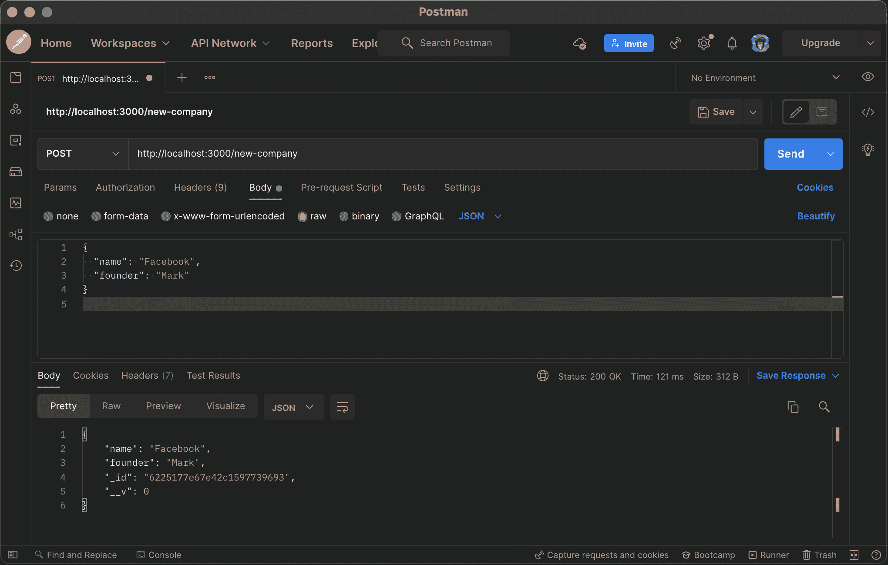

### 查看公司列表

接下来，向`http://localhost:3000/companies`发送一个`GET`请求来检索公司列表。

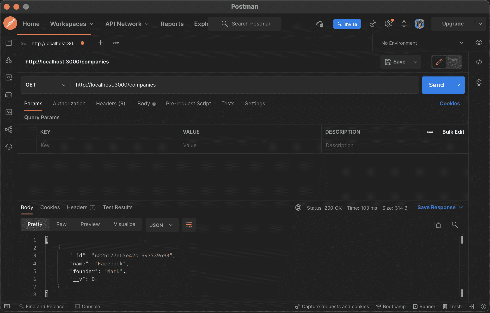

## 在 Heroku 上创建应用程序

接下来，在 Heroku 上创建一个新的应用程序来托管和运行 Node.js 项目。前往 [Heroku 仪表盘](https://dashboard.heroku.com/login)开始。点击**新增**，然后点击**新增 App** 。在表单中填写您的应用程序和您所在地区的名称。

**注**:*Heroku 上的应用名称是唯一的。选择一个可用的并记下来。*

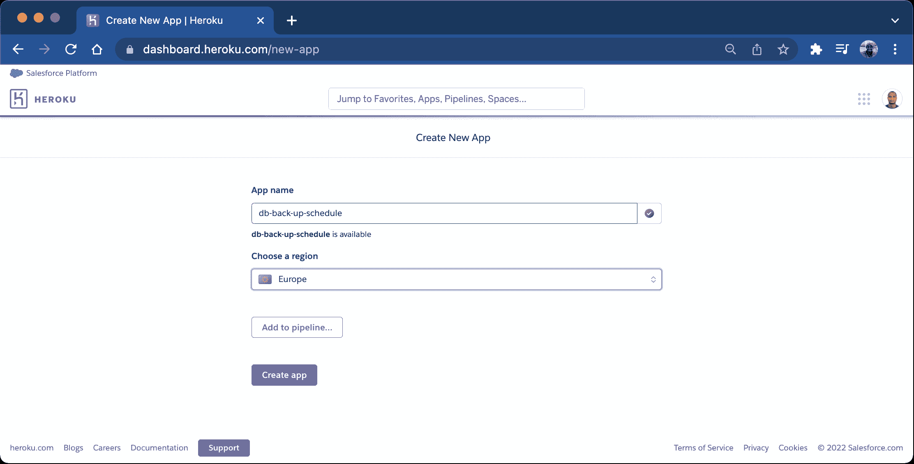

点击**创建应用**按钮。您将被重定向到新创建的应用程序的**部署**视图。

接下来，创建一个配置变量来引用前面从 MongoDB Atlas 仪表板中提取的 MongoDB URI。为此，导航到设置页面，向下滚动，并单击**显示配置变量**按钮。

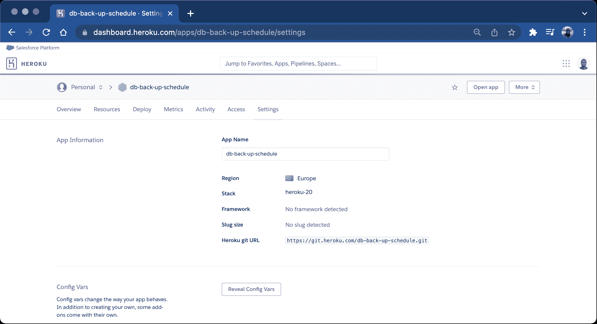

如下所示指定键和值，完成后点击**添加**。

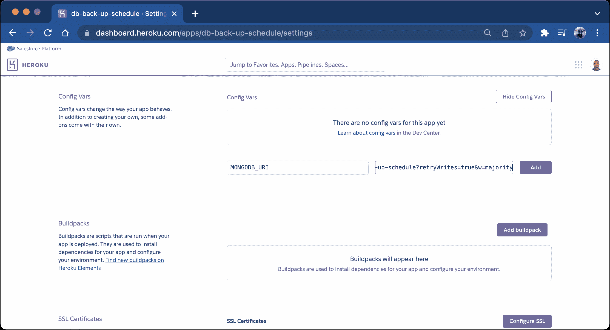

最后，您需要检索 Heroku 帐户的 API 密钥。此密钥将用于连接您的 CircleCI 管道和 Heroku。要获取您的 API 密钥，请打开[帐户设置](https://dashboard.heroku.com/account)页面。

滚动到 **API 键**部分。

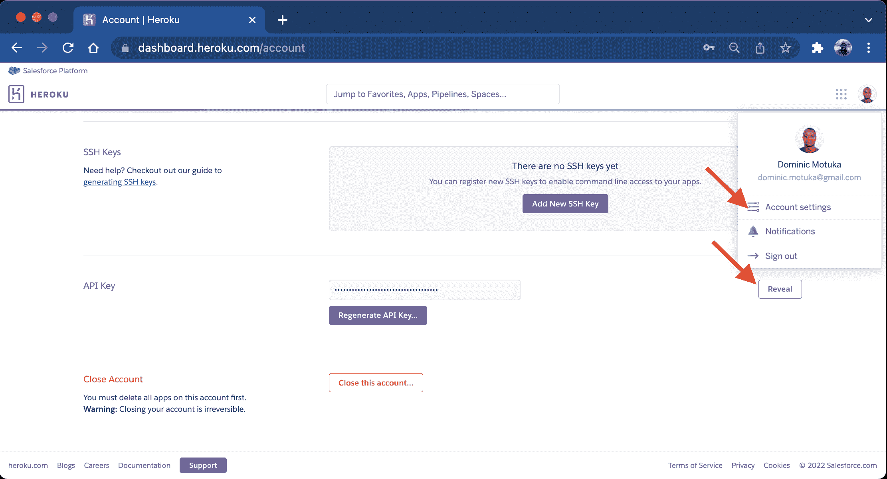

点击**显示**按钮，复制 API 密钥。将它保存在您以后可以轻松找到的地方。

## 创建 Azure 存储帐户

如前所述，Microsoft Azure 存储将用于托管我们数据库的备份 MongoDB 集合。为此，[你需要在 Azure 上注册一个免费账户](https://azure.microsoft.com/en-us/free/)。然后转到您的 Azure 门户仪表板。

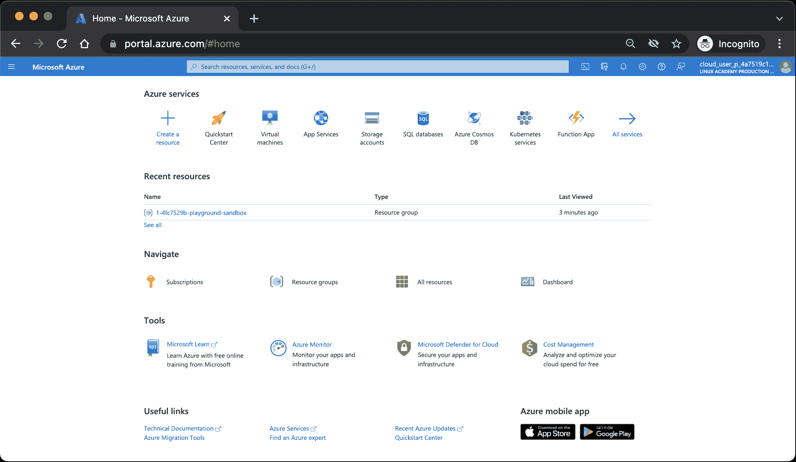

从服务列表中单击**存储帐户**,或者通过在搜索栏中键入“存储”来使用搜索功能。

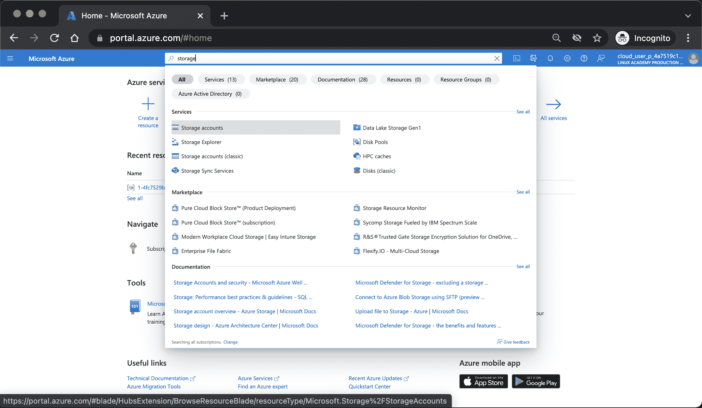

在存储帐户页面中，单击**创建**。在这个新页面上，指定您的存储帐户的详细信息。

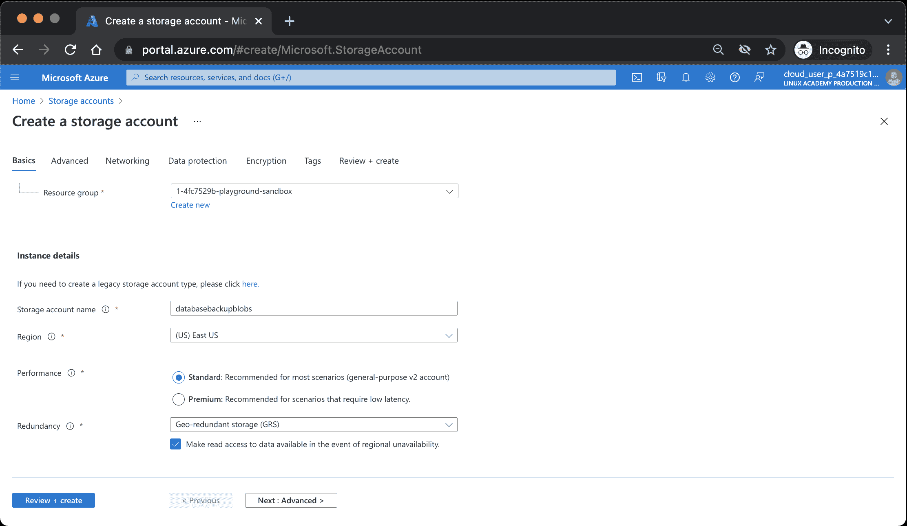

接下来，执行以下操作:

1.  选择一个订阅。
2.  选择现有的资源组或创建新的资源组。
3.  输入存储帐户名称。对于本教程，我将我的命名为`dbblobs`。
4.  选择一个离你近的地区。

点击**审核+创建**，然后点击**创建**按钮。将创建并部署您的存储帐户。

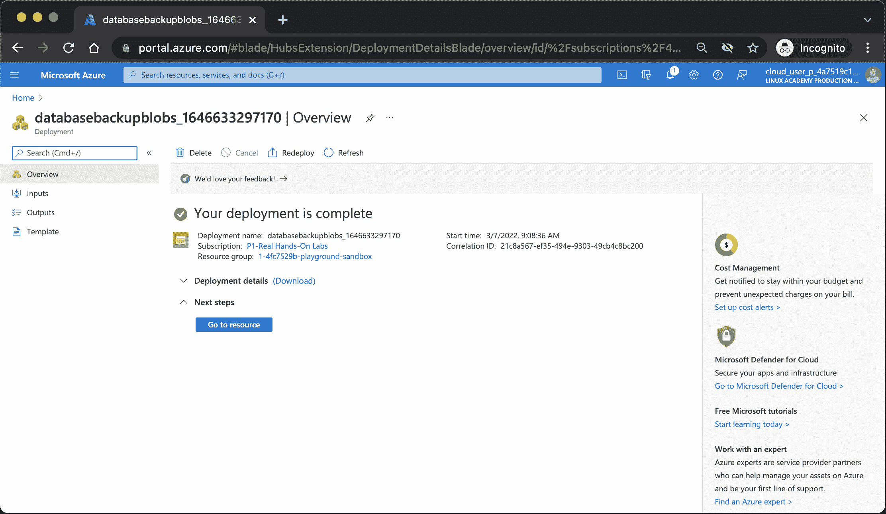

值得一提的是，Azure blob 存储帐户提供了以下资源:

*   刚刚创建的存储帐户。
*   `Container`，帮助组织一组 blobs，类似于文件系统中的一个目录。
*   `blob`，通常存储在类似于文件存储在目录中的容器中。

至此，您拥有了一个正常运行的存储帐户。接下来要做的是创建一个容器来存放 blobs(在我们的例子中是 MongoDB 集合备份)。在您的新存储帐户页面上，单击侧面菜单栏中的**容器**。然后点击 **+容器**创建一个新的容器。

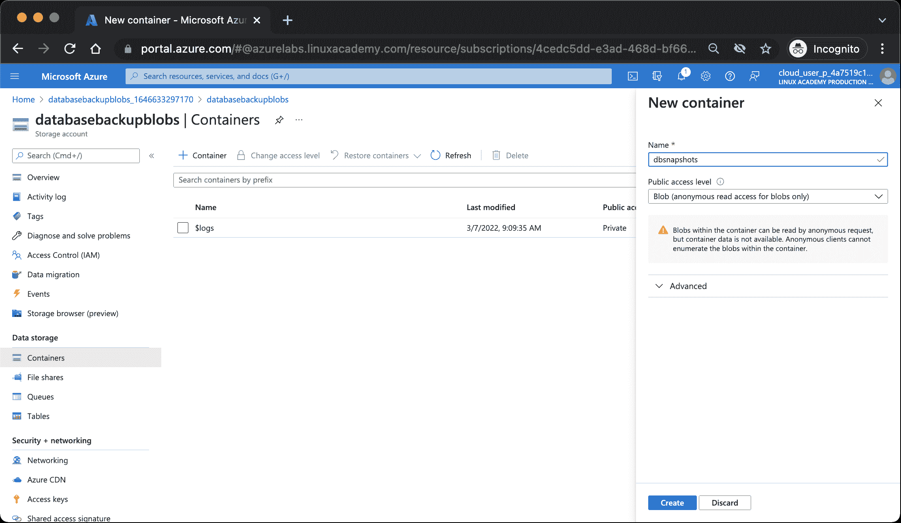

为您的容器命名并更改公共访问级别。完成后点击**创建**按钮。

### 正在检索访问密钥

要轻松建立远程连接，以便从您的存储帐户存储或检索文件，您需要访问密钥。默认情况下，Azure 上的每个存储帐户都有两个不同的访问密钥，这允许你在使用另一个时替换其中一个。要显示您的密钥，请点击**显示密钥**并复制其中一个密钥，最好是第一个。

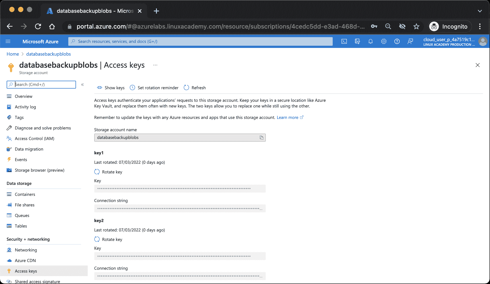

将密钥粘贴到计算机上安全的地方；你以后会需要它的。

## 添加管道配置脚本

接下来，您需要为 CircleCI 添加管道配置。管道将由安装项目依赖项和编译生产应用程序的步骤组成。

在项目的根目录下，创建一个名为`.circleci`的文件夹。在该文件夹中，创建一个名为`config.yml`的文件。在新创建的文件中，添加以下配置:

```
version: 2.1
orbs:
  heroku: circleci/heroku@1.2.6
jobs:
  build:
    executor: heroku/default
    steps:
      - checkout
      - heroku/install
      - heroku/deploy-via-git:
          force: true
workflows:
  deploy:
    jobs:
      - build 
```

这种配置引入了 Heroku orb `circleci/heroku`，它自动提供对一组健壮的 Heroku 作业和命令的访问。其中一个任务是`heroku/deploy-via-git`，它直接从你的 GitHub repo 将你的应用程序部署到你的 Heroku 账户。

接下来，在 GitHub 上建立一个存储库，并将项目链接到 CircleCI。查看[将项目推送到 GitHub](https://circleci.com/blog/pushing-a-project-to-github/) 以获得分步说明。

登录您的 CircleCI 帐户。如果你注册了你的 GitHub 账户，你所有的库都可以在你项目的仪表盘上看到。

点击**为您的`db-clean-up`项目设置项目**。

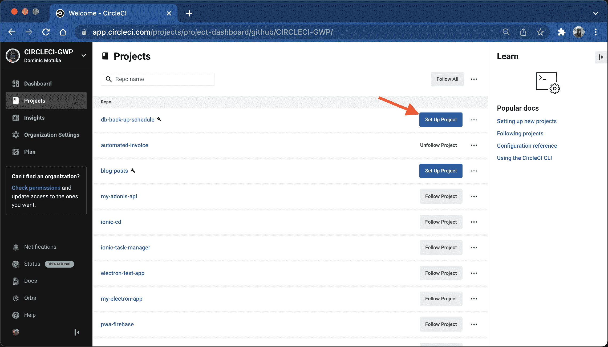

将提示您配置文件的几个选项。选择`use the .circleci/config.yml in my repo`选项。在 GitHub 上输入你的代码所在的分支名称，然后点击**设置项目**按钮。

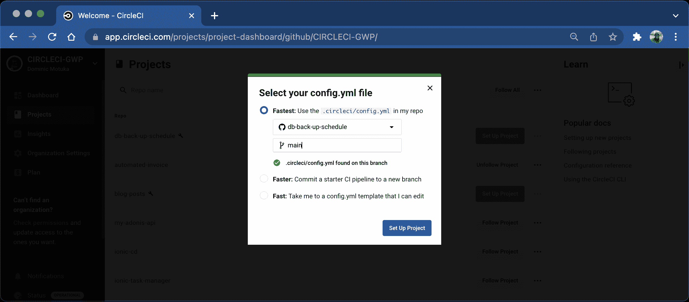

您的第一个工作流将开始运行，但会失败。这是因为您没有提供 Heroku API 密钥。你现在可以弥补了。

点击**项目设置**按钮，然后点击**环境变量**。添加这两个新变量:

*   `HEROKU_APP_NAME`是 Heroku ( `db-clean-up`)中的应用名称
*   `HEROKU_API_KEY`是您从帐户设置页面获取的 Heroku API 密钥

从失败的中选择**重新运行工作流以重新运行 Heroku 部署。这一次，您的工作流将成功运行。**

要确认工作流是否成功，您可以在浏览器中打开新部署的应用程序。您的应用程序的 URL 应该是这样的格式`https://<HEROKU_APP_NAME>.herokuapp.com/`。

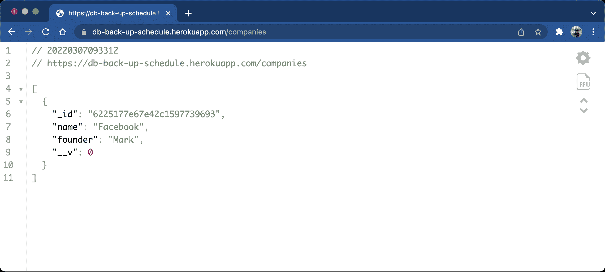

下面是到目前为止你所做和所学的快速回顾。你有:

*   在本地创建工作应用程序
*   在 Heroku 上创建了一个功能应用程序
*   已创建 Microsoft Azure blob 存储帐户
*   使用 CircleCI 成功地建立了一个管道来自动将您的应用程序部署到 Heroku

## 生成并上传备份文件

MongoDB 将数据记录存储为[文档](https://docs.mongodb.com/manual/reference/glossary/#std-term-document)；具体为 [BSON 文献](https://docs.mongodb.com/manual/core/document/#std-label-bson-document-format)，汇集在[馆藏](https://docs.mongodb.com/manual/reference/glossary/#std-term-collection)。

在本节中，您将创建一个脚本来为您的项目生成数据库备份文件(BSON 文档),并将该文件上传到 Microsoft Azure。为此，我们将使用两种不同的工具:

*   通过运行一个简单的命令来工作。它是一个实用工具，可用于创建数据库内容的二进制导出。MongoDump 工具是 MongoDB 数据库工具包的一部分，将在 CircleCI 上部署应用程序后安装。
*   `[Azure Storage Blob](https://www.npmjs.com/package/@azure/storage-blob)`是一个 JavaScript 库，它使从 Node.js 应用程序消费 Microsoft Azure 存储 blob 服务变得容易。在本教程中，这个库已经作为我们项目的依赖项包含和安装了。

要生成并上传备份文件，在应用程序的根目录下创建一个名为`backup.js`的新文件，并使用以下内容:

```
require("dotenv").config();
const exec = require("child_process").exec;
const path = require("path");
const {
  BlobServiceClient,
  StorageSharedKeyCredential,
} = require("@azure/storage-blob");

const backupDirPath = path.join(__dirname, "database-backup");

const storeFileOnAzure = async (file) => {
  const account = process.env.ACCOUNT_NAME;
  const accountKey = process.env.ACCOUNT_KEY;
  const containerName = "dbsnapshots";

  const sharedKeyCredential = new StorageSharedKeyCredential(
    account,
    accountKey
  );

  // instantiate Client
  const blobServiceClient = new BlobServiceClient(
    `https://${account}.blob.core.windows.net`,
    sharedKeyCredential
  );

  const container = blobServiceClient.getContainerClient(containerName);
  const blobName = "companies.bson";
  const blockBlobClient = container.getBlockBlobClient(blobName);
  const uploadBlobResponse = await blockBlobClient.uploadFile(file);
  console.log(
    `Upload block blob ${blobName} successfully`,
    uploadBlobResponse.requestId
  );
};

let cmd = `mongodump --forceTableScan --out=${backupDirPath} --uri=${process.env.MONGODB_URI}`;

const dbAutoBackUp = () => {
  let filePath = backupDirPath + `/db-back-up-schedule/companies.bson`;
  exec(cmd, (error, stdout, stderr) => {
    console.log([cmd, error, backupDirPath]);
    storeFileOnAzure(filePath);
  });
};

dbAutoBackUp(); 
```

该文件中的内容导入了所需的依赖项，包括 Azure storage client SDK，并指定了存放备份文件的路径。接下来，它创造了:

*   `cmd`是一个`mongodump`命令，将被执行并用于生成备份文件。`--out`标志指定文件所在文件夹的路径，而`--uri`指定 MongoDB 连接字符串。
*   `*storeFileOnAzure()*`函数获取备份文件的精确绝对路径，并使用 [Azure Storage Blob 客户端库](https://www.npmjs.com/package/@azure/storage-blob)将其上传到创建的 Azure 存储容器。
*   `*dbAutoBackUp()*`函数使用 JavaScript 中的` [exec](https://nodejs.org/api/child_process.html#child_processexeccommand-options-callback) `()`函数创建一个新的 shell，并执行指定的 MongoDump 命令。另外，`filepath`引用了生成的 bson 文件的确切位置(在本例中是 companies.bson)。

**注:** *`companiesdb`和`companies.bson`表示在 MongoDB Atlas 上看到的应用程序的数据库名和表名。所以，如果你的数据库名是`userdb`，表名是`users`，那么你的文件路径将指向`userdb/user.bson`文件。*

> 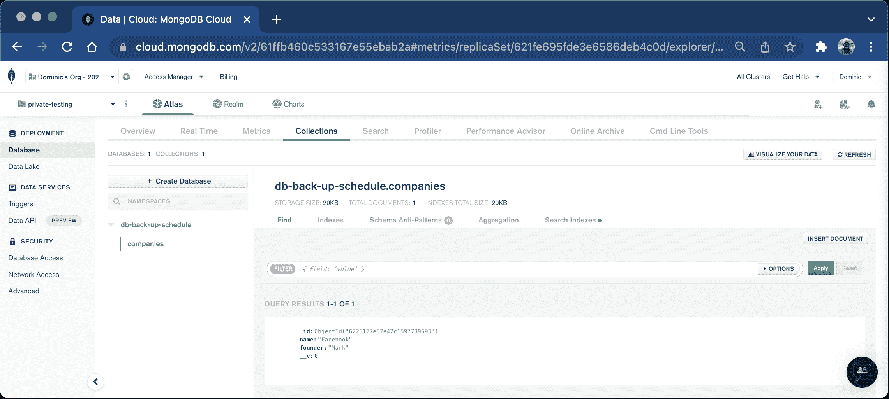

## 创建和实施预定的管道

从头开始设置计划管道有两种不同的选择:

*   使用 API
*   使用项目设置

在本教程中，我们将使用 API，因此您需要:

1.  CircleCI API 令牌
2.  存储库所在的版本控制系统的名称
3.  您的组织名称
4.  CircleCI 上的当前项目 ID

要获取令牌，请转到您的 CircleCI 仪表盘，然后单击您的头像:

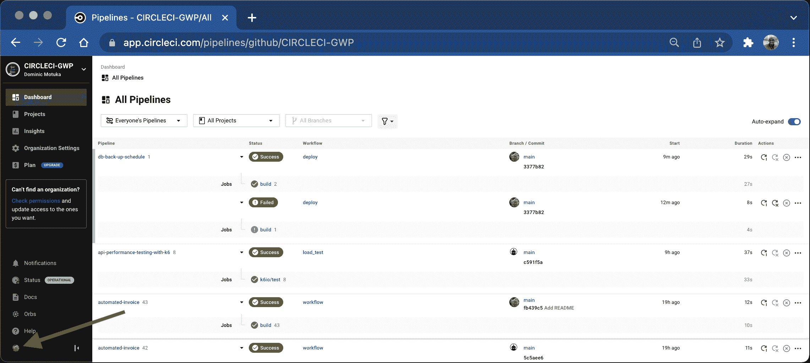

您将被重定向到您的用户设置页面。从那里，导航到个人 API 令牌，创建一个新的令牌，为您的令牌命名，并将其保存在某个安全的地方。

现在，从项目的根目录打开`.env`文件，并添加:

```
VCS_TYPE=VERSION_CONTROL_SYSTEM
ORG_NAME=ORGANISATION_NAME
PROJECT_ID=PROJECT_ID
CIRCLECI_TOKEN=YOUR_CIRCLECI_TOKEN
MONGODB_URI=YOUR_MONGODB_URL 
```

用您的值替换占位符:

*   `VCS_TYPE`是你的版本控制系统，比如`github`。
*   `ORG_NAME`是您的 GitHub 用户名或组织名称。
*   是您在 CircleCI 上的项目 ID。对于示例项目是`db-clean-up`。
*   是你的 CircleCI 令牌。
*   从 MongoDB Atlas dashboard 中提取的 MongoDB URI 字符串。

接下来要做的是在项目的根目录下创建一个名为`schedule.js`的新文件，并为其使用以下内容:

```
const axios = require("axios").default;
require("dotenv").config();
const API_BASE_URL = "https://circleci.com/api/v2/project";

const vcs = process.env.VCS_TYPE;
const org = process.env.ORG_NAME;
const project = process.env.PROJECT_ID;
const token = process.env.CIRCLECI_TOKEN;
const postScheduleEndpoint = `${API_BASE_URL}/${vcs}/${org}/${project}/schedule`;

async function scheduleDatabaseBackup() {
  try {
    let res = await axios.post(
      postScheduleEndpoint,
      {
        name: "Database backup",
        description: "Schedule database backup for your app in production",
        "attribution-actor": "current",
        parameters: {
          branch: "main",
          "run-schedule": true,
        },
        timetable: {
          "per-hour": 30,
          "hours-of-day": [
            0, 1, 2, 3, 4, 5, 6, 7, 8, 9, 10, 11, 12, 13, 14, 15, 16, 17, 18,
            19, 20, 21, 22, 23,
          ],
          "days-of-week": ["MON", "TUE", "WED", "THU", "FRI", "SAT", "SUN"],
        },
      },
     {
        headers: { "circle-token": token },
      }
    );
    console.log(res.data);
  } catch (error) {
    console.log(error.response);
  }
}
scheduleDatabaseBackup(); 
```

这段代码创建了一个名为`**scheduleDatabaseBackup()**`的函数，将管道进度细节发送到 [CircleCI API](https://circleci.com/blog/introducing-circleci-api-v2/) 。

有效载荷包括:

*   `name`，即日程名称。它需要是独特的。
*   `description`是可选字段，用于描述日程安排。
*   `attribution-actor`可以是中立角色的`system`，也可以是`current`，它获取当前用户的权限(根据您使用的令牌)。
*   对象指定触发哪个分支。它包括一个额外的值，用于检查何时运行管道。
*   `timetable`定义运行预定管道的时间和频率。这里使用的字段是`per-hour`、`hours-of-day`和`days-of-week`。

注意`timetable`没有采用 cron 表达式，这使得它更容易被使用 API 推理的人解析。对于本教程，时间表设置为在一小时内运行 30 次，大约每 2 分钟运行一次。

该代码还将 CircleCI 标记传递给头部。

## 更新配置文件

在运行计划管道之前，我们需要更新 CircleCI 管道配置脚本。打开`.circleci/config.yml`文件，将其内容替换为:

```
version: 2.1
orbs:
  heroku: circleci/heroku@1.2.6
jobs:
  build:
    executor: heroku/default
    steps:
      - checkout
      - heroku/install
      - heroku/deploy-via-git:
          force: true
  schedule_backup:
    working_directory: ~/project
    docker:
      - image: cimg/node:17.4.0
    steps:
      - checkout
      - run:
          name: Install MongoDB Tools.
          command: |
            npm install
            sudo apt-get update
            sudo apt-get install -y mongodb
      - run:
          name: Run database back up
          command: npm run backup
parameters:
  run-schedule:
    type: boolean
    default: false
workflows:
  deploy:
    when:
      not: << pipeline.parameters.run-schedule >>
    jobs:
      - build
  backup:
    when: << pipeline.parameters.run-schedule >>
    jobs:
      - schedule_backup 
```

该配置现在包括一个名为`schedule_backup`的新作业。它使用 Docker 镜像安装 Node.js 和 [MongoDB 工具](https://docs.mongodb.com/database-tools/)。配置包括参数，并使用`run-schedule`管道变量来检查何时运行工作流。

对于所有工作流，添加表示当`run-schedule`为`true`时运行它们并且除非`run-schedule`为`false`否则不运行其他工作流的`when`表达式。

## 在 CircleCI 上创建更多的环境变量

在将所有更新添加到 GitHub 之前，将 MongoDB 连接字符串、Azure 帐户名和 key 作为环境变量添加到 CircleCI 项目中。

从当前项目管道页面，点击**项目设置**按钮。接下来，从侧面菜单中选择**环境变量**。添加这些变量:

*   `ACCOUNT_KEY`是您的 Microsoft Azure 存储帐户密钥。
*   `ACCOUNT_NAME`是 Microsoft Azure 存储帐户名(本教程中为`dbblobs`)。
*   `MONGODB_URI`是您的 MongoDB 连接字符串。

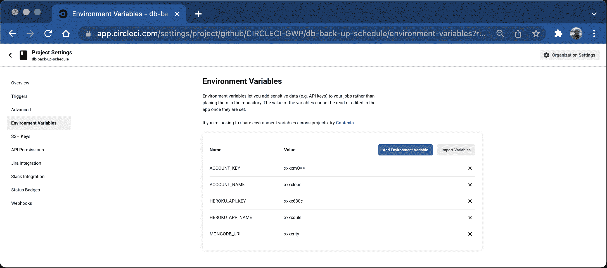

现在，更新 git，把你的代码推回 GitHub。

## 运行计划的管道

时间表配置文件已更新并准备就绪。要创建计划的管道，请从项目的根目录运行以下命令:

```
node schedule.js 
```

输出应该如下所示:

```
{
    "description": "Schedule database backup for your app in production",
  "updated-at": "2022-03-07T07:07:25.408Z",
  "name": "Database backup",
  "id": "caa627c8-2768-4ac7-8150-e808fb566cc6",
  "project-slug": "gh/CIRCLECI-GWP/db-back-up-schedule",
  "created-at": "2022-03-07T07:07:25.408Z",
  "parameters": { "branch": "main", "run-schedule": true },
  "actor": {
    "login": "daumie",
    "name": "Dominic Motuka",
    "id": "335b50ce-fd34-4a74-bc0b-b6455aa90325"
  },
  "timetable": {
    "per-hour": 30,
    "hours-of-day": [
      0, 1, 2, 3, 4, 5, 6, 7, 8, 9, 10, 11, 12, 13, 14, 15, 16, 17, 18, 19, 20,
      21, 22, 23
    ],
    "days-of-week": ["MON", "TUE", "WED", "THU", "FRI", "SAT", "SUN"]
  }
} 
```

## 查看您计划的运行中的管道

返回 CircleCI 上的 pipeline 页面。你的管道将每两分钟被触发一次。

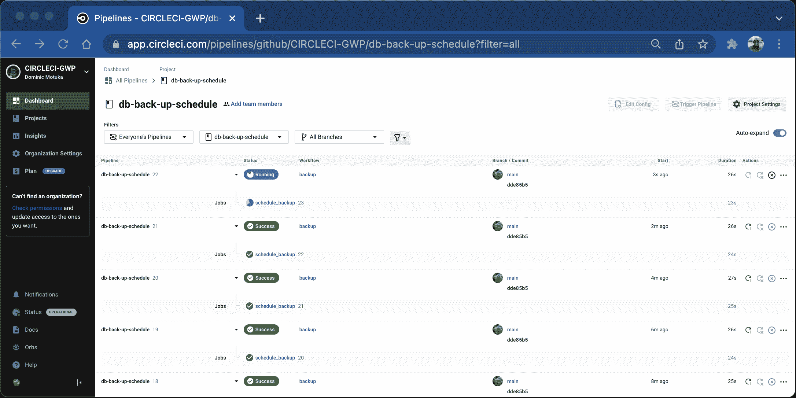

这是在你的 Azure 存储帐户中打开容器以确认文件已成功上载的好时机。

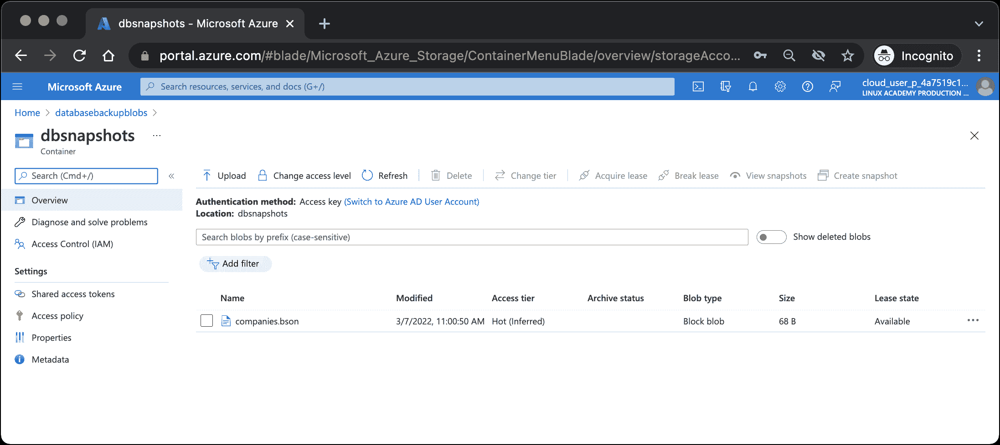

## 附加部分:检索时间表列表和删除时间表

在最后一部分，您将了解到:

*   如何检索特定项目的所有时间表
*   如何删除任何计划

### 检索项目的时间表列表

要获取所有的时间表，在项目的根目录下创建一个名为`get.js`的新文件。输入以下内容:

```
const axios = require("axios").default;
require("dotenv").config();

const API_BASE_URL = "https://circleci.com/api/v2/project";
const vcs = process.env.VCS_TYPE;
const org = process.env.ORG_NAME;
const project = process.env.PROJECT_ID;
const token = process.env.CIRCLECI_TOKEN;

const getSchedulesEndpoint = `${API_BASE_URL}/${vcs}/${org}/${project}/schedule/`;

async function getSchedules() {
  let res = await axios.get(getSchedulesEndpoint, {
    headers: {
      "circle-token": `${token}`,
    },
  });

  console.log(res.data.items[0]);
}

getSchedules(); 
```

这个代码片段获取并记录终端中的时间表，但只是时间表数组中的第一项。要查看所有项目，请将`res.data.items[0]`替换为`res.data.items`。

现在用`node get.js`运行文件。您的输出应该如下所示:

```
{
  description: 'Schedule database backup for your app in production',
  'updated-at': '2022-03-07T10:49:58.123Z',
  name: 'Database backup',
  id: '6aa72c63-b4c4-4dc0-b099-b8661a7a2052',
  'project-slug': 'gh/yemiwebby/db-back-up-schedule',
  'created-at': '2022-03-07T10:49:58.123Z',
  parameters: { branch: 'main', 'run-schedule': true },
  actor: {
    login: 'yemiwebby',
    name: 'Oluyemi',
    id: '7b490556-c1bb-4b42-a201-c1785a00005b'
  },
  timetable: {
    'per-hour': 30,
    'hours-of-day': [
       0,  1,  2,  3,  4,  5,  6,  7,
       8,  9, 10, 11, 12, 13, 14, 15,
      16, 17, 18, 19, 20, 21, 22, 23
    ],
    'days-of-week': [
      'MON', 'TUE',
      'WED', 'THU',
      'FRI', 'SAT',
      'SUN'
    ]
}
} 
```

### 删除任何计划

删除计划需要其唯一的`ID`。在本次演示中，我们可以使用上一节中的时间表中的`ID`。

创建另一个名为`delete.js`的文件，并将以下代码粘贴到其中:

```
const axios = require("axios").default;
require("dotenv").config();

const API_BASE_URL = "https://circleci.com/api/v2/schedule";
const vcs = process.env.VCS_TYPE;
const org = process.env.ORG_NAME;
const project = process.env.PROJECT_ID;
const token = process.env.CIRCLECI_TOKEN;

const schedule_ids = ["YOUR_SCHEDULE_ID"];

async function deleteScheduleById() {
  for (let i = 0; i < schedule_ids.length; i++) {
    let deleteScheduleEndpoint = `${API_BASE_URL}/${schedule_ids[i]}`;
    let res = await axios.delete(deleteScheduleEndpoint, {
      headers: { "circle-token": token },
    });
    console.log(res.data);
  }
}

deleteScheduleById(); 
```

用从上一节提取的`ID`替换`YOUR_SCHEDULE_ID`占位符，并保存文件。接下来，从终端运行`node delete.js`。输出:

```
{ message: 'Schedule deleted.' } 
```

## 结论

在本教程中，您从 GitHub 下载了一个示例项目，并在通过 CircleCI 将它部署到 Heroku 平台之前，在您的机器上本地运行它。然后，您在 MongoDB 数据库中创建了一些记录，并使用 [MongoDB 工具](https://docs.mongodb.com/database-tools/)创建了一个脚本来生成数据库的备份集合。您将备份文件存储在 Microsoft Azure 上，并使用 CircleCI 的计划管道功能以合理的时间间隔自动执行文件备份过程。

本教程涵盖了[调度管道](https://circleci.com/blog/benefits-of-scheduling-ci-pipelines/)的一个重要用例，因为它自动化了一项原本需要手动完成的任务。像安排数据库清理这样的任务太重要了，不能留给人类去做。它们占用了开发人员宝贵的时间，在繁忙或紧张的时候很容易忘记它们。为数据库清理安排管道解决了这些问题，因此您和您的团队有更多的时间来开发和发布应用程序。

我希望本教程对你有所帮助。完整的源代码可以在 GitHub 的[这里找到。](https://github.com/yemiwebby/db-back-up-schedule)

* * *

[Oluyemi](https://twitter.com/yemiwebby) 是一名拥有电信工程背景的技术爱好者。出于对解决用户日常遇到的问题的浓厚兴趣，他冒险进入编程领域，并从那时起将他解决问题的技能用于构建 web 和移动软件。Oluyemi 是一名热衷于分享知识的全栈软件工程师，他在世界各地的几个博客上发表了大量技术文章和博客文章。由于精通技术，他的爱好包括尝试新的编程语言和框架。

* * *

Oluyemi 是一名拥有电信工程背景的技术爱好者。出于对解决用户日常遇到的问题的浓厚兴趣，他冒险进入编程领域，并从那时起将他的问题解决技能用于构建 web 和移动软件。Oluyemi 是一名热衷于分享知识的全栈软件工程师，他在世界各地的几个博客上发表了大量技术文章和博客文章。作为技术专家，他的爱好包括尝试新的编程语言和框架。

[阅读更多 Olususi Oluyemi 的帖子](/blog/author/olususi-oluyemi/)