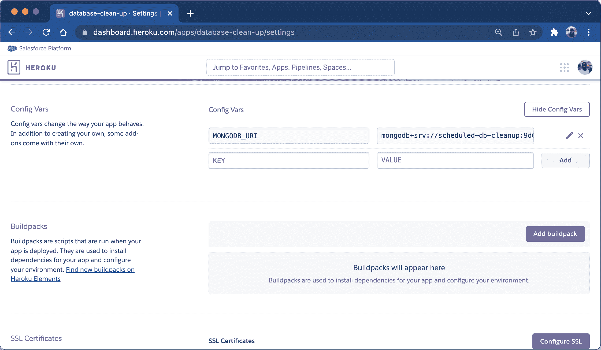
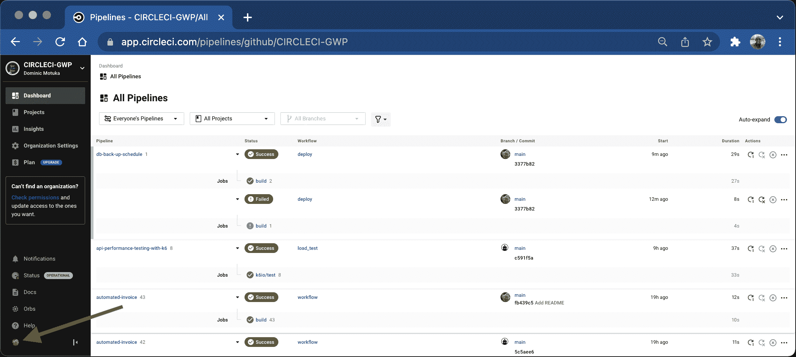
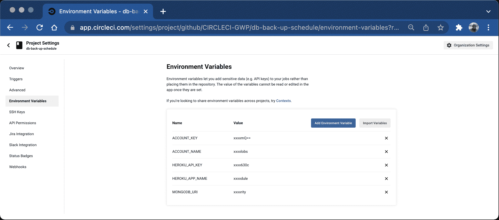

# 使用预定管道自动清理数据库| CircleCI

> 原文：<https://circleci.com/blog/schedule-recurring-database-cleanup/>

> 本教程涵盖:
> 
> 1.  克隆示例应用程序
> 2.  创建和配置计划管道
> 3.  运行计划的管道

RESTful API 项目通常要求开发人员授予对特定资源的临时访问权。有时这发生在特定的时间间隔内，如几天或几个月。当权限过期时撤销权限可能意味着在身份验证过程中包含额外的逻辑，或者编写一个中间件函数来附加到安全端点。或者，这个逻辑可以抽象为一个单独的部分，并配置为定期检查和管理权限。

在本教程中，我将向您展示如何使用[调度管道](https://circleci.com/blog/benefits-of-scheduling-ci-pipelines/)自动清理数据库和撤销授予 API 用户的临时访问权。为了简单起见，我为您创建了一个演示应用程序，用于克隆和部署到 Heroku。这个应用程序使用 MongoDB 来持久化数据。

> 本教程在 Node.js 应用程序中的[为 MongoDB 安排数据库备份中继续。](https://circleci.com/blog/schedule-mongo-db-cleanup/)

## 先决条件

以下是您正确学习本教程所需的内容:

## 克隆演示应用程序

首先，运行以下命令来克隆演示应用程序:

```
git clone https://github.com/yemiwebby/db-cleanup-starter.git db-clean-up 
```

接下来，进入新克隆的应用程序并安装其所有依赖项:

```
cd db-clean-up
npm install 
```

此应用程序包含以下端点:

*   `/create-permission`是一个端点，用于创建具有特定访问过期日期的用户。
*   `/check-access`将用于确保用户的临时访问结束日期早于当前日期。如果是，该用户的访问权限将被取消。
*   `/secured`端点将特定用户的电子邮件地址作为路由参数，并检查用户是否可以访问受保护的资源。
*   `/all-access`显示用户列表。

安装过程完成后，创建一个`.env`文件，并用以下内容填充它:

```
MONGODB_URI=YOUR_MONGODB_URL 
```

如果您愿意，您可以简单地运行以下命令，从 starter 项目中的`.env.sample`文件复制内容:

```
cp .env.sample .env 
```

当然，您需要用用于远程 MongoDB URI 的连接字符串替换`YOUR_MONGODB_URL`占位符。本教程使用 MongoDB Atlas 数据库，您可以很容易地设置一个。接下来我将解释如何做。

## 创建 MongoDB Atlas 帐户和数据库

[在这里](https://www.mongodb.com/cloud/atlas/register)创建一个免费的 Atlas 帐户，并按照说明部署一个[免费层集群](https://docs.atlas.mongodb.com/getting-started/)。设置好集群和数据库用户后，打开并编辑`.env`文件。

用从您的 [MongoDB Atlas 仪表板](https://cloud.mongodb.com/)中提取的连接字符串替换`YOUR_MONGODB_URL`占位符:

```
MONGODB_URI=mongodb+srv://<username>:<password>@<clustername>.mongodb.net/<dbname>?retryWrites=true&w=majority 
```

用集群的值替换`<username>`、`<password>`、`<clustername>`和`<dbname>`。

## 运行演示应用程序

正确创建和配置数据库后，打开一个终端并运行演示应用程序:

```
npm run start 
```

您将得到以下输出:

```
 > db-cleanup-starter@1.0.0 start
> node server.js

Server is running at port 3000
Connected successfully 
```

### 创建有权限的用户

在 Postman 中，使用以下 JSON 数据向`http://localhost:3000/create-permission`端点发出一个`POST`请求:

```
{
  "username": "sample",
  "email": "sample@mail.com",
  "endDate": "2021-07-30",
  "hasAccess": true
} 
```


创建更多用户:

```
{
    "username": "demo",
    "email": "demo@mail.com" ,
    "endDate": "2021-05-22",
    "hasAccess": true
}

{
    "username": "webby",
    "email": "webby@mail.com" ,
    "endDate": "2022-07-30",
    "hasAccess": true
} 
```

您刚刚创建了具有用于临时访问的`endDate`值和一个表示他们能够访问数据库的`hasAccess`标志的用户。默认设置为`false`，如`/models.js`中的`UserSchema`所定义:

```
const mongoose = require("mongoose");

const UserSchema = new mongoose.Schema({
  username: {
    type: String,
    required: true,
  },
  email: {
    type: String,
    required: true,
  },
  endDate: {
    type: Date,
    default: Date.now(),
  },
  hasAccess: {
    type: Boolean,
    default: false,
  },
});
const User = mongoose.model("User", UserSchema);

module.exports = User; 
```

### 检索安全资源

此时，所有创建的用户都可以通过发送一个带有电子邮件地址作为路由参数的`GET`请求来查看和检索来自`/secured`端点的安全资源。


## 在本地测试`check-access`端点

在`./routes.js`文件中定义的`/check-access`端点将检查每个用户的`endDate`是否小于当前日期，如果是，则撤销其访问。

```
app.get("/check-access", async (request, response) => {
  const result = await userModel.updateMany(
    { endDate: { $lt: Date.now() } },
    { hasAccess: false }
  );

  try {
    response.send(result);
  } catch (error) {
    response.status(500).send(error);
  }
}); 
```

换成邮差试试看。


最后，检索所有用户的列表。


此时，`endDate`小于当前日期的用户已经被拒绝访问，如用`hasAccess`标志所指示的。向`/check-access`端点发送 GET HTTP 请求的过程是我们想要自动化的。

## 在 Heroku 上创建应用程序

接下来，在 Heroku 上创建一个新的应用程序来托管和运行 Node.js 项目。前往 [Heroku 仪表盘](https://dashboard.heroku.com/login)开始。点击**新增**，然后点击**新增 App** 。在表单中填写您的应用程序和您所在地区的名称。

**注**:*Heroku 上的应用名称是唯一的。选择一个可用的并记下来。*


点击**创建应用**按钮。您将被重定向到新创建的应用程序的**部署**视图。

接下来，创建一个配置变量来引用前面从 MongoDB Atlas 仪表板中提取的 MongoDB URI。为此，导航到设置页面，向下滚动，并单击**显示配置变量**按钮。


如下所示指定键和值，完成后点击**添加**。



最后，您需要检索 Heroku 帐户的 API 密钥。此密钥将用于连接您的 CircleCI 管道和 Heroku。要获取您的 API 密钥，请打开[帐户设置](https://dashboard.heroku.com/account)页面。

滚动到 **API 键**部分。


点击**显示**按钮，复制 API 密钥。将它保存在您以后可以轻松找到的地方。

## 添加管道配置脚本

接下来，我们需要为 CircleCI 添加管道配置。管道将由安装项目依赖项和编译生产应用程序的步骤组成。

在项目的根目录下，创建一个名为`.circleci`的文件夹。在该文件夹中，创建一个名为`config.yml`的文件。在新创建的文件中，添加以下配置:

```
version: 2.1
orbs:
  heroku: circleci/heroku@1.2.6
jobs:
  build:
    executor: heroku/default
    steps:
      - checkout
      - heroku/install
      - heroku/deploy-via-git:
          force: true
workflows:
  deploy:
    jobs:
      - build 
```

这种配置引入了 Heroku orb `circleci/heroku`，它自动提供对一组健壮的 Heroku 作业和命令的访问。其中一个任务是`heroku/deploy-via-git`，它直接从你的 GitHub repo 将你的应用程序部署到你的 Heroku 账户。

接下来，在 GitHub 上建立一个存储库，并将项目链接到 CircleCI。查看[将项目推送到 GitHub](https://circleci.com/blog/pushing-a-project-to-github/) 以获得分步说明。

登录您的 CircleCI 帐户。如果你注册了你的 GitHub 账户，你所有的库都可以在你项目的仪表盘上看到。

点击**为您的`database-clean-up`项目设置项目**。


将提示您几个关于配置文件的选项。选择`use the .circleci/config.yml in my repo`选项。在 GitHub 上输入你的代码所在的分支名称，然后点击**设置项目**按钮。


您的第一个工作流将开始运行，但会失败。这是因为您没有提供 Heroku API 密钥。你现在可以弥补了。

点击**项目设置**按钮，然后点击**环境变量**。添加这两个新变量:

*   `HEROKU_APP_NAME`是 Heroku ( `database-clean-up`)中的应用名称
*   `HEROKU_API_KEY`是您从帐户设置页面获取的 Heroku API 密钥


从失败的中选择**重新运行工作流以重新运行 Heroku 部署。这一次，您的工作流将成功运行。**

要确认工作流是否成功，您可以在浏览器中打开新部署的应用程序。您的应用程序的 URL 应该是这样的格式`https://<HEROKU_APP_NAME>.herokuapp.com/`。对于这个教程项目，我使用了:“https://database-clean-up . heroku app . com”


## 创建和实施预定的管道

如 CircleCI 官方文件中所述，设置预定管道有两种不同的选择:

1.  使用 API
2.  使用项目设置

出于本教程及其目标的考虑，我们将使用 API。为了方便起见，我们需要 CircleCI API 令牌、您的存储库所在的版本控制系统的名称、您的组织名称以及 CircleCI 上的当前项目 id。要获得代币，请导航至您的 CircleCI 仪表盘并点击您的头像:



您将被重定向到您的用户设置页面。从那里，导航到个人 API 令牌，创建一个新的令牌，为您的令牌命名，并将其保存在某个安全的地方。

现在，从项目的根目录打开`.env`文件，并添加以下内容:

```
VCS_TYPE=VERSION_CONTROL_SYSTEM
ORG_NAME=ORGANISATION_NAME
PROJECT_ID=PROJECT_ID
CIRCLECI_TOKEN=YOUR_CIRCLECI_TOKEN
MONGODB_URI=YOUR_MONGODB_URL 
```

用适当的值替换占位符:

*   `VCS_TYPE`:你的版本控制系统，比如`github`。
*   `ORG_NAME`:您的 GitHub 用户名或组织名称
*   你在 CircleCI 上的项目 Id。在我们的例子中
*   你的戒指令牌
*   从 MongoDB Atlas dashboard 中提取的 MongoDB URI 字符串。

接下来要做的是在项目的根目录下创建一个名为`schedule.js`的新文件，并使用以下内容:

```
const axios = require("axios").default;
require("dotenv").config();
const API_BASE_URL = "https://circleci.com/api/v2/project";

const vcs = process.env.VCS_TYPE;
const org = process.env.ORG_NAME;
const project = process.env.PROJECT_ID;
const token = process.env.CIRCLECI_TOKEN;
const postScheduleEndpoint = `${API_BASE_URL}/${vcs}/${org}/${project}/schedule`;

async function scheduleDatabaseBackup() {
  try {
    let res = await axios.post(
      postScheduleEndpoint,
      {
        name: "Database backup",
        description: "Schedule database backup for your app in production",
        "attribution-actor": "current",
        parameters: {
          branch: "main",
          "run-schedule": true,
        },
        timetable: {
          "per-hour": 30,
          "hours-of-day": [
            0, 1, 2, 3, 4, 5, 6, 7, 8, 9, 10, 11, 12, 13, 14, 15, 16, 17, 18,
            19, 20, 21, 22, 23,
          ],
          "days-of-week": ["MON", "TUE", "WED", "THU", "FRI", "SAT", "SUN"],
        },
      },
      {
        headers: { "circle-token": token },
      }
    );
    console.log(res.data);
  } catch (error) {
    console.log(error.response);
  }
}
scheduleDatabaseBackup(); 
```

在这里，我们创建了一个名为`**scheduleDatabaseBackup()**`的函数，将管道进度细节发布到 [CircleCI API](https://circleci.com/blog/introducing-circleci-api-v2/) 。指定的有效载荷有:

*   `name`:这是日程名称。它需要是独特的。
*   `description`:可选字段，用于描述日程安排。
*   有效负载还包括一个`attribution-actor`，它可以是一个中立角色的`system`，也可以是获取当前用户权限的`current`(根据您使用的令牌)
*   `parameters`:在此对象中指定了要触发的分支和一个检查何时运行管道的附加值。
*   这是我们定义运行预定管道的时间和频率的地方。这里使用的字段是`per-hour`、`hours-of-day`和`days-of-week`。请注意，这没有采用 cron 表达式，这使得它更容易被使用 API 推理的人解析。在这里，我们将计划设置为在一小时内运行 30 次。这相当于大约每两分钟一次。

最后，CircleCI 标记在头中传递。

## 更新配置文件

在运行计划管道之前，我们需要更新 CircleCI 管道配置脚本。打开`.circleci/config.yml`文件，将其内容替换为:

```
version: 2.1
orbs:
  heroku: circleci/heroku@1.2.6
jobs:
  build:
    executor: heroku/default
    steps:
      - checkout
      - heroku/install
      - heroku/deploy-via-git:
          force: true
  schedule_backup:
    working_directory: ~/project
    docker:
      - image: cimg/node:17.4.0
    steps:
      - checkout
      - run:
          name: Install MongoDB Tools.
          command: |
            npm install
            sudo apt-get update
            sudo apt-get install -y mongodb
      - run:
          name: Run database back up
          command: npm run backup
parameters:
  run-schedule:
    type: boolean
    default: false
workflows:
  deploy:
    when:
      not: << pipeline.parameters.run-schedule >>
    jobs:
      - build
  backup:
    when: << pipeline.parameters.run-schedule >>
    jobs:
      - schedule_backup 
```

这里，我们包含了一个名为`schedule_backup`的新任务。它使用 docker 镜像来安装 Node.js 和 [MongoDB 工具](https://docs.mongodb.com/database-tools/)。此外，我们包含参数并使用名为`run-schedule`的管道变量来检查何时运行工作流。对于所有工作流，添加`when`表达式，表示当`run-schedule`为`true`时运行这些工作流，除非`run-schedule`为`false`否则不运行其他工作流。

## 在 CircleCI 上创建更多的环境变量

在将所有更新添加并推送到 GitHub 之前，您将添加 MongoDB 连接字符串、Azure 帐户名和 Key 作为 CircleCI 项目上的环境变量。从当前项目管道页面，点击**项目设置**按钮。接下来，从侧菜单中选择**环境变量**，并添加以下变量:

*   `ACCOUNT_KEY`:这是你的 Microsoft Azure 存储帐户密钥
*   `ACCOUNT_NAME`:这是微软 Azure 存储帐户名，在本教程中为`dbblobs`
*   `MONGODB_URI`:你的 MongoDB 连接字符串。

此时，您的环境变量页面应该如下所示:



现在，更新 git，把你的代码推回 GitHub。

## 为数据库清理运行计划的管道

准备好调度配置文件后，您就可以运行管道了。从项目的根目录中，运行以下命令:

```
node schedule_pipeline 
```

或者您可以使用在`package.json`文件中指定的 npm 脚本命令:

```
npm run schedule 
```

您的输出应该如下所示:

```
{
  description: 'Check and revoke permissions assigned to users.',
  'updated-at': '2022-02-06T13:54:01.993Z',
  name: 'Check and Change permission',
  id: '821f4190-7261-4433-ae08-d5d41d700879',
  'project-slug': 'gh/CIRCLECI-GWP/database-clean-up',
  'created-at': '2022-02-06T13:54:01.993Z',
  parameters: { branch: 'main', 'run-schedule': true },
  actor: {
    login: 'daumie',
    name: 'Dominic Motuka',
    id: '335b50ce-fd34-4a74-bc0b-b6455aa90325'
  },
  timetable: {
    'per-hour': 30,
    'hours-of-day': [0, 1, 2, 3, 4, 5, 6, 7, 8, 9, 10, 11, 12, 13, 14, 15, 16, 17, 18, 19, 20, 21, 22, 23],
    'days-of-week': [ 'MON', 'TUE', 'WED', 'THU', 'FRI', 'SAT', 'SUN' ]
  }
} 
```

### 更新配置文件

导航到`.circleci/config.yml`文件并更新其内容，如下所示:

```
version: 2.1
orbs:
  heroku: circleci/heroku@1.2.6
jobs:
  build:
    executor: heroku/default
    steps:
      - checkout
      - heroku/install
      - heroku/deploy-via-git:
          force: true
  permission:
    docker:
      - image: cimg/node:17.4.0
    steps:
      - run:
          name: Check access and update permissions for users
          command: "curl https://<YOUR_HEROKU_APP_NAME>.herokuapp.com/check-access"
parameters:
  run-schedule:
    type: boolean
    default: false

workflows:
  deploy:
    when:
      not: << pipeline.parameters.run-schedule >>
    jobs:
      - build
  check_permissions:
    when: << pipeline.parameters.run-schedule >>
    jobs:
      - permission 
```

这个配置包括一个名为`permission`的新作业。它使用 Docker 映像来安装 Node.js，并运行 curl 命令来调用部署的应用程序的`check-access`端点。该配置还包括参数，并使用名为`run-schedule`的管道变量来检查何时运行工作流。对于所有工作流，添加`when`表达式，表示当`run-schedule`为`true`时运行这些工作流，除非`run-schedule`为`false`否则不运行其他工作流。

现在，更新 git，把你的代码推回 GitHub。在 CircleCI 上查看您的管道。


管道将每两分钟运行一次。这个间隔很短，但只是为了演示。


在生产中，您不会希望在如此短的时间间隔内触发管道。您可以修改`./schedule_pipeline.js`文件的内容，并根据您的工作流程进行调整。每天晚上运行这个数据库清理工作流可能是个好主意。

## 结论

预定的管道可以在特定的时间间隔触发您的构建。让自动化处理应用程序的持续集成、部署和自动化操作。利用你节省下来的时间，专注于实现更多的特性，编写更多的测试，更快地修复 bug。你的团队会喜欢的！

关于 CircleCI 上预定管道的更多信息，请参考[官方文件](https://circleci.com/docs/scheduled-pipelines/#overview)。

我真的希望这对你有所帮助。完整的源代码可以在 GitHub 上找到[。](https://github.com/yemiwebby/db-clean-up)

* * *

[Oluyemi](https://twitter.com/yemiwebby) 是一名拥有电信工程背景的技术爱好者。出于对解决用户日常遇到的问题的浓厚兴趣，他冒险进入编程领域，并从那时起将他解决问题的技能用于构建 web 和移动软件。Oluyemi 是一名热衷于分享知识的全栈软件工程师，他在世界各地的几个博客上发表了大量技术文章和博客文章。由于精通技术，他的爱好包括尝试新的编程语言和框架。

* * *

Oluyemi 是一名拥有电信工程背景的技术爱好者。出于对解决用户日常遇到的问题的浓厚兴趣，他冒险进入编程领域，并从那时起将他的问题解决技能用于构建 web 和移动软件。Oluyemi 是一名热衷于分享知识的全栈软件工程师，他在世界各地的几个博客上发表了大量技术文章和博客文章。作为技术专家，他的爱好包括尝试新的编程语言和框架。

[阅读更多 Olususi Oluyemi 的帖子](/blog/author/olususi-oluyemi/)