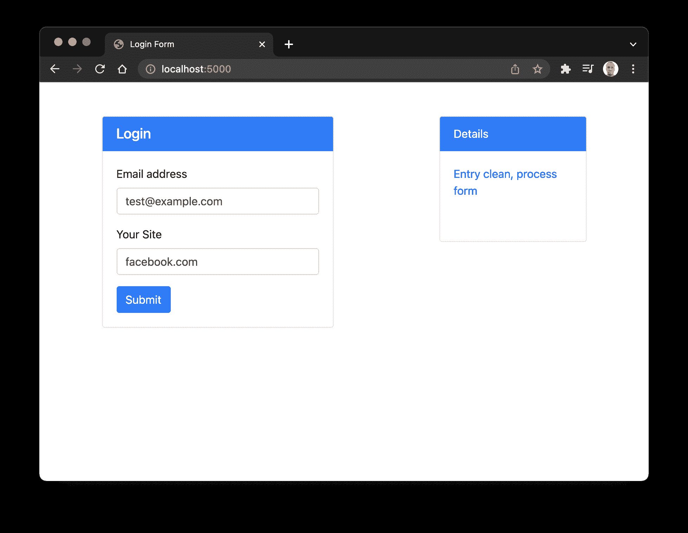
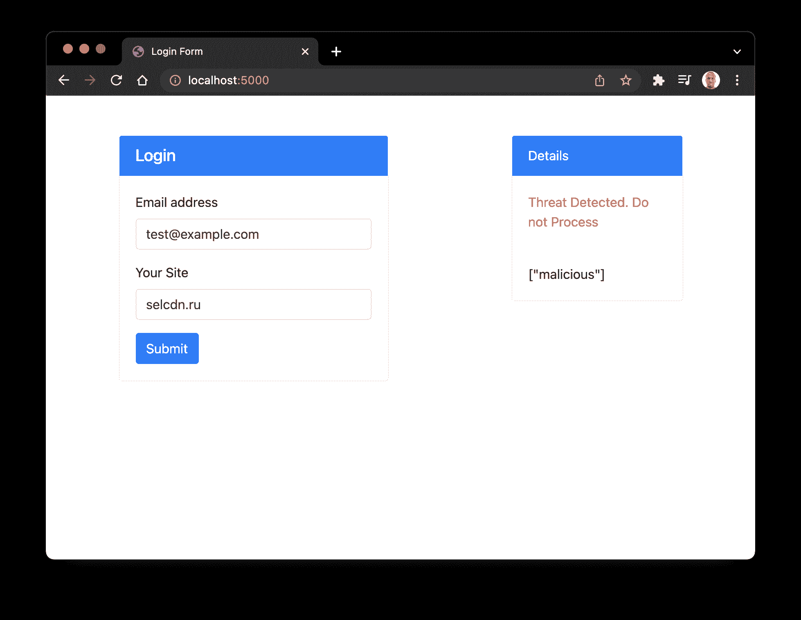
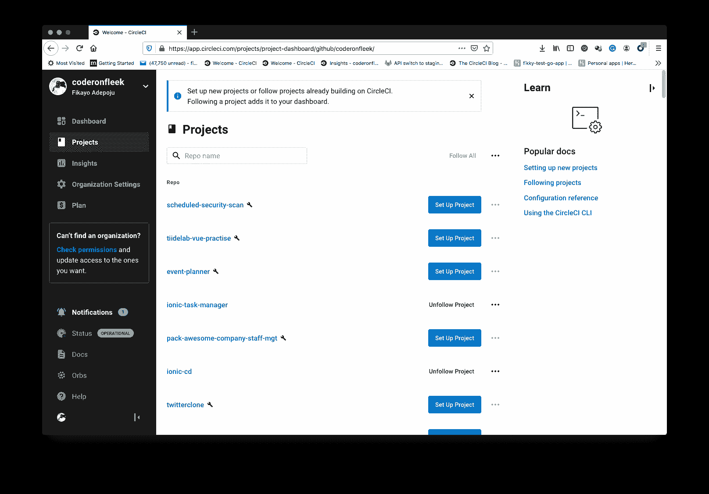
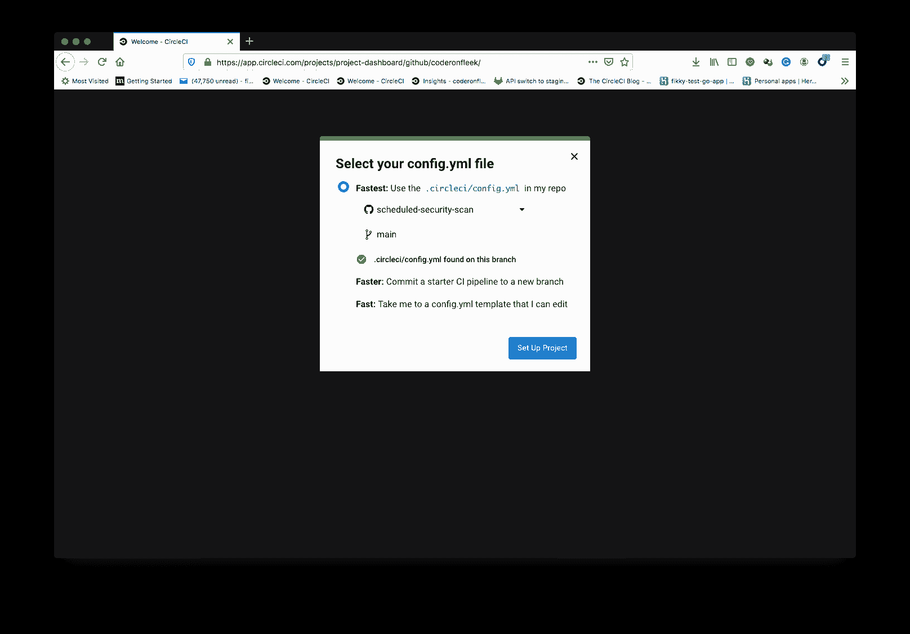
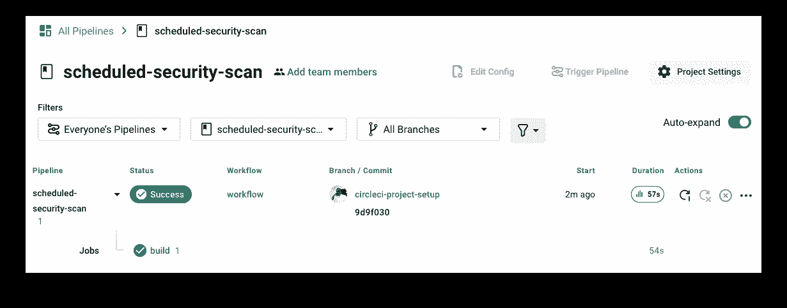
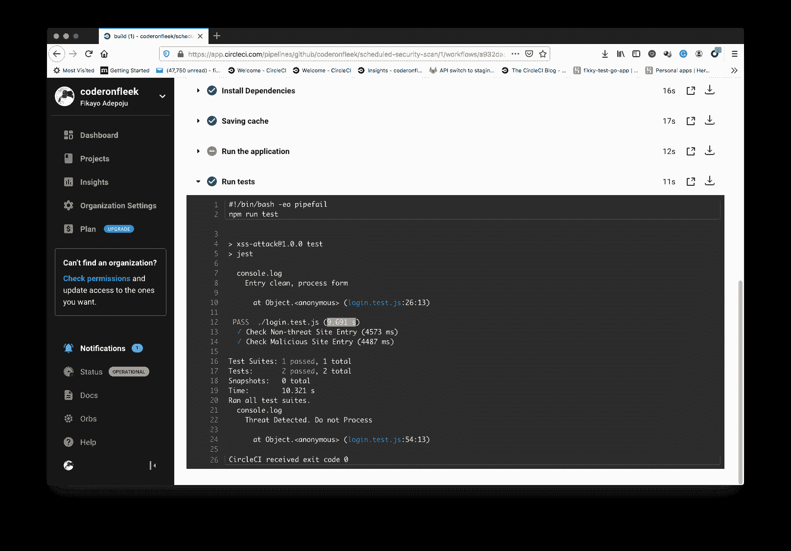
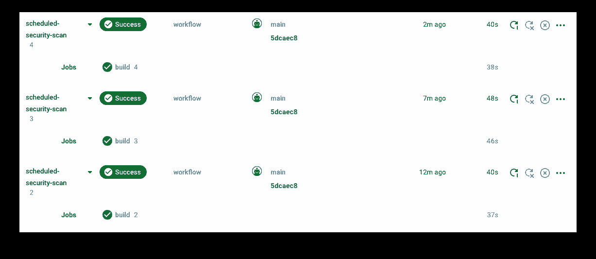

# 使用计划管道运行常规安全扫描| CircleCI

> 原文：<https://circleci.com/blog/scheduled-security-scans/>

安全性是应用程序开发中至关重要的一部分，但在攻击者利用系统中的漏洞之前，它可能会被忽略。安全漏洞的后果会损害应用程序的完整性以及公司的声誉和收入。软件架构师和工程师需要特别注意保护他们工作的系统。

运行基于安全性的测试并将安全性自动化到 CI/CD 工作流中是 [DevSecOps](https://circleci.com/blog/security-best-practices-for-ci-cd/) 背后的灵感，这是 DevOps 方法在应用安全领域的扩展。

在本文中，我将带领您完成应用程序中的自动化安全检查。我将向您展示如何在一个 web 表单上运行一个测试，将恶意域注入到 URL 字段中。测试的目标是破坏 web 表单。为了阻止攻击，web 表单受到了逻辑保护，该逻辑检查用户是否试图进入恶意域。我将向您展示如何使用[调度管道](https://circleci.com/blog/benefits-of-scheduling-ci-pipelines/)来定期运行安全测试。

## 先决条件

要完成本教程，您需要准备好以下内容:

一旦你设置好这些，你就可以开始了。

## 获取 Webshrinker 凭据

[Webshrinker](https://www.webshrinker.com/) 是由 DNS 安全公司 [DNSFilter](https://www.dnsfilter.com/) 拥有的 AI 驱动的域名分类系统。Webshrinker 能够识别威胁域，并根据威胁类别对其进行标记。网络钓鱼、恶意软件和僵尸网络只是 Webshrinker 可以识别的三种威胁类型。

我们在项目中保护的表单在其 URL 字段中采用完全限定的域名。它会将域名发送到 Webshrinker API 进行威胁扫描。如果结果表明它是恶意的，Webshrinker 返回一个威胁标识符。该表单使用威胁标识符拒绝处理域条目。

在这个演示中，您需要一个 API 密匙和 API 密码来使用 Webshrinker。一旦您创建了一个帐户，您就可以通过转到 **API 访问密钥**页面并点击**创建 API 密钥**按钮来创建新的 API 凭证。生成您的 API 秘密和令牌。

您将在下一步中使用您的凭据。

## 克隆和运行演示应用程序

第一步是在本地运行演示 web 表单并检查其行为。您可以从这个[存储库](https://github.com/coderonfleek/scheduled-security-scan)中克隆表单的代码，方法是在系统的任何地方运行这个命令:

```
git clone -b base-project --single-branch https://github.com/coderonfleek/scheduled-security-scan.git 
```

一旦您的系统上有了代码，通过运行以下命令安装依赖项:

```
cd scheduled-security-scan
npm install 
```

现在转到项目根目录下的`index.html`文件中的第`65`行和第`66`行，分别用 API 密匙和 API 秘密替换占位符。

依赖项安装完成后，使用以下命令运行应用程序:

```
npm start 
```

应用程序启动，您可以在`https://localhost:5000`查看 web 表单。

在电子邮件字段中输入电子邮件地址。在 URL 字段中，输入一个类似于`facebook.com`的安全域，然后点击**提交**。你会在表格的右边得到一个安全的回答。



现在，使用这个基于威胁的域名:`selcdn.ru`测试表单的 URL 字段。请，**不要在您的浏览器**中直接输入该域名。您将收到一条威胁警报消息。



## 添加安全测试

下一步是编写自动执行安全检查的测试。您将使用 Google 的[木偶师](https://developers.google.com/web/tools/puppeteer)添加一些自动化功能测试。木偶师模拟真实世界的用户填写表单的方式。

在项目的根目录下添加一个名为`login.test.js`的新文件，并输入以下代码:

```
const puppeteer = require("puppeteer");

const user_email = "test@example.com";
const non_threat_site = "facebook.com";
const malicious_site = "selcdn.ru";
const phishing_site = "mail.glesys.se";
const expected_safe_site_message = "Entry clean, process form";
const expected_threat_site_message = "Threat Detected. Do not Process";

test("Check Non-threat Site Entry", async () => {
  const browser = await puppeteer.launch();
  try {
    const page = await browser.newPage();

    await page.goto("http://localhost:5000");

    await page.type("#userEmail", user_email);
    await page.type("#userSite", non_threat_site);
    await page.click("#submitButton");

    let messageContainer = await page.$("#infoDisplay");
    await page.waitForTimeout(4000);
    let value = await messageContainer.evaluate((el) => el.textContent);

    console.log(value);

    expect(value).toBe(expected_safe_site_message);
  } finally {
    await browser.close();
  }
}, 120000);

test("Check Malicious Site Entry", async () => {
  const browser = await puppeteer.launch();
  try {
    const page = await browser.newPage();

    await page.goto("http://localhost:5000");

    await page.type("#userEmail", user_email);
    await page.type("#userSite", malicious_site);
    await page.click("#submitButton");

    let messageContainer = await page.$("#infoDisplay");
    await page.waitForTimeout(4000);

    let value = await messageContainer.evaluate((el) => el.textContent);

    console.log(value);

    expect(value).toBe(expected_threat_site_message);
  } finally {
    await browser.close();
  }
}, 120000); 
```

这个文件包含两个测试用例。第一个检查像`facebook.com`这样的非威胁域没有被系统阻止。这可以防止您的安全实现过度阻止常规域。

第二个测试用例通过使用一个示例恶意域来检查恶意条目。如果表单阻止了这个域，测试就通过了。如果恶意域未被阻止，测试将失败。

保存文件，并在终端中转至项目的根目录。确保应用程序正在另一个 shell 中运行；测试需要它才能成功运行。运行以下命令:

```
npm run test 
```

测试运行完成后，您将在 CLI 中看到如下结果:

```
MACs-MBP-2:scheduled-security-scan mac$ npm run test

> xss-attack@1.0.0 test /Users/mac/Documents/CircleCiProjects/2022/scheduled-security-scan
> jest

  console.log
    Entry clean, process form

      at Object.<anonymous> (login.test.js:26:13)

 PASS  ./login.test.js (109.034 s)
  ✓ Check Non-threat Site Entry (80318 ms)
  ✓ Check Malicious Site Entry (8210 ms)

Test Suites: 1 passed, 1 total
Tests:       2 passed, 2 total
Snapshots:   0 total
Time:        120.252 s
Ran all test suites.
  console.log
    Threat Detected. Do not Process

      at Object.<anonymous> (login.test.js:54:13) 
```

开发人员可能倾向于编写与他们的代码能力相匹配的测试。作为最佳实践，一定要将开发和测试团队分开。这种实践让测试团队编写详尽的测试，并保护开发人员免受其害。

## 添加管道配置脚本

为了自动化测试过程，我们可以使用 CircleCI 构建一个持续集成(CI)管道。

要设置 CI 管道，您需要一个管道配置脚本。您可以将这个脚本添加到一个`.circleci/config.yml`文件中。在项目的根目录下创建文件，并输入:

```
version: 2.1
jobs:
  build:
    working_directory: ~/repo
    docker:
      - image: cimg/node:14.18-browsers
    steps:
      - checkout
      - run:
          name: Update NPM
          command: "sudo npm install -g npm"
      - restore_cache:
          key: dependency-cache-{{ checksum "package-lock.json" }}
      - run:
          name: Install Dependencies
          command: npm install
      - save_cache:
          key: dependency-cache-{{ checksum "package-lock.json" }}
          paths:
            - ./node_modules
      - run:
          name: Run the application
          command: node server.js
          background: true
      - run:
          name: Run tests
          command: npm run test 
```

该配置脚本:

*   拉进一个安装了浏览器和 Node.js 的 Docker 映像
*   更新`npm`并安装所需的项目依赖项
*   在后台运行应用程序，以便 Cypress 测试可以加载它
*   运行测试

保存文件并[将项目推送到 GitHub](https://circleci.com/blog/pushing-a-project-to-github/)

接下来，将存储库添加为 CircleCI 项目。





一旦在 CircleCI 上建立了项目，测试就会立即运行。当构建完成时，您将获得一个成功的构建状态。



单击**构建**链接查看构建详细信息。



## 在 CircleCI 上设置预定管道

通常，您的 CI 管道只有在对您在设置管道时使用的远程代码存储库进行新的提交时才会运行。为了从我们编写的测试这样的安全扫描中获得最大收益，即使没有新代码被推送，应用程序的安全状态也应该被更新。

这意味着我们的管道需要定期运行，就像一个`cron`作业，以准确地报告应用程序的安全状态。为了保持效率，最好不要将安全性测试与检查错误或验证应用程序功能的功能性测试混在一起。

通过 CircleCI 上的计划管道，您可以将管道配置为仅在特定的一天运行，或者在一周的所有天的特定时间运行。

对于本教程，我们将设置管道在一周的每一天每五分钟运行一次。为此项目设置的时间间隔不是基于任何实际情况、详细考虑或最佳实践。这只是为了演示管道在演示期间定期运行。

要配置您的管道按计划运行，请转到 CircleCI 并选择**项目设置**，然后**触发**。

在触发页面，点击**添加预定触发**显示触发表单。填写表单，将管道配置为每天每五分钟运行一次。


点击**保存触发器**，您的触发器将被创建。

返回到管道页面，等待至少五分钟。你的管道会被 CircleCI 系统触发。



每次运行之间的五分钟间隔表明配置完全有效。

## 结论

在本教程中，我演示了如何使用 CircleCI 的调度管道在您的应用程序上运行定期安全扫描。您可以让系统不断运行安全检查，并在出现问题或易受攻击时进行报告，而不是等待新代码的生成。

安全扫描只是这种自动化的众多用例之一。日志和数据归档等清理任务也是配置时间表的理想选择。与您的团队分享您所学到的知识，并开始尝试预定的管道。

编码快乐！

* * *

Fikayo Adepoju 是 LinkedIn Learning(Lynda.com)的作者、全栈开发人员、技术作者和技术内容创建者，精通 Web 和移动技术以及 DevOps，拥有 10 多年开发可扩展分布式应用程序的经验。他为 CircleCI、Twilio、Auth0 和 New Stack 博客撰写了 40 多篇文章，并且在他的个人媒体页面上，他喜欢与尽可能多的从中受益的开发人员分享他的知识。你也可以在 Udemy 上查看他的视频课程。

[阅读 Fikayo Adepoju 的更多帖子](/blog/author/fikayo-adepoju/)