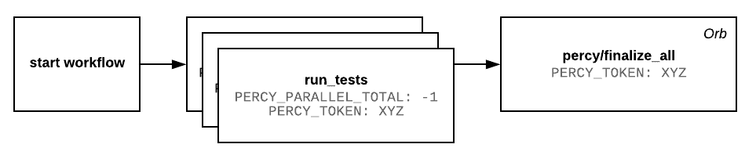

# 使用 Percy orb | CircleCI 进行并行可视化测试

> 原文：<https://circleci.com/blog/seamless-parallelized-visual-testing-with-the-percy-circleci-orb/>

我们在 [Percy](https://percy.io/) 的目标是帮助团队满怀信心地部署他们的应用程序，使其看起来完全符合预期。

我们的视觉测试和审查解决方案会自动为您检查 UI，而不是在浏览器和屏幕之间手动检查。[将 Percy](https://docs.percy.io/v1/docs/supported-frameworks) 与您的测试相集成，我们定制的渲染基础设施会在您每次进行更改时生成您的用户界面快照。

该工作流可以无缝地融入您现有的 CI/CD 套件中，帮助您消除每次提交时出现视觉倒退的风险。借助 Percy，您还可以在并行 CI 构建的同时运行可视化测试——而我们的 CircleCI orb 让这变得前所未有的简单。

## 珀西·切尔莱西球体

因为 Percy 在 CI 服务的下游运行，所以它需要一个清晰的信号来指示构建何时完成，这样它就知道何时拥有完整的快照集。我们的 orb 确保没有一个迟到的测试者没有完成。

Percy Orb 的典型工作流程如下:



您的测试套件开始了，将运行测试的工作分成多个测试运行程序。一旦它们都完成了，就调用`percy/finalize_all`命令，触发完成一个构建并将构建中的所有快照视为已接收。

## 环境变量

一旦您创建了一个与 CircleCI 集成的 Percy 项目，请在您的项目设置下检索您的 PERCY_TOKEN。

将`PERCY_PARALLEL_TOTAL`设置为-1。这告诉 Percy，我们不知道这次运行的并行化程度如何，但是当我们听到来自 orb 的`percy/finalize_all`命令时，我们将认为我们的 Percy 构建已经完全完成。

## 工作流配置

您的 CircleCI 工作流配置导入了`percy/agent` orb，一旦所有测试完成，它就执行`percy/finalize_all`命令。

概括地说，`.circleci/config.yml`文件应该是这样的:

```
version: 2.1

orbs:
 percy: percy/agent@volatile

jobs:
 run_tests:
   steps:
     - attach_workspace:
         at: .
     - run: echo "your tests run here"

workflows:
 test:
   jobs:
     - run_tests:
         parallelism: 3
     - percy/finalize_all:
         requires:
           - run_tests 
```

## 运行测试

一旦您将 Percy CircleCI Orb 添加到您的配置文件(`.circleci/config.yml`)中，每当您的测试运行时，快照将跨浏览器和屏幕尺寸呈现。

 </blog/media/2018-12-06-diff-min.mp4> 

在上面的例子中，发生变化的像素以红色“视觉差异”突出显示 [Percy 的 SDK](https://docs.percy.io/v1/docs/supported-frameworks)使得向任何前端框架、测试框架、组件库或风格指南添加可视化测试变得容易。关于将我们的 orb 整合到你的 CircleCI 配置文件中的更多信息，请访问 [Percy docs](https://docs.percy.io/v1/docs/circleci-orb-integration) 。

我们很高兴成为 CircleCI [的技术合作伙伴](https://circleci.com/blog/announcing-orbs-technology-partner-program/)，使视觉测试更加高效和可扩展，我们期待着为未来的用例发展我们的 Orb。

在 2019 年 1 月 22 日星期二上午 10:00 PST/18:00 UTC 举行的我们的[网络研讨会](https://www2.circleci.com/CircleCI-Percy-Webinar.html)“Percy 和 CircleCI orbs 在您的 CI/CD 工作流程中的视觉测试”中，了解更多关于 CircleCI 和 Percy 的信息

* * *

大卫·琼斯是珀西 T2 公司的工程总监。他喜欢与工程师一起工作，开发工具，让他们在发布软件时更有信心。你可以跟着他 [@d_jones](https://twitter.com/d_jones?lang=en) 。