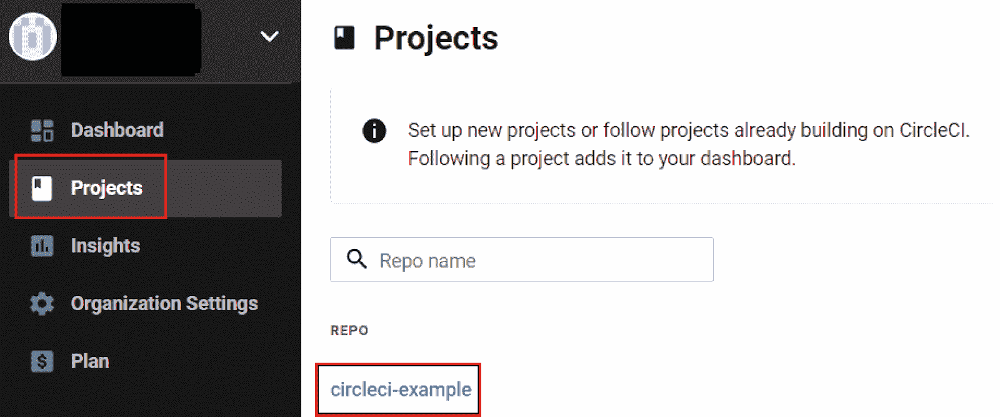

# 完成安全测试自动化周期| CircleCI

> 原文：<https://circleci.com/blog/security-testing-automation-cycle/>

DevOps、DevSecOps 和 CI/CD 是一个词的同义词——自动化。自动化他们的工作流使开发人员能够交付一致性、节省时间以及对他们的软件开发生命周期(SDLC)的有用见解。但是自动化的效率取决于您最薄弱的环节或最麻烦的瓶颈，有时可能是安全测试。

传统上，安全测试要么手动执行，要么在过程的后期执行。有时，安全测试依赖于遗留工具，这些工具速度慢，对开发人员不友好，并且不能有效地集成到持续集成(CI) [管道](https://circleci.com/blog/what-is-a-ci-cd-pipeline/)中。

为了保持快速的发布周期，您要么被迫等待直到手动安全检查和验证完成(这可能需要几个星期)，要么接受风险并进行部署(不幸的是，这更常见)。这两种选择中的任何一种都可能导致生产中的重大漏洞，在发布完成(如果有的话)几个月后问题才得到补救，并导致不可逾越的技术和安全债务。

这个瓶颈抵消了自动化带来的好处。雪上加霜的是，瓶颈安全测试变成了一个棘手的问题，它经常被忽略，甚至完全从工作流程中删除。这篇文章将描述一些方法来使安全测试自动化成为你的管道中的一个活跃的部分，这样你就可以继续交付及时和安全的持续高质量的应用程序。

## 先决条件

为了遵循本文中的示例，您需要准备一些东西。

*   GitHub 帐户
*   一个[圆](https://circleci.com/signup/)的账户
*   云帐户(在本例中，我们将使用 AWS 帐户)
*   一个 [NexPloit.app 账户](https://go.neuralegion.com/appsec-testing-for-devs?utm_source=referral&utm_medium=website&utm_campaign=circleci)(免费)来运行安全测试

## 作为 CircleCI 工作流程一部分的自动化安全测试

要将安全测试自动化作为您工作流程的一部分，需要您的工具具有补充并跟上快速发展的属性:

*   无缝集成到您的 CI 中
*   专为开发者设计。为网络安全专业人员构建的工具具有复杂的测试设置和配置，对开发人员来说是行不通的
*   直观的扫描优化和利用配置文件作为代码的能力
*   快速测试每个构建和提交的能力，同时还能识别漏洞
*   以不延迟(和烦扰)开发人员(和安全团队)的方式自动删除误报
*   清晰有效的补救指南

有了这种工具，自动化测试就能发现真正的问题，这些问题可以尽早地、经常地得到补救，开发人员将开始信任结果。集成和运行这些测试以开始在每个构建中获得安全性遵从性是非常简单的，正如我将在本文接下来的几个部分中展示的。

## 集成和配置 circleci 和 exploit

神经区域有一个圆形球体。不过，对于这个例子，我们将使用 GitHub 存储库中的一个易受攻击的应用程序，并设置一个 CircleCI 工作流。

我们将使用 NexPloit 对目标运行初始安全扫描，CircleCI 将根据我们的配置中断构建，并且可以查看结果以进行补救。本例的[代码库](https://github.com/NeuraLegion/circleci-example)包含一个示例 CircleCI YAML 配置文件的公共可用库。它对一个名为[破碎晶体](https://brokencrystals.com/)的故意易受攻击的基准应用程序进行扫描。请随意使用这个目标作为测试项目。

这个 YAML 文件包含安全扫描的配置、管道本身(称为 nexploit)，以及回购和执行步骤的详细信息。

安装 NexPloit CLI 实用程序，以便可以使用 Nexploit API 运行、轮询状态和停止扫描。

接下来，我们需要提供扫描设置的详细信息:

*   将在目标上使用爬虫来自动检测攻击面
*   NEXPLOIT _ TOKEN–使用 Nexploit API 所需的令牌
*   扫描和轮询间隔的长度以及超时
*   断点，在本例中是检测到中等严重性问题时构建失败

那么，让我们看看如何在 CircleCI 中设置自动扫描。

首先，我们需要添加我们的集成。如果您还没有，请添加您的 GitHub 和 Nexploit.app 集成。

## 集成 GitHub 和 CircleCI

这可能是最简单的过程，不需要安装插件，集成真的是开箱即用。只需使用您的 GitHub 帐户登录，CircleCI 就会镜像您的 GitHub 团队权限和特权，因此您可以立即开始构建。每当您在 GitHub 中提交代码时，CircleCI 都会自动运行您的构建和测试流程。

## 将 NeuraLegion 的 Nexploit.app 与 CircleCI 集成

在 CircleCI 中，导航到您的项目，并选择您想要与自动化测试集成的 repo。

### 获取 Nexploit.app API 密钥

1.  转到**项目设置**，然后转到**环境变量**，为 Nexploit repeater/CLI 添加 API 密钥和令牌。
2.  在 nexploit.app 中，进入**用户设置**，点击**创建新的 API 密钥**。
3.  为 API 密钥添加“名称”
4.  在“选择范围”下，选择全部。
5.  创建并复制令牌。这可以在 CircleCI 平台中用来设置集成。

### 获取中继器 ID

1.  转到**中继器**然后按 **+** 设置一个新的中继器。
2.  添加一个“名称”

1.  在中继器列表下，复制您生成的新中继器 ID。

新的 API 键和 Repeater ID 现在可以用来设置 CircleCI 环境变量:NEXPLOIT_TOKEN 和 Repeater。

您的下一次提交将启动一个工作流并使用 CircleCI 进行构建。NexPloit 将针对该提交运行安全性测试。

正如 config.yaml 中所指定的，环境已经启动，环境变量已经准备好，针对目标启动了新的 NexPloit 安全扫描，我们正在轮询结果。

过不了多久，NexPloit 就会发现一个中等级别的问题。正如我们在配置文件中指定的，当遇到这个断点时，构建失败，扫描被设置为停止。在配置中删除此“停止扫描”步骤将导致构建失败，但会继续对目标运行扫描，以便可以检测到任何其他漏洞。

现在，我们可以使用 NexPloit 仪表板检查状态，查看安全扫描状态和结果。

扫描器已经在目标上检测到许多自动验证的安全问题，准备修复，而不需要任何手动验证。

这些结果为开发人员提供了理解问题、如何重现问题、如何修复问题所需的信息，以及补救指南。

提供了带有类似 diff 的视图(添加/删除了什么)的请求，以及响应、头和主体。

在这个[跨站点脚本](https://www.neuralegion.com/blog/cross-site-scripting-xss/) (XSS)的例子中，有截图形式的额外证据作为概念证明，所以你知道漏洞在那里。

Nexploit 与 JIRA 集成，因此每发现一个问题就可以自动开一张罚单，或者你可以用插件连接 [JIRA 和 CircleCI](https://circleci.com/docs/jira-plugin/) 。

## 结论

将 [NeuraLegion 的 DAST](https://www.neuralegion.com/products/ast/nexdast/) AppSec 扫描连接到您的 CircleCI 管道简单、直接，是您工作流程中的自动化步骤。你也可以继续使用你的其他集成，比如像 JIRA 这样的售票系统。NexPloit 可以扫描您的 web 应用程序或 API(SOAP、REST、GraphQL)，以开发人员友好的方式组织和解释任何漏洞的结果，描述漏洞以及如何补救和修复它们。

使用 CircleCI 和 NeuraLegion，您可以在几分钟内创建端到端的部署管道，其中包括作为一个组成部分的安全测试，而不会因错误警报而导致构建失败。结果是部署了安全的产品，并配备了简化的 CI 流程。阅读关于浪子如何利用 CircleCI 和 NeuraLegion 的文章。

Oliver Moradov 是 NeuraLegion 的副总裁，也是 DevOps 和 DevSecOps 的应用安全测试(DAST)自动化方面的专家。NeuraLegion 提供了一个以开发者为中心的 DAST 平台。了解如何结合使用 CircleCI 和 NexPloit 在管道中自动进行 AppSec 测试，以确保设计的安全性。您可以马上开始，今天就注册您的 [CircleCI 免费试用](https://circleci.com/signup/)。