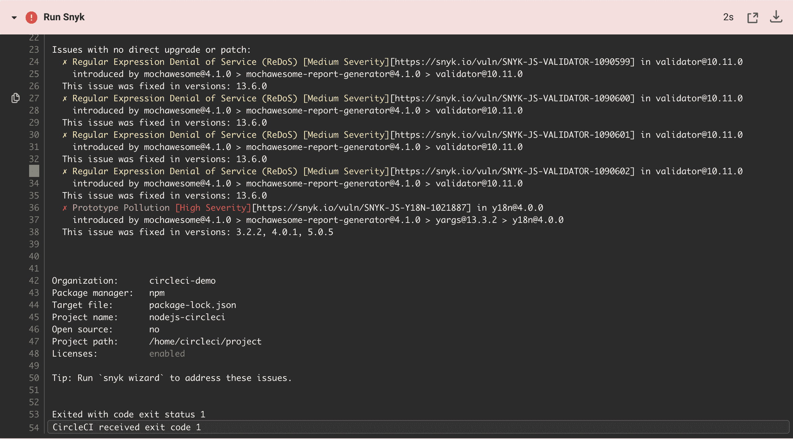
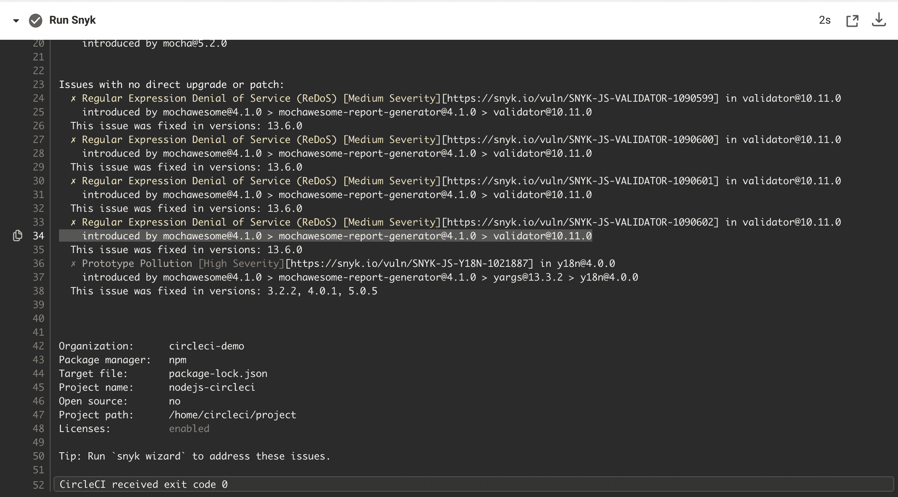
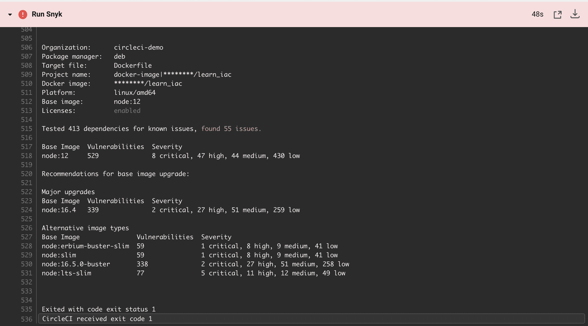
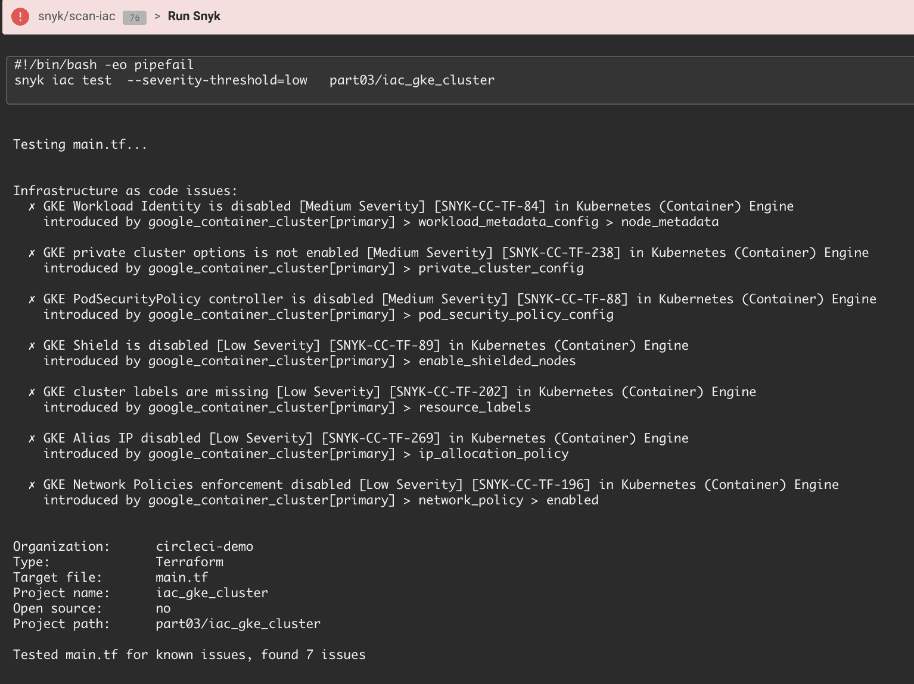
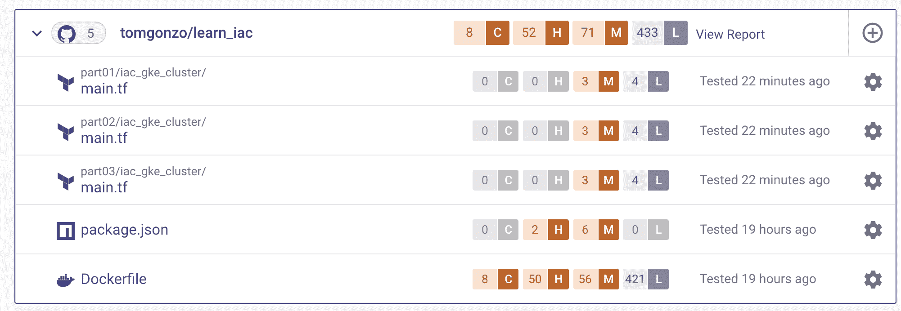

# CircleCI 工作流程| CircleCI 中的 Snyk 安全性

> 原文：<https://circleci.com/blog/security-with-snyk-in-the-circleci-workflow/>

今天的应用程序是使用现代 DevOps 流程构建的，每天都要进行几次频繁的集成和部署。为了实现速度和规模，应用程序安全性必须从开发人员开始，安全团队从审核和把关职能转变为授权和治理角色。

## 保护云原生应用

随着容器、Kubernetes 和 Terraform 等云原生技术用代码取代了基础设施，应用程序也发生了变化。这些元素现在由开发人员构建和定制，并存在于他们的存储库中。

保护云原生应用需要将这些应用组件的所有权(传统上是 IT 安全性的一部分)转移到应用安全模型中。随着开发人员掌握安全性的第一步，集成到他们的工作流中并以开发人员友好的方式呈现信息的安全测试工具对他们的工作效率变得至关重要。

## Snyk 入门

Snyk orb 使得 DevSecOps 团队很容易将测试集成到 CircleCI 工作流中。使用 Snyk orb，您可以安装、运行测试，并使用 Snyk 监控项目。根据您的风险承受能力，您还可以为失败的构建设置一个阈值。扫描结果提供清晰的信息，帮助开发人员快速了解问题和任何可用的修复。

在本教程中，我们使用 Snyk orb 来演示如何通过将自动化 Snyk 测试添加到 CircleCI 工作流中来防止漏洞通过构建过程。

### 先决条件

要学习本教程，您需要:

1.  一个[圆](https://circleci.com/signup/)的账户
2.  GitHub 的一个账户
3.  一个帐户

您需要一个 Snyk API 令牌来使用 Snyk orb。[创建一个 Snyk 令牌](https://docs.snyk.io/features/snyk-api-info/revoking-and-regenerating-snyk-api-tokens)，然后[用它的值在 CircleCI](https://circleci.com/docs/env-vars/#setting-an-environment-variable-in-a-project) 中设置一个名为`SNYK_TOKEN`的环境变量。

当你在 [CircleCI Academy](https://academy.circleci.com) 中完成基础设施代码模块后，本教程最有意义。您可以在不完成本模块的情况下完成本教程，但是 Terraform 工作流将会失败。

### 分叉演示项目

在本教程中，您将使用 CircleCI 学院模块中的存储库。在这里，您将创建一个工作流，该工作流使用 Terraform 创建一个 GKE 集群，并在其中部署一个应用程序，作为连续交付管道的一部分。

如果您没有完成该模块，请导航到[Learn infra structure as Code repo](https://github.com/datapunkz/learn_iac)并分叉。然后，进入 [CircleCI 项目](https://app.circleci.com/)页面，点击**设置项目**，然后选择**使用现有配置**。

### 确保依赖关系是安全的，并且符合 Snyk 开源

如果您完成了 Academy 模块，那么您部署了一个具有开源组件的应用程序，但是您没有检查它们的漏洞。将 Snyk 开源集成到 CI 工作流中，使安全性和合规性测试成为流水线的一部分，使您能够防止具有易受攻击的依赖关系的应用程序进入生产环境。

要添加 Snyk 开源，在编辑器中打开`.circleci/config.yml`文件，然后将 Snyk orb 添加到顶部，在 orbs 注册表中用最新版本的 [Snyk orb 替换`@x.y.z`:](https://circleci.com/developer/orbs/orb/snyk/snyk)

```
version: 2.1

orbs:
  snyk: snyk/snyk@1.0.1

jobs:
  run_tests:
    docker:
      - image: circleci/node:12 
```

添加 orb 会向您的工作流公开 Snyk 命令和作业。在选择将它们添加到工作流中的什么位置时，请考虑您的需求。对于这个例子，在运行单元测试之前，将`snyk/scan`命令添加到`run_tests`作业中，以检查漏洞和许可问题:

```
jobs:
  run_tests:
    docker:
      - image: circleci/node:12
    steps:
      - checkout
      - run:
          name: Install npm dependencies
          command: |
            npm install --save
      - snyk/scan
      - run:
          name: Run Unit Tests 
```

保存并提交您的更改。当工作流运行时，`run_tests`作业失败，因为`package.json`文件声明了易受攻击的依赖关系。



还好你查了！但是，您可能不希望过早地将太多的中断引入您的管道。

可以通过向 orb 传递参数来定制这种行为。有关可用参数的列表，请查看 orb 注册表中的 [Snyk orb。要让工作流不间断地继续，请将`fail-on-issues`参数添加到`snyk/scan`命令中，并提交您的更改:](https://circleci.com/developer/orbs/orb/snyk/snyk)

```
- run:
          name: Install npm dependencies
          command: |
            npm install --save
      - snyk/scan:
          fail-on-issues: false
      - run:
          name: Run Unit Tests
          command: | 
```

下次管道运行时，它仍会发现问题，但会继续下一个作业。



要了解如何解释 CLI 结果以[修复开源漏洞](https://docs.snyk.io/features/fixing-and-prioritizing-issues/issue-management/remediate-your-vulnerabilities/)，请访问 Snyk 文档。

### 使用 Snyk 容器扫描和保护容器图像

除了您的应用程序依赖性之外，您选择的容器基础映像也可能通过操作系统包和语言运行时引入易受攻击的开源组件。

Snyk 容器使用带有几个参数的相同的`snyk/scan`命令。因为需要构建映像来扫描它，所以通过分解现有命令，将命令添加到`docker build`和`docker push`步骤之间的`build_docker_image`任务中。请注意，使用了`severity-threshold`参数来报告仅高或严重的问题。

如果您没有完成 CircleCI 学院模块，您将需要[设置一个名为`DOCKER_LOGIN`的环境变量](https://circleci.com/docs/env-vars/#setting-an-environment-variable-in-a-project),使用您的 Docker ID 或任何您想要的名称来命名图像，以使其工作:

```
build_docker_image:
    docker:
      - image: circleci/node:12
    steps:
      - checkout
      - setup_remote_docker:
          docker_layer_caching: false
      - run:
          name: Build Docker image
          command: |
            export TAG=0.2.<< pipeline.number >>
            export IMAGE_NAME=$CIRCLE_PROJECT_REPONAME
            docker build -t $DOCKER_LOGIN/$IMAGE_NAME -t $DOCKER_LOGIN/$IMAGE_NAME:$TAG .
      - snyk/scan:
          severity-threshold: high
          docker-image-name: $DOCKER_LOGIN/$CIRCLE_PROJECT_REPONAME
          target-file: "Dockerfile"
          fail-on-issues: true
      - run:
          name: Push Docker image
          command: |
            echo $DOCKER_PWD | docker login -u $DOCKER_LOGIN --password-stdin
            docker push $DOCKER_LOGIN/$IMAGE_NAME 
```

扫描完成后，Snyk 将由于高严重性漏洞而无法通过该阶段。与 Snyk 开源一样，可以通过向 orb 传递额外的参数来自定义这种行为。



在容器扫描后使用 Snyk 来中断构建，如本例所示，这是防止有漏洞的映像被推送到容器注册表的一种方法。

访问 Snyk 文档，了解如何[理解 Snyk 容器 CLI 结果](https://support.snyk.io/hc/en-us/articles/360003946937-Understanding-Snyk-Container-CLI-results)，并确保浏览关于基础映像修复的部分。

### 使用 Snyk 基础设施作为代码来修复地形错误配置

正如我们上面讨论的，现代应用不仅仅是代码和开源组件；在云时代，基础设施是应用程序的一部分。虽然云提供商提供了管理云配置的工具，但云资源的错误配置仍然是最普遍的云漏洞，可以被利用来访问云数据和服务。这就是 Snyk 基础设施作为代码的用武之地，它提供了精选的安全信息，为开发人员提供了快速查找和修复配置问题所需的信息。

从 orb 版本`1.0.0`开始，Snyk 基础设施作为代码以`job`的形式提供，可以直接添加到`workflow`中。对于本例，在`gke-create-cluster`作业之前添加`snyk/scan-iac`作业，以在创建云基础设施之前检查 Terraform 文件是否配置正确。`args`参数指向要检查错误配置的文件，也可用于传递其他 [Snyk CLI 参数](https://docs.snyk.io/products/snyk-infrastructure-as-code/snyk-cli-for-infrastructure-as-code/test-your-configuration-files/):

```
workflows:
  build_test:
    jobs:
      - run_tests
      - build_docker_image
      - snyk/scan-iac:
          args: part03/iac_gke_cluster/
      - gke_create_cluster:
          requires:
            - run_tests
            - build_docker_image
            - snyk/scan-iac 
```

与所有其他 Snyk 扫描一样，默认行为是在出现任何错误配置的情况下中断构建。



访问 Snyk 学院，了解如何在此工作流程中[定制 IaC 扫描参数](https://solutions.snyk.io/partner-workshops/circleci/scan-terraform-with-the-snyk-orb/adjusting-snyk-iac-scan-parameters)。

### 增强开发者体验

如果你能走到这一步，恭喜你！现在，您的交付管道已经针对应用程序的开源依赖项、容器基础映像以及将应用程序部署到生产 GKE 环境中的 Terraform 文件所带来的问题进行了安全测试。我们可以通过集成 Snyk、IDE 和他们的源代码控制库，让开发人员更容易访问和操作这些信息。

要在 IDE 中使用 Snyk，下载任何可用的 [IDE 插件](https://snyk.io/ide-plugins/)或使用 [Snyk CLI](https://support.snyk.io/hc/en-us/articles/360003812578-CLI-reference) 。

要将 Snyk 集成到源代码控制管理(SCM)中，请使用 SCM 集成将 Learn 基础结构的分支作为代码报告导入 Snyk。访问 GitHub 集成的 Snyk 文档了解如何集成。一旦 fork 被导入，您将在 Snyk UI 中看到我们在本教程中测试的文件，以及它们的风险。这通过像修复拉取请求这样的特性提高了开发人员的生产力。请访问 [SCM 集成最佳实践](https://docs.snyk.io/features/integrations/git-repository-scm-integrations/snyk-scm-integration-good-practices)页面了解更多信息。



## 结论

通过完成本教程，您会更加意识到开发人员选择开放源代码、容器和基础设施配置所带来的安全风险。这种意识是在负责预防生产问题的安全团队、负责保持管道运行的运营团队和负责解决问题的开发人员之间建立协作文化的重要第一步。

想了解更多？访问 Snyk 文档，阅读将 Snyk 集成到 CI/CD 管道中的一些最佳实践[。](https://docs.snyk.io/features/integrations/ci-cd-integrations/snyk-cicd-integration-good-practices/)