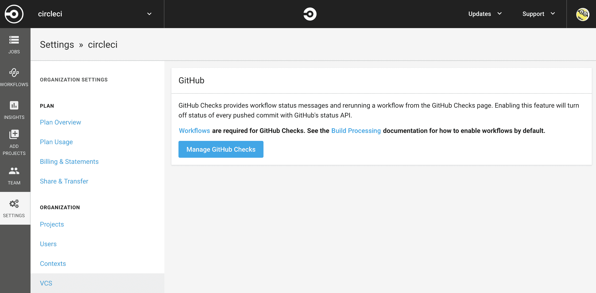
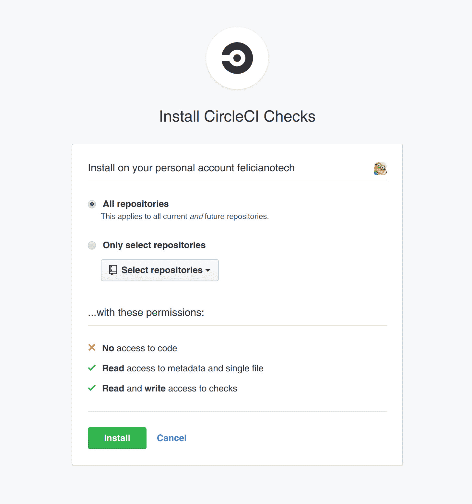
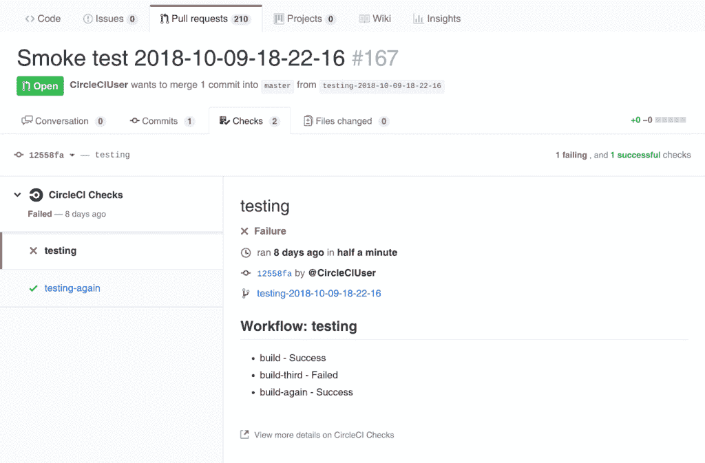

# GitHub 检查-工作流| CircleCI | GitHub App + CircleCI 工作流检查

> 原文：<https://circleci.com/blog/see-the-status-of-your-circleci-workflows-in-github/>

CircleCI 现在与 GitHub Checks API 集成，因此您可以在 GitHub UI 的 Pull Request Checks 选项卡下看到您的 CircleCI [工作流](https://circlecicom/docs/20/workflows/)的状态。以前在 GitHub UI 中，用户只能看到给定 pull 请求的单个 CircleCI 作业的状态——没有办法看到这些作业所属的工作流的状态。启用检查后，用户现在可以在 GitHub 的 checks 选项卡上查看 CircleCI 构建的完整层次和状态。

## 在 CircleCI 中启用 GitHub 检查

**重要提示** -您*无法*从 GitHub UI 为 CircleCI 启用 GitHub 检查，您必须登录 CircleCI 并为您的组织启用检查。您必须拥有组织的管理员权限才能启用检查。

要启用检查:

1.  登录 [CircleCI](https://circleci.com/vcs-authorize/)
2.  导航至[仪表板](https://app.circleci.com/pipelines/)
3.  点击左侧导航栏上的**设置**
4.  选择 **VCS**
5.  点击**管理 GitHub 检查**

1.  选择要启用检查的存储库，然后单击**安装**

一旦您为运行 CircleCI 构建的存储库安装了检查，您将看到 CircleCI“检查套件”出现在 checks 选项卡上，用于该存储库中打开的 pull 请求。在 CircleCI check suite 中，您可以看到工作流的状态以及每个工作流中的作业状态。

如果您需要重新启动任何工作流，您可以单击“重新运行”图标从头重新运行工作流。您还可以重新运行整个 CircleCI check suite，这将从头重新运行项目的所有工作流。更多高级功能，如从失败中重新运行工作流，或使用 SSH 运行作业，仍然只能通过 CircleCI 应用程序访问，而不是通过 GitHub 检查。您可以从 GitHub Checks 选项卡直接进入 CircleCI，方法是点击**查看 CircleCI Checks** 的更多详细信息。