# 设置与 CircleCI 和 GitHub 的持续集成

> 原文：<https://circleci.com/blog/setting-up-continuous-integration-with-github/>

> 本教程涵盖:
> 
> 1.  创建一个简单的 Python 应用程序(使用 Flask)
> 2.  为此应用程序编写测试
> 3.  添加`config.yml`文件

[持续集成(CI)](https://circleci.com/continuous-integration/) 包括在特性分支被合并到项目中的主 Git 分支之前，它们的构建和测试自动化。这确保了代码库不会因为可能破坏某些东西的更改而更新。连续交付(CD)通过自动化这些分支或主分支的发布来扩展 CI。这允许小的增量更新更快地到达您的用户，符合敏捷软件开发哲学。

在本文中，我将指导您使用 GitHub 建立一个 CI/CD 流程。我们将使用一个 Python 应用程序来演示如何构建一个 [CI 管道](https://circleci.com/blog/what-is-a-ci-cd-pipeline/)。

我将引导您完成以下步骤:

1.  创建一个简单的 Python 应用程序(使用 Flask)
2.  为此应用程序创建测试
3.  添加`config.yml`文件
4.  推送至 GitHub
5.  配置 CircleCI
6.  用徽章更新`README`
7.  创建一个公关，看看 CircleCI 的运作

## 先决条件

要按照教程进行操作，需要做一些事情:

1.  [Python 安装在您的本地系统上](https://python.org/downloads)
2.  一个[圆](https://circleci.com/signup/)的账户
3.  GitHub 的一个账户

## 创建简单的 Python 应用程序

为了创建应用程序，我们将使用 Flask，这是 Python 的一个微框架。对于这个练习，对框架的最低限度的了解是必要的。你可以在这里找到[的例子。](http://flask.pocoo.org/)

### 构建应用程序

首先，创建一个项目目录(文件夹)并将`cd`放入其中。在终端中键入以下内容:

```
mkdir python_app && cd $_/ 
```

接下来，打开你最喜欢的编辑器，创建一个`hello.py`文件。然后，将以下几行复制到该文件中:

```
from flask import Flask

app = Flask(__name__)

@app.route("/")
def hello():
    return "Hello World!" 
```

### Python 中的虚拟环境

在 Python 中工作时，强烈建议您使用虚拟环境。这允许您在一个抽象的环境中安装 Python 包，而不是整个本地机器。一些常见的方法是使用 [`virtualenv`](https://virtualenv.pypa.io/en/stable/) 或者更好的 [`virtualenvwrapper`](http://virtualenvwrapper.readthedocs.io/en/latest/) 。我们将使用模块`venv`，它是 Python3 的一部分。

创建虚拟环境:

```
python3 -m venv venv 
```

您可以为您的虚拟环境使用其他名称，如下例所示。

```
python3 -m venv Env 
```

激活环境:

```
source venv/bin/activate 
```

如果您为环境使用了另一个名称，请用该名称替换`venv`。您将注意到 shell 提示符前的环境名称，这告诉您虚拟环境是活动的。安装的任何 Python 包都将安装在此环境中。要停用此环境，只需运行:

```
deactivate 
```

### 运行应用程序

现在是时候在编辑器中创建一个`requirements.txt`文件了。将单词`Flask`添加到文件中并保存。

```
Flask 
```

然后，在虚拟环境中，通过运行以下命令来安装该软件包:

```
pip install -r requirements.txt 
```

运行该应用程序的最后一个命令是:

```
FLASK_APP=hello.py flask run 
```

在浏览器上转到`http://localhost:5000/`查看应用程序。

## 创建测试

在您的编辑器中，创建一个`tests.py`文件并将这些行粘贴到其中:

```
from hello import app
with app.test_client() as c:
    response = c.get('/')
    assert response.data == b'Hello World!'
    assert response.status_code == 200 
```

有关测试的更多信息，请参考[这些资源](https://flask.palletsprojects.com/en/1.1.x/testing/)。

现在您可以运行测试了。打开终端并运行:

```
python3 tests.py 
```

不会有任何东西返回到您的终端。为什么？我们构建了 Flask 应用程序，这样它就不会在一次传递中输出到终端。没有终端输出意味着您的测试是成功的。前面提到的参考资料提供了终端如何处理通过和失败测试的更详细的例子。

## 创建 CircleCI 配置文件

创建一个`.circleci`文件夹。在那个文件夹里面，创建一个 [`config.yml`](https://circleci.com/docs/sample-config/) 文件。然后，把这几行复制进去:

```
version: 2.1
jobs:
  build:
    docker:
      - image: cimg/python:3.10.1
    steps:
      - checkout
      - restore_cache:
          key: deps1-{{ .Branch }}-{{ checksum "requirements.txt" }}
      - run:
          command: |
            python3 -m venv venv
            . venv/bin/activate
            pip install -r requirements.txt
      - save_cache:
          key: deps1-{{ .Branch }}-{{ checksum "requirements.txt" }}
          paths:
            - "venv"
      - run:
          name: Running tests
          command: |
            . venv/bin/activate
            python3 tests.py
      - store_artifacts:
          path: test-reports/
          destination: python_app 
```

你可以在这里找到关于这个`config`文件[的更多信息。](https://circleci.com/docs/language-python/)

## 推送至 GitHub

使用尽早和经常提交代码的理念，我们会在这个过程中更早地初始化 Git，并且我们会有原子提交。因为这篇教程是关于 CircleCI 和 GitHub 的集成，所以我故意把它搁置到现在。

当前的代码结构如下所示:

```
.
├── .circleci
│   └── config.yml
├── hello.py
├── requirements.txt
└── tests.py 
```

打开编辑器，在工作目录中创建一个`.gitignore`文件。我们将使用这个文件来声明哪些文件和文件夹是我们*不想*提交给 Git 的。将以下几行复制到该文件中:

```
# Byte-compiled / optimized / DLL files
__pycache__/
*.py[cod]

# Virtualenv
venv/* 
```

通过运行以下命令提交代码:

```
git add . 
```

```
git commit -m "Initial commit" 
```

如果您还没有 GitHub 帐户，请到 GitHub 的主页创建一个。如果你是 GitHub 的新手，你可能想读一下关于[向 GitHub](https://circleci.com/blog/pushing-a-project-to-github/) 推送项目的教程。然后，通过去 github.com/new 的[创建一个仓库。](https://github.com/new)

我将使用名称`python_app`，保持其余的默认设置不变，并单击按钮**创建存储库**。(如果不可见，请向下滚动。)

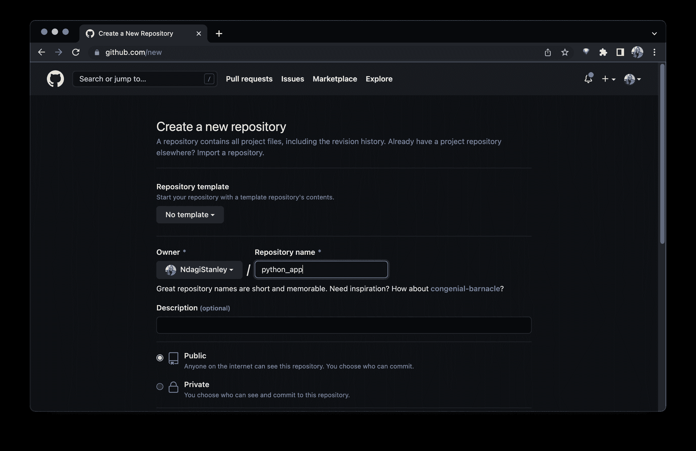

在创建新的存储库之后，您将看到这样一个页面。

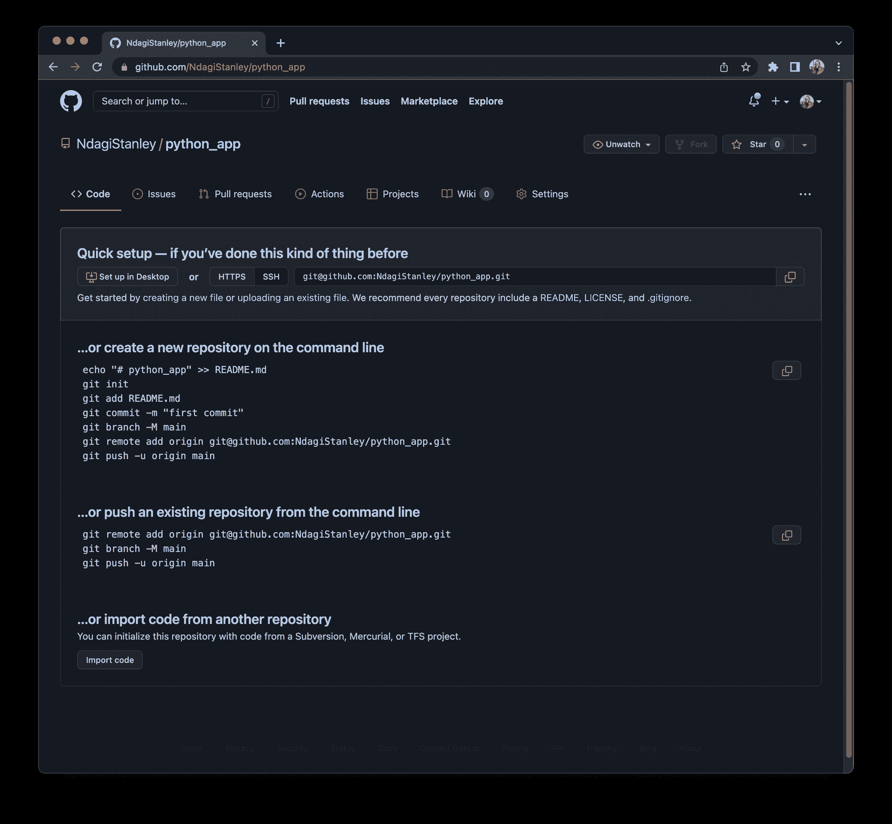

选择第二个选项，**推送一个现有的存储库**。运行:

```
git remote add origin git@github.com:NdagiStanley/python_app.git
git branch -M main
git push -u origin main 
```

## 配置 CircleCI

既然 repo 已经在 GitHub 上，我们可以通过配置 CircleCI 来完成 CI。前往 [CircleCI 注册页面](https://circleci.com/signup/)。如果你还没有注册 CircleCI，请用你的 GitHub 帐户注册。

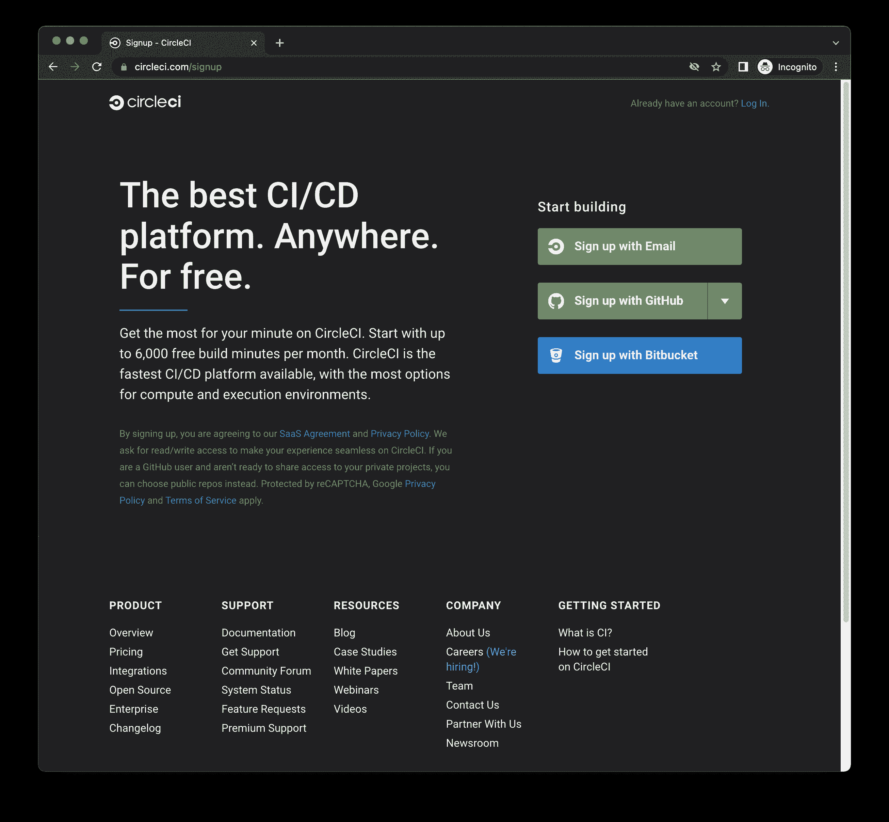

登录后，请确保您的个人 GitHub 帐户处于活动状态。如果你在几个 GitHub 组织中，其中一个可能是活跃的。只需点击下拉菜单(左上角)并选择您的 GitHub 用户名。然后，点击**添加项目**。最新的项目“python_app”就列在那里。

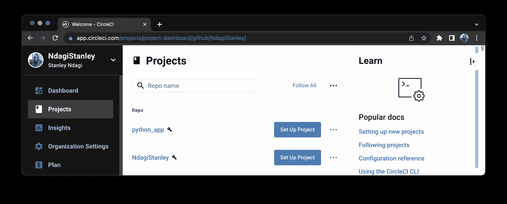

点击包含您的项目的行右侧的**设置项目**。

在重定向的页面上，您会注意到三个选项(最快、更快和快速)，默认选择的是**最快**。我们将使用这个默认选项。注意另外两个的描述。

在 GitHub 分支的输入字段中输入 **main** (注意字段下方确认`.circleci/config.yml`文件存在的文本)并点击**设置项目**。

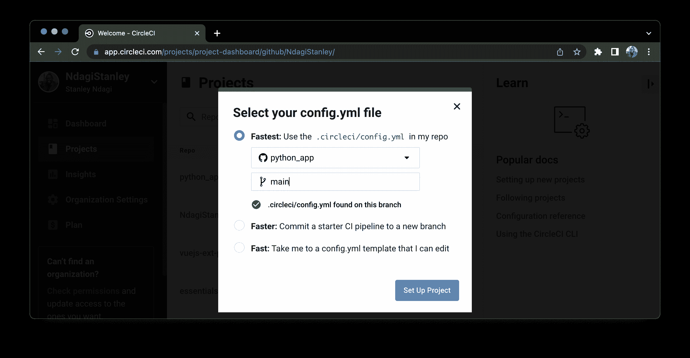

构建很快就通过了。成功！

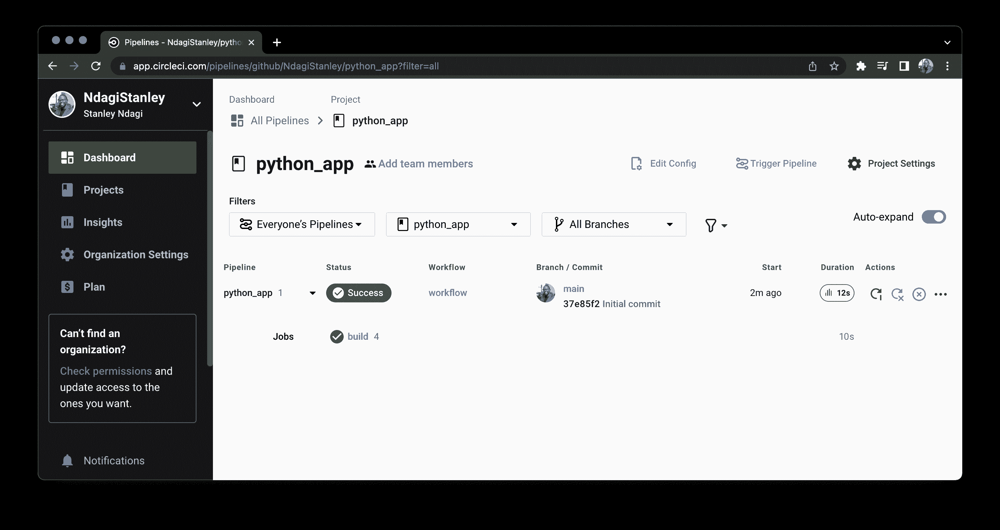

熟悉可以为此项目更改的设置非常重要。我现在将谈一谈与我们相关的问题。

在右上角，点击**项目设置**(带有齿轮图标的按钮)。然后点击左边的**高级**。

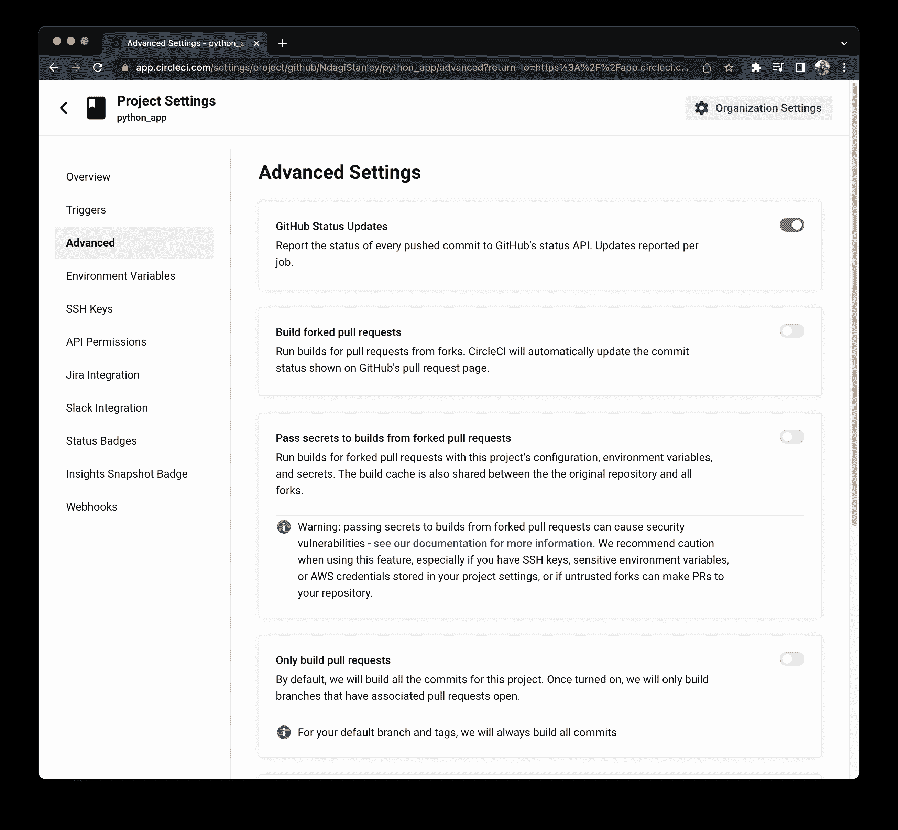

找到 **Only build pull requests** 卡片(如有必要，向下滚动)。默认情况下，它是关闭的。这意味着 GitHub 的每次推送都会在 CircleCI 上运行，包括 PRs。如果你认为有必要，请随意切换。有时，在一个大型团队环境中，建议适度调整构建时间。

## 自述文件-状态徽章

在您的本地机器上，通过运行以下命令签出到另一个 Git 分支:

```
git checkout -b add_readme 
```

打开编辑器并创建一个`README.md`文件。将以下行复制并粘贴到该文件中，相应地替换用户名`NdagiStanley`:

```
# PYTHON APPLICATION

This Python application repo was created to showcase the integration between GitHub and CircleCI.

[](https://circleci.com/gh/NdagiStanley/python_app) 
```

这将添加一个标题、简短描述和一个[状态徽章](https://circleci.com/docs/status-badges/)。

现在，运行以下命令:

```
git add .
git commit -m "Add README"
git push -u origin add_readme 
```

如果你去你的 GitHub repo，`https://github.com/<< username >>/python_app`，你会注意到我们有了一个新的分支:`add_readme`。点击**比较和拉取请求**。

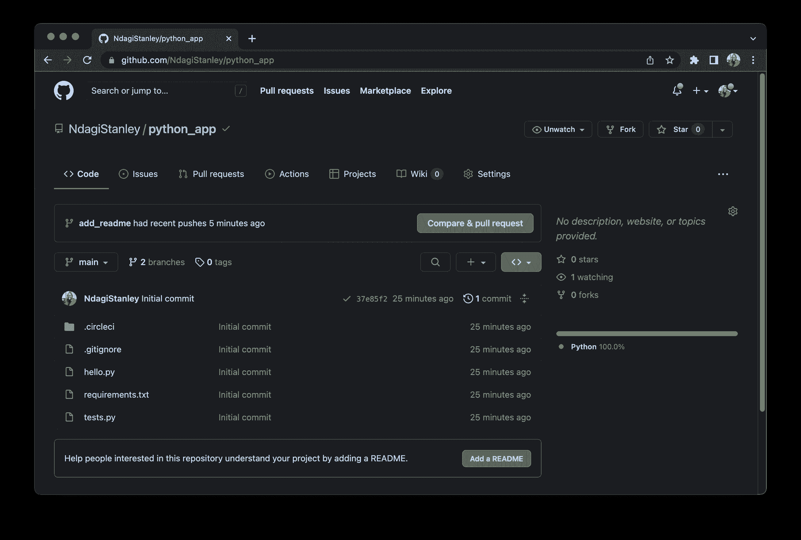

## 打开拉取请求

这一部分包括我如何建立我的公关。

PR 的标题作为提交消息自动生成。我在描述中输入了以下内容，但这是可选的:

```
#### What does this PR do?

Adds README.md file and a CircleCI badge in it. 
```

点击**创建拉请求**，很快您就成功构建了！

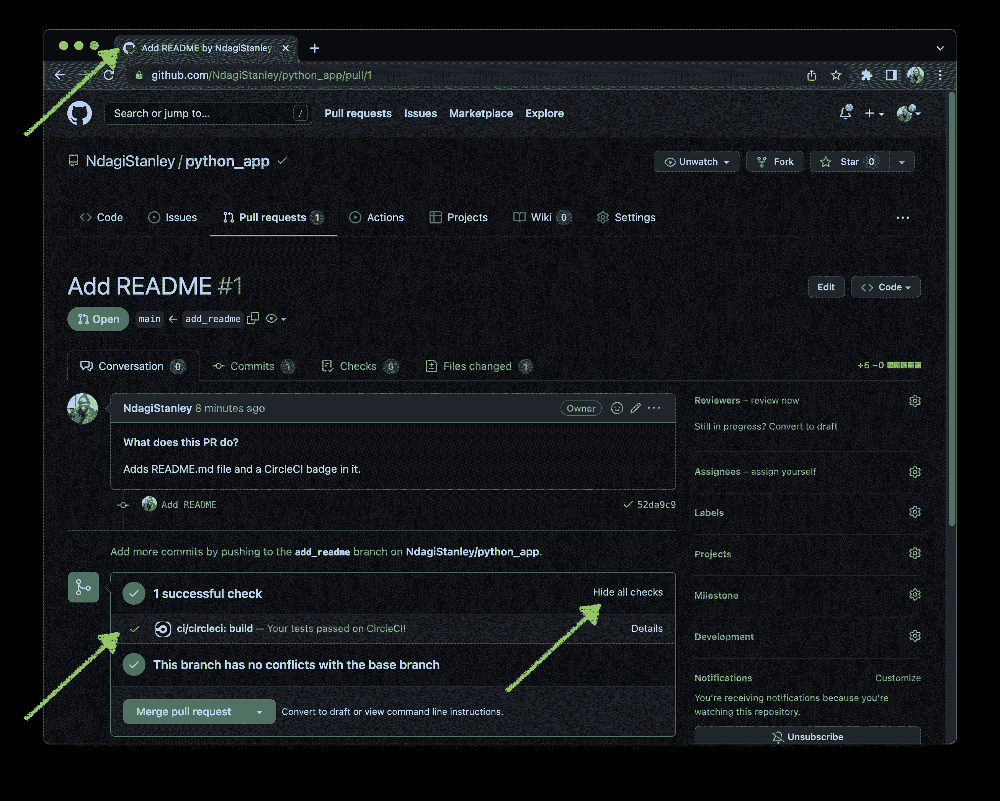

请注意，我单击了**显示所有检查**以显示成功的检查来自 CircleCI。(它现在显示了**隐藏所有检查**的选项。)甚至浏览器的标签页图标也显示了成功运行的绿色勾号。

如果您点击**下面的**细节**，隐藏所有检查**，您将被重定向到 CircleCI 上的构建:

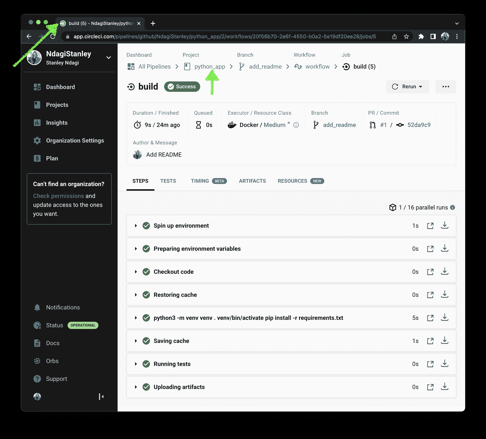

在顶部，点击 **python_app** 。您将被重定向到该项目的版本。

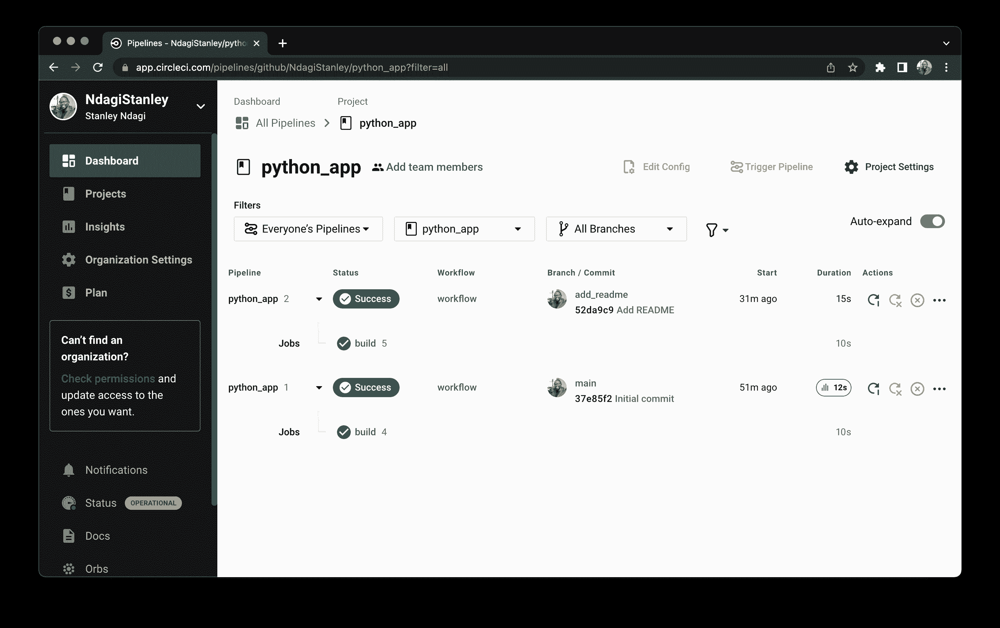

## 结论

你有它！我们已经将 GitHub 与 CircleCI 整合在一起。

总之，我们建立了一个 Python 应用程序，并为它创建了测试。然后，我们创建了一个 CircleCI 配置文件，并将代码库推送到 GitHub。最后，我们将我们创建的 GitHub 存储库连接到 CircleCI。

现在，您可以在 GitHub 中建立自己的项目，并在 CircleCI 上配置 CI 构建。祝贺您开始持续集成实践！让团队的其他成员参与进来，通过添加更多应用程序、更多测试和自动化部署来提升水平。

* * *

* * *

Stanley 是一名软件工程师和技术文案，他身兼数职，包括技术团队领导和社区参与。他把自己描述成一个数字人(在数字空间中有文化)。

[阅读 Stanley Ndagi 的更多帖子](/blog/author/stanley-ndagi/)