# 部署到谷歌 Kubernetes 引擎-部署到 GKE | CircleCI

> 原文：<https://circleci.com/blog/simplifying-your-ci-cd-build-pipeline-to-gke-with-circleci-orbs/>

本文试图解开 orbs 的使用之谜，以便快速入门 CircleCI 平台。orb 使您能够跨项目共享、标准化和简化配置。您可能还想使用 orb 作为配置最佳实践的参考。请参考此 [orb 简介](https://circleci.com/docs/orb-intro/)以获得高级概述。你也可以参考 [CircleCI orbs 注册表](https://circleci.com/developer/orbs)获得可用 orbs 的完整列表。

## 使用的技术

本文假设您对以下技术和工具有基本的了解:

*   [Docker](https://www.docker.com/)——用于使用容器创建、部署和运行应用程序。Docker 提供了可重复的开发、构建、测试和生产环境。
*   [CircleCI](https://circleci.com/) -用于持续集成和持续部署(CI/CD)。
*   Kubernetes——用于跨主机集群自动化部署、扩展和管理容器化应用。这降低了云计算的成本，简化了运营和架构。
*   Git 一个分布式版本控制系统，用于在软件开发过程中跟踪源代码的变化。
*   [谷歌 Kubernetes 引擎(GKE)](https://cloud.google.com/kubernetes-engine/)——谷歌运行 Kubernetes 集群的云解决方案。

## GKE 设置

Kubernetes 是一个独立于供应商的集群和容器管理工具，由 Google 于 2014 年开源。它提供了一个“跨主机集群自动部署、扩展和操作应用程序容器的平台。”最重要的是，这降低了云计算的成本，简化了运营和架构。要快速了解 GKE，请参见[文档](https://cloud.google.com/gcp/getting-started/#quick-starts)。

如果你没有谷歌云平台账号，你可以在这里获得一个[。一旦我们登录到我们的帐户，我们需要创建一个 id 为`circle-ci-demo`的项目。](https://console.cloud.google.com/freetrial/signup/tos)

接下来，我们需要下载并安装 [Cloud SDK](https://cloud.google.com/sdk/) ，这是一个用于 Google 云平台产品和服务的命令行界面，其中包含了`gcloud`，我们稍后将会用到这个工具。

在命令行中，通过在终端中输入以下命令来确认项目确实存在:

```
gcloud projects list 
```

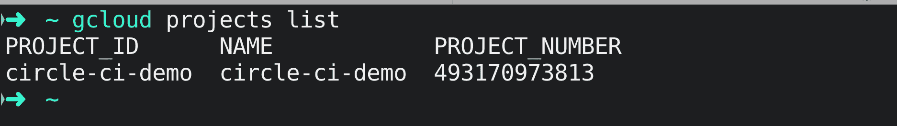

通过在您的终端中输入以下命令来初始化`gcloud`环境:

```
gcloud init 
```

通过输入以下内容对其进行身份验证:

```
gcloud auth login 
```

`kubectl`是一个命令行界面，用于对 Kubernetes 集群运行命令。让我们通过在您的终端中输入以下内容来安装它:

```
gcloud components install kubectl 
```

在 GKE 上创建一个名为`circle-ci-cluster`的[容器集群。您可以从 GCP 控制台执行此操作，但也可以通过在命令行中输入以下命令来执行:](https://cloud.google.com/kubernetes-engine/docs/how-to/creating-a-cluster)

```
gcloud container clusters create circle-ci-cluster 
```

我们可以使用以下命令确认集群创建成功:

```
gcloud container clusters list 
```

您的输出将类似于下面的输出:

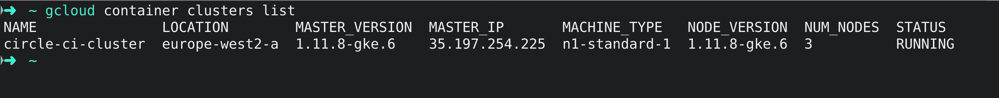

要从另一台计算机或项目的另一个成员对 GCP 控制台中创建的集群运行`kubectl`命令，您需要在您的环境中生成一个`kubeconfig`条目。通过运行以下命令生成一个`kubeconfig`条目:

```
gcloud container clusters get-credentials circle-ci-cluster 
```

要确保群集设置正确，请运行命令:

```
kubectl config current-context 
```

您的输出将类似于下面的输出:

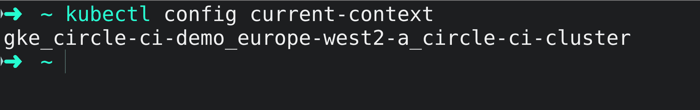

## Docker 设置

Docker 是一个开源工具，可以在软件容器中自动部署应用程序。使用容器来部署应用程序被称为*容器化*。集装箱化已经变得流行，因为集装箱灵活、轻便、可互换、便携、可升级和可堆叠。你可以在链接的[网页](https://docs.docker.com/get-started/)中了解更多关于 Docker 的信息。

### Dockerizing 一个简单的 Node.js 应用程序

我们的项目需要一个`Dockerfile`来对我们的[简单 nodejs 应用程序](https://github.com/daumie/circleci-orbs)进行 dockerize。一个 **Dockerfile** 是一个文本文档，它包含用户可以在命令行上调用的所有命令来组合一个图像。下面是项目中使用的 Dockerfile 文件:

```
# Set the base image to use for subsequent instructions
FROM node:alpine

# Add metadata to an image 
LABEL app="simple-node-application"

# Directive to set environmental variables key to value pair
ENV NPM_CONFIG_LOGLEVEL warn

# Set the working directory for any subsequent ADD, COPY, CMD, ENTRYPOINT, 
# or RUN instructions that follow it in the Dockerfile
WORKDIR /usr/src/app

# Copy files or folders from source to the dest path in the image's filesystem.
COPY package.json /usr/src/app/
COPY . /usr/src/app/

# Execute any commands on top of the current image as a new layer and commit the results.
RUN npm install --production

# Define the network ports that this container will listen on at runtime.
EXPOSE 3000

# Configure the container to be run as an executable.
ENTRYPOINT ["npm", "start"] 
```

我们现在可以使用以下内容构建和标记图像:

```
docker build -t circleci-gke:v1 . 
```

通过从终端运行以下命令，确认映像已成功创建:

```
docker image 
```

您的输出将类似于下面的输出:

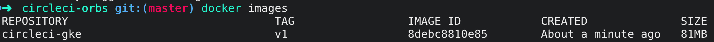

通过从终端运行以下命令，在本地测试映像:

```
docker run -p 3000:3000 circleci-gke:v1 
```

您现在可以通过访问 [https://127.0.0.1:3000](https://127.0.0.1:3000) 在浏览器上访问该应用程序。

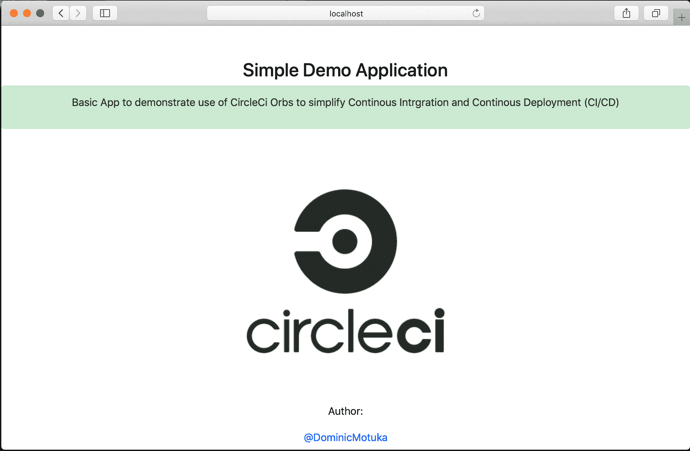

下一步是标记图像并将其推送到注册表中，以便于管理。开发人员、测试人员和 CI/CD 系统(如 CircleCI)需要使用注册表来存储应用程序开发过程中创建的映像。我们可以用以下命令标记图像:

```
docker tag circleci-gke:v1 gcr.io/circle-ci-demo/circleci-gke:v1 
```

然后，我们可以将图像推送到 Google 的容器注册中心(GCR ):

```
docker push gcr.io/circle-ci-demo/circleci-gke:v1 
```

既然我们已经将工作的容器化 Docker 映像推送到注册中心，我们就可以将应用程序部署到我们的`circle-ci-cluster`集群了。

## 为部署配置 Kubernetes 清单

Kubernetes 使用 YAML 进行配置。我们将需要一个类型为`LoadBalancer`的 Kubernetes 服务，以使我们的部署可以被外部世界访问。

Kubernetes **服务**是一种抽象，它定义了一组逻辑单元和访问它们的策略。更多关于 Kubernetes 服务的信息请点击这里[。](https://kubernetes.io/docs/concepts/services-networking/service/)

Kubernetes **部署**管理集群上运行的无状态服务。他们的目的是保持一组相同的 pod 运行，并以受控的方式升级它们——默认情况下执行滚动更新。更多关于 kubernetes 的部署[在这里](https://kubernetes.io/docs/concepts/workloads/controllers/deployment/)。

创建一个文件夹来保存 Kubernetes 服务和部署的`.yaml`文件。对于这个例子，我将文件夹命名为`admin`。用下面的内容在文件夹中创建两个文件:

```
apiVersion: apps/v1beta1
kind: Deployment
metadata:
  name: production-circle-demo
  labels:
    app: simple-backend
spec:
  selector:
    matchLabels:
      app: ci-deploy
      tier: backend
  strategy:
    type: Recreate
  template:
    metadata:
      labels:
        app: ci-deploy
        tier: backend
    spec:
      containers:
        - image: gcr.io/circle-ci-demo/circleci-gke:v1
          name: rusty-pangolin
          ports:
            - containerPort: 3000
              name: ci-deploy 
```

应用程序部署. yaml

```
apiVersion: v1
kind: Service
metadata:
  name: circle-service
  labels:
    app: circle
spec:
  ports:
    - port: 3000
  selector:
    app: ci-deploy
    tier: backend
  type: LoadBalancer 
```

app-service.yaml

因为我们的 Kubernetes 清单在文件夹`admin`中，所以我们可以通过对文件夹`admin`运行以下命令来验证它们:

```
kubectl apply --validate=true --dry-run=true -f admin/ 
```

您的输出将类似于下面的输出:

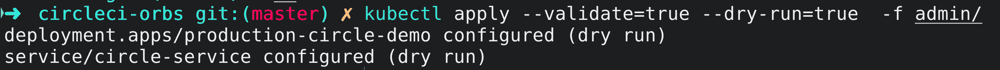

现在我们已经准备好部署我们的应用程序了。使用以下命令部署它:

```
kubectl apply --validate=true   -f admin/ 
```

您的输出将类似于下面的输出:

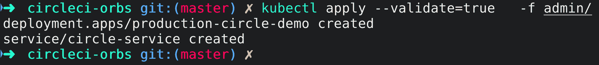

要访问应用程序，请使用以下命令获取外部 IP:

```
kubectl get services 
```

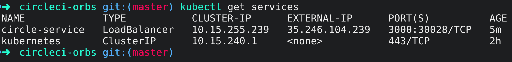

您可以在`http://<EXTERNAL-IP>:3000`访问应用程序。对我来说，那是 http://35.246.104.239:3000/.

我们将如何自动从 GitHub 中签出应用程序，构建它，测试它，并更新 GKE 上的运行实例？我们将与 CircleCI 合作。

## 配置 CircleCI

现在我们已经有了一个到 GKE 的基本工作部署，我们将需要一种方法来更新应用程序，一旦更改被推送到我们选择的 VCS。我们将[整合 CircleCI 和 GitHub](https://circleci.com/integrations/github/) 。CircleCI [配置](https://circleci.com/docs/configuration-reference/)以`.yml`文件的形式存在于项目根文件夹的`.circleci`目录中，即配置的路径为`.circleci/config.yml`。

### 使用 CircleCI 球体

我们不需要编写任何定制脚本来将我们的应用程序部署到 GKE。我们将通过将预构建的命令、作业和执行器导入到我们的配置文件中来节省大量时间。我们将使用`orbs`键调用这个项目中的以下 orb:

*   `node: circleci/node@1.0.1` -用于安装所有的应用依赖项。

*   与 GCR 一起工作的圆球。

*   与 GKE 一起工作的球体。

orb 由以下元素组成:

*   命令
*   作业——一组可执行的命令或步骤。
*   执行者——这些定义了一个作业的步骤将在其中运行的环境，例如 Docker、Machine、macOS 等。除了该环境的任何其他参数之外。

对于这个项目，`config.yml`文件包含以下代码行:

```
version: 2.1
orbs:
  node: circleci/node@1.0.1
  gcp-gke: circleci/gcp-gke@0.1.0
  gcr: circleci/gcp-gcr@0.0.2
jobs:
  build:
    description: Install npm
    # machine option runs your jobs in a dedicated, ephemeral VM that has the following specifications:
    machine: true
    steps:
      - checkout
      # Install node
      - node/install
      # Install npm
      - node/install-npm
      # Download and cache dependencies
      - node/with-cache:
          steps:
            - run:
                name: Install application dependencies
                command: npm install
          # Save cache
          cache-key: package.json
          # Ignore non-checksum cache hits
          use-strict-cache: true
  Build-Push-Image-Docker:
    description: Build and push image to Google Container Registry
    machine: true
    steps:
      - checkout
      - gcr/gcr-auth
      - gcr/build-image:
          image: circle-gke
          tag: "v2" #Change version number e.g to 'v3' when updating application
      - gcr/push-image:
          image: circle-gke
          tag: "v2" #Change version number e.g to 'v3' when updating application

  deploy:
    description: Deploy application to Google Kubernetes Engine
    machine: true
    steps:
      # Install `gcloud` and `kubectl` if not already installed.
      - gcp-gke/install
      # Initialize the `gcloud` CLI.
      - gcp-gke/init
      # Update a deployment Docker image.
      - gcp-gke/rollout-image:
          deployment: circle-ci-cluster
          container: dominic-backend
          image: gcr.io/circle-ci-demo/circle-gke:v2 # change version when updating
workflows:
  build_update_deploy:
    jobs:
      - build
      - Build-Push-Image-Docker:
          requires:
            - build
      - deploy:
          requires:
            - Build-Push-Image-Docker 
```

[将 CircleCI 配置文件的更改](https://circleci.com/blog/pushing-a-project-to-github/)推送到 GitHub。

如果您没有 CircleCI 帐户，请创建一个。你可以注册 GitHub。从 CircleCI 仪表板点击**添加项目**，从显示的列表中添加项目。

在我们对 CircleCI 做任何改变之前，我们需要一个和 GCP 沟通的方法。在我们的例子中，我们需要 CircleCI 将创建的映像推送到 GCR，并用新映像更新部署的实例。我们将使用 GCP 的服务帐户。使用这些[指令](https://cloud.google.com/iam/docs/creating-managing-service-accounts)创建服务账户。给服务账号**编辑**项目权限:

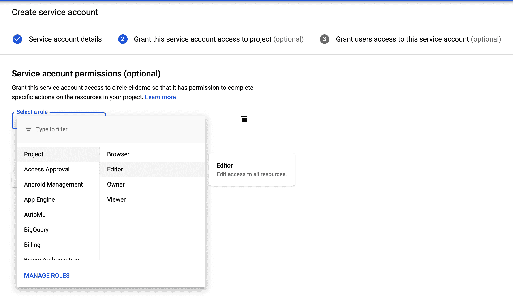

下面是一个服务帐户密钥结构:

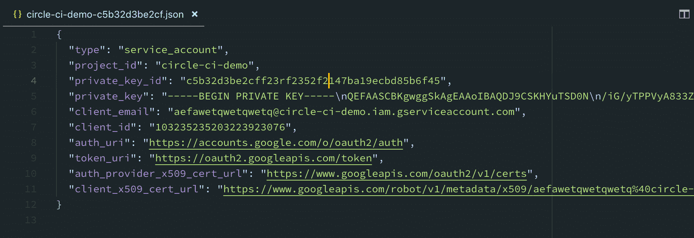

**注:** *这是一个示例服务帐户(未使用)。你应该**永远不要**将服务账户提交给代码库，因为恶意攻击者可以获得对你的云平台资源的访问权。*

复制服务帐户内容，并通过单击右上角的 cog 图标将它们添加为项目的[环境变量](https://circleci.com/docs/env-vars/)。

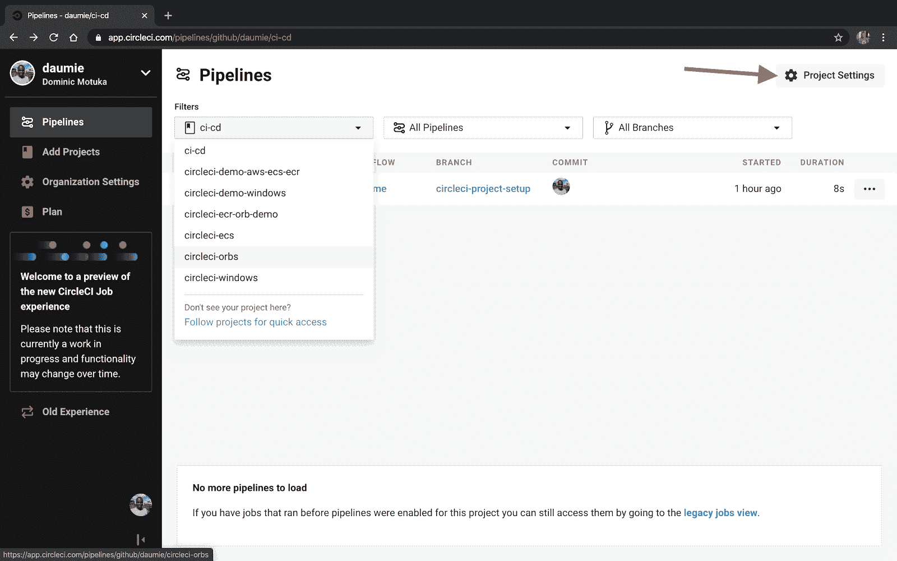

在构建设置下，点击**环境变量**。

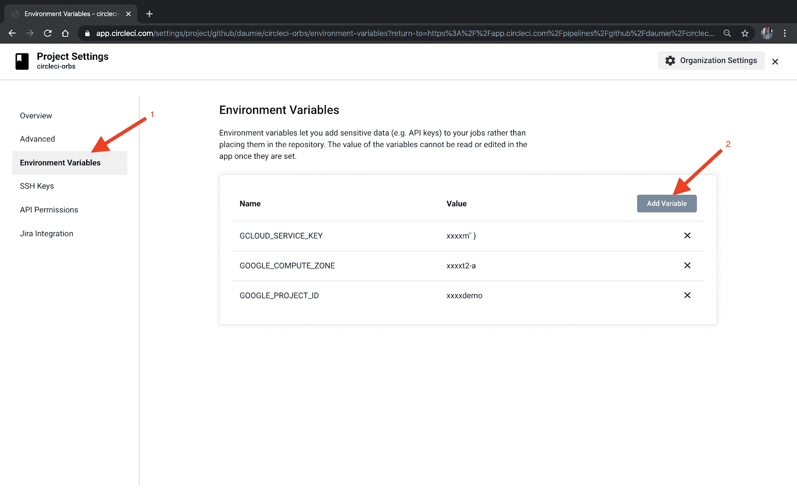

添加服务密钥为 **GCLOUD_SERVICE_KEY** 。您还需要添加**谷歌计算区域**。您可以通过运行以下命令来实现这一点:

```
gcloud container clusters describe circle-ci-cluster 
```

**注意:** *使用您创建的集群*。

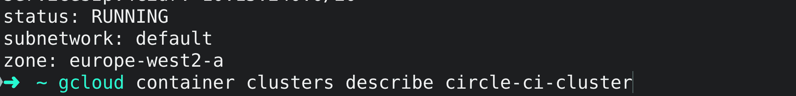

对于我的集群，在底部，区域可以标识为`europe-west2-a`。根据您所在的位置，这可能会有所不同。

对于 **GOOGLE_PROJECT_ID** ，我们可以从控制台直接从**项目信息**卡中抓取:

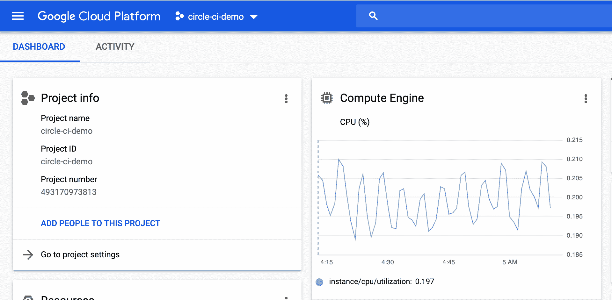

现在我们有了 CircleCI 环境集。我们可以触发一个新的构建来测试我们的管道是否工作。您的工作流将类似于下面的工作流:

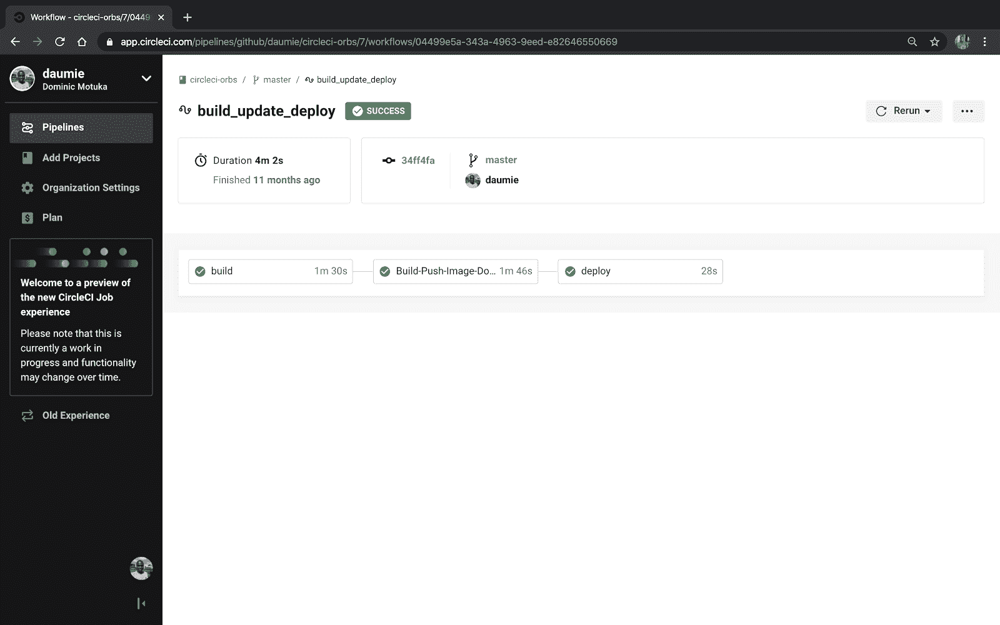

## 在 GKE 上访问应用程序

您可以通过运行以下命令来获取应用程序的外部 IP:

```
kubectl get services 
```

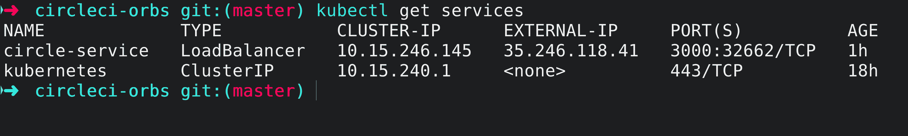

例如，我必须访问 http://35.246.118.41:3000/.上的应用程序

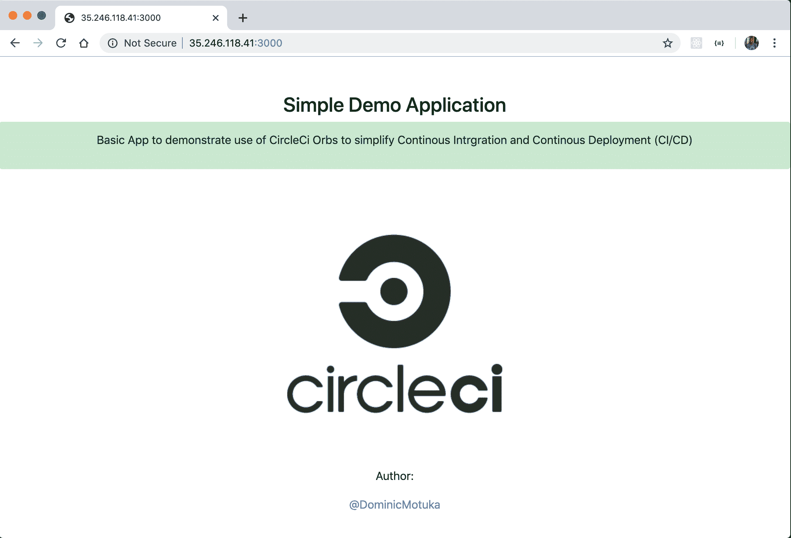

## 结论

使用 CircleCI orbs 通过简化我们编写 CircleCI 配置的方式来提高生产率。orb 也可以共享，这通过在我们的配置文件中使用预构建的命令、作业和执行器来节省时间。

orb 并不局限于 CircleCI + GKE 部署。您可以浏览注册表中可用的[orb 列表，找到符合您选择的云平台、编程语言等的 orb。](https://circleci.com/developer/orbs)

* * *

Dominic Motuka 是 Andela 的 DevOps 工程师，在 AWS 和 GCP 支持、自动化和优化生产就绪部署方面拥有 4 年多的实践经验，利用配置管理、CI/CD 和 DevOps 流程。

[阅读多米尼克·莫图卡的更多帖子](/blog/author/dominic-motuka/)