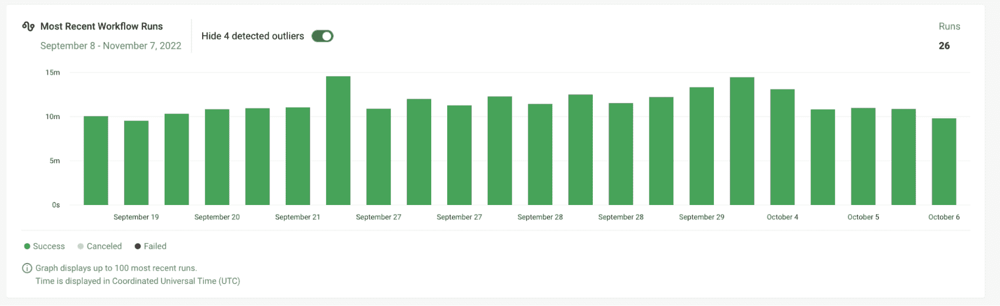

# 六件你不知道可以用 CircleCI Insights | CircleCI 做的事情

> 原文：<https://circleci.com/blog/six-things-about-insights/>

CircleCI 上有数百种功能，旨在为我们的用户创造最佳的 CI/CD 体验。但用户经常指出的平台上最有价值的一个功能是 CircleCI Insights 仪表板。

Insights dashboard 提供对工作状态、持续时间监控和管道优化解决方案等指标的全面了解。作为开发人员，它让您可以完全控制您的构建过程，提供快速反馈和更有效地利用资源。

## 洞察仪表板核心功能

仔细看看下面仪表板的核心功能。

### 管道优化

Insights 帮助[在构建、测试和部署过程中确定关键的优化目标](https://circleci.com/blog/how-the-insights-team-uses-insights-to-optimize-pipelines/)。在仪表板中，您可以通过识别趋势、查看什么在工作，以及哪些测试可能会失败来快速查看项目的健康状况。

### 测试

仪表板还可以让您鸟瞰测试洞察，密切关注[端到端的片状测试检测](https://circleci.com/blog/introducing-test-insights-with-flaky-test-detection/)。只需几次点击，您就可以确定您的测试是否失败，并快速找到解决方案。

### 工作流程

使用简单的 YAML 配置，您可以深入了解您的工作流，从而协调并发作业运行并高效地执行它们。这也可以缩短您的反馈循环，帮助您做出更好的总体工程决策。点击了解更多关于 CircleCI 工作流程[的信息。](https://circleci.com/docs/workflows/)

利用 Insights，您可以做很多事情来确保您从 CircleCI 中获得最大收益。请继续阅读，了解一些最具影响力的功能。

## 1.确保管道数据的准确性

使用 CircleCI 直接内置的专门算法，您可以确保您的管道始终如一地提供准确的数据。借助 Insights 异常值检测工具，您的团队可以快速、轻松地隐藏异常值，以平衡过大值的影响，为您提供更准确的数据视图。

## 2.使用资源类洞察力来节省使用成本

监控您的 CPU/RAM 使用情况有助于您和您的团队更好地了解您的资源消耗，以便围绕您的使用成本和管道优化做出最明智的决策。类似下图的报告允许您准确地确定您的使用情况。如果使用率高，您可以考虑升级您的资源类，如果使用率低，您可以通过转移到更低的资源类来节省资金。

## 3.通过片状测试扫描和检测提高您的效率

片状测试扫描是 Insights 仪表板的一项持续功能。仪表板显示了测试性能的高级概述，但也允许您的团队访问更细粒度的分析。通过薄片式的测试扫描和检测，您可以获得在您的活动或已完成的构建中哪些测试失败的近距离和个性化的视图。当检测到不稳定的测试时，Insights dashboard 会立即将测试标记为*不稳定的*，这样可以更容易地过滤掉构建中可能需要进一步关注的组件。

## 4.节省大量开发时间

在节省开发时间方面，并行性是最有益的洞察特性之一。该功能允许使用单个计算资源同时运行测试。尽管 CircleCI 中的[测试拆分可以支持许多不同的框架，但并行性通过在您的测试套件中进行测试拆分节省了大量时间——甚至跨多个执行环境。](https://circleci.com/blog/a-guide-to-test-splitting/)

## 5.深入挖掘您的工作数据

您的职务数据包含大量有价值的信息。从 Insights dashboard 下载作业数据，以更全面地检查和理解您的数据，使用它进行自我修正，或与您的团队共享，以进一步优化您的管道。

## 6.确定哪些项目需要测试优化

CircleCI API 让您的团队有机会确定哪些项目可以从测试优化中受益。在 Insights 主仪表板中，构建自定义仪表板，供您和您的团队通过 API 使用。在这些仪表板中，添加特定的见解，如单个项目或整个组织的汇总指标和趋势。

软件交付中的一个常见挑战是缺乏对管道、构建过程和项目的全面了解。 [CircleCI Insights](https://circleci.com/docs/insights/) 是帮助您和您的团队完全掌控开发流程的第一步。最棒的是，您可以对其进行定制，以便在您需要时准确地提供您需要的内容。

查看[你自己的 CircleCI 见解](https://app.circleci.com/insights/)。