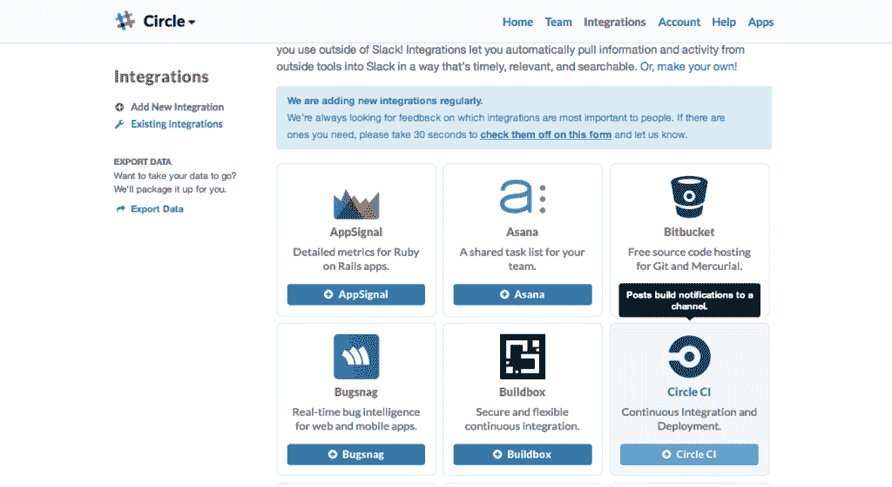

# 松散集成- CircleCI

> 原文：<https://circleci.com/blog/slack-integration/>

***编者按 2020 年 10 月 9 日:**你现在可以使用 [CircleCI Slack orb](https://circleci.com/developer/orbs/orb/circleci/slack) 将 Slack 与 CircleCI 集成，支持 [Slack Kit Builder](https://app.slack.com/block-kit-builder) ，用于在职通知。我们有一个关于如何[设置它的教程](https://circleci.com/blog/circleci-slack-integration/)。CircleCI Slack orb 是我们迄今为止最受欢迎的[orb](https://circleci.com/orbs/)之一。有关 [CircleCI orbs](https://circleci.com/orbs/) 的更多信息，请参见此处的[公告。要查看所有可用的](https://circleci.com/blog/announcing-orbs-technology-partner-program/)[球体](https://circleci.com/orbs/)，请访问 [CircleCI 球体注册表](https://circleci.com/developer/orbs)。*

* * *

上周，我们将构建通知支持扩展到了 Slack.com！Slack 是现代团队的实时消息、存档和搜索。

CircleCI 的聊天通知可以帮助团队中的每个人了解您的最新构建状态。当构建失败或通过时，您可以看到哪个提交触发了构建，以及谁负责将代码推送到 GitHub。这是一种很好的方式，可以让您随时掌握合作者正在进行的工作，并快速注意和修复有问题的构建。

设置集成非常简单:

当登录到您的 Slack 页面时，从 Slack 菜单转到**配置集成**，然后选择 **CircleCI** 。

选择发布 CircleCI 通知的频道后，点击绿色的“添加 CircleCI 集成”按钮，然后复制提供的 webhook URL。

在您的 CircleCI 账户中，点击您想要监控的项目旁边的**项目设置**图标。

在左侧栏中，点击**聊天室**。找到 **Slack** 部分并添加 webhook URL，然后在完成后按下**保存通知挂钩**按钮。

就是这样！在你的下一个版本中，你会在你的 Slack 聊天室中看到 CircleCI 版本通知。

非常感谢 Slack 的朋友们与我们一起完成这个项目！