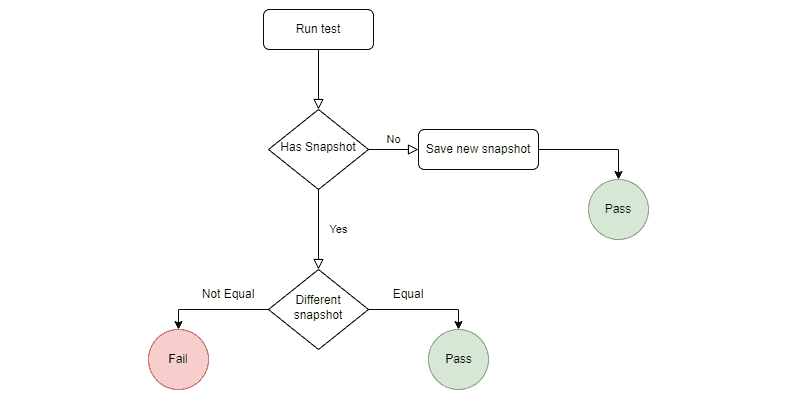
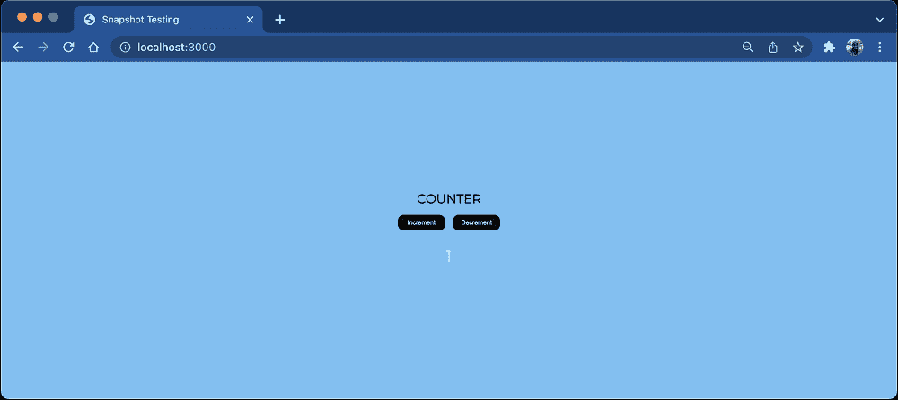
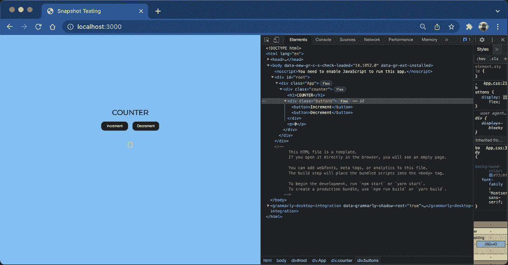
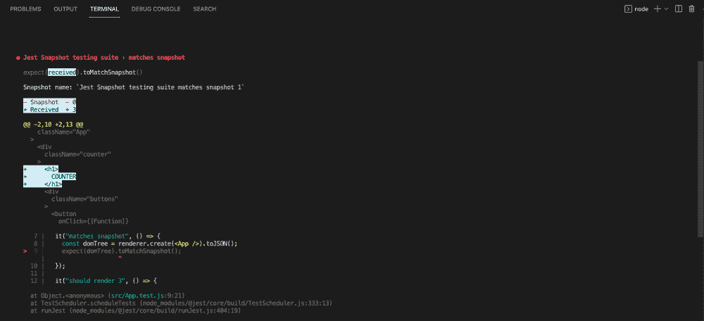
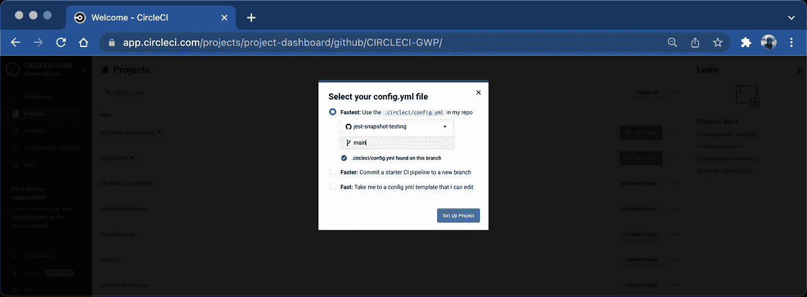
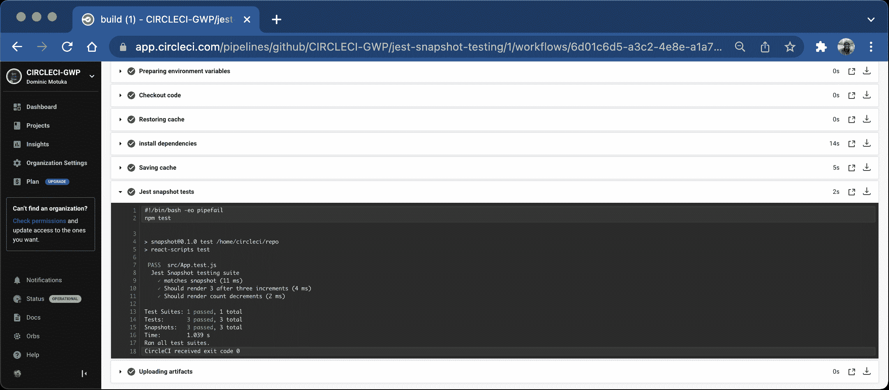

# 在 Jest 中创建快照以测试 React 应用程序

> 原文：<https://circleci.com/blog/snapshot-testing-with-jest/>

> 本教程涵盖:
> 
> 1.  设置 Jest 快照
> 2.  使用快照来模拟测试的 UI 更改
> 3.  使用快照测试来确定更改是否是有意的

自动化测试在有许多活动部件的大型应用程序中尤其重要。了解测试应用程序的许多方法是明智的，这样你就可以提供尽可能多的覆盖面。如果您不熟悉在测试中使用快照，请继续阅读。快照测试是作为前端测试自动化的一部分编写的。

在本教程中，我将带领您使用 JavaScript 测试框架 [Jest](https://jestjs.io/docs/getting-started) 来创建测试简单的 [React](https://reactjs.org) web 应用程序的快照。使用 Jest 快照将帮助您确保您的 UI 更改是确定性的，并且您知道何时进行了更改。使用这些信息，您可以确定这些更改是否是有意的。您将使用 Jest 创建的快照来模拟 React 应用程序中的变化。如果不断改变文本断言是痛苦的，您可能会发现快照测试是一种强大的解毒剂。

## 先决条件

要跟随本教程，您需要以下内容:

*   本地安装的节点。
*   一个 [GitHub](https://github.com/) 账户。
*   一个 [CircleCI](https://circleci.com/) 账户。
*   JavaScript、React、Git 和 Jest 的基础知识。

> 我们的教程是平台无关的，但是使用 CircleCI 作为例子。如果你没有 CircleCI 账号，请在 注册一个免费的 [**。**](https://circleci.com/signup/)

## 开玩笑的快照测试

Jest 是一个 JavaScript 测试框架，它使得编写前端测试如快照、[单元测试](https://circleci.com/blog/unit-testing-vs-integration-testing/)和组件测试变得简单高效。快照测试是一种输出比较测试。这种类型的测试确保您的应用程序符合开发团队的质量特征和代码值。

### 快照测试如何工作

当您想要确保您的 UI 不会意外更改时，快照测试非常有用。一个典型的快照测试用例呈现一个 UI 组件，获取一个快照，然后将它与测试旁边存储的一个参考快照文件进行比较。该测试将应用程序的当前状态与已建立的快照和预期行为进行比较。

### 可视化快照测试过程

下图说明了 Jest 中快照测试的过程。它显示了快照通过时、快照测试失败时的不同结果，以及发生了什么操作。



## 设置样本 React 应用程序

在本教程中，您的应用程序将由一个简单的 [React](https://reactjs.org/) 组件组成，该组件带有两个按钮，单击时会增加和减少计数。

通过在终端中运行以下命令来克隆存储库:

```
git clone https://github.com:mwaz/jest-snapshot-testing.git;

cd jest-snapshot-testing; 
```

接下来，您需要从 npm [React 测试库](https://www.npmjs.com/package/@testing-library/react)、 [Jest](https://www.npmjs.com/package/jest) 和 [React 测试呈现器](https://www.npmjs.com/package/react-test-renderer)安装以下依赖项。

它们安装在您的`package.json`文件中。要在您的系统中安装它们，请打开您的终端并运行:

```
npm install 
```

安装完依赖项后，使用以下命令运行应用程序:

```
npm start 
```

这将启动您的应用程序。



您的测试将确定计数器值是否初始化为零，以及按钮是否工作。因为值根据所单击的按钮而变化，所以您可能想知道增量值或减量值保持不变，总是增加或减少 1。您现在可以开始编写测试了。

## 编写快照测试

Jest 使用正则表达式来查找扩展名为`.test.js`或`.test.jsx`的文件。一旦遇到带有这些扩展名的测试文件，在执行 test 命令时，Jest 将自动运行这些文件中的测试。

为了编写您的第一个快照测试，您将使用`renderer`模块。该模块呈现文档对象模型( [DOM](https://developer.mozilla.org/en-US/docs/Web/API/Document_Object_Model/Introduction) )元素，该元素将被保存为文本快照:

```
import renderer from "react-test-renderer"; 
```

编写您的测试以确保它捕获了`<App>`组件的渲染，并将其保存为 Jest 快照。这是测试的结构:

```
import React from "react";
import renderer from "react-test-renderer";
import App from "./App";

describe("Jest Snapshot testing suite", () => {
  it("Matches DOM Snapshot", () => {
    const domTree = renderer.create(<App />).toJSON();
    expect(tree).toMatchSnapshot();
  });
}); 
```

该测试有一个`domTree`变量，它保存 JSON 格式的呈现组件的 DOM 树。这使得保存和比较快照更加容易。`expect(domTree).toMatchSnapshot()`如果快照不存在，则创建快照，保存它，并检查快照是否与以前存储的快照一致。如果存在现有的快照，Jest 会比较这两个快照。如果匹配，测试通过。不匹配的快照会导致测试失败。测试还使用了`.toJSON()`方法，该方法返回呈现的 DOM 树快照的 JSON 对象。

一旦你运行测试(使用命令`npm test`)，就会有一个名为`(__snapshots__)`的新文件夹，里面有文件`App.test.js.snap`。该文件包含已保存的快照，应该类似于以下代码片段:

```
exports[`Jest Snapshot testing suite matches snapshot 1`] = `
<div
  className="App"
>
  <div
    className="counter"
  >
    <div
      className="buttons"
    >
      <button
        onClick={[Function]}
      >
        Increment
      </button>
      <button
        onClick={[Function]}
      >
        Decrement
      </button>
    </div>
    <p>
      0
    </p>
  </div>
</div>
`; 
```

这个快照文件显示了组件的 DOM 树，包括父选择器元素和子元素。

为了更好地理解快照，打开运行 React 应用程序的选项卡中的`elements`部分。与快照并排比较；它们应该是几乎相同的。快照的结构类似于 DOM，这使得识别 DOM 更改的过程无缝。



事实上，文本快照是从 DOM 创建的，这意味着只有当 DOM 发生变化或者内容与拍摄快照时不同时，它们才会失败。接下来，您将研究 DOM 中的变化是如何发生的，它们是如何触发快照变化的，以及如何处理这个过程。

### 处理快照更改

现在您已经知道了快照是如何创建的，是时候了解更多关于它们何时失败以及失败原因的信息了。为了演示这一点，使用前面的测试并对 DOM 树进行更改。您要做的更改是给组件引入一个标题`<h1>COUNTER</h1>`。该添加显示在文件`Counter.js`中:

```
return (
      <div className="counter">
        <h1>COUNTER</h1>
        <div className="buttons">
          <button onClick={this.increment}>Increment</button>
          <button onClick={this.decrement}>Decrement</button>
        </div>
        <p>{this.state.count}</p>
      </div>
    ); 
```

完成这一更改后，再次运行测试。测试应该会失败。



因为这些更改是意料之中的，所以您需要更新现有的快照，而不是更改代码来匹配以前的快照。选择 **u** 选项，当 Jest 在`watch mode`时更新快照。更新快照告诉 Jest，这些更改是有意的，您想要保留。在快照更新被触发之后，您的测试又回到了令人愉快的状态，并且它完美地通过了。

**注意:** *当 Jest 在`watch mode`时，应用程序正在被跟踪，因此任何更改都将触发测试的重新运行。要激活`watch mode`，用`--watch`参数在 Jest runs 中指定它。*

```
 PASS  src/App.test.js (20.905 s)
  Jest Snapshot testing suite
    √ Matches Snapshot (64 ms)

 > 1 snapshot updated.
Snapshot Summary
 > 1 snapshot updated from 1 test suite.
   ↳ src/App.test.js

Test Suites: 1 passed, 1 total
Tests:       1 passed, 1 total
Snapshots:   1 updated, 1 total
Time:        51.348 s
Ran all test suites related to changed files. 
```

### 添加更多快照测试

您可以添加更多的快照测试，以确保您的应用程序中所有重要的视觉元素都符合您的 UI 规范和 UX 准则，并且您的应用程序中的一切都正常工作。快照测试是全面前端测试的一部分，还应该包括单元和组件测试。

对于本教程，我将只添加一个快照测试。该测试检查增量功能是否按预期工作。这个代码片段可以在文件`App.test.js`中找到:

```
it("Should render 3 after three increments", () => {
    const component = renderer.create(<Counter />);
    component.getInstance().increment();
    component.getInstance().increment();
    component.getInstance().increment();
    expect(component.toJSON()).toMatchSnapshot();
}); 
```

在这个测试中，计数器组件结构被保存到一个组件变量中。然后，测试访问您的`class-based component`的`increment()`方法，并调用它三次。目标是确保当`Increment`按钮被点击三次时，呈现的计数是三。此信息保存到快照中，应该会通过。

## 用 CircleCI 集成快照测试

考虑一下:为什么要运行别人不知道的成功测试？相反，花一点时间与团队的其他成员分享您的测试，这样他们也可以从他们提供的见解中受益。

在本教程中，我将带领您完成使用 CircleCI 执行快照测试的步骤。

在应用程序的根文件夹中，创建一个`.circleci`文件夹，并添加一个`config.yml`文件。该文件将包含运行 CircleCI 管道所需的所有配置。

在 CircleCI config.yml 文件中，添加以下配置:

```
version: 2.1
jobs:
  build:
    working_directory: ~/repo
    docker:
      - image: cimg/node:14.17.1
    steps:
      - checkout
      - restore_cache:
          key: dependency-cache-{{ checksum "package-lock.json" }}
      - run:
          name: install dependencies
          command: npm install
      - save_cache:
          key: dependency-cache-{{ checksum "package-lock.json" }}
          paths:
            - ./node_modules
      - run:
          name: Jest snapshot tests
          command: npm test
      - store_artifacts:
          path: ~/repo/jest-snapshot-testing 
```

## 将您的更改推送到 GitHub

如果您克隆了存储库，那么更改已经存在，这是一个可选步骤。但是，如果您使用不同的存储库并使用相同的配置，您将需要将更改推送到存储库。

保存这个文件，提交并把你的修改推送到你的 GitHub 库。导航到 [CircleCI 仪表盘](https://app.circleci.com/projects/project-dashboard/github/circleci/)后，点击库名旁边的**设置项目**。

出现提示时，选择`main`，这是您的默认分支。然后点击**设置项目**。您的项目将开始在 CircleCI 上运行。



CircleCI 仪表板上应该有一个绿色构建。单击它查看构建详细信息。



太棒了。您的构建是绿色的，并且您的所有测试都成功执行。

## 结论

在本教程中，您了解了快照测试，以及它在确保您的 UI 外观和工作符合预期方面有多么有用。您学习了如何编写快照测试，并使用快照作为比较来确保所做的任何更改都是预期的。您还了解了如何在有意更改的情况下更新快照。最后，您集成了 CircleCI 来运行您的测试。我希望你喜欢本教程的项目工作。直到下次，继续编码！

* * *

Waweru Mwaura 是一名软件工程师，也是一名专门研究质量工程的终身学习者。他是 Packt 的作者，喜欢阅读工程、金融和技术方面的书籍。你可以在[他的网页简介](https://waweruh.github.io/)上了解更多关于他的信息。

[阅读更多 Waweru Mwaura 的帖子](/blog/author/waweru-mwaura/)