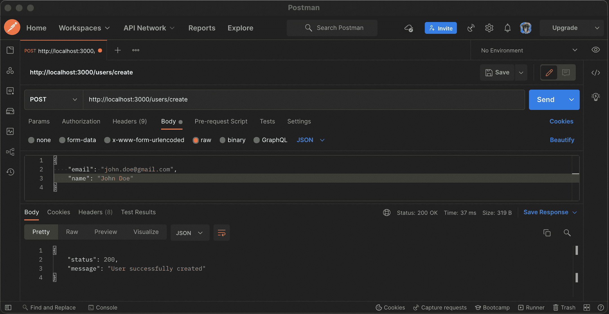
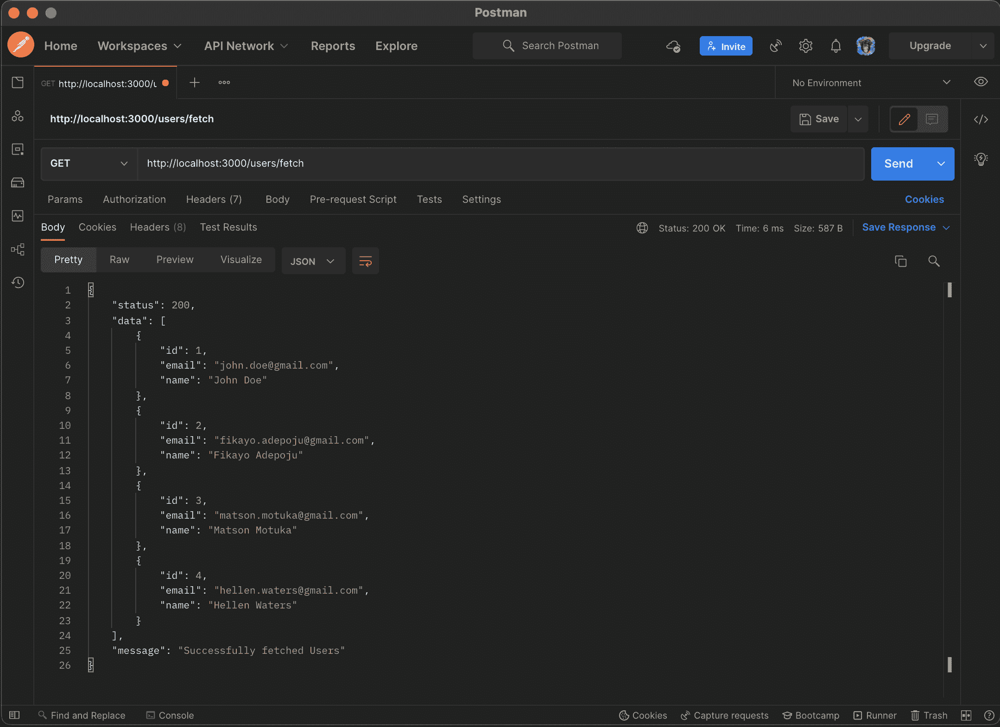
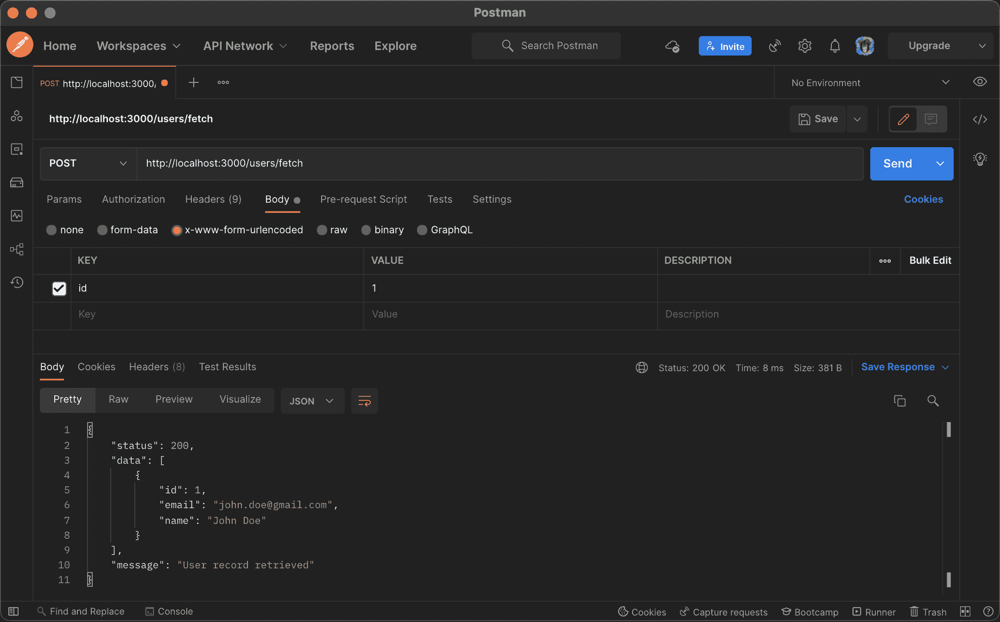
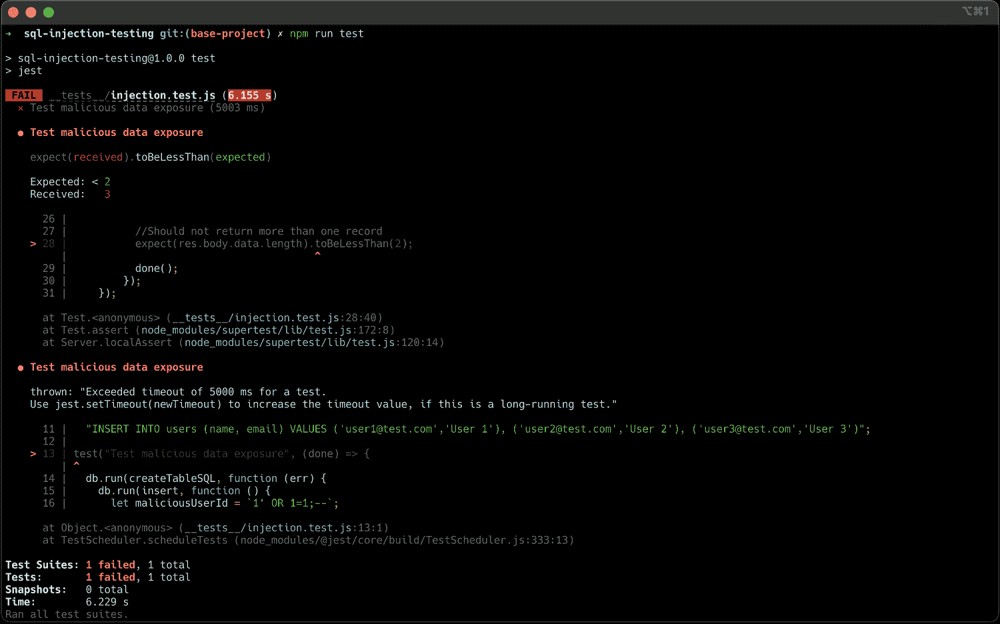
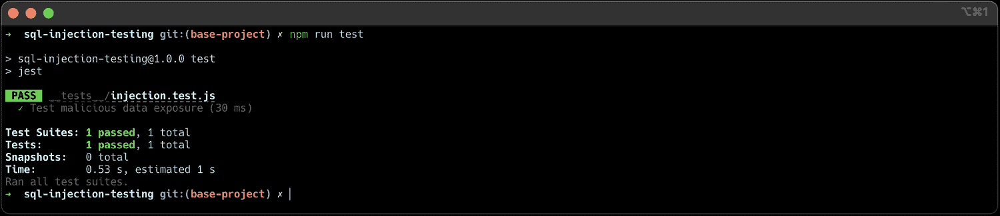
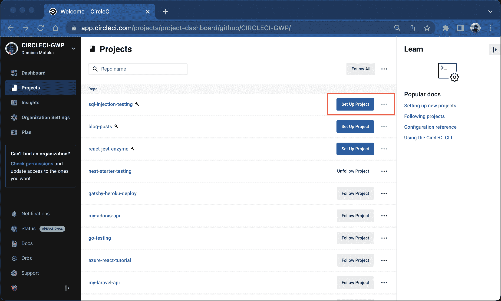
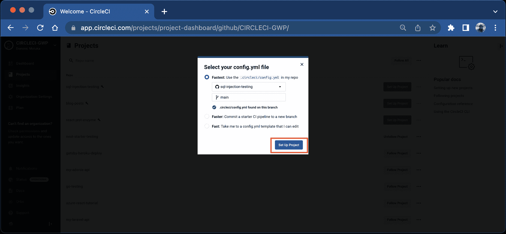
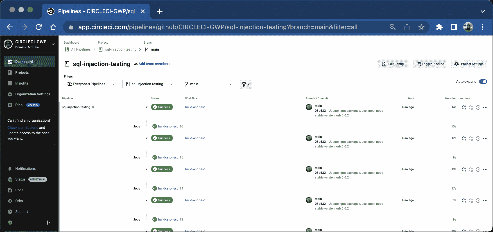
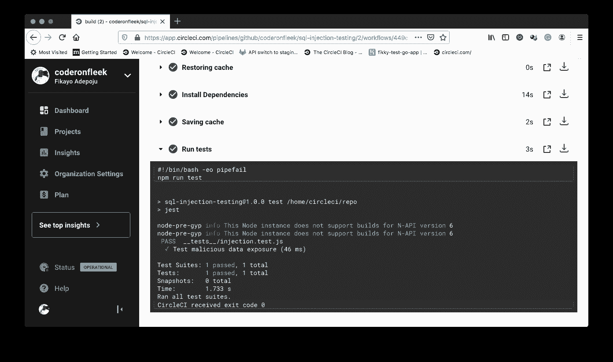
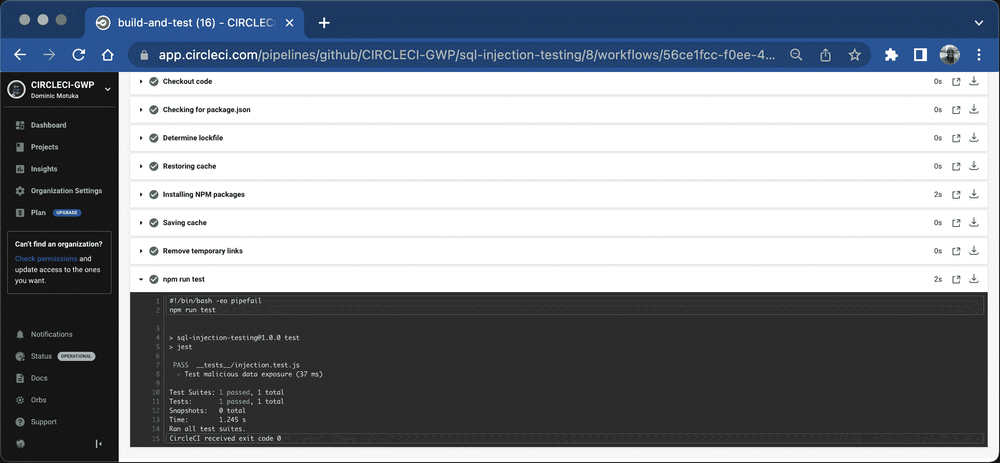

# 通过自动化测试防止 SQL 注入攻击

> 原文：<https://circleci.com/blog/sql-injection/>

> 本教程涵盖:
> 
> 1.  SQL 注入是什么，为什么它如此具有破坏性
> 2.  添加和自动化暴露威胁测试
> 3.  修补注射漏洞

SQL 注入攻击的目标是应用程序的数据库，这可能导致不可逆转的后果，导致金钱损失，并降低用户对您公司的信任。每天都有太多的应用程序数据泄露事件发生，通常是在恶意代理攻击数据库时。 [SQL 注入](https://en.wikipedia.org/wiki/SQL_injection)是攻击应用程序最具破坏性的方式之一。该攻击诱使应用程序在数据库级别运行精心编制的恶意代码。SQL 注入攻击会导致数据暴露、损坏，甚至永久丢失。

在本教程中，我将演示如何使用自动化测试来检查易受数据库注入攻击的应用程序入口点。

## 先决条件

要遵循本教程，需要做一些事情:

1.  Javascript 的基础知识
2.  您系统上安装的 [Node.js](https://nodejs.org) (版本> = 11.0)
3.  一个[圆](https://circleci.com/signup/)的账户
4.  GitHub 的一个账户

> 我们的教程是平台无关的，但是使用 CircleCI 作为例子。如果你没有 CircleCI 账号，请在 注册一个免费的 [**。**](https://circleci.com/signup/)

## 克隆演示项目

要开始这个练习，您需要克隆这个演示项目。该项目是一个简单的 Node.js 用户帐户 API 应用程序，具有以下端点:

*   `GET : /users/fetch`是获取所有用户的端点
*   `POST : /users/fetch`是一个`POST`端点，它接受一个用户`id`，并使用它来获取一个用户
*   `POST : /users/create`是一个`POST`端点，它使用参数`name`和`email`来创建一个新的用户记录

这个项目运行在一个 [SQLite](https://www.sqlite.org/index.html) 数据库上，该数据库将数据存储在内存中(用于演示目的)，并包含一个名为`users`的表。

通过运行以下命令克隆项目:

```
git clone --single-branch --branch base-project https://github.com/CIRCLECI-GWP/sql-injection-testing.git 
```

克隆过程完成后，进入项目的根目录，通过运行以下命令安装依赖项:

```
cd sql-injection-testing
npm install 
```

接下来，使用以下命令运行应用程序:

```
npm run dev 
```

应用程序将开始监听默认端口`3000`。打开[邮递员](https://www.postman.com/)，使用`http://localhost:3000/users/create`端点添加一些用户。(一次只能创建一个用户。)

```
{
  "email": "john.doe@gmail.com",
  "name": "John Doe"
} 
```



通过对`http://localhost:3000/users/fetch`端点进行`GET`调用来获取用户。



您还可以通过调用`/users/fetch`的`POST`端点来检索用户，从而为第一个用户发送一个`id`参数。



## 添加测试以检查敏感数据暴露威胁

端点`POST : /users/fetch`和`POST : /users/create`是应用程序的两个入口点。它们接收应用程序处理后给出结果的数据。这两个端点的处理程序可以在项目根目录的`user.js`中找到。

```
...

function getUser(req, res) {

    let sql = `SELECT * FROM users WHERE id='${req.body.id}'`;

    db.all(sql, function (err, data) {
        if(err) throw err

        res.json({
            status : 200,
            data,
            message : "User record retrieved"
        })
    })

}

function createUser(req, res) {

    let sql = `INSERT INTO users(email, name) VALUES ('${req.body.email}', '${req.body.name}')`;

    db.run(sql, function (err) {
        if(err) throw err

        res.json({
            status : 200,
            message : "User successfully created"
        })
    })
} 
```

两个处理程序都运行直接从请求对象获取用户数据的 SQL 查询。我们可以攻击其中一个端点来暴露其 SQL 注入漏洞。

我们将测试`POST : http://localhost:3000/users/fetch`端点，它应该接受特定用户的`id`,并在`data`数组中返回该用户。我们将使用精心制作的 SQL 注入攻击，攻击该端点，使其暴露数据库中所有用户的数据。

首先，使用以下命令安装`jest`(测试运行程序)和`supertest`(用于测试 API 端点):

```
npm install -D jest supertest 
```

安装完成后，创建一个文件夹`__tests__`，并在这个文件夹中创建文件`injection.test.js`。添加以下代码:

```
const supertest = require("supertest");
const app = require("../app");
const request = supertest(app);

const db = require("../db");

let createTableSQL =
  "CREATE TABLE IF NOT EXISTS `users` ( `id` INTEGER PRIMARY KEY AUTOINCREMENT NOT NULL , `email` VARCHAR(100) NOT NULL , `name` VARCHAR(240) NOT NULL)";

let insert =
  "INSERT INTO users (name, email) VALUES ('user1@test.com','User 1'), ('user2@test.com','User 2'), ('user3@test.com','User 3')";

test("Test malicious data exposure", (done) => {
  db.run(createTableSQL, function (err) {
    db.run(insert, function () {
      let maliciousUserId = `1' OR 1=1;--`;

      request
        .post("/users/fetch/")
        .send({ id: maliciousUserId })
        .set("Accept", "application/json")
        .expect(200)
        .expect("Content-Type", /json/)
        .end(function (err, res) {
          if (err) return done(err);

          //Should not return more than one record
          expect(res.body.data.length).toBeLessThan(2);
          done();
        });
    });
  });
}); 
```

这个测试用例从创建`users`表开始，并用 3 个测试用户播种它。然后，它会创建一个恶意用户`id`，拦截 SQL 查询并注入一个永远为真的条件。这是将结果限制为仅具有`id`的用户的条件的替代方案。结果是查询返回了`users`表中的所有用户。

我们可以测试 API 调用的结果，以确保它不包含一个以上的记录。表中已经有 3 个用户，如果请求返回 1 个以上的结果，它将失败，这表明攻击成功了。

为了完成测试设置，向`package.json`添加一个`test`脚本:

```
"scripts": {
    ...
    "test": "jest"
}, 
```

现在，您可以通过在项目的根目录下运行以下代码来运行测试:

```
npm run test 
```

一旦测试运行，您将得到一个失败的结果。



如果没有匹配，注入攻击不是返回单个值或根本不返回任何值，而是能够成功地迫使数据库暴露表中包含的超过`2`个用户。对于恶意用户来说，这种攻击是暴露数据库表中的敏感或私有数据(如电话号码、帐号和信用卡信息)的一种危险方式。

## 修补注射漏洞

那么，如何解决这个问题呢？SQL 注入通常通过调整代码来检查条件，以验证来自访问应用程序的用户的数据。例如，在上面的例子中，我们可以尝试检查用户提交的值是否为整数，因为`id`是作为整数存储的。任何恶意的 SQL 都无法通过检查，因为它们是字符串而不是整数。

然而，尽管该策略可以修复`POST : http://localhost:3000/users/fetch`端点中的漏洞，但在我们的应用程序中处理 SQL 语句还有另一个推荐的最佳实践:在`getUser`处理程序中的 SQL 命令。

```
let sql = `SELECT * FROM users WHERE id='${req.body.id}'`; 
```

将用户输入的值直接传递给我们的 SQL 查询通常被认为是不安全的。我们可以在查询中使用占位符，这些占位符映射到数组或对象中定义的一组值。大多数数据库驱动程序和[对象关系映射器](https://en.wikipedia.org/wiki/Object%E2%80%93relational_mapping) (ORMS)都提供这种功能。对于我们的端点，用这段代码替换`users.js`文件中的`getUser`代码处理程序:

```
function getUser(req, res) {
  let sql = `SELECT * FROM users WHERE id=?`;

  db.all(sql, [req.body.id], function (err, data) {
    if (err) throw err;

    res.json({
      status: 200,
      data,
      message: "User record retrieved"
    });
  });
} 
```

更新后的处理程序在我们的查询中使用占位符`?`，然后将一个数组作为第二个参数传递给`db.all()`，其中包含用户的`id`。当您重新运行测试时，您将得到一个通过的结果。



我们的测试现在通过了，因为恶意代码被转换成了与任何用户`id`都不匹配的无害字符串。没有用户返回，使我们的数据免受不必要的暴露。

## 自动化测试过程

本教程的目的不仅仅是运行 SQL 注入测试。我们希望自动化整个过程，以便随时更新代码，这些测试运行，以确保我们的数据得到充分保护。

为了自动化 SQL 注入测试的运行，第一步是[将项目推送到 GitHub](https://circleci.com/blog/pushing-a-project-to-github/) 。

现在，点击 CircleCI 仪表板上的**设置项目**按钮。



通过定义一个名为`.circleci/config.yml`的配置文件(可能需要指定分支)，CircleCI 会自动检测到它。你可以点击**设置项目**开始构建。此构建将失败，因为您还没有设置您的配置文件，这是我们的下一步。



在项目的根目录下创建一个名为`.circleci`的文件夹，并在刚刚创建的文件夹中添加一个名为`config.yml`的配置文件。在该文件中，输入以下代码:

```
version: 2.1
orbs:
  node: circleci/node@5.0.2
jobs:
  build-and-test:
    executor:
      name: node/default
    steps:
      - checkout
      - node/install-packages
      - run:
          command: npm run test
workflows:
  build-and-test:
    jobs:
      - build-and-test 
```

这个配置从定义 Node.js orb 开始。Node.js orb 包含一组预打包的 CircleCI 配置，您可以使用这些配置轻松安装 Node.js 及其包管理器(npm、yarn)。

在`build-and-test`工作中，我们有检查/提取最新代码变更、安装包和运行测试套件的步骤。

**注意:**T3`node/install-packages`步骤是在 Node.js orb 中预定义的。

提交所有更改并推送到远程存储库，以运行构建管道。你应该得到一个成功的构建。



通过点击 build，您可以查看测试细节。



您可以单击单个步骤来获取更多详细信息。



测试如预期的那样通过了，现在我们有了测试 SQL 注入攻击的自动化管道。

**注意** : *避免在生产数据库上运行注入测试；始终在试运行环境中运行这些测试。*

## 结论

数据库是所有数据驱动的应用程序的心脏和灵魂(现在几乎是所有的应用程序)。对数据库的任何攻击都是不可容忍的，因此需要对应用程序代码进行彻底的 SQL 注入攻击测试。在本教程中，我们演示了为公开的端点创建一个简单的注入测试，并自动化测试过程。将你所学到的应用到你的团队正在进行的其他项目中是非常值得的。

编码快乐！

* * *

Fikayo Adepoju 是 LinkedIn Learning(Lynda.com)的作者、全栈开发人员、技术作者和技术内容创建者，精通 Web 和移动技术以及 DevOps，拥有 10 多年开发可扩展分布式应用程序的经验。他为 CircleCI、Twilio、Auth0 和 New Stack 博客撰写了 40 多篇文章，并且在他的个人媒体页面上，他喜欢与尽可能多的从中受益的开发人员分享他的知识。你也可以在 Udemy 上查看他的视频课程。

[阅读 Fikayo Adepoju 的更多帖子](/blog/author/fikayo-adepoju/)