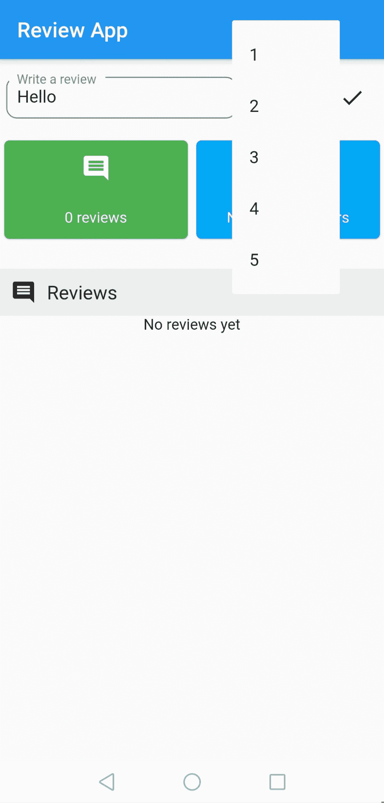
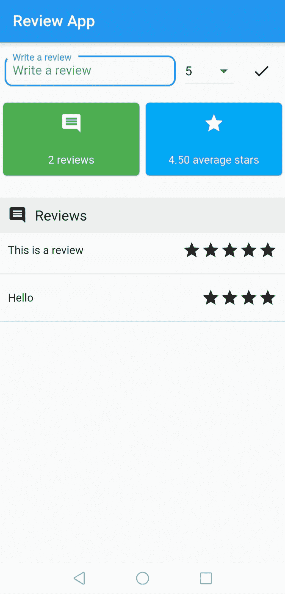
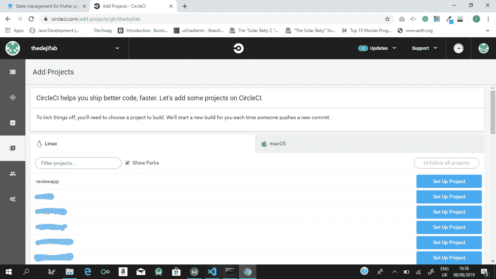
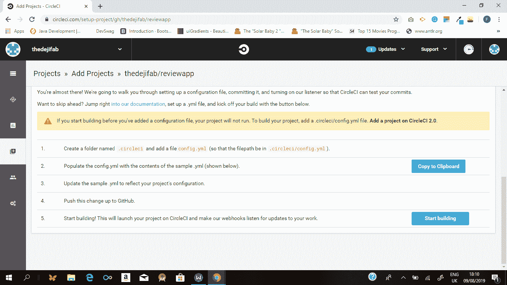
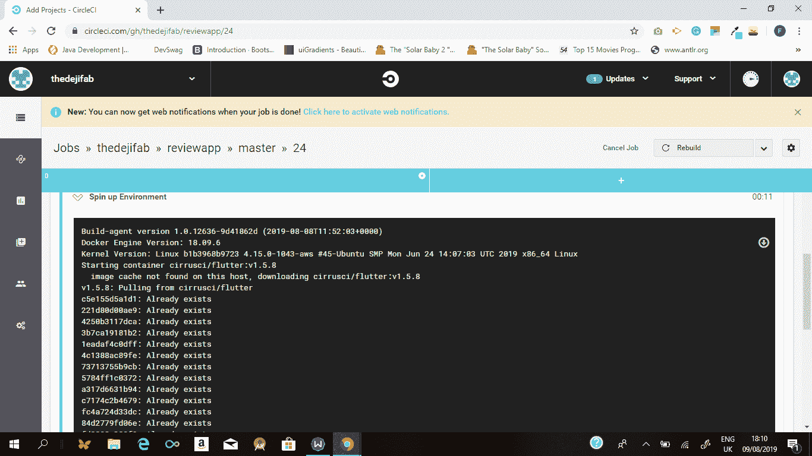

# 借助 MobX | CircleCI 为 Flutter 应用提供 CI/CD 和状态管理

> 原文：<https://circleci.com/blog/state-management-for-flutter-apps-with-mobx/>

MobX 是一个可扩展的库，旨在简化前端应用程序中的状态管理过程。在本教程中，您将学习如何使用 MobX 管理您的 Flutter 应用程序的状态，然后使用 CircleCI 为您的应用程序设置一个[持续集成/持续部署(CI/CD)](https://circleci.com/blog/what-is-a-ci-cd-pipeline/) 管道。您可以在[GitHub 资源库](https://github.com/thedejifab/reviewapp)中找到为本教程开发的示例项目。

## 先决条件

在开始之前，你需要一个关于 Flutter 的工作知识。如果需要帮助入门，可以关注 [Flutter 网站](https://flutter.io/docs/codelabs)上的 codelabs。

您需要在计算机上安装以下项目:

*   [Flutter SDK](https://flutter.io/docs/get-started/install) ，1.0 或更高版本。(这附带了一个 [Dart SDK](https://www.dartlang.org/install) 安装)。
*   开发环境。选择以下选项之一:

无论你选择哪个 IDE，你都需要安装 Dart 和 Flutter 插件。这些插件对于编辑和重构你的 Flutter 应用程序是至关重要的。

## MobX 简史

根据[mobx.js.org](https://mobx.js.org)的说法，MobX 是一个经过战斗测试的库，它通过透明地应用函数式反应式编程( [TFRP](https://github.com/mobxjs/mobx/issues/220) )使状态管理变得简单和可扩展。最初开发 MobX 时考虑的是 React 应用程序，现在它已经支持用其他 JavaScript 库构建的应用程序，最近还支持 Flutter 应用程序。

## 在 Flutter 应用中使用 MobX 进行状态管理

使用 MobX 管理状态依赖于该库的三个主要概念:

*   可观察状态
*   行动
*   计算值

可观察的状态是应用程序的那些易受变化影响的属性。这些状态是用`@observable`注释声明的。例如，待办应用程序中的可观察状态包括所有待办事项的列表。该列表还包括其值可以更新的所有其他属性。

动作是旨在改变可观察状态的值的操作。动作用`@action`注释声明。在运行一个动作时，MobX 处理应用程序中使用被该动作修改的可观察对象的更新部分。待办事项应用程序中的动作的一个例子是用新的待办事项更新待办事项列表的功能。

计算出的值类似于可观察的状态，并用`@computed`注释声明。计算值不直接依赖于动作。相反，计算值取决于可观测状态的值。如果计算值所依赖的可观察状态被一个动作修改，则计算值也被更新。在实践中，开发人员经常忽略计算值的概念，而是经常无意地使用可观察值来代替它们。

### 比较 MobX、BLoC、Redux 和 setState()中的范例

MobX 建立在一个简单的理念上，即任何可以从应用程序状态*派生的东西都应该从*派生出来。这意味着 MobX 覆盖了应用程序状态中的所有属性，这些属性被定义为有可能改变。MobX 仅在此类属性改变时才重建 UI。这种方法不同于 BLoC、Redux 和 setState 使用的方法。BLoC 使用流来传播更改，而 Redux 基于一个应用程序，该应用程序拥有一个真实的来源，其小部件从该来源继承。提供与 MobX 类似的简单性，需要您自己处理状态传播。凭借其抽象状态变化细节的能力，MobX 相对于其他方法提供了更平滑的学习曲线。

## 建立一个颤振项目

要创建新的 Flutter 项目，您将使用 Flutter CLI 工具。打开您的终端，导航到您的项目目录并运行以下命令:

```
$ flutter create reviewapp 
```

CLI 工具会生成一个模板项目，让您在几秒钟内就可以开始工作。项目生成后，您可以在 IDE 中打开它。

## 安装项目依赖项

您的新项目需要五个主要依赖项:

*   [mobx](https://pub.dartlang.org/packages/mobx) 是 mobx 的 Dart 端口，用于编写状态修改逻辑。
*   [flutter_mobx](https://pub.dartlang.org/packages/flutter_mobx) 是 mobx 的 flutter 集成，它提供了`Observer`小部件，可以根据可观察状态的变化自动重建。
*   [shared_preferences](https://pub.dartlang.org/packages/shared_preferences) 是一个本地持久性库。
*   [mobx_codegen](https://pub.dartlang.org/packages/mobx_codegen) 是 mobx 的代码生成库，允许使用 MobX 注释。
*   [build_runner](https://pub.dartlang.org/packages/build_runner) 是一个运行代码生成操作的独立库。

在 IDE 中打开项目后，导航到您的`/pubspec.yaml`文件以添加依赖项。用以下代码片段替换`dependencies`部分:

```
dependencies:
  flutter:
    sdk: flutter
  mobx: ^0.3.5
  flutter_mobx: ^0.3.0+1
  shared_preferences: ^0.5.3+4 
```

然后用这段代码替换`dev_dependencies`部分:

```
dev_dependencies:
  flutter_test:
    sdk: flutter
  build_runner: ^1.6.5
  mobx_codegen: ^0.3.3+1 
```

现在，在项目的根目录下运行这个命令来下载依赖项:

```
$ flutter packages get 
```

## 你在建造什么

在本教程中，您将构建一个简单的审阅应用程序，该应用程序允许用户添加评论和星号，如下图所示:

 

## 如何构建样本颤振项目

在[您正在构建的内容](#what-you-are-building)一节中描述的示例项目工作如下:

*   启动应用程序
*   从本地首选项获取评论
*   用检索到的评论更新 UI
*   添加评论
*   更新应用状态中的评论列表
*   在首选项中保留更新的评论列表

在开始之前，通过在项目的`/lib`目录中运行该命令，创建`/widgets`、`/screens`和`/models`文件夹:

```
$ mkdir widgets screens models 
```

### 创建数据模型

首先，通过在`/lib/models/`目录中创建一个`reviewmodel.dart`文件，为评审定义一个数据模型。将以下代码片段添加到其中:

```
import 'package:meta/meta.dart';
class ReviewModel {
  final String comment;
  final int stars;
  const ReviewModel({@required this.comment, @required this.stars});

  factory ReviewModel.fromJson(Map<String, dynamic> parsedJson) {
    return ReviewModel(
      comment: parsedJson['comment'],
      stars: parsedJson['stars'],
    );
  }

  Map<String, dynamic> toJson(){
    return {
      'comment': this.comment,
      'stars': this.stars,
    };
  }
} 
```

### 创建用户界面

我们正在构建的示例应用程序需要一种用户与之交互的方式。该应用程序将包含一个评论表单，显示现有评论的列表，评论的总数，以及每个评论的平均星级数。该表单还允许用户添加新的评论。

首先在`/lib/screens`目录下创建一个`review.dart`文件。添加以下代码片段:

```
import 'package:flutter/material.dart';
import 'package:flutter_mobx/flutter_mobx.dart';
import '../widgets/info_card.dart';

class Review extends StatefulWidget {
  @override
  ReviewState createState() {
    return new ReviewState();
  }
}
class ReviewState extends State<Review> {
  final List<int> _stars = [1, 2, 3, 4, 5];
  final TextEditingController _commentController = TextEditingController();
  int _selectedStar;

  @override
  void initState() {
    super.initState();
  }
  @override
  Widget build(BuildContext context) {
    Size screenSize = MediaQuery.of(context).size;
    double screenWidth = screenSize.width;
    return Scaffold(
      appBar: AppBar(
        title: Text('Review App'),
      ),
      body: Center(
        child: Column(
          mainAxisAlignment: MainAxisAlignment.start,
          children: <Widget>[
            SizedBox(height: 12.0),
            Row(
              mainAxisAlignment: MainAxisAlignment.spaceAround,
              children: <Widget>[
                Container(
                  width: screenWidth * 0.6,
                  child: TextField(
                    controller: _commentController,
                    decoration: InputDecoration(
                      contentPadding: EdgeInsets.all(10),
                      border: OutlineInputBorder(
                        borderRadius: BorderRadius.circular(10.0),
                      ),
                      hintText: "Write a review",
                      labelText: "Write a review",
                    ),
                  ),
                ),
                Container(
                  child: DropdownButton(
                    hint: Text("Stars"),
                    elevation: 0,
                    value: _selectedStar,
                    items: _stars.map((star) {
                      return DropdownMenuItem<int>(
                        child: Text(star.toString()),
                        value: star,
                      );
                    }).toList(),
                    onChanged: (item) {
                      setState(() {
                        _selectedStar = item;
                      });
                    },
                  ),
                ),
                Container(
                  child: Builder(
                    builder: (BuildContext context) {
                      return IconButton(
                        icon: Icon(Icons.done),
                        onPressed: () {},
                      );
                    },
                  ),
                ),
              ],
            ),
            SizedBox(height: 12.0),
            //contains average stars and total reviews card
            Row(
              mainAxisAlignment: MainAxisAlignment.spaceEvenly,
              children: <Widget>[
                InfoCard(
                    infoValue: '2',
                    infoLabel: "reviews",
                    cardColor: Colors.green,
                    iconData: Icons.comment),
                InfoCard(
                  infoValue: '2',
                  infoLabel: "average stars",
                  cardColor: Colors.lightBlue,
                  iconData: Icons.star,
                  key: Key('avgStar'),
                ),
              ],
            ),
            SizedBox(height: 24.0),
            //the review menu label
            Container(
              color: Colors.grey[200],
              padding: EdgeInsets.all(10),
              child: Row(
                mainAxisAlignment: MainAxisAlignment.start,
                children: <Widget>[
                  Icon(Icons.comment),
                  SizedBox(width: 10.0),
                  Text(
                    "Reviews",
                    style: TextStyle(fontSize: 18),
                  ),
                ],
              ),
            ),
            //contains list of reviews
            Expanded(
              child: Container(
                child: Text("No reviews yet"),
              ),
            ),
          ],
        ),
      ),
    );
  }
} 
```

### 创建自定义小部件

在这段代码中，有一个对`InfoCard`的引用。`InfoCard`是一个自定义小部件，显示评论总数和平均星级数:


要创建`InfoCard`小部件，在`/lib/widgets`目录中创建一个名为`info_card.dart`的文件。添加以下代码片段:

```
import 'package:flutter/material.dart';

class InfoCard extends StatelessWidget {
  final String infoValue;
  final String infoLabel;
  final Color cardColor;
  final IconData iconData;
  const InfoCard(
      {Key key,
      @required this.infoValue,
      @required this.infoLabel,
      @required this.cardColor,
      @required this.iconData,
      })
      : super(key: key);
  @override
  Widget build(BuildContext context) {
    Size screenSize = MediaQuery.of(context).size;
    double screenWidth = screenSize.width;
    return Container(
      height: 100,
      width: screenWidth / 2,
      child: Card(
        color: cardColor,
        shape: RoundedRectangleBorder(
          borderRadius: BorderRadius.circular(5.0),
        ),
        child: Column(
          mainAxisAlignment: MainAxisAlignment.spaceAround,
          children: <Widget>[
            Icon(
              iconData,
              size: 28.0,
              color: Colors.white,
            ),
            Text(
              "$infoValue $infoLabel",
              style: TextStyle(color: Colors.white),
            ),
          ],
        ),
      ),
    );
  }
} 
```

尽管在本教程的后面部分您还不需要它，但是创建一个`ReviewWidget`类。这个类将被用来显示一个单独的评论项目。首先在项目的`lib/widgets`目录下创建一个`review.dart`文件。添加以下代码片段:

```
import 'package:flutter/material.dart';
import '../models/reviewmodel.dart';
import '../models/reviews.dart';
import '../widgets/review.dart';
import '../widgets/info_card.dart';

class ReviewWidget extends StatelessWidget {
  final ReviewModel reviewItem;

  const ReviewWidget({Key key, @required this.reviewItem}) : super(key: key);

  @override
  Widget build(BuildContext context) {
    return Column(
      children: <Widget>[
        Padding(
          padding: EdgeInsets.all(10.0),
          child: Row(
            mainAxisAlignment: MainAxisAlignment.spaceBetween,
            children: <Widget>[
              Expanded(
                child: Text(
                  reviewItem.comment,
                ),
              ),
              Row(
                children: List(reviewItem.stars).map((listItem) {
                  return Icon(Icons.star);
                }).toList(),
              ),
            ],
          ),
        ),
        Divider(
          color: Colors.grey,
        )
      ],
    );
  }
} 
```

## 实现 MobX

要在应用程序中实现 MobX，您需要在应用程序状态中定义观察值、动作和计算值。

在应用程序中的任何时间点，评论列表、平均星级数和评论总数必须是最新的可用值。这意味着它们必须用注释声明，以便 MobX 可以跟踪对它们的更改。

为此，在项目的`/lib/models`目录中创建一个文件`reviews.dart`。添加以下代码片段:

```
import 'dart:async';
import 'dart:convert';
import 'package:mobx/mobx.dart';
import 'package:shared_preferences/shared_preferences.dart';
import './reviewmodel.dart';
part 'reviews.g.dart';
class Reviews = ReviewsBase with _$Reviews;
abstract class ReviewsBase with Store {
  @observable
  ObservableList<ReviewModel> reviews = ObservableList.of([]);

  @observable
  double averageStars = 0;

  @computed
  int get numberOfReviews => reviews.length;

  int totalStars = 0;

  @action
  void addReview(ReviewModel newReview) {
    //to update list of reviews
    reviews.add(newReview);
    // to update the average number of stars
    averageStars = _calculateAverageStars(newReview.stars);
    // to update the total number of stars
    totalStars += newReview.stars;
    // to store the reviews using Shared Preferences
    _persistReview(reviews);
  }

  @action
  Future<void> initReviews() async {
    await _getReviews().then((onValue) {
      reviews = ObservableList.of(onValue);
      for (ReviewModel review in reviews) {
        totalStars += review.stars;
      }
    });
    averageStars = totalStars / reviews.length;
  }

  double _calculateAverageStars(int newStars) {
    return (newStars + totalStars) / numberOfReviews;
  }

  void _persistReview(List<ReviewModel> updatedReviews) async {
    List<String> reviewsStringList = [];
    SharedPreferences _preferences = await SharedPreferences.getInstance();
    for (ReviewModel review in updatedReviews) {
      Map<String, dynamic> reviewMap = review.toJson();
      String reviewString = jsonEncode(ReviewModel.fromJson(reviewMap));
      reviewsStringList.add(reviewString);
    }
    _preferences.setStringList('userReviews', reviewsStringList);
  }

  Future<List<ReviewModel>> _getReviews() async {
    final SharedPreferences _preferences =
        await SharedPreferences.getInstance();
    final List<String> reviewsStringList =
        _preferences.getStringList('userReviews') ?? [];
    final List<ReviewModel> retrievedReviews = [];
    for (String reviewString in reviewsStringList) {
      Map<String, dynamic> reviewMap = jsonDecode(reviewString);
      ReviewModel review = ReviewModel.fromJson(reviewMap);
      retrievedReviews.add(review);
    }
    return retrievedReviews;
  }
} 
```

这段代码声明了两个变量:

1.  `reviews`是所有用户评论的列表
2.  是从所有评论中计算出的可观测恒星的平均数量。它们被计算为可观察的，因为它们的值被期望响应于动作而改变。然后，代码定义了`addReview()`函数，它向评论列表中添加了一个新的评论。它还添加了一个`initReviews()`函数，用来自共享偏好的现有数据初始化评论列表，作为更新可观察状态的动作。

虽然也可以将`numberOfReviews`变量声明为可观察变量，但是可以使用计算值，因为其值的变化取决于动作的结果(更新的可观察状态),而不是直接取决于动作本身。就当是余波效应吧。最后，声明一个`totalStars`变量和函数`_calculateAverageStars()`、`_persistReview()`和`_getReviews()`。这些参数没有注释，因为它们是不直接更新状态的辅助参数。

## 运行 CodeGen

由于 MobX 专注于抽象高级实现细节，库处理生成数据存储的过程。相比之下，Redux 甚至要求存储都是手工编写的。MobX 通过使用其`mobx_codegen`库和 Dart 的`build_runner`库来执行代码生成，并在搭建存储时考虑所有带注释的属性。

转到项目的根目录，运行命令:

```
$ flutter packages pub run build_runner build 
```

在您生成存储之后，您将在您的`/lib/models`目录中找到一个`review.g.dart`文件。

## 使用观察者

即使实现了 MobX 存储，在应用程序的 UI 中反映状态变化也需要使用来自`flutter_mobx`库的观察者。observer 是一个小部件，它包装了一个可观察值或计算值，以将它们值的变化呈现给 UI。

添加每个新评论时，平均星级、评论数和评论总数的值都会更新。这意味着用于呈现值的小部件被包装在一个`Observer`小部件中。要使用 observer 小部件，请导航到您的`/lib/screens/review.dart`文件。使用以下代码修改`ReviewState`类:

```
class ReviewState extends State<Review> {
  final Reviews _reviewsStore = Reviews();
  final TextEditingController _commentController = TextEditingController();  
  final List<int> _stars = [1, 2, 3, 4, 5];
  int _selectedStar;
  @override
  void initState() {
    _selectedStar = null;
    _reviewsStore.initReviews();
    super.initState();
  }
  @override
  Widget build(BuildContext context) {
    Size screenSize = MediaQuery.of(context).size;
    double screenWidth = screenSize.width;
    return Scaffold(
      appBar: AppBar(
        title: Text('Review App'),
      ),
      body: Center(
        child: Column(
          mainAxisAlignment: MainAxisAlignment.start,
          children: <Widget>[
            SizedBox(height: 12.0),
            Row(
              mainAxisAlignment: MainAxisAlignment.spaceAround,
              children: <Widget>[
                Container(
                  width: screenWidth * 0.6,
                  child: TextField(
                    controller: _commentController,
                    decoration: InputDecoration(
                      contentPadding: EdgeInsets.all(10),
                      border: OutlineInputBorder(
                        borderRadius: BorderRadius.circular(10.0),
                      ),
                      hintText: "Write a review",
                      labelText: "Write a review",
                    ),
                  ),
                ),
                Container(
                  child: DropdownButton(
                    hint: Text("Stars"),
                    elevation: 0,
                    value: _selectedStar,
                    items: _stars.map((star) {
                      return DropdownMenuItem<int>(
                        child: Text(star.toString()),
                        value: star,
                      );
                    }).toList(),
                    onChanged: (item) {
                      setState(() {
                        _selectedStar = item;
                      });
                    },
                  ),
                ),
                Container(
                  child: Builder(
                    builder: (BuildContext context) {
                      return IconButton(
                        icon: Icon(Icons.done),
                        onPressed: () {
                          if (_selectedStar == null) {
                            Scaffold.of(context).showSnackBar(SnackBar(
                              content:
                                  Text("You can't add a review without star"),
                              duration: Duration(milliseconds: 500),
                            ));
                          } else if (_commentController.text.isEmpty) {
                            Scaffold.of(context).showSnackBar(SnackBar(
                              content: Text("Review comment cannot be empty"),
                              duration: Duration(milliseconds: 500),
                            ));
                          } else {
                            _reviewsStore.addReview(ReviewModel(
                                comment: _commentController.text,
                                stars: _selectedStar));
                          }
                        },
                      );
                    },
                  ),
                ),
              ],
            ),
            SizedBox(height: 12.0),
            //contains average stars and total reviews card
            Observer(
              builder: (_) {
                return Row(
                  mainAxisAlignment: MainAxisAlignment.spaceEvenly,
                  children: <Widget>[
                    InfoCard(
                      infoValue: _reviewsStore.numberOfReviews.toString(),
                      infoLabel: "reviews",
                      cardColor: Colors.green,
                      iconData: Icons.comment
                    ),
                    InfoCard(
                      infoValue: _reviewsStore.averageStars.toStringAsFixed(2),
                      infoLabel: "average stars",
                      cardColor: Colors.lightBlue,
                      iconData: Icons.star,
                      key: Key('avgStar'),
                    ),
                  ],
                );
              },
            ),
            SizedBox(height: 24.0),
            //the review menu label
            Container(
              color: Colors.grey[200],
              padding: EdgeInsets.all(10),
              child: Row(
                mainAxisAlignment: MainAxisAlignment.start,
                children: <Widget>[
                  Icon(Icons.comment),
                  SizedBox(width: 10.0),
                  Text(
                    "Reviews",
                    style: TextStyle(fontSize: 18),
                  ),
                ],
              ),
            ),
            //contains list of reviews
            Expanded(
              child: Container(
                child: Observer(
                  builder: (_) => _reviewsStore.reviews.isNotEmpty
                      ? ListView(
                          children:
                              _reviewsStore.reviews.reversed.map((reviewItem) {
                            return ReviewWidget(
                              reviewItem: reviewItem,
                            );
                          }).toList(),
                        )
                      : Text("No reviews yet"),
                ),
              ),
            )
          ],
        ),
      ),
    );
  }
} 
```

这段代码通过从`/lib/models/reviews.dart`创建一个`Review`类的实例来追加第一次修改，作为访问存储的一种方式。然后，它用一个 observer 小部件包装显示平均星级和总评论数据的`Row`。然后它使用`Review`类的`reviewStore`实例来引用数据。

接下来，当商店中的评论列表为空时，将显示占位符“no reviews”`Text`小部件。否则，`ListView`显示列表中的项目。最后，修改“完成”按钮的`onPressed()`功能，向商店添加新的评论。

至此，您的应用程序差不多完成了。下一步是将审查屏幕导入到您的`main.dart`文件的导入部分。打开文件，并添加以下代码片段:

```
$ import './screens/review.dart'; 
```

在`/lib/main.dart`中，修改`MyApp`类的`build()`方法中的`home`属性。将`home`属性从`MyHomePage()`更改为`Review()`。代码如下:

```
@override
Widget build(BuildContext context) {
  return MaterialApp(
    title: 'Flutter Demo',
    theme: ThemeData(
      primarySwatch: Colors.blue,
    ),
    home: Review() //previously MyHomePage(),
  );
} 
```

最后，使用`flutter run`命令运行应用程序。

## 编写样本测试

为了理解测试如何适应 CI/CD 管道，您将需要创建一个简单的单元测试和小部件测试。

为了编写单元测试，在项目的`/test`目录中创建一个名为`unit_test.dart`的文件。添加以下代码片段:

```
import 'package:flutter_test/flutter_test.dart';
import '../lib/models/reviewmodel.dart';
import '../lib/models/reviews.dart';

void main() {
  test('Test MobX state class', () async {
    final Reviews _reviewsStore = Reviews();

    _reviewsStore.initReviews();

    expect(_reviewsStore.totalStars, 0);

    expect(_reviewsStore.averageStars, 0);
    _reviewsStore.addReview(ReviewModel(
      comment: 'This is a test review',
      stars: 3,
    ));

    expect(_reviewsStore.totalStars, 3);
    _reviewsStore.addReview(ReviewModel(
      comment: 'This is a second test review',
      stars: 5,
    ));

    expect(_reviewsStore.averageStars, 4);
  });
} 
```

接下来，通过用以下代码片段完全替换项目的`test`目录中现有的`widget_test.dart`文件的内容来添加小部件测试:

```
import 'package:flutter/material.dart';
import 'package:flutter_test/flutter_test.dart';
import '../lib/main.dart';

void main() {
  testWidgets('Test for rendered UI', (WidgetTester tester) async {
    await tester.pumpWidget(MyApp());
    Finder starCardFinder = find.byKey(Key('avgStar'));

    expect(starCardFinder, findsOneWidget);
  });
} 
```

通过执行项目根目录中的`flutter test`命令来运行测试。

## 带 CircleCI 的 CI/CD

除了为您提供一个构建项目的环境之外，持续集成(CI)工具还为运行自动化测试和自动上传部署工件提供了一个可靠而稳定的环境。在本节中，您将学习如何使用 CircleCI 为您的颤振项目设置和利用 CI/CD 管道。

首先，通过执行项目根目录中的`git init`命令来初始化项目中的本地 Git 存储库。用`git add .`把你的文件添加进去。把那些文件交给`git commit -m "First commit"`。然后，在 GitHub 上为您的项目创建一个在线存储库。将 GitHub 存储库添加为本地存储库的远程引用，然后通过在项目根目录下运行以下命令将更改推送到远程存储库:

```
$ git remote add origin https://link_to_repo && git push -u origin master 
```

## 创建配置文件

通过运行项目根目录中的`mkdir .circleci`命令创建一个名为`.circleci`的文件夹。创建一个[配置文件](https://circleci.com/docs/configuration-reference/)，这样文件路径的结构就是这样的`/your_project_path/.circleci/config.yml`。

然后，用下面的代码片段填充`/.circleci/config.yml`文件:

```
version: 2
jobs:
  build:    
    docker:
      - image: cirrusci/flutter:v1.5.8 

    branches:
      only: master

    steps:
      - checkout

      - run:
          name: Run Flutter doctor
          command: flutter doctor

      - run:
          name: Run the application tests
          command: flutter test

      - run:
          name: Build the Android version
          command: flutter build apk 

      - store_artifacts:
          path: build/app/outputs/apk/release/app-release.apk 
```

在这个配置文件中， [Docker](https://circleci.com/docker/) 被用作 [executor](https://circleci.com/docs/executor-types/) 。Flutter 没有官方的 CircleCI [Docker 图片](https://circleci.com/docs/building-docker-images/)，但是 DockerHub 上有一个很大的 Flutter 图片列表。最突出的是 [cirrusci/flutter](https://hub.docker.com/r/cirrusci/flutter) 图像。这张图片的使用频率超过 100 万次。

配置文件中可选的`branches`部分用于过滤部署流程运行的分支。当没有明确定义时，CircleCI 假设`master`为要处理的分支。

配置定义了使用哪个 Docker 映像。它还固定了一个镜像版本，该版本与运行项目本地副本的 Flutter 版本相匹配(在我的例子中是 [v1.5.8)。](https://hub.docker.com/r/cirrusci/flutter/tags)

在步骤部分中，配置文件定义了每次在项目的存储库上运行部署时要执行的每个过程，按照它们的执行顺序。

最后，在上面代码片段的`store-artifacts`部分，引用了我们的[构建工件](https://circleci.com/docs/artifacts/)的路径。这使得工件能够自动上传到 CircleCI 仪表板的**工件**选项卡。工件可以部署到 AWS S3 存储桶或任何其他托管服务。对于生产就绪的 Flutter 应用程序，您可以将应用程序商店的部署添加到该配置中。

## 设置 CircleCI

要将 CircleCI 与您的项目集成，请转到 CircleCI 仪表板，然后单击**添加项目**。它位于仪表板页面的最左侧。接下来，导航到页面的最右侧，点击**设置项目**。



在下一页，点击**开始建造**。



您的构建将开始。



现在，新代码的每一次提交都将为您的 Flutter 应用程序触发一个自动化的构建、测试和部署管道。

## 结论

在这篇文章中，我们介绍了如何使用 MobX 状态管理库管理 Flutter 应用程序的状态。我们还介绍了如何使用 CircleCI 为您的应用程序设置 CI/CD 管道。

尽管在为颤振项目(尤其是大型项目)选择状态管理方法时需要考虑权衡，但 MobX 为中型项目提供了可靠的选择。图书馆为你做最难的工作，同时给你权力在必要的地方负责。当您决定下一个 Flutter 项目的状态管理，甚至可能重写当前的项目时，这是一个很大的好处！

开发团队继续在他们的颤振项目中采用 MobX。查看[图书馆的 GitHub 知识库](https://github.com/mobxjs/mobx.dart)，了解有助于其发展的方法。

我真的希望你喜欢这个教程。祝编码愉快！

* * *

Fabusuyi 是 Busha 的一名软件工程实习生，在那里他与移动开发团队一起工作。他目前是计算机科学专业的学生，对计算理论有研究兴趣。

[阅读更多 Fabusuyi Ayodeji 的帖子](/blog/author/fabusuyi-ayodeji/)