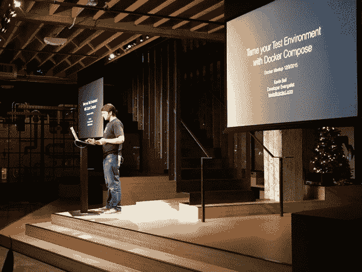
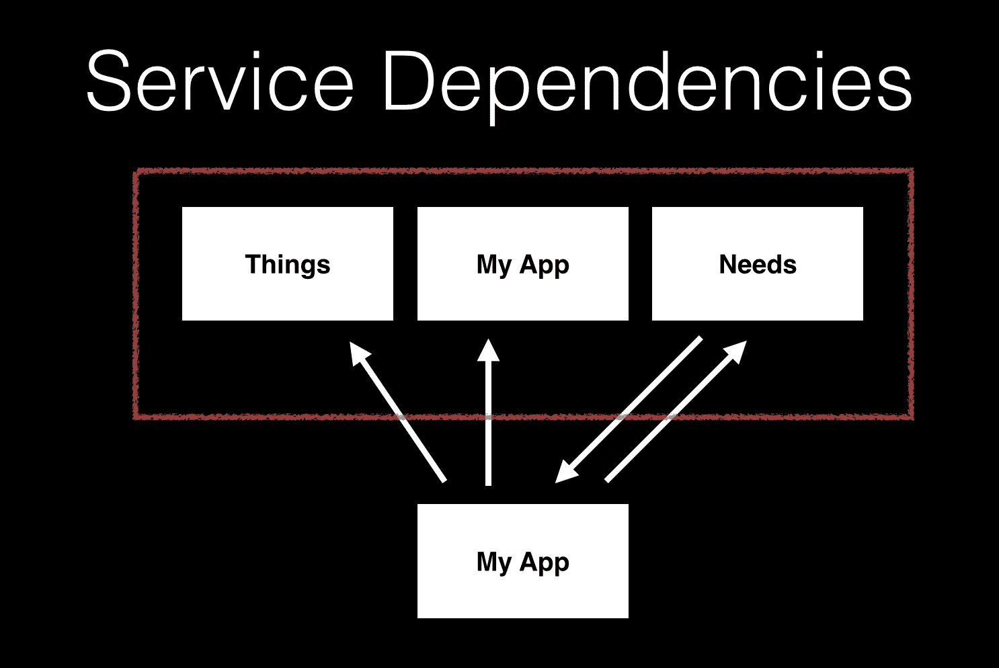
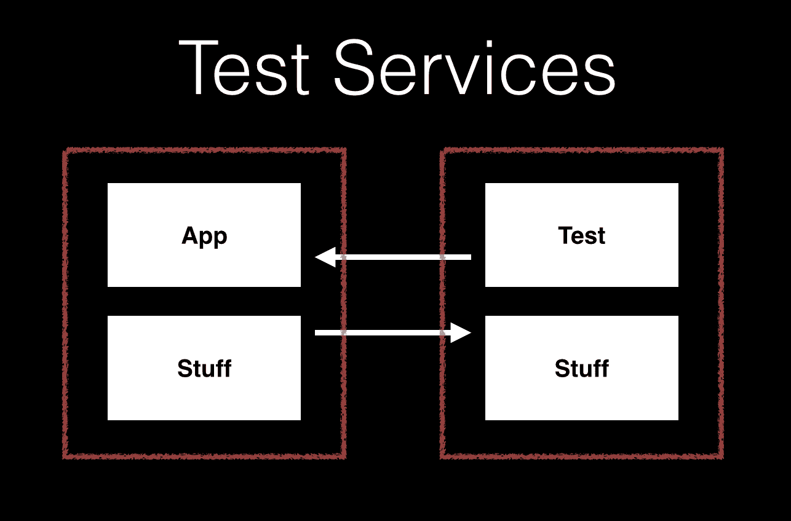

# 用 Docker Compose - CircleCI 驯服您的测试环境

> 原文：<https://circleci.com/blog/tame-your-test-environment-with-docker-compose/>

**来自出版商的说明:**您已经找到了我们的一些旧内容，这些内容可能已经过时和/或不正确。尝试在[我们的文档](https://circleci.com/docs/)或[博客](https://circleci.com/blog/)中搜索最新信息。

* * *

我昨晚在 Heavybit 俱乐部会所的 Docker meetup 上做了一个有趣的小演讲。演讲的视频应该很快就会在网上发布，但在此之前，我们先来回顾一下内容。

## 复合坞站

即使您还没有在生产中使用 Docker，Docker Compose 在您的开发和测试环境中也会非常有用。Docker Compose 基本上是一个工具，可以一次运行任意数量的 Docker 容器，这些容器相互链接，或者以简单的 YAML 文件中指定的任何方式进行配置。

## 服务依赖关系

Docker Compose 在您的开发/测试环境中的一个用例是管理服务依赖。例如，如果您需要一个 LESS 编译器、一个 linter、一个 DB 和一个应用服务器都在您的开发环境中运行，您可以简单地使用一个 docker-compose.yml 来管理它们。如果您熟悉 Foreman 之类的工具来管理您的开发环境中的多个进程，docker Compose 可以做非常类似的工作，但远不止启动每个进程，它在自己的 Docker 容器中运行每个服务，这意味着所有依赖项都是非常独立的。这里有一个视频示例，是我在昨晚的演讲中提到的一个用例(视频中没有声音):

## 复杂的测试服务

除了管理应用程序复杂的服务依赖关系，Docker Compose 还可以帮助运行复杂的测试过程。分布式压力测试或复杂的安全扫描浮现在脑海中，但即使是普通的浏览器测试也涉及一组相当复杂的交互过程，设置和考虑起来都很复杂。Docker Compose 有助于为这种设置提供一些清晰的结构，以及开发和测试/CI 环境之间的对等性。这是另一个快速的视频演示(同样，没有声音):

这就是在您的开发和测试环境(包括 CircleCI)中使用 Docker Compose 的基本情况。以上视频中使用的所有代码都可以在 GitHub 上找到:

昨晚演示的幻灯片也可以在 SlideShare 上获得[。](http://www.slideshare.net/KevinBell20/tame-your-test-environment-with-docker-compose)

感谢阅读！别忘了查看 Docker 上的 [CircleCI 文档，了解如何使用 CircleCI 满足您的所有 Docker 需求！](https://circleci.com/docs/1.0/docker/)