# 用 Postman | CircleCI 测试 API

> 原文：<https://circleci.com/blog/testing-an-api-with-postman/>

> 本教程涵盖:
> 
> 1.  设置邮递员环境
> 2.  为 API 请求编写测试
> 3.  使用 Newman orb 自动化测试

从 cURL 是唯一可用的工具开始，测试 API 已经走过了漫长的道路。 [Postman](https://www.postman.com/) 通过允许开发人员从一个用户友好的界面轻松地提出请求，改善了端到端的测试体验。您可以使用 Postman 作为 API 开发和测试的全功能协作平台。

在本教程中，您将学习如何使用 Postman 的命令行实用程序 [Newman](https://www.npmjs.com/package/newman) 对您的 API 执行和自动化测试。

## 先决条件

要完成本教程，需要做一些事情:

1.  JavaScript 的基础知识
2.  邮差桌面安装在您的系统上。你可以在这里下载[。本教程使用版本 9.30.3。](https://www.postman.com/downloads/)
3.  一个[圆](https://circleci.com/signup/)的账户
4.  GitHub 的一个账户

我们将在这个[帖子](https://circleci.com/blog/automating-the-deploy-of-an-adonis-api-to-heroku/)中测试构建和部署的 API。这是一个简单的 [Node.js](https://nodejs.org/en/) API，由创建和获取用户帐户的端点组成。这个 API 被部署到地址`https://my-adonis-api-app.herokuapp.com`。你可以在这里找到源代码[，并按照文章中的步骤部署它(上面有链接)。](https://github.com/CIRCLECI-GWP/my-adonis-api)

随着我们需要的一切安装和设置，是时候开始教程了。

## 设置邮递员环境

要为您的 API 测试建立一个自动化测试管道，您需要在 Postman 中创建一个环境。设置环境的范围将帮助您避免变量在全局范围内或与其他环境发生冲突。

打开 Postman desktop，从左侧菜单栏中选择**环境**。你的环境将会显示在这里，如果你有，否则，你将会有一个链接来创建一个新的。点击**创建环境**或使用加号图标。

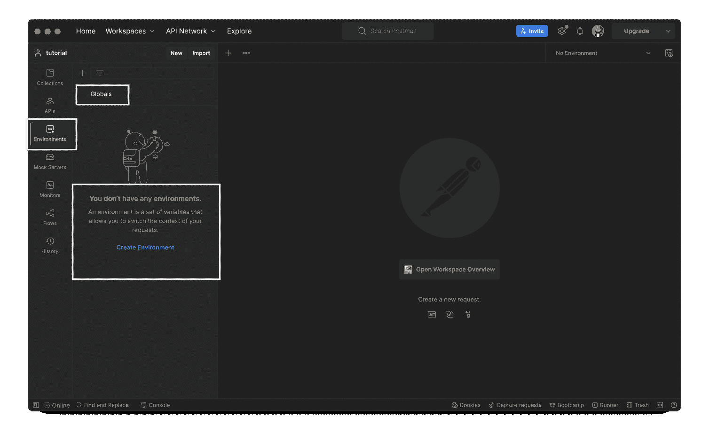

注意: *你的邮递员用户界面可能看起来与本教程中的截图略有不同，但你需要的工具将会可用。*

接下来，输入环境的名称。输入环境变量`api_url`。用`https://my-adonis-api-app.herokuapp.com`填充 API 基 URL(不带尾随斜杠)。`INITIAL VALUE`中的值在`CURRENT VALUE`中重复。在本教程中保持它们的一致性。

点击**保存**添加新环境。从界面右上角的下拉列表中选择新环境。

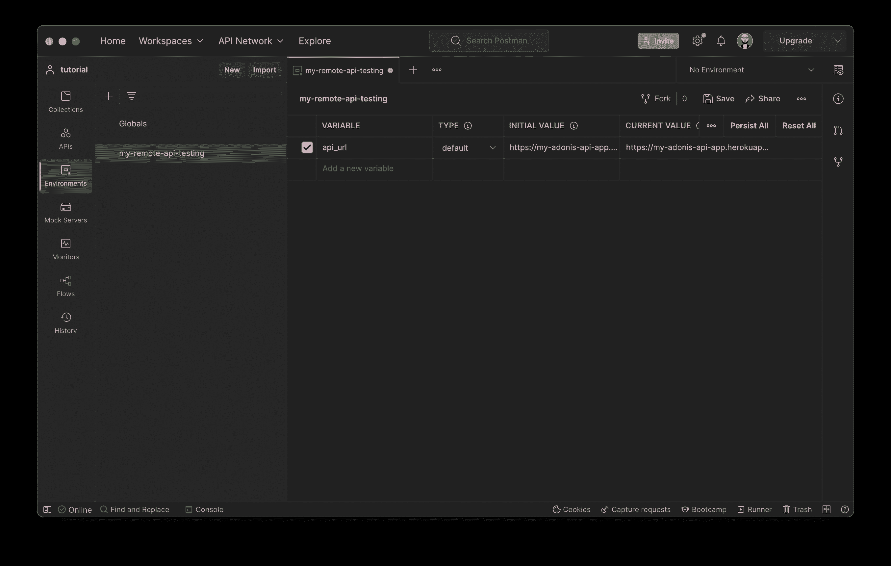

## 为 API 测试创建 Postman 集合

下一步是为我们正在测试的 API 的用户端点创建一个 Postman 集合。邮递员集合充当 API 请求的容器。邮递员集合通常用于对与特定实体相关的请求进行分组。

要创建新的收藏，请单击界面左侧栏上的**收藏**选项卡。然后点击**创建收藏**。

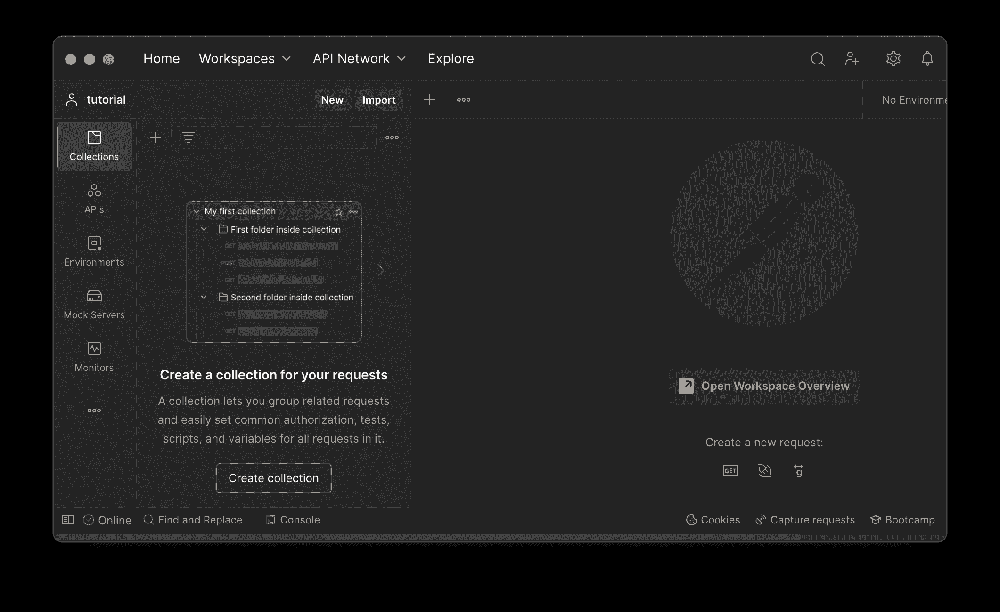

填写您收藏的名称(`Users`)。您还可以为该集合添加描述，以提供更多信息。您的新收藏列在左侧栏的**收藏**标签下。

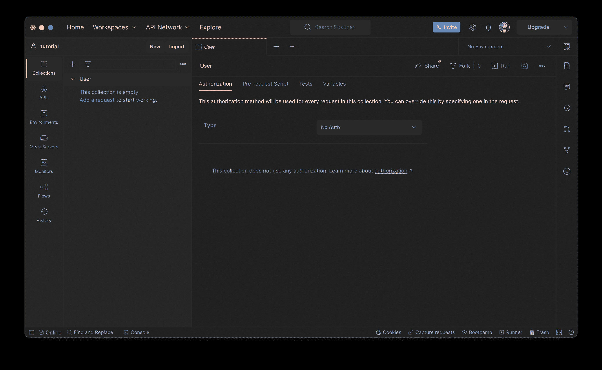

## 向集合中添加请求

现在，您可以将请求添加到您的集合中。我们的 API 由两个端点组成:

*   (GET):获取用户配置文件列表
*   `{{api_url}}/user/create` (POST):创建新的用户配置文件

要添加新请求，请单击集合旁边的菜单图标。

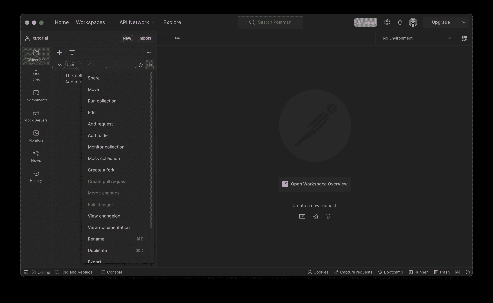

点击**添加请求**。为`{{api_url}}/user/get`端点创建一个请求，点击**保存**。`Users`是我们之前创作的系列。

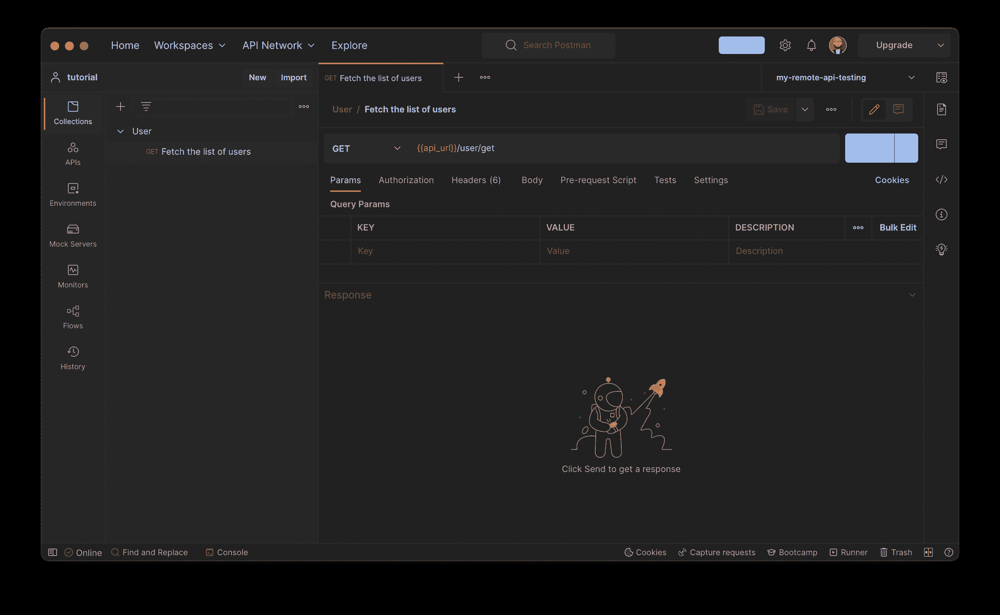

将列出一个新的“请求”选项卡。使用您为当前环境创建的`api_url`变量，在地址栏(`{{api_url}}/user/get`)中输入请求的端点。把它命名为`Fetch the list of users`。

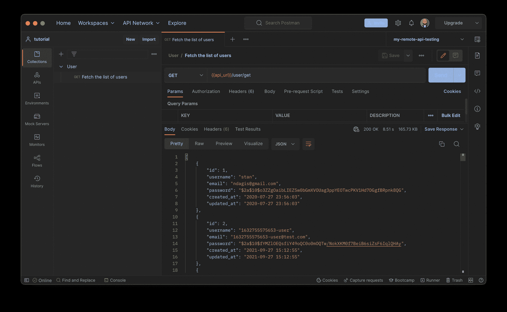

Postman 返回用户数组。点击**保存**。

创建另一个请求，这次是针对`{{api_url}}/user/create`端点的。这是一个`POST`请求，需要一个`username`、`email`和`password`。

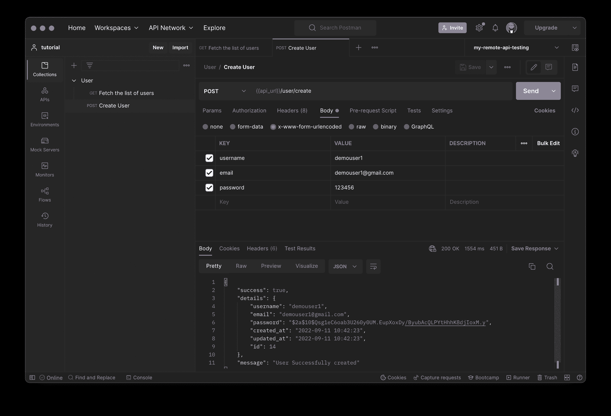

请确保保存此请求。

## 为 API 请求编写测试

现在设置已经完成，是时候添加一些测试了。

左侧栏应该显示`{{api_url}}/user/get`请求已被选中。如果不是，请单击选择它。点击**测试**选项卡并输入:

```
pm.test("Request is successful with a status code of 200", function () {
  pm.response.to.have.status(200);
});

pm.test("Check that it returns an array", function () {
  var jsonData = pm.response.json();
  pm.expect(jsonData).to.be.an("array");
}); 
```

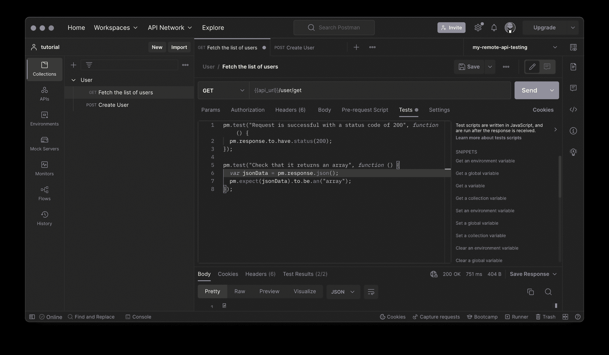

你刚才加的邮差测试是[柴](https://www.chaijs.com/)断言。

在上面的代码中，第一个测试检查请求是否完成，成功状态代码为`200`。第二个测试检查从请求返回的数据是否是一个数组；在这种情况下，预期的用户配置文件数组。

保存并再次运行请求。关于已通过测试的详细信息列在**测试结果**选项卡上。

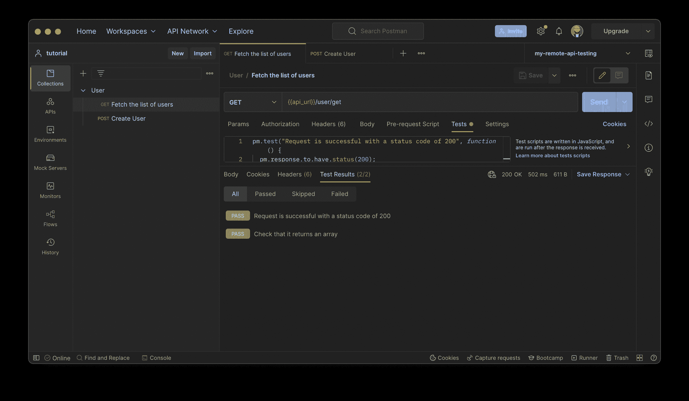

接下来，向`{{api_url}}/user/create`端点添加对`POST`请求的测试。此端点的测试比前一个测试更复杂。这是因为 API 对`username`和`email`请求参数进行了重复检查。使用硬编码参数将导致请求在第一次尝试后失败。

幸运的是，你可以建立一个邮递员的`Pre-request Scripts`。这些脚本在触发请求之前运行。使用此脚本为请求动态生成随机用户名和电子邮件。

单击请求以加载它，然后单击**预请求脚本**选项卡。添加以下脚本:

```
let random = +new Date();

pm.globals.set("username", `${random}-user`);
pm.globals.set("email", `${random}-user@test.com`); 
```

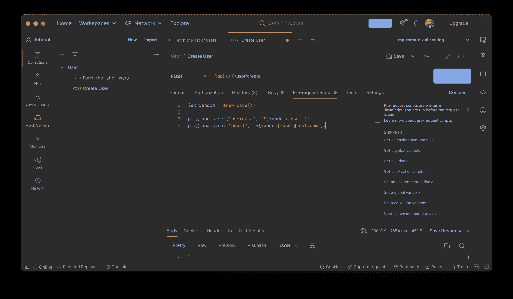

在上面的脚本中，当前时间戳用于为每个触发的请求随机创建用户名和电子邮件。随机变量`username`和`email`被设置为请求实例的全局变量。用下面显示的动态值替换请求体中的`username`和`email`。

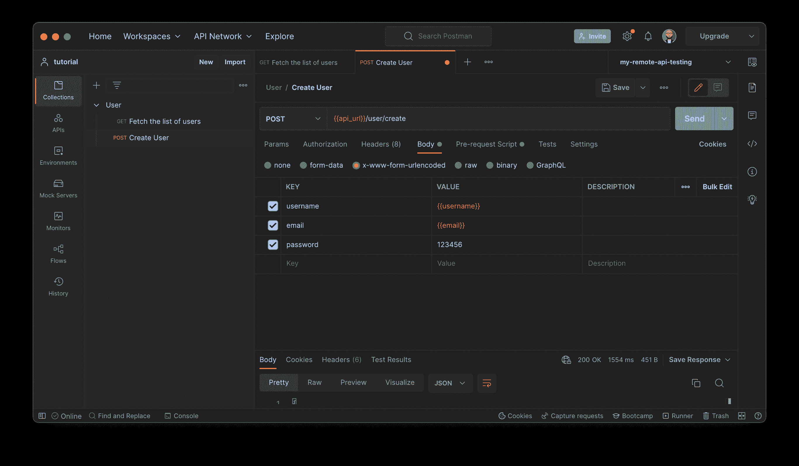

现在，每个请求将使用动态的`username`和`email`参数。将以下内容添加到该请求的`Tests`窗口中:

```
pm.test("User creation was successful", function () {
  pm.expect(pm.response.code).to.be.oneOf([200, 201, 202]);
});

pm.test("Confirm response message", function () {
  var jsonData = pm.response.json();
  pm.expect(jsonData.message).to.eql("User Successfully created");
}); 
```

在上面的代码中，第一个测试通过检查状态代码`200`、`201`和`202`来断言一个成功的响应。这些代码用于指示成功的`POST`请求。第二个测试检查在`json`响应中返回的消息，以确保它与预期的成功消息匹配。

运行请求，测试将通过，如下所示:

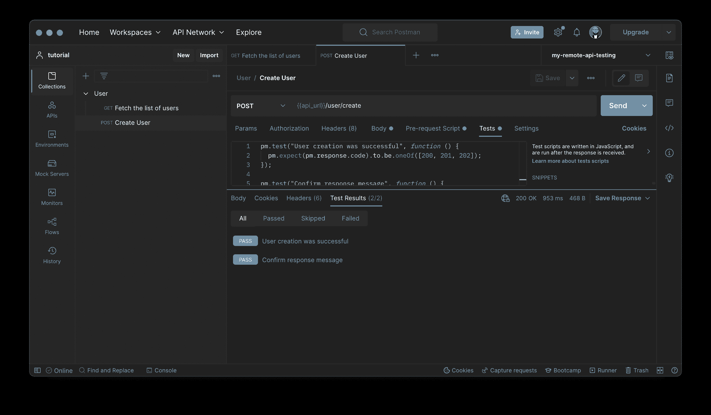

## 设置测试自动化项目

到目前为止，我们已经使用了 Postman GUI 来发出请求，这很好，但是本教程的目标是自动化测试和生成测试结果。这使得我们的下一个任务是为测试自动化建立一个项目。

首先，在本地计算机上的任意位置为项目创建一个文件夹:

```
mkdir postman-api-testing 
```

确保您已经保存了您的请求。然后从集合上下文菜单中单击**导出**。

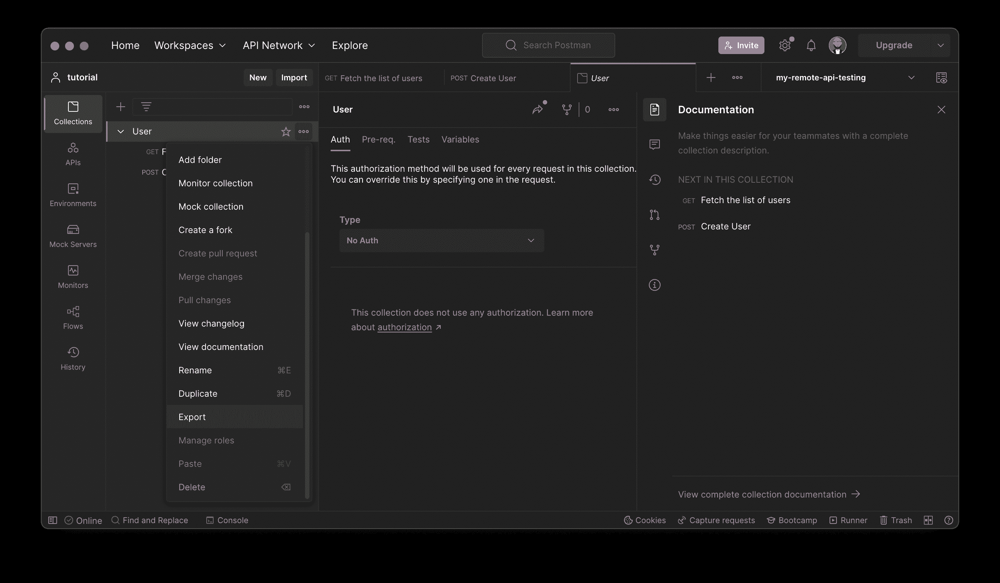

名为`User.postman_collection.json`的文件将被下载。

我们还需要导出为本教程创建的 Postman 环境。点击侧边栏中的环境选项卡，确保选择了`my-remote-api-testing`。单击菜单图标，从弹出对话框中导出您的环境。

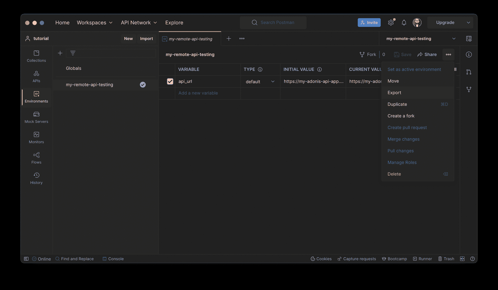

名为`my-remote-api-testing.postman_environment.json`的文件将被下载。

**注意:** *如果你使用不同的文件名，一定要保持一致，或者使用教程中的例子来重命名文件。*

将这两个文件放在项目文件夹的根目录下。

## 使用 Newman orb 自动化测试过程

本教程的最后一步是编写测试自动化脚本。这个脚本将使用 Postman 的 CLI 兄弟 Newman，使用导出的环境运行集合。幸运的是，CircleCI 为纽曼准备了一个[球](https://circleci.com/developer/orbs/orb/postman/newman)。 [Orbs](https://circleci.com/orbs/) 是抽象了大量样板代码的包。orb 为开发人员提供了一个友好的 API，用于调用常见命令和使用 Newman、Heroku 和 environments 等工具。

因为`newman`是第三方 orb，你的 CircleCI 账号必须设置成允许。要更改此设置，请转到您的 CircleCI 帐户的**组织设置**。在左侧工具条中，点击**安全**。在**安全设置**页面上，选择**是**以允许第三方 orb 进入您的构建。

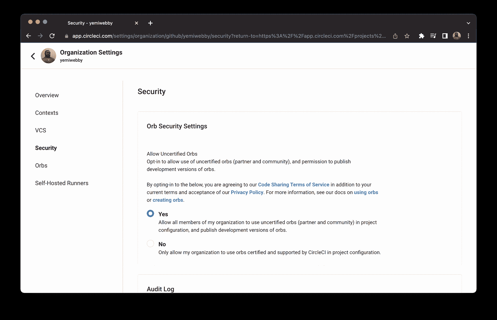

## 创建配置文件

在项目的根目录下创建一个名为`.circleci`的文件夹，并在文件夹中添加一个名为`config.yml`的配置文件。在该文件中，输入以下代码:

```
version: 2.1
orbs:
  newman: postman/newman@1.0.0
jobs:
  build:
    executor: newman/postman-newman-docker
    steps:
      - checkout
      - newman/newman-run:
          collection: ./User.postman_collection.json
          environment: ./my-remote-api-testing.postman_environment.json 
```

通过调用`newman/newman-run`命令，上面的脚本加载 Postman 的`Newman` orb，并使用指定的`environment`运行`collection`。就是这么简单。

提交您的更改并[将您的项目推送到 GitHub](https://circleci.com/blog/pushing-a-project-to-github/) 。

## 将项目连接到 CircleCI

现在，登录你的 CircleCI 账户。如果你注册了你的 GitHub 账户，你所有的库都可以在你项目的仪表盘上看到。

点击`postman-api-testing`项目旁边的**设置项目**。

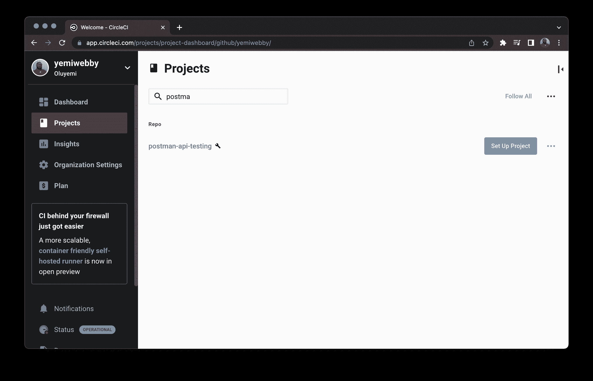

这将触发管道构建并成功运行它。

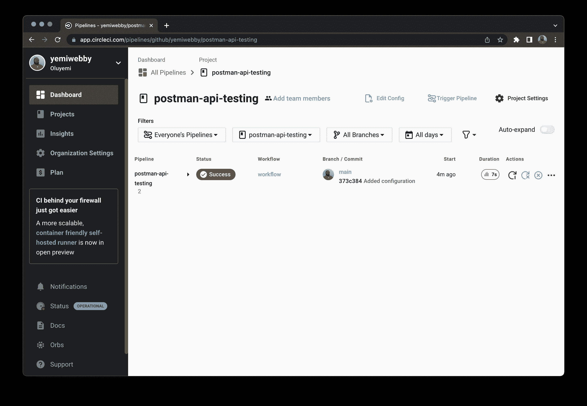

要查看测试结果，单击构建并展开**测试**选项卡。

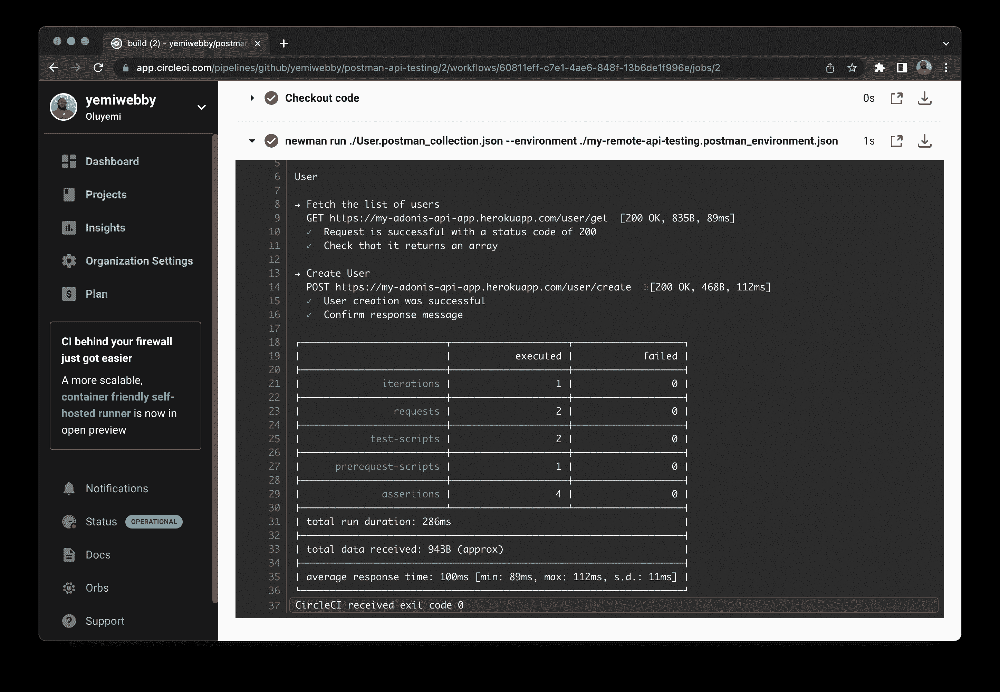

正如预期的那样，Newman 运行了集合，然后生成了一个报告，详细说明了测试是如何运行的。

厉害！

## 结论

手动测试过程会很快变成一个麻烦的、容易出错的例行程序。Postman GUI 已经是每个 API 开发者的必备工具包。正如我们在本教程中所展示的，CircleCI 自动化管道和`newman` orb 可以让你的 API 测试更进一步。

编码快乐！

* * *

Fikayo Adepoju 是 LinkedIn Learning(Lynda.com)的作者、全栈开发人员、技术作者和技术内容创建者，精通 Web 和移动技术以及 DevOps，拥有 10 多年开发可扩展分布式应用程序的经验。他为 CircleCI、Twilio、Auth0 和 New Stack 博客撰写了 40 多篇文章，并且在他的个人媒体页面上，他喜欢与尽可能多的从中受益的开发人员分享他的知识。你也可以在 Udemy 上查看他的视频课程。

[阅读 Fikayo Adepoju 的更多帖子](/blog/author/fikayo-adepoju/)