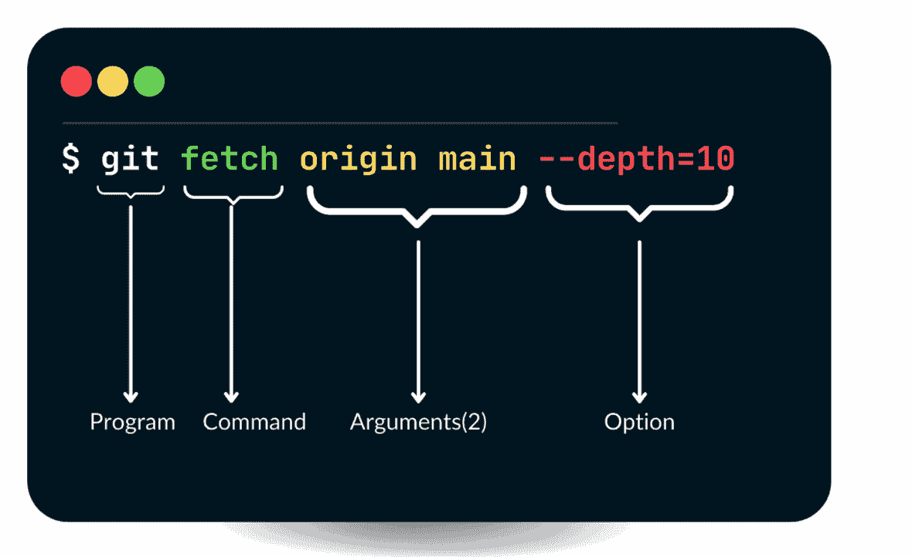
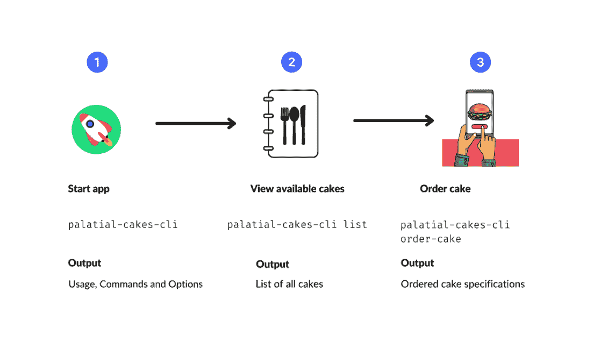
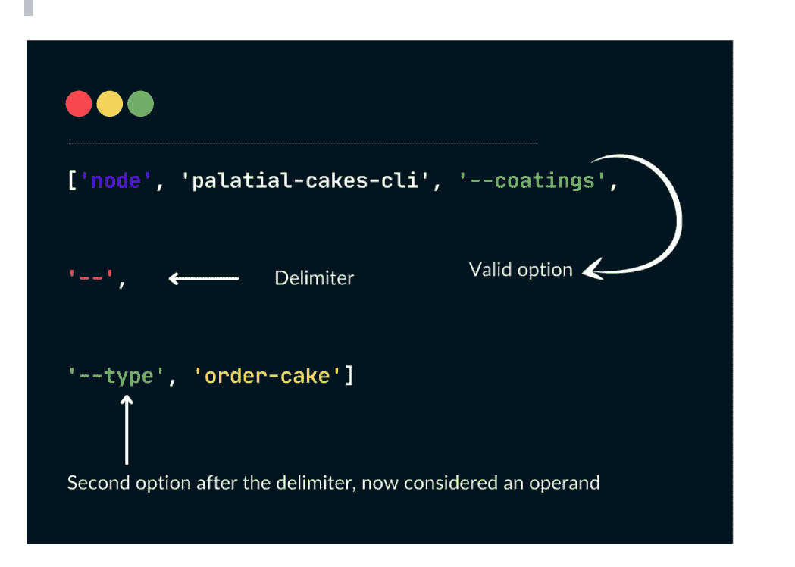
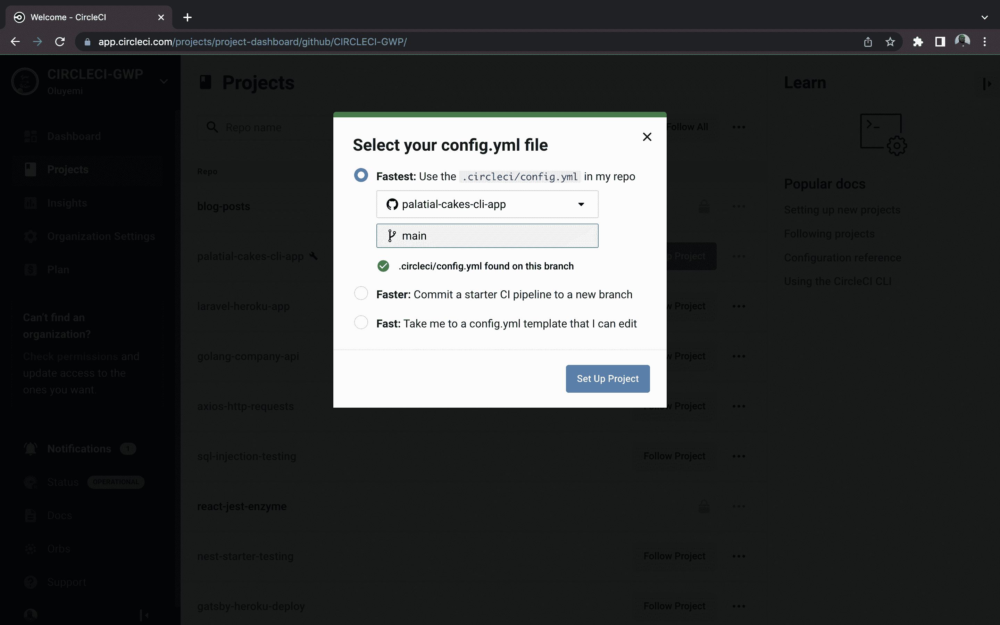
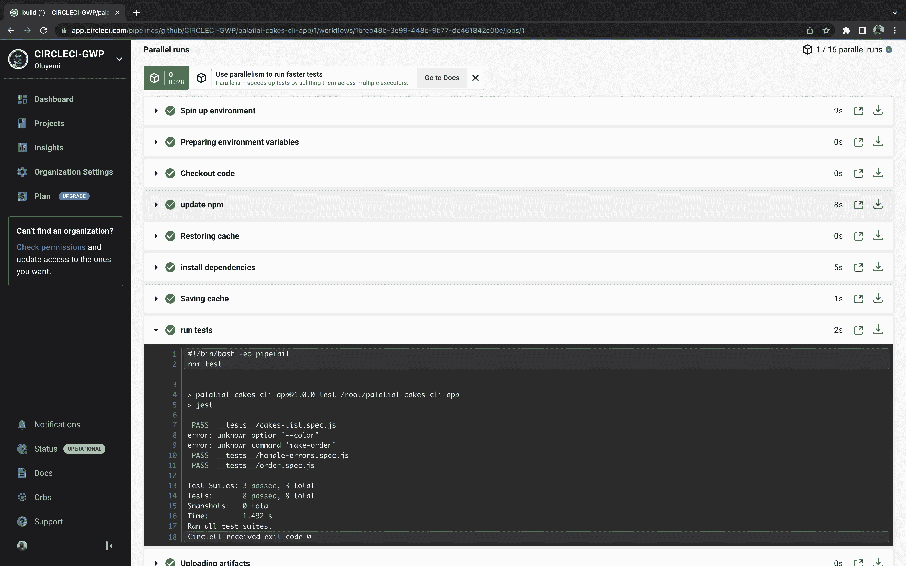

# 测试 Commander.js 命令行应用程序

> 原文：<https://circleci.com/blog/testing-command-line-applications/>

> 本教程涵盖:
> 
> 1.  CLI 应用程序如何工作
> 2.  为 CLI 应用程序编写测试
> 3.  使用 CircleCI 自动化命令行应用程序测试

生产中的突破性变化是不方便的，而且修复起来可能会很昂贵。使用类似于`git clone < some GitHub repository >`的命令，在您的终端上执行是一种常见的做法，称为使用命令行。这种做法比使用 GUI 更快更有效。在本教程中，我将带您了解测试命令行应用程序`git`的过程，解释您为什么需要命令行应用程序，并详细描述它们是如何工作的。

## 先决条件

完成本教程需要以下项目:

> 我们的教程是平台无关的，但是使用 CircleCI 作为例子。如果你没有 CircleCI 账号，请在 注册一个免费的 [**。**](https://circleci.com/signup/)

## 设置应用程序

为了帮助你完成本教程，我创建了一个 Github 库供你克隆。您需要通过在终端中运行以下命令来安装项目的依赖项:

```
git clone https://github.com/CIRCLECI-GWP/palatial-cakes-cli-app.git

cd palatial-cakes-cli-app

npm install 
```

## 为什么要使用 CLI 应用程序？

复杂的图形用户界面(GUI)带来的技术进步是惊人的，但我们不能否认命令行应用程序(CLI)引发了软件革命。

那么，到底什么是`CLI`应用呢？命令行界面(CLI)应用程序是一种程序，它允许通过计算机终端输入文本命令，然后主机将这些命令解释为正在执行的程序。

让我们看看为什么在某些情况下 CLI 应用程序比 GUI 应用程序更好。

1.  了解 CLI 命令及其工具可以提高开发人员的工作效率。使用命令行实现自动化(重复任务)比使用 GUI 更快更有效。
2.  与 GUI 应用程序相比，CLI 应用程序需要更少的内存和机器处理能力。
3.  由于其基于文本的界面，CLI 应用程序可以在低分辨率显示器上完美运行，并受到大量操作系统的支持。

## CLI 应用程序如何工作的描述

使用 CLI 应用程序需要在主机终端输入并执行文本命令。一些 CLI 应用程序允许用户从提供的默认`options`中进行选择，而其他应用程序除了提供的选项之外还需要手动文本输入。

让我们来看看执行`fetch`命令时,`git`命令行应用程序的命令行接口结构和语法示例。



在这种情况下，`Program`关键字是实际程序的名称，通常是一个名词。`command`(一个动词)描述了程序做什么或者我们指示程序做什么。`Arguments`允许 CLI 接受正在处理的值。修改命令行为的一种有记录的参数类型被称为`option`。这些字符以连字符为前缀输入。

## 概述我们的示例 CLI 应用程序如何工作

在本教程中，我创建了一个实践 CLI，它将帮助您学习如何测试命令行应用程序。CLI 应用程序允许您订购蛋糕，并创建所有可订购蛋糕的列表。

运行我们的 CLI 应用程序有两个不同的命令:一个用于订购蛋糕，另一个用于获取可以订购的蛋糕列表。

### 订购蛋糕

要运行命令行蛋糕订单:

```
npm run order-cake 
```

### 列出所有蛋糕

要获取所有可用蛋糕的列表，请运行以下命令:

```
npm run list-cakes 
```

下面是使用 CLI 订购和列出蛋糕的两种不同工作流的图示。



## 为我们的 CLI 应用程序编写测试

既然您已经看到了我们的 CLI 应用程序是如何工作的，那么最好仔细检查添加更多的更改不会破坏代码。测试还有助于您深入了解潜在的易出错区域。为此，您将向现有的 cake 应用程序逻辑添加测试。然后您将使用 [Jest](https://jestjs.io/) 来测试您的应用程序。

## 理解蛋糕订购逻辑

处理蛋糕订单的逻辑是这样实现的:

```
/** lib/order.js **/
const inQuirerOder = async () => {
  const answers = await inquirer.prompt(orderDetailsQuestions);
  return Object.keys(answers).map(
    (key, index) => `\n${index + 1}:${key} => ${answers[key]}`
  );
}; 
```

使用`Inquirer.js`的`prompt()`方法，您为用户提供一个选项列表。对于每个问题，您使用其答案检索用户选择的答案。

根据 [Inquirer.js](https://www.npmjs.com/package/inquirer) 的文档，prompt 方法接受一个包含问题对象和另一个参数的数组:answers，一个包含以前回答的问题的值的对象。默认情况下，answers 对象为空:

```
inquirer.prompt(questions, answers) -> promise 
```

为了测试这个逻辑，我们将提供问题和预期的答案，而不仅仅是提供问题，这将通过 CLI 提示输入。这导致询问者避免提示回答。

因为这个方法返回一个承诺，所以我们可以使用`[async-await](https://developer.mozilla.org/en-US/docs/Web/JavaScript/Reference/Statements/async_function)`模式来获取响应对象。

接下来，您将测试订购各种蛋糕，因此将相关的测试分组到一个测试套件中是一个很好的实践。下面提供了使用`describe()`方法对几个相关测试进行分组的语法，以及三个测试块，为您的蛋糕提供不同类型的测试。

```
/** Order.spec.js **/

describe('Order different types of cakes', () => {
 test('order cake: type A', async () => {
   ...
 });
 test('order cake: type B', async () => {
   ...
 });

 test('order cake: type C', async () => {
   ...
 });
}); 
```

### 断言入门

从文件顶部的`order.js`文件和`inquirer`模块导入所有内容。

```
/** __tests__/order.spec.js **/

const order = require("../lib/order");
const inquirer = require("inquirer"); 
```

现在您已经拥有了所需的模块，您可以在第一个测试块中快速创建一个 cake 对象；这将是我们的答案。您将从导入的订单文件中得到您的问题。

```
/** __tests__/order.spec.js **/
cakeA = {
  Coating: "Butter",
  type: "Strawberry",
  "Cake Size": "Medium",
  Toppings: "Fruit",
}; 
```

第一个 cake 对象包含`key-value`对，这些键来自原始的 question 对象。其他两个测试块之间的唯一区别是 cake 对象和对象名称的值。

如前所述，我们将为询问者提示方法提供各种问题和答案:

```
const order_cli = await inquirer.prompt(order.orderDetailsQuestions, cakeA); 
```

返回的承诺是一个对象，包含用户在使用 CLI 时可能已经选择的答案。因此，我们可以断言这些被嘲笑的反应。

```
expect(order_cli).toMatchObject(cakeA); 
```

如果你想回顾整个`order.spec.js`测试文件，你可以在这里找到它[。](https://github.com/mwaz/palatial-cakes-cli-app/blob/main/__tests__/order.spec.js)

就像这样，您现在能够测试蛋糕订单命令的各种输入和输出。

## 列出蛋糕

测试处理蛋糕渲染的逻辑将会很简单。您将提供一个蛋糕列表，然后根据您的 CLI 呈现的蛋糕列表断言它。

全面实施:

```
/** __tests__/cakes-list.spec.js **/
const renderCakes = require("../lib/cakes-list");

const results = [
  "\n1 => Strawberry",
  "\n2 => Vanilla",
  "\n3 => Mint",
  "\n4 => White Chocolate",
  "\n5 => Black Forest",
  "\n6 => Red Velvet",
  "\n7 => Fruit Cake",
];

test("renders cakes list", () => {
  expect(renderCakes()).toEqual(results);
}); 
```

这个代码片段导入了`cakes-list`模块，然后使用`renderCakes`方法断言蛋糕列表与之前在命令行应用程序中声明的列表相同。

## 设置错误处理

您可能希望确保在您的 CLI 应用程序中检测和处理错误，以便在错误发生时修复错误。您将在这里编写的测试将涵盖`unknown options`、`commands`，以及`undefined`选项的使用。在这个测试中，您将不会测试输出，而是测试是否检测到错误。

### 检查分隔符后选项的检测

您可以从发现当参数包含未定义的选项时会发生什么开始。在`–`之后提供了可能的选项。

在声明程序变量之前，您需要使它可用:

```
const { Command } = require("commander"); 
```

`Commander.js`建议创建一个本地命令对象以在测试时使用。稍后，您将在每个测试块中这样做，就像这样:

```
const program = new Command(); 
```

考虑下面的测试片段:

```
/** handle-errors.spec.js **/
test("when arguments includes -- then stop processing options", () => {
  const program = new Command();
  program
    .option("-c, --coatings [value]", "cake coatings to apply")
    .option("-t, --type <cake-type>", "specify the type of cake");
  program.parse([
    "node",
    "palatial-cakes-cli",
    "--coatings",
    "--",
    "--type",
    "order-cake",
  ]);
  const opts = program.opts();
  expect(opts.coatings).toBe(true);
  expect(opts.type).toBeUndefined();
  expect(program.args).toEqual(["--type", "order-cake"]);
}); 
```

第一个`—`非选项参数应该被接受为指示选项结束的分隔符。即使它们以字符`-`开始，任何后续的参数都应该被视为操作数。

因为`—-coatings`选项出现在`--`之前，所以它被视为有效选项，您可以执行断言来查看这是否正确。接下来的`-–type`应该被视为一个`undefined`选项。



`program.parse(arguments)`将处理参数，程序没有接受的任何选项都将留在`program.args`数组中。因为`–type`选项被忽略了，所以可以断定它属于`program.args`数组。

### 检查未知选项的检测

```
/** handle-errors.spec.js **/
test("unknown option, then handle error", () => {
  const program = new Command();
  program
    .exitOverride()
    .command("order-cake")
    .action(() => {});
  let caughtErr;
  try {
    program.parse(["node", "palatial-cakes-cli", "order-cake", "--color"]);
  } catch (err) {
    caughtErr = err;
  }
  expect(caughtErr.code).toBe("commander.unknownOption");
}); 
```

上面的测试块没有什么异常。它只是将一个未知选项`–-color`传递给`program.parse()`方法，并检查它是否被检测为错误。你可以确认这个错误是`commander.unknownOption`的一个实例，正如预期的那样。

然后，通过将错误整齐地记录到终端来处理错误。如果您在`handle-errors.spec.js`文件中运行上面的代码块`npm test`，您应该得到一个通过测试的错误消息:`error: unknown option '--color'`。

### 检查未知命令的检测

就像您测试一个未知选项一样，您可以检测一个未知命令，然后在终端上整齐地记录一条错误消息。

下面是测试片段的实现:

```
/** handle-errors.spec.js **/
test("unknown command, then handle error", () => {
  const program = new Command();
  program
    .exitOverride()
    .command("order-cake")
    .action(() => {});
  let caughtErr;
  try {
    program.parse(["node", "palatial-cakes-cli", "make-order"]);
  } catch (err) {
    caughtErr = err;
  }
  expect(caughtErr.code).toBe("commander.unknownCommand");
}); 
```

这提供了`program.parse()`方法中预期参数的列表，但是带有一个未知的 CLI 命令`make-order`。您可以预期抛出的错误是`commander.unknownCommand`的一个实例，因此您可以针对该错误断言它。在 CI 环境中设置测试之前，运行您的测试应该验证它们都在本地通过。

在下一节中，您将把您的 GitHub 帐户连接到 CircleCI。然后，您将把您编写的所有测试推送到您的 Github 帐户，以便您可以配置它们在 CI 环境中运行。

## 配置 CircleCI

要配置 CircleCI，创建一个名为`.circleci`的目录并添加一个名为`config.yml`的文件。在`.circleci/config.yml`文件中，添加以下配置:

```
# .circleci/config.yml
version: 2.1
jobs:
  build:
    working_directory: ~/palatial-cakes-cli-app
    docker:
      - image: cimg/node:10.16.3
    steps:
      - checkout
      - run:
          name: update npm
          command: "npm install -g npm@5"
      - restore_cache:
          key: dependency-cache-{{ checksum "package-lock.json" }}
      - run:
          name: install dependencies
          command: npm install
      - save_cache:
          key: dependency-cache-{{ checksum "package-lock.json" }}
          paths:
            - ./node_modules
      - run:
          name: run tests
          command: npm test
      - store_artifacts:
          path: ~/palatial-cakes-cli-app/__tests__ 
```

现在您可以提交并[将您的更改推](https://docs.github.com/en/get-started/using-git/pushing-commits-to-a-remote-repository)到存储库中。然后在 [CircleCI 仪表盘](https://app.circleci.com/dashboard)上设置你的项目。

在 CircleCI 仪表板上，转到项目。将列出与您的 GitHub 用户名或组织相关的所有 GitHub 存储库。本教程的存储库是`palatial-cakes-cli-app`。在“项目”面板上，选择设置项目的选项。使用分支`main`中现有配置的选项。



瞧啊。在检查 CircleCI 仪表板并展开构建细节时，您可以验证您已经成功运行了 CLI 应用程序测试并将其集成到 CircleCI 中。



现在，任何时候你对你的应用程序进行更改，CircleCI 都会自动运行你的测试，并验证所做的更改是否会破坏你的应用程序。

## 结论

在本教程中，您了解了 CLI 应用程序及其工作原理。您设置了一个简单的 CLI 应用程序，了解了它的工作原理，并为它编写了测试。然后，您配置 CircleCI 来运行您的测试，并验证这些测试是否成功。

虽然已经创建并配置了示例应用程序，但是浏览这些文件可能是值得的。这可以帮助您更好地理解当 CLI 应用程序由`commander.js`运行时会发生什么。

一如既往，我很高兴为您创建本教程，我希望您会发现它很有价值。直到下一个，继续学习，继续建设！

* * *

Waweru Mwaura 是一名软件工程师，也是一名专门研究质量工程的终身学习者。他是 Packt 的作者，喜欢阅读工程、金融和技术方面的书籍。你可以在[他的网页简介](https://waweruh.github.io/)上了解更多关于他的信息。

[阅读更多 Waweru Mwaura 的帖子](/blog/author/waweru-mwaura/)