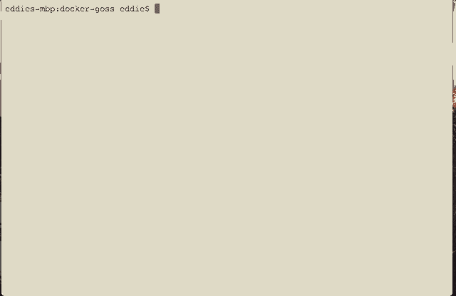
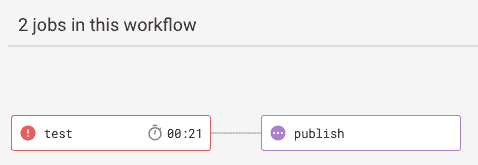

# 坞站图片-gos |圆形

> 原文：<https://circleci.com/blog/testing-docker-images-with-circleci-and-goss/>

测试是任何 CI/CD 管道的关键部分。大多数团队在应用程序级测试方面做得很好，并且有大量的框架(JUnit、RSpec 等。)来支持。但是服务器级测试——服务器配置和服务的验证——经常被忽略。在这篇博文中，我们将探索一种方法来使用 Goss 对我们的自定义 [Docker 图像](https://circleci.com/docs/custom-images/)执行测试，作为 CircleCI 管道的一部分。

首先， [Goss](https://github.com/aelsabbahy/goss) 是什么？

> Goss 是一个位于 YAML 的 serverspec 替代工具，用于验证服务器的配置。

在这篇文章中，我们将只涉及几种类型的测试，所以值得探索一下 [Goss 手册](https://github.com/aelsabbahy/goss/blob/master/docs/manual.md)来学习所有可用的操作。该项目还包括`dgoss`，它是一个面向`goss`的 Docker 包装器。它包括两个基本操作:`edit`和`run`。

## 先决条件

为了在本地运行测试，您需要根据您的操作系统使用适当的步骤安装 dgoss 。

您还需要一个正在开发的 Docker 图像。在这篇文章的剩余部分，我将引用我的[示例项目](https://github.com/eddiewebb/circleci-docker-goss)，你应该分叉并跟随它！

## 创建测试

正如 [Goss 手册](https://github.com/aelsabbahy/goss/blob/master/docs/manual.md)所建议的，最简单的开始方式是通过使用`goss add <TYPE> <ARGUMENTS>`在你想要测试的服务器/容器内部运行。因为我们在容器的侧面运行，所以我们需要首先构建它。

```
docker build . -t my-image:test 
```

然后使用上面的标记名，我们可以通过 dgoss 运行安装了 Goss 的容器。`dgoss edit`支持启动图像所需的任何 Docker 参数。在我的示例项目中，这包括一个修改的入口点。

```
dgoss edit --entrypoint=/test/gossEntrypoint.sh my-image:test 
```

您可以运行`test/editTests.sh`来作为重复这些命令的快捷方式。

一旦进入正在运行的 Docker 映像，您就可以探索不同的测试，Goss 命令会自动将这些测试附加到 goss.yaml 文件中。退出后，该文件将被复制到您的本地工作站。

### 验证文件是否存在

我们的第一个测试非常简单:确保我们的 entrypoint.sh 文件在文件系统中。

```
/goss # goss add file /entrypoint.sh 
```


您可以看到输出指定了位置、类型、所有者和其他关键属性。您现在可以`cat goss.yml`看到初始的测试结构，但是一个健康的映像不仅仅包括文件的存在，所以让我们再添加一些测试。

### 验证命令输出

我们的 Docker 映像非常简单，entrypoint 只是根据安装在我们的生产环境中的配置文件运行一些简单的逻辑。我们希望确保它按照预期处理这个配置文件。

对于我们的第一个测试，我们希望确保如果没有找到文件，脚本退出时显示一个读取警告。由于这是默认状态，我们可以运行以下命令:

```
goss add command "/entrypoint.sh /config.txt /schedule.txt" 
```

引用参数很重要，否则 Goss 会将它们视为单独的命令。


您可以看到 Goss 期望退出状态为 1，这是一条打印到 stderr 的消息。

我们还有一些更复杂的测试，因为它们修改文件来模拟生产中可能出现的某些条件。对于这些测试，我发现将逻辑封装到它们自己的脚本中，并在文件名中指明明确的意图，更具可读性和可维护性。一个例子可见于 [`testNonEmptyScheduleModifiesScalerConfig.sh`](https://github.com/eddiewebb/circleci-docker-goss/blob/master/test/testNonEmptyScheduleModifiesScalerConfig.sh) 。该测试将确保非空调度修改我们的配置。

该目录中的每个测试都设置一些预期的状态，然后像我们上面做的那样调用`/entrypoint.sh /config.txt /schedule.txt`。

### 模式匹配

有时候输出会有动态内容，幸运的是 Goss 支持一些基本的模式匹配。例如，上面的测试在测试中使用了当前的日期和时间，并将在输出中打印出来。因为这将根据我们执行测试的时间来改变输出，所以我们使用一个正则表达式来处理这个问题。

```
/test/testNonEmptyScheduleModifiesScalerConfig.sh:
  exit-status: 0
  stdout:
  - /Matching rule - Day:\s[1-7], Hour:\s[1-2]?[0-9], Type :\sdocker, Count:\s5/
  - Updated docker preallocation count to 5
  - /Matching rule - Day:\s[1-7], Hour:\s[1-2]?[0-9], Type :\smachine, Count:\s5/
  - Updated machine preallocation count to 5
  - schedule updated
  stderr: []
  timeout: 10000 
```

**注意:**需要使用`\s`，这样 yaml 就不会将冒号解析为 yaml key: value。

### 最终规范(goss.yaml)

当您在运行完所有的`goss add`步骤后键入`exit`时，您将看到 Goss 在停止实例之前将生成的 goss.yaml 复制回您的本地机器。

```
/goss # exit
INFO: Copied '/goss/goss.yaml' from container to 'test'
INFO: Deleting container 
```

该文件是我们已经看到的各个输出的集合，按照它们的类型分组。

```
file:
  /entrypoint.sh:
    exists: true
    mode: "0755"
    size: 1530
    owner: root
    group: root
    filetype: file
    contains: []
  /schedule.sh:
    exists: false
    contains: []
command:
  /test/testEmptyScheduleIgnored.sh:
    exit-status: 1
    stdout: []
    stderr: []
    timeout: 10000
  /test/testNonEmptyScheduleModifiesScalerConfig.sh:
    exit-status: 0
    stdout:
    - /Matching rule - Day:\s[1-7], Hour:\s[1-2]?[0-9], Type :\sdocker, Count:\s5/
    - Updated docker preallocation count to 5
    - /Matching rule - Day:\s[1-7], Hour:\s[1-2]?[0-9], Type :\smachine, Count:\s5/
    - Updated machine preallocation count to 5
    - schedule updated
    stderr: []
    timeout: 10000
  /test/testNonExistentScheduleIgnored.sh:
    exit-status: 1
    stdout: []
    stderr:
    - 'cat: can''t open ''/schedule.txt'': No such file or directory'
    timeout: 10000 
```

## 运行我们的测试

现在我们应该有了一个工作的 Docker 映像(我们希望如此)和一些在 goss.yaml 中定义的测试，我们想对一个新的映像执行我们的测试。dgoss 希望当前目录中有一个名为 goss.yaml 的文件。因为我把我们的放在了`test`文件夹中，所以我们需要包含`GOSS_FILES_PATH`参数。

```
docker build . -t my-image:test
GOSS_FILES_PATH=test dgoss run --entrypoint=/test/gossEntrypoint.sh my-image:test
# OR provided wrapper for this tutorial
test/runTests.sh 
```

上面的命令将构建一个新的 Docker 映像，mount Goss 和 goss.yaml，并执行我们的测试。


这个输出不是很令人兴奋，但是通过测试应该是这样的。所以，让我们打破一些东西！

```
#!/bin/bash
#
# Any changes are written to the SCALING_FILE
#
set -euo pipefail

#this won't work..
CMD=`./nonexistentScript.sh`

SCALING_FILE=$1
SCHEDULE_FILE=$2 
```

当你执行`test/runTest.sh`时会发生什么？Goss 将打印预期的而不是实际的输出，并包括一个错误摘要。它还以非零状态存在，这对我们的下一步很重要:与我们的[持续集成](https://circleci.com/continuous-integration/)管道集成！

## 在每次提交时运行我们的测试

我们在本地运行测试很好，但这里的想法是将 Docker 级别的测试集成到我们的 CI/CD 管道中，这样我们就不会发布糟糕的映像。




CircleCI 不提供预装 Goss 的映像，但安装它只需要一秒钟。您可以查看 [sample config.yml](https://github.com/eddiewebb/circleci-docker-goss/blob/master/.circleci/config.yml) 了解完整设置。我在这里只包括相关的片段。

```
jobs:
  test:
    docker:
      - image: circleci/python:2-jessie
    steps:
      - checkout

      - setup_remote_docker:   # (2)
          docker_layer_caching: true # (3)
      - run:
          name: Install goss
          command: |
            # rather than give internet scripts SU rights, we install to local user bin and add to path
            mkdir ~/bin
            export GOSS_DST=~/bin
            export PATH=$PATH:~/bin
            curl -fsSL https://goss.rocks/install | sh
            goss -version
      - run:
          name: Test
          command: |
            # Don't forget path!
            export PATH=$PATH:~/bin
            # Important, change from mount to work on remote docker, see https://github.com/aelsabbahy/goss/pull/271
            # If using machine image you do not need this.
            export GOSS_FILES_STRATEGY=cp
            test/runTests.sh junit
      - store_test_results:
          path: goss 
```

### 试验结果

**注意:**对于 CI 执行，我们将参数`junit`传递给我们的测试运行程序。这会将输出格式转换成~/goss/report.xml，并包含在 CircleCI 的测试摘要中:


## 摘要

就这样吧！随着这个基本结构的运行，您可以添加更成熟的测试，并将基于 Goss 的映像测试作为核心步骤包含在您的 CI/CD 管道中，以保持您团队的代码库从服务到服务器都得到测试。

一定要把那个快乐的绿色状态徽章加到你的回购上，让全世界都知道！


航运愉快！