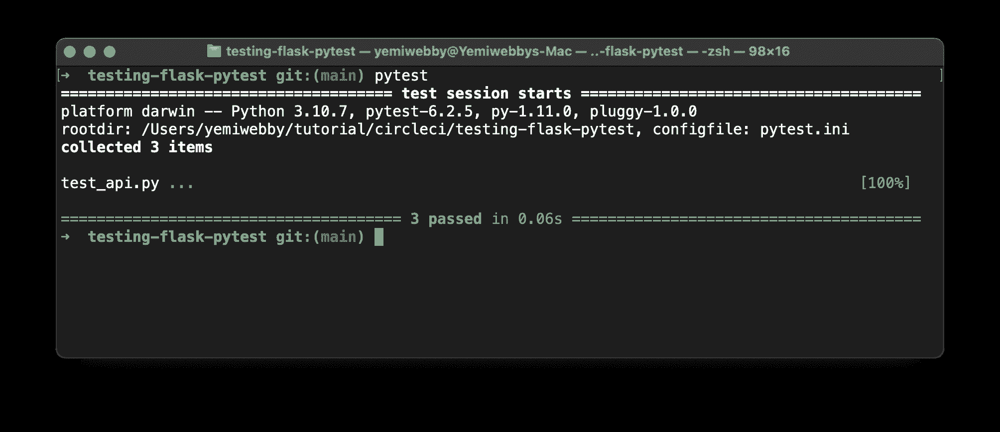
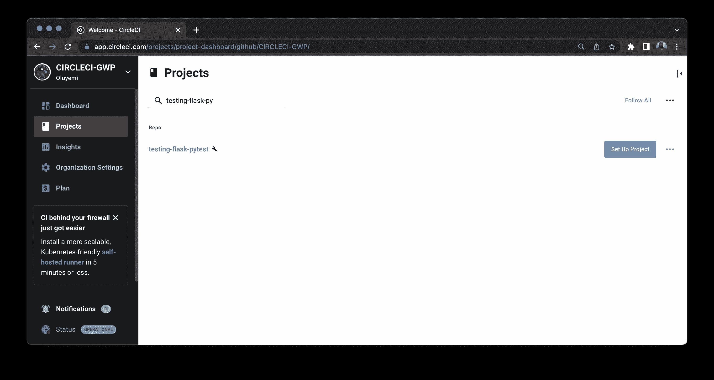
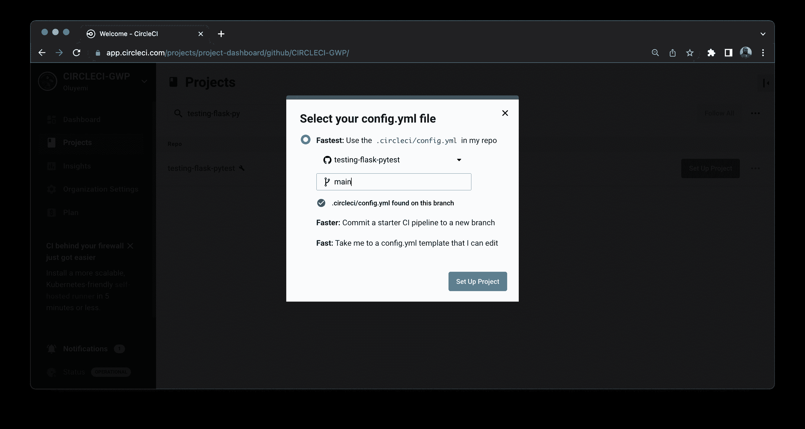
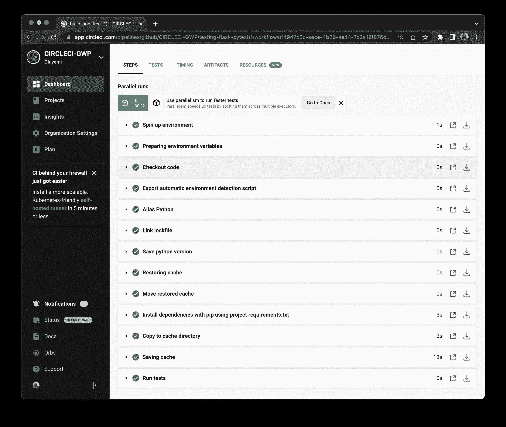
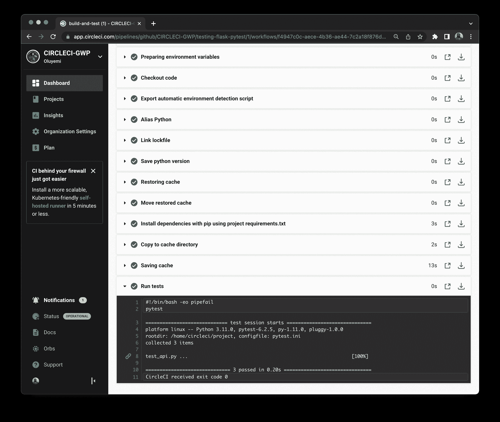

# 使用 Pytest | CircleCI 测试烧瓶框架

> 原文：<https://circleci.com/blog/testing-flask-framework-with-pytest/>

> 本教程涵盖:
> 
> 1.  在 Flask 应用程序上设置 Pytest
> 2.  编写 Pytest 测试
> 3.  分组测试

用任何编程语言编写测试都可能很困难，但也不尽然。在本教程中，我将向您展示如何使用 Flask 和 Pytest 轻松编写和运行测试。

作为奖励，我们还将集成一个 CI/CD 管道，使用 CircleCI 在 Flask 应用程序上运行测试。

请务必查看我们的其他 Flask 教程，了解[应用程序日志](https://circleci.com/blog/application-logging-with-flask/)、[认证装饰者](https://circleci.com/blog/authentication-decorators-flask/)和[自动化 Flask 部署](https://circleci.com/blog/automating-flask-deployments-with-pythonanywhere/)。

## 先决条件

为了从本教程中获得最大收益，您需要:

*   对 [Python](https://www.python.org/) 编程语言的基本理解
*   了解[烧瓶](https://flask.palletsprojects.com/en/2.0.x/%7B:%20target=%22_blank%22%20rel=%22noreferrer%20noopener%22%7D)框架
*   对测试的基本理解

您还需要进行以下安装和设置:

1.  您的计算机中安装的 Python 版本> = 3.5
2.  GitHub 账户；您可以在处创建一个
3.  CircleCI 账户；您可以在处创建一个
4.  来自 GitHub 的项目资源库；在这里克隆它

> 我们的教程是平台无关的，但是使用 CircleCI 作为例子。如果你没有 CircleCI 账号，请在 注册一个免费的 [**。**](https://circleci.com/signup/)

一旦项目被克隆，转到项目的根文件夹。使用命令`pip install -r requirements.txt`安装依赖项。

## 为什么要用烧瓶？

[Flask](https://flask.palletsprojects.com/en/2.0.x/) 是一个用 Python 编写的轻量级微 web 框架。Flask 预装了核心特性，因此您可以根据项目的需求进行定制。Flask 并不决定使用哪个数据库或者默认的解析器是什么。所有这些都可以通过修改来改变，这使得它对于开发团队的新需求来说是可扩展的和灵活的。

在这个项目教程中，我们将使用一个用 Flask 构建的简单的`book-retrieval` API。我们将使用 API 来展示如何在 Flask 应用程序中编写测试。为了保持本教程的简单，我们将把重点放在测试 API 上，而不是构建它。API 应用程序可以在克隆存储库的项目根目录下的`api.py`文件中找到。

现在你知道了 Flask 是什么以及如何使用它，你可以通过学习`Pytest`以及如何在 Flask 应用上设置它来建立这些知识。

## 什么是 Pytest，我如何使用它？

Pytest 是一个 Python 测试框架，旨在帮助开发人员编写更好的系统并满怀信心地发布它们。用 Pytest 编写小型的、可伸缩的测试很简单。该代码片段显示了 Pytest 测试的基本布局:

```
from api import app # Flask instance of the API

def test_index_route():
    response = app.test_client().get('/')

    assert response.status_code == 200
    assert response.data.decode('utf-8') == 'Testing, Flask!' 
```

测试 Flask 要求我们首先从我们的`api`(在我们的应用程序中创建)导入一个 Flask 实例`app`，如前面的代码片段所示。然后，导入的实例从 Flask 公开一个`test_client()`方法，该方法包含向被测应用程序发出`HTTP`请求所需的特性。在本例中，它指向我们默认的(`/` ) API 端点。然后，我们断言`test_client()`收到的响应是在解码字节对象后预期的。在下面的步骤中，您将使用这种格式来编写您的测试。

**注意:** *默认情况下，Pytest 使用`utf-8`编解码器对 API 响应进行编码。您需要使用`decode()`方法将从测试客户端接收的`byte`对象转换成可读的字符串响应，如前面的代码片段所示。*

## 在烧瓶上设置 Pytest

安装 Pytest 很简单。如果您克隆了存储库，那么它已经安装好了，您可以跳过这一步。如果尚未克隆存储库，请在终端上运行以下命令:

```
pip install pytest 
```

**注意:** *如果你使用的是[虚拟环境](https://docs.python.org/3/library/venv.html)，[在安装前激活](https://packaging.python.org/en/latest/guides/installing-using-pip-and-virtual-environments/)。最佳实践是使用虚拟环境来隔离不同的应用程序及其相关的 Python 包。*

### 导入 Pytest 模块

安装完成后，导入 Pytest 模块。这个片段可以放在任何测试文件上:

```
import pytest 
```

### 测试的命名约定

对于本教程，将您的测试保存在应用程序根文件夹的`tests`目录中。Pytest 建议测试文件名以格式`test_*.py`开始，或者以格式`**_test.py`结束，使用这些格式可以使 Pytest 很容易地自动发现测试文件，并且在运行测试时最大限度地减少混淆。当创建测试:`test_index_route():`时，在`test methods`前加上`test`一词。

## 用 Pytest 编写测试

现在您已经知道如何在 Flask 应用程序上设置 Pytest，您可以开始为图书检索 API 编写测试了。你的第一个测试将是`/bookapi/books`路线。

```
# get books data

books = [
    {
        "id": 1,
        "title": "CS50",
        "description": "Intro to CS and art of programming!",
        "author": "Havard",
        "borrowed": False
    },
    {
        "id": 2,
        "title": "Python 101",
        "description": "little python code book.",
        "author": "Will",
        "borrowed": False
    }
]

@app.route("/bookapi/books")
def get_books():
    """ function to get all books """
    return jsonify({"Books": books}) 
```

这个路径所做的只是返回一个硬编码到`books`变量中的图书列表。您将在下一步中测试这个端点。使用相同的格式，定义您的测试函数，并断言`test_client()`收到的响应是您所期望的。

```
import json
from api import app

def test_get_all_books():
    response = app.test_client().get('/bookapi/books')
    res = json.loads(response.data.decode('utf-8')).get("Books")
    assert type(res[0]) is dict
    assert type(res[1]) is dict
    assert res[0]['author'] == 'Havard'
    assert res[1]['author'] == 'Will'
    assert response.status_code == 200
    assert type(res) is list
    .... 
```

这个测试片段确保您能够接收一个图书列表。通过断言`test_client()`收到的响应确实是您期望的图书列表，您可以做到这一点。您还断言响应包含一个`dictionaries`的`list`，它是定义的 book 对象中的单本书。您还断言列表中的第一本书有作者`Havard`，第二本书有作者`Will`。这就是编写一个从`/bookapi/books`端点获取所有书籍的测试所需的全部内容。

## 使用 Pytest 运行测试

要运行 Pytest 测试，您可以在终端中使用`py.test`或`pytest`。您也可以通过在 Pytest 命令后明确指定文件名来运行单个文件:`pytest test_api.py`。当执行这些命令时，Pytest 会在根目录或指定的单个文件中查找所有的测试。

当没有显式定义测试文件时，Pytest 在根目录中执行任何遵循标准命名模式的测试，而不需要指定文件名或目录。



您已经验证测试已成功执行！Pytest 用绿点`.`标记通过的测试；它用红色的`F`标记测试失败。计算点或 f 的数量，以确定有多少测试通过和失败，以及执行的顺序。

**注意:** *如果您正在调试控制台的测试，并且您需要打印出一个响应，您可以使用`$ pytest -s test_*.py`来登录到 stdout。当 Pytest `s`选项被定义时，您可以在测试中控制消息，并在测试执行期间调试输出。*

既然您已经成功地执行了您的第一个测试，那么当您推进到`main`分支时，您可以集成 CircleCI 来自动运行测试。

## 设置 CircleCI

在根目录下创建一个`.circleci`目录，然后在那里添加一个`config.yml`文件。配置文件包含每个项目的 CircleCI 配置。使用 CircleCI Python `orb`执行测试，如下所示:

```
version: 2.1
orbs:
  python: circleci/python@2.1.1
jobs:
  build-and-test:
    docker:
      - image: cimg/python:3.11.0
    steps:
      - checkout
      - python/install-packages:
          pkg-manager: pip
      - run:
          name: Run tests
          command: pytest
workflows:
  sample:
    jobs:
      - build-and-test 
```

CircleCI orbs 是 YAML 代码的可重用包。Orbs 将多行代码压缩成一行。在这个例子中，这一行代码是:`python: circleci/python@2.1.1`。您可能需要启用组织设置以允许在 CircleCI 仪表板中使用第三方 orb，或者向您组织的 CircleCI 管理员请求权限。

设置好配置后，提交您的更改，然后[将您的更改](https://circleci.com/blog/pushing-a-project-to-github/)推送到 GitHub。

登录 CircleCI 并转到项目仪表板。从与您的用户名或组织相关联的 GitHub 存储库列表中，找到您想要在 CircleCI 中设置的特定存储库。这种情况下是`testing-flask-with-pytest`。



接下来，点击**设置项目**开始在 CircleCI 上构建项目。这将显示一个模式弹出窗口，其中有一个默认选项，可以使用项目存储库中的配置文件。输入存放配置文件的分支的名称。



点击**设置项目**完成该过程。

瞧啊。在 CircleCI 仪表板中，单击构建以查看详细信息。您可以验证运行第一个 Pytest 测试并将其集成到 CircleCI 中是成功的。



既然您已经成功地设置了持续集成，下一步就是对测试进行分组，并运行分组测试的批次。

## 分组和运行测试批次

随着应用程序功能的增加，您需要增加测试的数量，以确保一切正常。很容易被大量可用的测试脚本淹没。不过您不需要担心，Pytest 已经解决了这个问题。Pytest 允许您通过对测试进行分组，从一个文件中运行多个测试。

Pytest 提供了`markers`，您可以使用它来设置测试函数的属性和特性。

### 使用 Pytest 测试标记

我们可以使用标记赋予测试不同的行为，比如跳过测试，运行测试的子集，甚至失败。Pytest 附带的一些默认标记包括`xfail`、`skip`和`parameterize`。对于这个项目，您将创建一个定制标记，它将对所有执行`GET`请求到`/bookapi/books`和`/bookapi/book/:id`端点的测试进行分组。

以下是您将用于创建自定义标记的结构示例:

```
@pytest.mark.<markername>
def test_method():
  # test code 
```

要在 Pytest 中使用自定义标记，请将其定义为`pytest`命令中的一个参数:

```
$ pytest -m <markername> 
```

`-m <markername>`是您将用于测试的自定义标记名称。

您需要在您的测试文件中导入`pytest`来使用 Pytest 标记。还需要注册标记，以便 Pytest 可以抑制关于它们的警告。将此添加到您的`pytest.ini`文件中:

```
[pytest]
markers =
    <markername>: Marker description 
```

### 使用标记对测试进行分组

对于本教程，您想要将向`/bookapi`端点发出`GET`请求的测试分组。

创建一个名为`get_request`的客户标记，并将其添加到测试中:

```
import pytest
...
# Other imports here

@pytest.mark.get_request
def test_get_book_by_id():
    response = app.test_client().get('/bookapi/books/1')
    res = json.loads(response.data.decode('utf-8')).get("Book")
    print(res)
    assert res['id'] == 1
    assert res['author'] == 'Havard'
    assert res['title'] == 'CS50'
    assert response.status_code == 200 
```

用`pytest -m get_request`参数运行测试会执行测试文件中所有用`@pytest.mark.get_request`装饰器标记的测试。您也可以通过在终端中运行它来验证这一点。

现在，将您的更改提交并推送到 GitHub，并检查管道是否成功执行。



太棒了。您的所有测试都已成功执行。

## 结论

在本教程中，您已经使用 Pytest 设置了测试，执行了测试，学习了使用 Pytest 标记对测试进行分组。您学习了如何使用 Pytest 命令行参数来执行测试，以及如何使用`test_client()`方法来发出`HTTP`请求。您知道如何在测试中使用收到的响应。我希望你喜欢这个教程。如果你有，与你的团队分享你所学到的。没有什么比教别人更能巩固学习了。直到下一个，享受你的编码项目！

* * *

Waweru Mwaura 是一名软件工程师，也是一名专门研究质量工程的终身学习者。他是 Packt 的作者，喜欢阅读工程、金融和技术方面的书籍。你可以在[他的网页简介](https://waweruh.github.io/)上了解更多关于他的信息。

[阅读更多 Waweru Mwaura 的帖子](/blog/author/waweru-mwaura/)