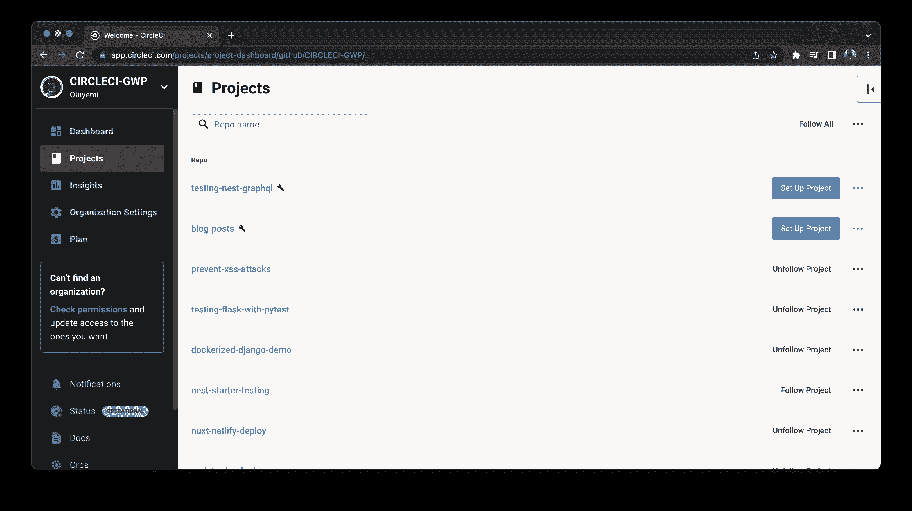
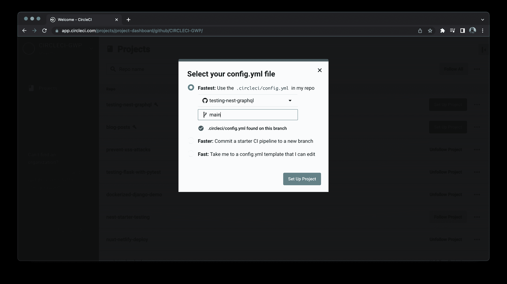
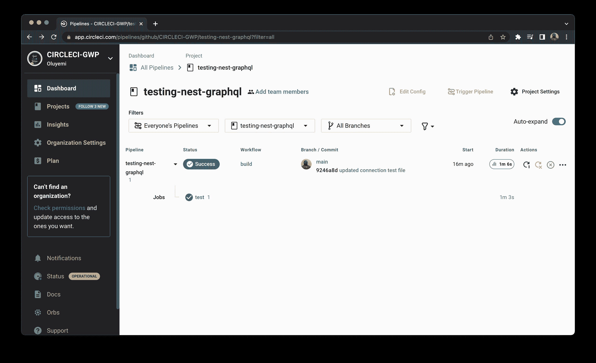
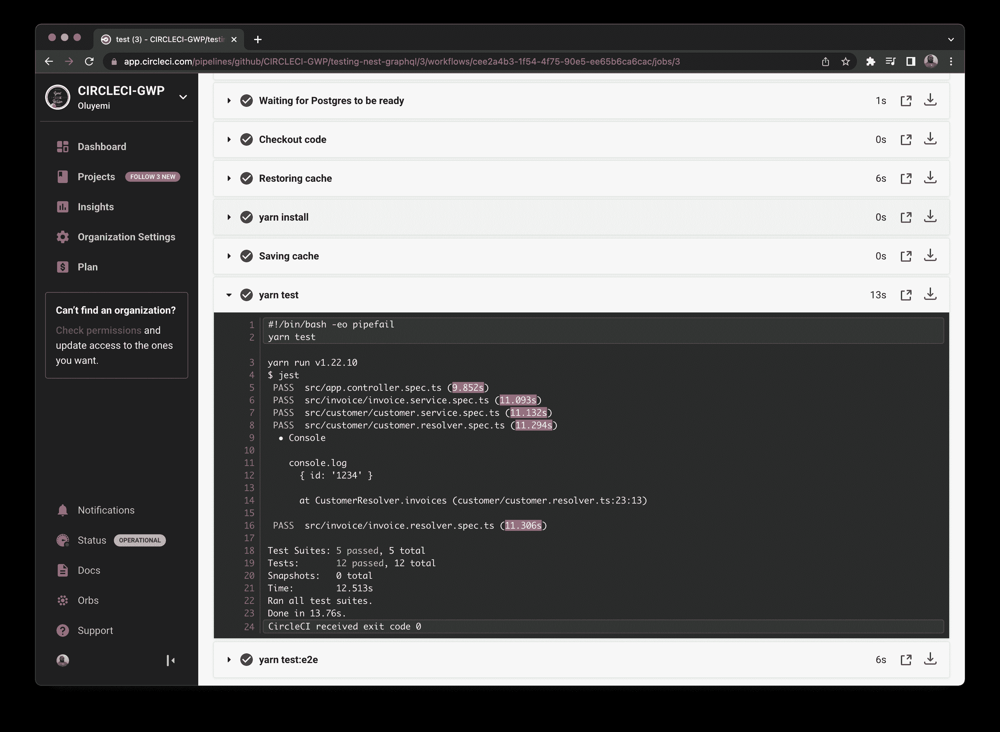

# NestJS GraphQL 项目的持续集成| CircleCI

> 原文：<https://circleci.com/blog/testing-nestjs-graphql/>

> 本教程涵盖:
> 
> 1.  克隆示例项目
> 2.  添加单元和集成测试
> 3.  自动化端到端测试

NestJS 正迅速成为 NodeJS 项目事实上的框架。与旧的框架不同，NestJS 是用 TypeScript 构建的，这在 JavaScript 社区中已经很常见了。采用 TypeScript 的团队似乎更喜欢 NestJS 这样的框架。

NestJS 支持在 REST 和 GraphQL 中构建 API。作为 REST 的替代方案， [GraphQL](https://graphql.org/) 允许您以完整而准确的方式描述数据，为更改客户端命令提供足够的灵活性。它为响应客户端查询返回数据提供了一个运行时。GraphQL 提供了许多有用的开发工具，有助于简化 API 的维护。

本教程的目标是展示如何向 NestJS GraphQL 项目添加单元和集成测试，并使用 CircleCI 自动化测试过程。

## 先决条件

要完成本教程，您需要准备一些东西:

> 我们的教程是平台无关的，但是使用 CircleCI 作为例子。如果你没有 CircleCI 账号，请在 注册一个免费的 [**。**](https://circleci.com/signup/)

## 克隆一个示例项目

本教程使用现有的 NestJS 应用程序。这是一个小的发票应用程序，演示了如何使用 NestJS 构建一个 GraphQL API。

首先，克隆[ [项目](https://github.com/CIRCLECI-GWP/testing-nest-graphql)。它已经包含了一些我将解释的测试。然后，我们将使用 CircleCI 自动化运行测试的过程。该项目有两个模块:客户和发票。每个模块包含一个服务和一个解析器文件。示例测试将集中在客户模块上。

## 单元测试客户服务

客服有三种方式:`create`、`findAll`、`findOne`。我们将为每个方法添加一个测试。`customer.service.spec.ts`文件已经包含了一个测试样板，我们可以用它来测试客户服务。在添加每个测试之前，您需要配置测试模块，为它提供所有必需的依赖项。测试配置被添加到`beforeEach`模块中。以下是客户服务的配置:

```
// src/customer/customer.service.spec.ts

import { Test, TestingModule } from "@nestjs/testing";
import { getRepositoryToken } from "@nestjs/typeorm";
import { Repository } from "typeorm";
import { CustomerModel } from "./customer.model";
import { CustomerService } from "./customer.service";
type MockType<T> = {
  [P in keyof T]?: jest.Mock<{}>;
};
describe("CustomerService", () => {
  let service: CustomerService;
  const customerRepositoryMock: MockType<Repository<CustomerModel>> = {
    save: jest.fn(),
    findOne: jest.fn(),
    find: jest.fn(),
  };
  beforeEach(async () => {
    const module: TestingModule = await Test.createTestingModule({
      providers: [
        CustomerService,
        {
          provide: getRepositoryToken(CustomerModel),
          useValue: customerRepositoryMock,
        },
      ],
    }).compile();
    service = module.get<CustomerService>(CustomerService);
  });
}); 
```

有两个提供者:`CustomerService`和`CustomerRepository`。因为这是一个单元测试，我们对`CustomerRepository`使用了一个模拟值。以下是对每种方法的完整测试:

```
// src/customer/customer.service.spec.ts

import { Test, TestingModule } from "@nestjs/testing";
import { getRepositoryToken } from "@nestjs/typeorm";
import { Repository } from "typeorm";
import { CustomerModel } from "./customer.model";
import { CustomerService } from "./customer.service";
type MockType<T> = {
  [P in keyof T]?: jest.Mock<{}>;
};
describe("CustomerService", () => {
  let service: CustomerService;
  const customerRepositoryMock: MockType<Repository<CustomerModel>> = {
    save: jest.fn(),
    findOne: jest.fn(),
    find: jest.fn(),
  };
  beforeEach(async () => {
    const module: TestingModule = await Test.createTestingModule({
      providers: [
        CustomerService,
        {
          provide: getRepositoryToken(CustomerModel),
          useValue: customerRepositoryMock,
        },
      ],
    }).compile();
    service = module.get<CustomerService>(CustomerService);
  });
  it("should be defined", () => {
    expect(service).toBeDefined();
  });
  describe("create", () => {
    it("should create a new customer", async () => {
      const customerDTO = {
        name: "John Doe",
        email: "john.doe@email.com",
        phone: "3134045867",
        address: "123 Road, Springfied, MO",
      };
      customerRepositoryMock.save.mockReturnValue(customerDTO);
      const newCustomer = await service.create(customerDTO);
      expect(newCustomer).toMatchObject(customerDTO);
      expect(customerRepositoryMock.save).toHaveBeenCalledWith(customerDTO);
    });
  });
  describe("findAll", () => {
    it("should find all customers", async () => {
      const customers = [
        {
          id: "1234",
          name: "John Doe",
          email: "john.doe@email.com",
          phone: "3134045867",
          address: "123 Road, Springfied, MO",
        },

        {
          id: "5678",
          name: "John Ford",
          email: "john.ford@email.com",
          phone: "3134045867",
          address: "456 Road, Springfied, MO",
        },
      ];
      customerRepositoryMock.find.mockReturnValue(customers);
      const foundCustomers = await service.findAll();
      expect(foundCustomers).toContainEqual({
        id: "1234",
        name: "John Doe",
        email: "john.doe@email.com",
        phone: "3134045867",
        address: "123 Road, Springfied, MO",
      });
      expect(customerRepositoryMock.find).toHaveBeenCalled();
    });
  });
  describe("findOne", () => {
    it("should find a customer", async () => {
      const customer = {
        id: "1234",
        name: "John Doe",
        email: "john.doe@email.com",
        phone: "3134045867",
        address: "123 Road, Springfied, MO",
      };
      customerRepositoryMock.findOne.mockReturnValue(customer);
      const foundCustomer = await service.findOne(customer.id);
      expect(foundCustomer).toMatchObject(customer);
      expect(customerRepositoryMock.findOne).toHaveBeenCalledWith(customer.id);
    });
  });
}); 
```

### 测试客户解析程序

还有测试解析器的样板代码:`customer.resolver.spec.ts`。解析器的测试类似于维修测试。我们将为`CustomerService`和`InvoiceService`依赖项提供模拟值。

```
// src/customer/customer.resolver.spec.ts

import { Test, TestingModule } from "@nestjs/testing";
import { InvoiceService } from "../invoice/invoice.service";
import { CustomerDTO } from "./customer.dto";
import { CustomerResolver } from "./customer.resolver";
import { CustomerService } from "./customer.service";
const invoice = {
  id: "1234",
  invoiceNo: "INV-01",
  description: "GSVBS Website Project",
  customer: {},
  paymentStatus: "Paid",
  currency: "NGN",
  taxRate: 5,
  taxAmount: 8000,
  subTotal: 160000,
  total: 168000,
  amountPaid: "0",
  outstandingBalance: 168000,
  issueDate: "2017-06-06",
  dueDate: "2017-06-20",
  note: "Thank you for your patronage.",
  createdAt: "2017-06-06 11:11:07",
  updatedAt: "2017-06-06 11:11:07",
};
describe("CustomerResolver", () => {
  let resolver: CustomerResolver;
  beforeEach(async () => {
    const module: TestingModule = await Test.createTestingModule({
      providers: [
        CustomerResolver,
        {
          provide: CustomerService,
          useFactory: () => ({
            create: jest.fn((customer: CustomerDTO) => ({
              id: "1234",
              ...customer,
            })),
            findAll: jest.fn(() => [
              {
                id: "1234",
                name: "John Doe",
                email: "john.doe@email.com",
                phone: "3134045867",
                address: "123 Road, Springfied, MO",
              },

              {
                id: "5678",
                name: "John Ford",
                email: "john.ford@email.com",
                phone: "3134045867",
                address: "456 Road, Springfied, MO",
              },
            ]),
            findOne: jest.fn((id: string) => ({
              id: id,
              name: "John Doe",
              email: "john.doe@email.com",
              phone: "3134045867",
              address: "123 Road, Springfied, MO",
            })),
          }),
        },
        {
          provide: InvoiceService,
          useFactory: () => ({
            findByCustomer: jest.fn((id: string) => invoice),
          }),
        },
      ],
    }).compile();
    resolver = module.get<CustomerResolver>(CustomerResolver);
  });
  it("should be defined", () => {
    expect(resolver).toBeDefined();
  });
  describe("customer", () => {
    it("should find and return a customer", async () => {
      const customer = await resolver.customer("1234");
      expect(customer).toEqual({
        id: "1234",
        name: "John Doe",
        email: "john.doe@email.com",
        phone: "3134045867",
        address: "123 Road, Springfied, MO",
      });
    });
  });
  describe("customers", () => {
    it("should find and return a list of customers", async () => {
      const customers = await resolver.customers();
      expect(customers).toContainEqual({
        id: "1234",
        name: "John Doe",
        email: "john.doe@email.com",
        phone: "3134045867",
        address: "123 Road, Springfied, MO",
      });
    });
  });
  describe("invoices", () => {
    it("should find and return a customer invoice", async () => {
      const customer = await resolver.invoices({ id: "1234" });
      expect(customer).toEqual(invoice);
    });
  });
  describe("createCustomer", () => {
    it("should find and return a customer invoice", async () => {
      const customer = await resolver.createCustomer(
        "John Doe",
        "john.doe@email.com",
        "3134045867",
        "123 Road, Springfied, MO"
      );
      expect(customer).toEqual({
        id: "1234",
        name: "John Doe",
        email: "john.doe@email.com",
        phone: "3134045867",
        address: "123 Road, Springfied, MO",
      });
    });
  });
}); 
```

## 自动化端到端测试

端到端测试不使用模拟值，因为目标是测试每个组件(模型、解析器和服务),并确保它们一起正常工作。

测试数据库的 TypeORM 配置与主数据库的配置略有不同。我创建了一个`config`并添加了一个`config.database.ts`来基于环境(测试或开发)导出 TypeORM 配置。

```
import dotenv from "dotenv";
dotenv.config();
const database = {
  development: {
    type: "postgres",
    host: "localhost",
    port: 5432,
    username: "godwinekuma",
    password: "",
    database: "invoiceapp",
    entities: ["dist/**/*.model.js"],
    synchronize: false,
    uuidExtension: "pgcrypto",
  },
  test: {
    type: "postgres",
    host: "localhost",
    port: 5432,
    username: process.env.POSTGRES_USER,
    password: "",
    database: process.env.POSTGRES_DB,
    entities: ["src/**/*.model.ts"],
    synchronize: true,
    dropSchema: true,
    migrationsRun: false,
    migrations: ["src/database/migrations/*.ts"],
    cli: {
      migrationsDir: "src/database/migrations",
    },
    keepConnectionAlive: true,
    uuidExtension: "pgcrypto",
  },
};
const DatabaseConfig = () => ({
  ...database[process.env.NODE_ENV],
});
export = DatabaseConfig; 
```

注意`dropSchema`被设置为`true`；这将在测试后删除您的数据，以便将它们与之前的测试和运行隔离开来。在每次测试运行之后，删除连接中注册的每个实体的所有数据是一个很好的做法。在测试文件夹中创建一个`connection.ts`文件，并添加以下代码:

```
// /test/connection.ts
import { createConnection, getConnection } from "typeorm";

const connection = {
  async create() {
    await createConnection();
  },

  async close() {
    await getConnection().close();
  },

  async clear() {
    const connection = getConnection();
    const entities = connection.entityMetadatas;

    const entityDeletionPromises = entities.map((entity) => async () => {
      const repository = connection.getRepository(entity.name);
      await repository.query(`DELETE FROM ${entity.tableName}`);
    });
    await Promise.all(entityDeletionPromises);
  },
};
export default connection; 
```

`connection`导出两个方法`close`和`clear`。为了关闭到数据库的连接，在所有的测试都被执行之后，调用`close`。在每次测试之前，`clear`被调用以在下一次测试运行之前删除所有数据。

添加测试:

```
// /test/customer.e2e-spec.ts

import { Test, TestingModule } from "@nestjs/testing";
import { INestApplication } from "@nestjs/common";
import request = require("supertest");
import { AppModule } from "../src/app.module";
import connection from "./connection";
import { getConnection } from "typeorm";
import { CustomerModel } from "../src/customer/customer.model";

describe("CustomerResolver (e2e)", () => {
  let app: INestApplication;

  beforeEach(async () => {
    const moduleFixture: TestingModule = await Test.createTestingModule({
      imports: [AppModule],
    }).compile();

    app = moduleFixture.createNestApplication();
    await connection.clear();
    await app.init();
  });

  afterAll(async () => {
    await connection.close();
    await app.close();
  });

  const gql = "/graphql";

  describe("createCustomer", () => {
    it("should create a new customer", () => {
      return request(app.getHttpServer())
        .post(gql)
        .send({
          query:
            'mutation {createCustomer(name: "John Doe", email: "john.doe@example.com", phone: "145677312965", address: "123 Road, Springfied, MO") {address name phone email}}',
        })
        .expect(200)
        .expect((res) => {
          expect(res.body.data.createCustomer).toEqual({
            name: "John Doe",
            email: "john.doe@example.com",
            phone: "145677312965",
            address: "123 Road, Springfied, MO",
          });
        });
    });

    it("should get a single customer by id", () => {
      let customer;
      return request(app.getHttpServer())
        .post(gql)
        .send({
          query:
            'mutation {createCustomer(name: "John Doe", email: "john.doe@example.com", phone: "145677312965", address: "123 Road, Springfied, MO") {address name id phone email}}',
        })
        .expect(200)
        .expect((res) => {
          customer = res.body.data.createCustomer;
        })
        .then(() =>
          request(app.getHttpServer())
            .post(gql)
            .send({
              query: `{customer(id: "${customer.id}") {address name id phone email}}`,
            })
            .expect(200)
            .expect((res) => {
              expect(res.body.data.customer).toEqual({
                id: customer.id,
                address: customer.address,
                name: customer.name,
                phone: customer.phone,
                email: customer.email,
              });
            })
        );
    });

    it("should retrieve all customer data", async () => {
      const data = [
        {
          name: "John Doe",
          email: "john.doe@example.com",
          phone: "145677312965",
          address: "123 Road, Springfied, MO",
        },
        {
          name: "Jane Doe",
          email: "jane.doe@example.com",
          phone: "145677312900",
          address: "456 Road, Springfied, MO",
        },
      ];
      const connection = await getConnection();
      data.map(async (item) => {
        await connection
          .createQueryBuilder()
          .insert()
          .into(CustomerModel)
          .values(item)
          .execute();
      });

      request(app.getHttpServer())
        .post(gql)
        .send({
          query: `{customers() {address name phone email}}`,
        })
        .expect(200)
        .expect((res) => {
          expect(res.body.data.customers.length).toEqual(data.length);
          expect(res.body.data.customers[0]).toEqual(data[0]);
        });
    });
  });
}); 
```

## 将 CircleCI 配置添加到项目

要开始自动化您的测试，您首先需要构建一个 CircleCI 将运行的持续集成管道。管道将:

*   检查您的存储库
*   恢复现有缓存
*   安装项目依赖项
*   保存缓存
*   运行单元测试
*   运行端到端测试

首先，在项目的根目录下创建一个名为`.circleci`的文件夹。在其中创建一个名为`config.yml`的文件。现在将这段代码粘贴到里面:

```
version: 2.1
workflows:
  build:
    jobs:
      - test
jobs:
  test:
    docker:
      - image: cimg/node:10.23
      - image: cimg/postgres:10.17
        environment:
          POSTGRES_USER: circleci
          POSTGRES_DB: circleci
          POSTGRES_HOST_AUTH_METHOD: "trust"
    environment:
      NODE_ENV: test
      POSTGRES_USER: circleci
      POSTGRES_DB: circleci
      POSTGRES_HOST_AUTH_METHOD: "trust"
    steps:
      - run:
          name: Waiting for Postgres to be ready
          command: dockerize -wait tcp://localhost:5432 -timeout 1m
      - checkout
      - restore_cache:
          key: v1-deps-{{ checksum "package.json" }}
      - run: yarn install
      - save_cache:
          paths:
            - node_modules
          key: v1-deps-{{ checksum "package.json" }}
      - run: yarn test
      - run: yarn test:e2e 
```

这个脚本指定 Docker 作为执行环境。它将导入两个 CircleCI Docker 映像，一个用于 Nodejs，另一个用于 Postgres。运行端到端测试需要 Postgres。

提交您的代码并[将其推送到您的 repo](https://circleci.com/blog/pushing-a-project-to-github/) 。

接下来，将项目设置为在推送代码更改时在 CircleCI 上运行。

## 将项目连接到 CircleCI

转到 CircleCI 项目仪表板。如果你用 GitHub 或 Bitbucket 注册了 CircleCI，你所有的库都会在那里列出。点击教程项目的**设置项目**按钮。



出现提示时，点击 **Let's go** 。您的项目将连接到 Circle CI，并且您的第一个构建将开始运行。



您的构建应该会成功运行。



单击 build 链接查看管道如何运行，并确认测试成功通过。



## 结论

在本教程中，我们使用 customer 模块向您展示了如何在 NestJS GraphQL API 中执行单元测试和端到端测试。这里使用的相同方法可以应用于示例应用程序中的其他模块，或者任何 NestJS 应用程序。与您的团队合作，尝试对您的 NestJS 和 GraphQL 应用程序进行自动化测试。

如果你有兴趣了解 app 是如何构建的，可以参考这篇帖子:[如何用 NestJS](https://blog.logrocket.com/how-to-build-a-graphql-api-with-nestjs/) 构建 GraphQL API。