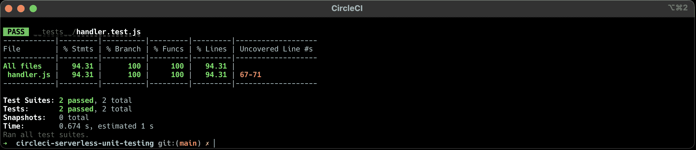
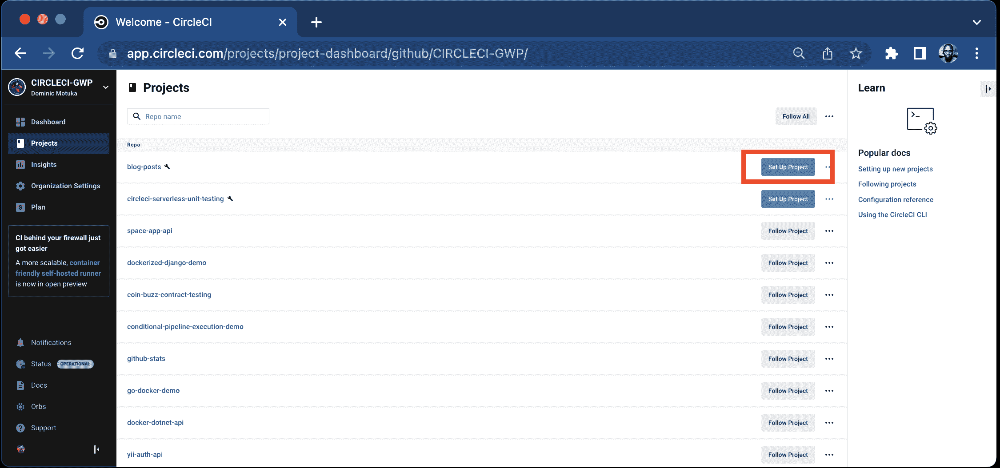
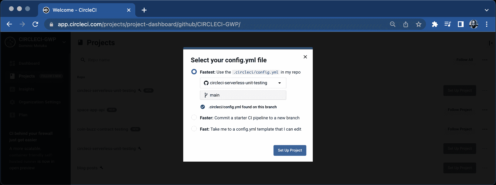
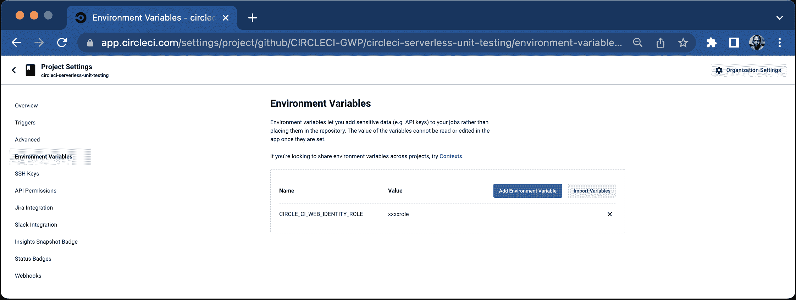
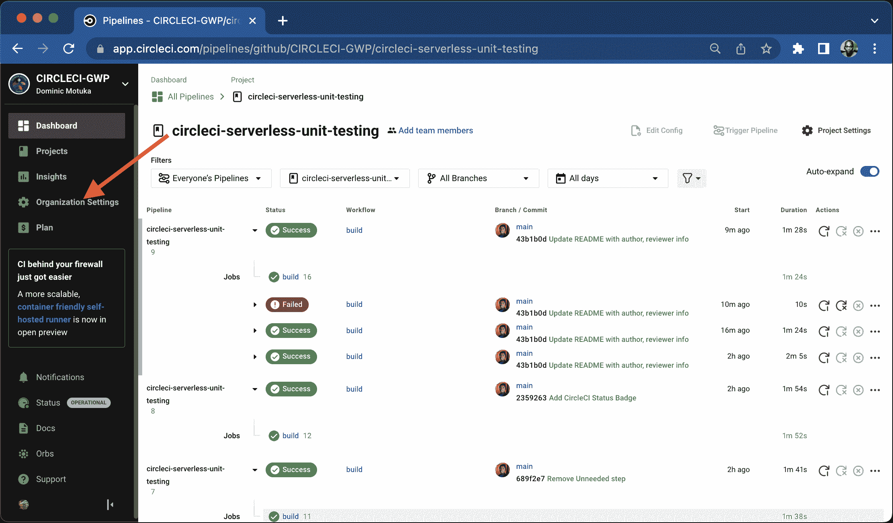
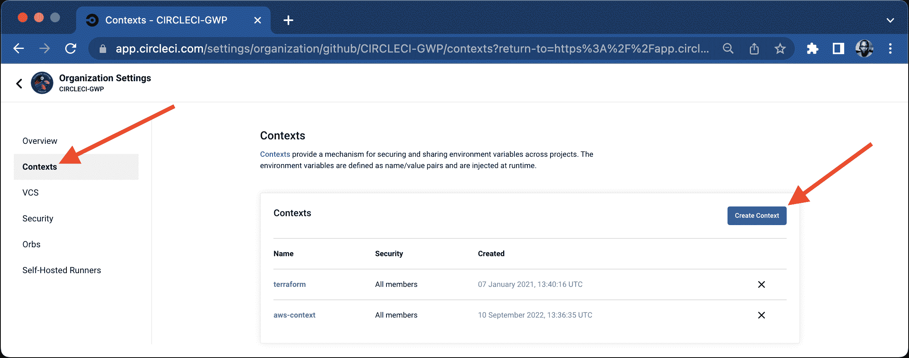
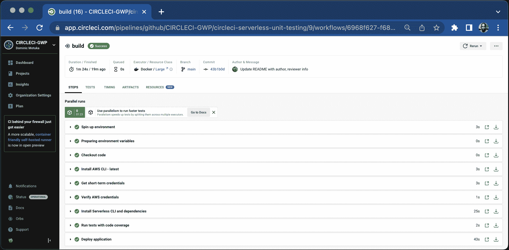

# 为无服务器应用程序构建自动化单元测试管道

> 原文：<https://circleci.com/blog/testing-pipeline-for-serverless-apps/>

> 本教程涵盖:
> 
> 1.  使用 Jest 框架为无服务器应用程序设置单元测试
> 2.  在本地运行测试
> 3.  构建管道来运行测试和部署应用程序

[无服务器框架](https://www.serverless.com/framework)是用 Node.js 编写的开源框架，简化了 AWS Lambda 功能的开发和部署。它让您不必担心如何将应用程序打包和部署到云中，因此您可以专注于您的应用程序逻辑。

无服务器应用程序是按设计分布的，所以良好的代码覆盖率是至关重要的，并且应该包括单元测试。单元测试用例使得在开发阶段早期检测 bug 和防止回归问题变得更加容易。它们改进了应用程序的整体设计和质量，并允许您满怀信心地重构代码。

因为您的应用程序可能依赖于许多其他 AWS 服务，所以很难在本地复制云环境。单元测试允许你独立地测试你的应用程序逻辑。使用基于事件的架构，您可以模拟事件来添加测试用例，并根据接收到的事件断言预期的行为。

在本教程中，您将学习如何使用 Jest 测试框架为无服务器应用程序构建自动化单元测试管道。它建立在从[部署无服务器应用](https://circleci.com/blog/deploying-a-serverless-application/)博文中获得的经验之上。

## 先决条件

对于本教程，您需要设置以下项目:

> 我们的教程是平台无关的，但是使用 CircleCI 作为例子。如果你没有 CircleCI 账号，请在 注册一个免费的 [**。**](https://circleci.com/signup/)

## 创建新的无服务器应用程序

为您的项目创建新目录。运行:

```
mkdir circleci-serverless-unit-testing
cd circleci-serverless-unit-testing 
```

转到`circleci-serverless-unit-testing`目录。从这里，您将使用`aws-nodejs`模板创建一个新的无服务器应用程序。(确保您的系统上设置了无服务器框架。)运行以下命令:

```
serverless create --template aws-nodejs 
```

执行这个命令会创建一个带有基本 Lambda 处理程序的`handler.js`文件和一个带有应用程序配置的`serverless.yml`文件。

### 创建 Node.js Lambda 函数

接下来，您需要使用 Node.js 定义一个 AWS Lambda 函数。该函数生成一个虚拟 CSV 文件，将其上传到 AWS S3，并向 DynamoDB 表添加一个条目。在本教程的后面，您将使用 Jest 测试框架为 Lambda 处理程序编写单元测试用例。

在无服务器应用程序的根目录下创建一个新的`package.json`文件。您将需要它来添加 Lambda 函数所需的依赖项。在`package.json`文件中，添加以下代码片段:

```
{
  "scripts": {

  },
  "dependencies": {
    "csv-stringify": "^6.0.5",
    "fs": "0.0.1-security",
    "uuid": "^8.3.2"
  },
  "devDependencies": {

  }
} 
```

接下来，用下面的代码片段更新现有的`handler.js`文件:

```
"use strict"

const AWS = require('aws-sdk');
const { v4: uuidv4 } = require('uuid');
var fs = require('fs');
const { stringify } = require('csv-stringify/sync');
AWS.config.update({ region: 'us-west-2' });

var ddb = new AWS.DynamoDB();
const s3 = new AWS.S3();

const TABLE_NAME = process.env.TABLE_NAME
const BUCKET_NAME = process.env.BUCKET_NAME

module.exports.uploadCsvToS3Handler = async (event) => {
  try {
    const uploadedObjectKey = await generateDataAndUploadToS3()
    const jobId = event['jobId']
    var params = {
      TableName: TABLE_NAME,
      Item: {
        'jobId': { S: jobId },
        'reportFileName': { S: uploadedObjectKey }
      }
    };

    // Call DynamoDB to add the item to the table
    await ddb.putItem(params).promise();;
    return {
      statusCode: 200,
      body: JSON.stringify(
        {
          "status": "success",
          "jobId": jobId,
          "objectKey": uploadedObjectKey
        },
        null,
        2
      ),
    };
  } catch (error) {
    throw Error(`Error in backend: ${error}`)
  }
};

const generateDataAndUploadToS3 = async () => {
  var filePath = '/tmp/test_user_data.csv'
  const objectKey = `${uuidv4()}.csv`;
  await writeCsvToFileAndUpload(filePath, objectKey)
  return objectKey
}

const uploadFile = async (fileName, objectKey) => {
  // Read content from the file
  const fileContent = fs.readFileSync(fileName);

  // Setting up S3 upload parameters
  const params = {
    Bucket: BUCKET_NAME,
    Key: objectKey,
    Body: fileContent
  };

  // Uploading files to the bucket
  s3.upload(params, function (err, data) {
    if (err) {
      throw err;
    }
    console.log(`File uploaded successfully. ${data.Location}`);
  });
  return objectKey;
};

async function writeCsvToFileAndUpload(filePath, objectKey) {
  var data = getCsvData();
  var output = stringify(data);

  fs.writeFile(filePath, output, function (err) {
    if (err) {
      console.log('file write error', err)
    }
    uploadFile(filePath, objectKey);
  });
}

function getCsvData() {
  return [
    ['1', '2', '3', '4'],
    ['a', 'b', 'c', 'd']
  ];
} 
```

以下是该片段包含的内容:

*   `uploadCsvToS3Handler`是由 AWS Lambda 调用的处理函数。它调用`generateDataAndUploadToS3`方法来生成一个虚拟 CSV 文件。
*   然后使用`uploadFile`方法将虚拟 CSV 文件上传到 AWS S3。
*   然后，`generateDataAndUploadToS3`方法返回生成的文件键，该键在处理程序中用于在 AWS DynamoDB 表中插入一个新项。
*   处理程序返回一个带有`uploadedObjectKey`的 HTTP JSON 响应。

**注意:** *处理程序从环境变量中接收 AWS S3 桶名和 AWS DynamoDB 表名。在所有 AWS 区域的所有 AWS 帐户中，AWS S3 时段名称应该是唯一的。*

### 更新无服务器配置

您之前定义的 Lambda 处理程序使用环境变量，并与 AWS S3 和 AWS DynamoDB 交互。您可以通过对`serverless.yml`文件进行以下更改来进行设置:

*   通过创建新的 AWS S3 存储桶和新的 AWS DynamoDB 表来调配新的云资源。
*   更新 Lambda 函数的处理程序名，并将桶名和表名作为环境变量传递。
*   更新 IAM 角色，将 Lambda 函数权限授予 S3 存储桶和 DynamoDB 表。

**注意** : *确保将 AWS S3 存储桶名称更新为唯一的名称。存储桶不能共享相同的名称，如果 AWS 上已经存在同名的存储桶，您的部署可能会失败。*

要应用这些更改，用以下代码更新`serverless.yml`:

```
service: circleci-serverless-unit-testing
frameworkVersion: '3'

provider:
  name: aws
  runtime: nodejs12.x

  # you can overwrite defaults here
  region: us-west-2

  # you can add statements to the Lambda function's IAM Role here
  iam:
    role:
      statements:
        - Effect: "Allow"
          Action:
            - "s3:ListBucket"
          Resource: { "Fn::Join" : ["", ["arn:aws:s3:::", { "Ref" : "ServerlessDeploymentBucket" } ] ]  }
        - Effect: "Allow"
          Action:
            - "s3:PutObject"
          Resource:
            Fn::Join:
              - ""
              - - "arn:aws:s3:::"
                - "Ref" : "ServerlessDeploymentBucket"
                - "/*"
        - Effect: "Allow"
          Action:
            - "s3:ListBucket"
          Resource: { "Fn::Join" : ["", ["arn:aws:s3:::", { "Ref" : "ServerlessDeploymentBucket" } ] ]  }
        - Effect: "Allow"
          Action:
            - "s3:PutObject"
          Resource: { "Fn::Join": ["", ["arn:aws:s3:::circle-ci-unit-testing-bucket", "/*" ] ] }
        - Effect: "Allow"
          Action:
          - dynamodb:Query
          - dynamodb:Scan
          - dynamodb:GetItem
          - dynamodb:PutItem
          - dynamodb:UpdateItem
          - dynamodb:DeleteItem
          Resource: "arn:aws:dynamodb:us-west-2:927728891088:table/circle-ci-unit-testing-table"

functions:
  UploadCsvToS3:
    handler: handler.uploadCsvToS3Handler
    environment:
      TABLE_NAME: circle-ci-unit-testing-table
      BUCKET_NAME: circle-ci-unit-testing-bucket

# you can add CloudFormation resource templates here
resources:
 Resources:
    S3Bucket:
      Type: AWS::S3::Bucket
      Properties:
        BucketName: circle-ci-unit-testing-bucket
    DynamoDB:
      Type: AWS::DynamoDB::Table
      Properties:
        TableName: circle-ci-unit-testing-table
        AttributeDefinitions:
          - AttributeName: jobId
            AttributeType: S
        KeySchema:
          - AttributeName: jobId
            KeyType: HASH
        ProvisionedThroughput:
          ReadCapacityUnits: 1
          WriteCapacityUnits: 1

 Outputs:
    S3Bucket:
      Description: "S3 Bucket Name"
      Value: "circle-ci-unit-testing-bucket"
    DynamoDB:
      Description: "DynamoDB Table Name"
      Value: "circle-ci-unit-testing-table" 
```

更新后的配置将负责提供云资源并设置所需的 IAM 权限。

## 设置单元测试

对于本教程，您将使用 Jest 测试框架为 AWS Lambda 函数编写单元测试用例。Jest 适用于大多数 JavaScript 项目，并为测试提供了很好的 API。您可以在不添加任何附加配置的情况下生成代码覆盖率报告。它不仅支持模仿，还为模块提供了手动模仿实现。这些特性使得 Jest 成为测试无服务器应用程序的绝佳选择。

**注意:** *如果你对使用 Mocha/Chai JS 进行单元测试感兴趣，[这篇教程](https://circleci.com/blog/deploying-a-serverless-application/)将向你展示如何设置。*

### 为单元测试添加库依赖项

通过运行以下命令添加`jest` NPM 依赖项:

```
npm install --save-dev jest 
```

### 为单元测试创建目录结构

作为最佳实践，您应该为您的测试保持与应用程序文件布局相同的目录结构。例如，如果您在您的无服务器应用程序中定义了`controllers`、`views`或`models`，您可以在您的`__tests__`目录中为测试用例添加类似的文件夹。以下是无服务器应用程序的布局示例:

```
.
├── __tests__
│   └── controllers
│   |   └── myAppController.test.js
│   └── models
│   |   └── user.test.js
│   └── views
        └── userView.test.js
├── controllers
│   └── myAppController.js
├── handler.js
├── models
│   └── user.js
├── views
│   └── userView.js
├── node_modules
├── package-lock.json
├── package.json
└── serverless.yml 
```

## 为无服务器函数编写单元测试

要为无服务器应用程序添加单元测试用例，在无服务器应用程序的根目录下创建一个`__tests__`目录:

```
mkdir __tests__ 
```

接下来，添加一个`handler.test.js`文件。该文件将包含对`handler.js`中定义的处理函数的测试。

1.  在`__tests__`目录中创建一个空的`handler.test.js`。
2.  在`handler.test.js`中为`aws-sdk`添加一个手动模拟实现。Jest 允许你为模块定义部分模仿，这样你就不需要模仿模块的每一个功能。
3.  为 DynamoDB 的`putItem`和 S3 木桶的`putObject`函数创建模拟实现。

将以下代码片段添加到文件中:

```
jest.mock("aws-sdk", () => {
  return {
    config: {
      update() {
        return {};
      },
    },
    DynamoDB: jest.fn(() => {
      return {
        putItem: jest.fn().mockImplementation(() => ({ promise: jest.fn().mockReturnValue(Promise.resolve(true)) })),
      };
    }),
    S3: jest.fn(() => {
      return {
        upload: jest.fn().mockImplementation(() => ({ promise: jest.fn().mockReturnValue(Promise.resolve(true)) })),
      };
    }),
  };
}); 
```

您已经定义了模拟实现来成功解析`Promise`。接下来，为 Lambda 处理程序添加一个单元测试。用测试 ID 调用 Lambda 处理程序，并断言响应体中的`status`被设置为`success`。

```
const handler = require('../handler');

describe('uploadCsvToS3Handler', () => {
  beforeEach(() => {
    jest.restoreAllMocks();
  });

  test('test uploadFile', async () => {
    const response = await handler.uploadCsvToS3Handler({
      jobId: 'test-job-id',
    });

    let body = JSON.parse(response.body);

    expect(body.status).toBe('success');
    expect(body.jobId).toBe('test-job-id');
  });
}); 
```

您可以从终端运行`npm run test`命令来确保测试通过。

接下来，为失败场景添加另一个测试用例。因为您需要为失败场景提供不同的模拟实现，所以在`__tests__`目录中添加一个名为`handler-fail-putItem.test.js`的新文件。将以下代码片段添加到其中:

```
jest.mock("aws-sdk", () => {
  return {
    config: {
      update() {
        return {};
      },
    },
    DynamoDB: jest.fn(() => {
      return {
        putItem: jest.fn().mockImplementation(() => {
          throw new Error();
        }),
      };
    }),
    S3: jest.fn(() => {
      return {
        upload: jest.fn().mockImplementation(() => ({ promise: jest.fn().mockReturnValue(Promise.resolve(false)) })),
      };
    }),
  };
});

const handler = require('../handler');

describe('uploadCsvToS3Handler', () => {
  beforeEach(() => {
    jest.restoreAllMocks();
  });

  test('test uploadFile', async () => {
    expect(handler.uploadCsvToS3Handler({
      jobId: 'test-job-id',
    })).rejects.toThrow(new Error('Error in backend'))
  });
}); 
```

注意，当在 AWS SDK 的 DynamoDB 模块上调用`putItem`方法时，我们抛出了一个异常。因为`putItem`方法抛出一个异常，测试处理程序也会抛出一个异常。通过将错误字符串与预期错误进行匹配来断言异常。

应用程序结构应该如下所示:

```
.
├── README.md
├── __tests__
│   ├── handler-fail-putItem.test.js
│   └── handler.test.js
├── handler.js
├── jest.config.js
├── package-lock.json
├── package.json
└── serverless.yml 
```

## 在本地运行测试

现在您已经为您的应用程序添加了单元测试，接下来看看如何执行它们。首先，将`scripts`添加到`package.json`文件中。

```
"scripts": {
  "test": "jest",
  "coverage": "jest --coverage"
} 
```

添加这些脚本后，您可以使用`npm run test`命令运行所有测试用例，并使用`npm run coverage`命令生成代码覆盖报告。在本地运行这些命令，以确保所有测试用例都通过，并检查代码覆盖率报告是否按预期生成。

一旦您运行了`npm run test`命令，它将执行所有的测试套件并显示结果，如图所示。



## 使用 CircleCI 自动化无服务器应用程序部署

既然您已经能够在本地部署和测试，那么自动化工作流，这样就可以在每次部署时生成代码覆盖率报告。

### 添加配置脚本

转到包含 CI 管道配置文件的项目根目录。添加一个`.circleci/config.yaml`脚本。对于本教程，您将使用 OIDC 令牌向 AWS 进行身份验证，而不是使用静态访问密钥和密码。OIDC 令牌是为每个作业新颁发的短期令牌。要实现此添加:

```
version: 2.1

orbs:
  aws-cli: circleci/aws-cli@3.0.0
  serverless-framework: circleci/serverless-framework@2.0
commands:
  aws-oidc-setup:
    description: Setup AWS auth using OIDC token
    parameters:
      aws-role-arn:
        type: string
    steps:
      - run:
          name: Get short-term credentials
          command: |
            STS=($(aws sts assume-role-with-web-identity --role-arn << parameters.aws-role-arn >> --role-session-name "circleciunittesting" --web-identity-token "${CIRCLE_OIDC_TOKEN}" --duration-seconds 900 --query 'Credentials.[AccessKeyId,SecretAccessKey,SessionToken]' --output text))
            echo "export AWS_ACCESS_KEY_ID=${STS[0]}" >> $BASH_ENV
            echo "export AWS_SECRET_ACCESS_KEY=${STS[1]}" >> $BASH_ENV
            echo "export AWS_SESSION_TOKEN=${STS[2]}" >> $BASH_ENV
      - run:
          name: Verify AWS credentials
          command: aws sts get-caller-identity

jobs:
  build:
    executor: serverless-framework/default
    steps:
      - checkout
      - aws-cli/install
      - aws-oidc-setup:
          aws-role-arn: "${CIRCLE_CI_WEB_IDENTITY_ROLE}"
      - run:
          name: Test AWS connection
          command: aws s3 ls
      - run:
          name: Install Serverless CLI and dependencies
          command: |
            sudo npm i -g serverless
            npm install

      - run:
          name: Run tests with code coverage
          command: npm run coverage

      - run:
          name: Deploy application
          command: sls deploy

workflows:
  build:
    jobs:
      - build:
          context:
            - "aws-context" 
```

您需要在 CircleCI 组织设置中定义一个[上下文](https://circleci.com/docs/2.0/contexts/),否则构建将会失败。

这个脚本使用 [CircleCI 的 aws-cli orb](https://circleci.com/developer/orbs/orb/circleci/aws-cli) 来安装 AWS CLI。它使用[无服务器框架](https://circleci.com/developer/orbs/orb/circleci/serverless-framework) orb 将应用程序部署到使用无服务器框架的 AWS。

这个管道运行所有的单元测试用例，并在将应用程序部署到 AWS 之前生成代码覆盖报告。提交更改并将其推送到 GitHub 存储库。

### 为应用程序创建 CircleCI 项目

接下来，使用 [CircleCI 控制台](https://app.circleci.com/)将存储库设置为 CircleCI 项目。在 Circle CI 控制台上，点击**项目**，搜索 GitHub repo 名称。为您的项目点击**设置项目**按钮。



代码库已经包含一个`config.yaml`文件，CircleCI 将检测到该文件。点击**走吧**继续。



点击**设置项目**按钮触发管道。这次管道将失败，因为您尚未设置环境变量。接下来您可以设置它们。

### 设置环境变量

在项目页面，点击**项目设置**，进入**环境变量**选项卡。在下一个表单中，点击**添加环境变量**。添加这些环境变量:

*   将`CIRCLE_CI_WEB_IDENTITY_ROLE`设置为从 AWS 控制台的 IAM 角色页面获得的角色 ARB。确保您按照指南中描述的步骤[设置 AWS 以使用 OpenID 连接令牌](https://circleci.com/docs/2.0/openid-connect-tokens/#setting-up-aws)并创建 IAM 角色。

一旦您添加了环境变量，它应该在仪表板上显示键值。



### 创建 CircleCI 上下文

因为 OpenID 连接令牌仅可用于至少使用一个上下文的作业，所以请确保每个需要 OIDC 令牌的作业都使用一个上下文(该上下文可能没有环境变量)。

转到**组织设置**。



创建在 CircleCI 工作流中使用的上下文。称之为`aws-context`。



既然已经创建了上下文并配置了环境变量，那么再次触发管道。这一次构建应该会成功。



## 结论

在本教程中，您了解了如何为无服务器应用程序构建自动化单元测试管道。无服务器框架简化了将应用程序部署到云的过程。为了放心地部署，拥有包括单元测试在内广泛的代码覆盖率是至关重要的。使用 Jest 框架，您可以轻松地为您的应用程序添加表达式单元测试，包括模仿、监视和存根。同样在本教程中，您使用了 OIDC 短期令牌来部署 AWS，而不是使用静态访问密钥和密码。你可以在 GitHub 上查看本教程中使用的完整的[源代码](https://github.com/CIRCLECI-GWP/circleci-serverless-unit-testing.git)。

* * *

Vivek Kumar Maskara 是 JP 摩根的一名软件工程师。他喜欢写代码，开发应用程序，创建网站，并写关于他的经历的技术博客。他的简介和联系方式可以在[maskaravivek.com](https://www.maskaravivek.com/)找到。

[阅读更多 Vivek Maskara 的帖子](/blog/author/vivek-maskara/)