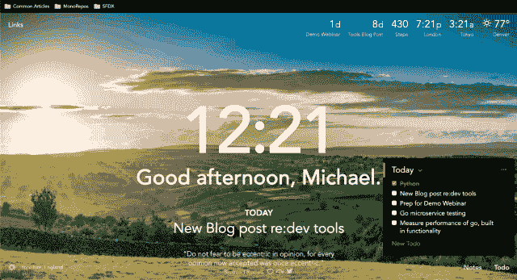
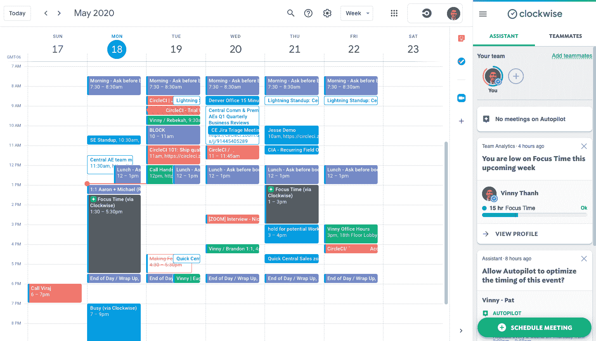
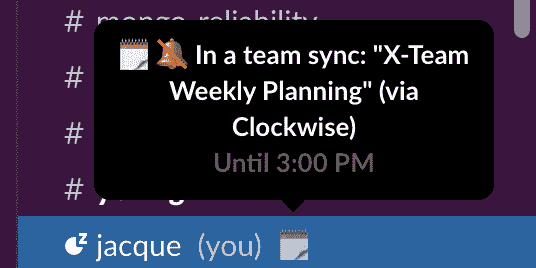
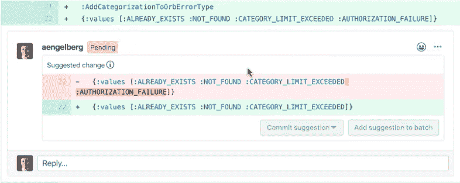
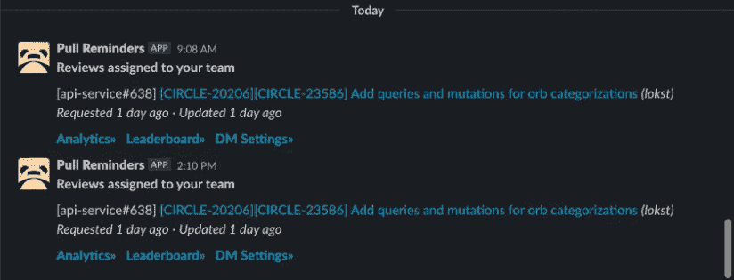

# CircleCI 工程师使用的 10 大开发工具| CircleCI

> 原文：<https://circleci.com/blog/the-best-dev-tools-used-by-circleci-engineers/>

> 如果说我看得更远，那是因为我站在巨人的肩膀上。
> 
> — 艾萨克·牛顿

软件工程师总是在优化。我们修补、尝试新工具，并转变我们的开发过程。每台电脑都是有趣实验和插件的真正游乐场。

出于好奇，我与 CircleCI 的一些工程师谈论了他们用来提高生产率的工具。结果是软件宝石的宝库。很难将这个列表缩减到十个，但是这十个工具是最划算的。我希望这篇文章能帮助 CircleCI 内外的其他工程师，让他们的日常工作更快捷、更有趣。

特别感谢亚历克斯·恩格尔伯格、德文·布朗、格伦·梅勒和杰奎琳·加西亚与我会面，讨论他们的设置。另外感谢 CircleCI 的其他人在我们(许多)Slack 频道中提供的各种工具建议。

## 通用生产力工具

### 浏览器的一个选项卡

OneTab 是 Chrome 和 Firefox 浏览器的一个便捷插件，可以聚集和存储你的标签。更具体地说，它存储了你在其中打开的链接，允许你关闭标签页并释放内存。

 </blog/media/2020-05-26-OneTab-Open.mp4> 

Opening a OneTab grouping

选项卡很容易分组和命名:您可以保存整个选项卡组，也可以恢复选项卡组。我有一组客户演示所需的页面，可以立即打开。完成后，我可以为下一个演示保存这些相同的选项卡。

在我看来，这就是书签应该有的样子。保存和打开新书签是一件麻烦的事，而在 OneTab 中，它们是简单的一键式体验。试用 OneTab，看看它能为您的浏览器选项卡管理做些什么！

### 动量仪表板

[Momentum](https://momentumdash.com/) 是 Chrome、Firefox 和 Edge 的浏览器扩展，帮助用户找到焦点。

它用漂亮的背景图片、激励性的引语和用户可配置的其他项目取代了浏览器上的新标签。有大量方便的小工具——倒计时，世界时钟，当地天气，你可以在浏览器中快速记笔记…

链接下拉菜单可以完全取代书签栏，因为它速度更快，可读性更强。甚至还有键盘快捷键！

 </blog/media/2020-05-26-Momentum.mp4> 

Opening a link in Momentum

在付费计划中，你可以设置与 Todoist、Asana、Trello、Bitbucket、GitHub 等应用程序的集成。结合其“自动对焦”功能，将一个项目集中在屏幕上，您可以专注于手头的任务，保持一天的清晰。

动力已经迅速成为我们中一些人选择的仪表板。

### 谷歌日历顺时针方向

[顺时针](https://www.getclockwise.com/)是 GSuite 和 Chrome 的日历助手，智能管理你的日历。

它可以重新安排你的会议(称为“自动驾驶”)，以创造最大的专注时间，或不间断的高质量工作时间。

此外，还有一些方便的集成，如与 Slack 的集成，可以根据您的日历自动打开勿扰模式和同步状态。这个插件甚至可以给你的会议标上颜色。

顺时针方向有助于创造不间断的时间。作为工程师，避免过于频繁的上下文切换和干扰我们的流程是很重要的。通过自动驾驶某些会议，我们可以毫不费力地移动会议来创建这些区块。

### 矩形

[矩形](https://rectangleapp.com/)是窗口管理器，允许用户使用键盘快捷键移动和平铺窗口。

 </blog/media/2020-05-26-Window-Tiling.mp4> 

Tiling windows

现代技术工作的一个常见问题是管理许多应用程序和窗口。矩形使管理它们变得容易；您可以使用直观的键盘快捷键来移动东西(例如，Ctrl+Alt+→向右平铺窗口)。

本来 Devin 推荐的是[眼镜](https://www.spectacleapp.com/)。然而，眼镜不再保持，它的用户指向矩形，一个开源的替代品，具有本质上相同的功能。

看看用矩形移动你的窗口有多容易！

### 克利皮

Clipy 是一个 Mac 剪贴板扩展，可以保存拷贝项目的更长历史。

 </blog/media/2020-05-26-Clipy.mp4> 

Fetching a value from the Clipy clipboard

它支持包括图像和文本在内的各种格式，它的历史很长——你可以去找一个你几个动作前复制的小东西。

此外，它甚至支持代码片段。有可能经常打字的长东西吗？你可以存储它，只需一个快捷键就可以调用它。

## 开发工具

### GitHub 内嵌建议

GitHub 提供了一个强大的功能，叫做[建议的修改](https://help.github.com/en/github/collaborating-with-issues-and-pull-requests/incorporating-feedback-in-your-pull-request)，它允许 PR 评论者提出内嵌建议，作者直接提交它们。

开发人员知道，令人厌倦的游戏——打开 PR、接收建议、返回 IDE、进行更改、推送更改、返回 PR……所有这些都可以通过内联提交建议的能力来消除。这对于微小的变化特别有用。

总的来说，这个特性帮助我们很多人简化了 PRs 的修复，从而加快了合并的速度。

### 奔向苹果电脑

[Dash for macOS](https://kapeli.com/dash) 是一个 API 文档管理器和代码片段管理器。

 </blog/media/2020-05-26-Dash.mp4> 

Browsing and Searching Documentation on Dash

有了 200 多个可用的离线文档集，您不用上线就可以找到最流行语言的文档。

无论是浏览 Go 的`strconv`包，还是查找 PSQL 命令，都可以使用一个单一、快速、统一的应用来完成。它甚至有一个 snippets 特性，允许你输入一个别名并扩展到一些更大的文本——对于更大的重复输入的文本非常有用。

Dash 对于跨多种语言和项目以及离线查找文档非常有用。

### 可宽延时间的提取提醒

[拉动提醒](https://pullreminders.com/)是一个 Slack 应用，通知用户 PRs 上未完成的任务。

它非常适合通过 Slack 通知用户所有的公关事件和行动项目，有效地取代了 GitHub 的通知。用户可以在 Slack 中看到他们需要的一切，他们可以关闭电子邮件通知来清理他们的收件箱。

### VS 代码的 GitLens

GitLens 是一个在 VS 代码中扩展 Git 功能的插件。

 </blog/media/2020-05-26-GitLens.mp4> 

Seeing line by line authors & commit messages inline

通常在项目协作时，很容易丢失特定代码的上下文。有了 GitLens，可以一目了然地访问这些信息:从内联错误到差异，甚至是特定文件和代码行的历史记录。

此外，GitLens 可以在“倒带”提交历史的同时显示并排的差异，允许用户逐行、逐提交地查看更改。

超级有用。

### VS 代码的实时共享

[VS Code Live Share](https://marketplace.visualstudio.com/items?itemName=MS-vsliveshare.vsliveshare) 是一个插件，允许用户在 VS Code 中进行远程协作和实时编辑。

 </blog/media/2020-05-26-Code-Live-Share.mp4> 

Seeing Jacque work in a live share session

过去，远程协作通常是通过`tmux`完成的，它运行在终端上，共享基于文本的会话。

但从那时起，功能和技术已经扩展到涵盖完整的 IDE 和工作区共享，如在 Live Share 插件中看到的。

CircleCI 的许多工程师都使用 VS 代码，因为它有很棒的插件和可扩展的特性。Live Code 插件经常用于工作中的配对。

## 结论

有这么多伟大的工具，这是不可能在这篇文章中列出他们。然而，以上只是 CircleCI 工程师使用的众多工具中的一小部分。

在我认识他们的时间里，他们做了令人难以置信的工作，我们希望这些工具可以帮助你更有效地做你自己的令人难以置信的工作。