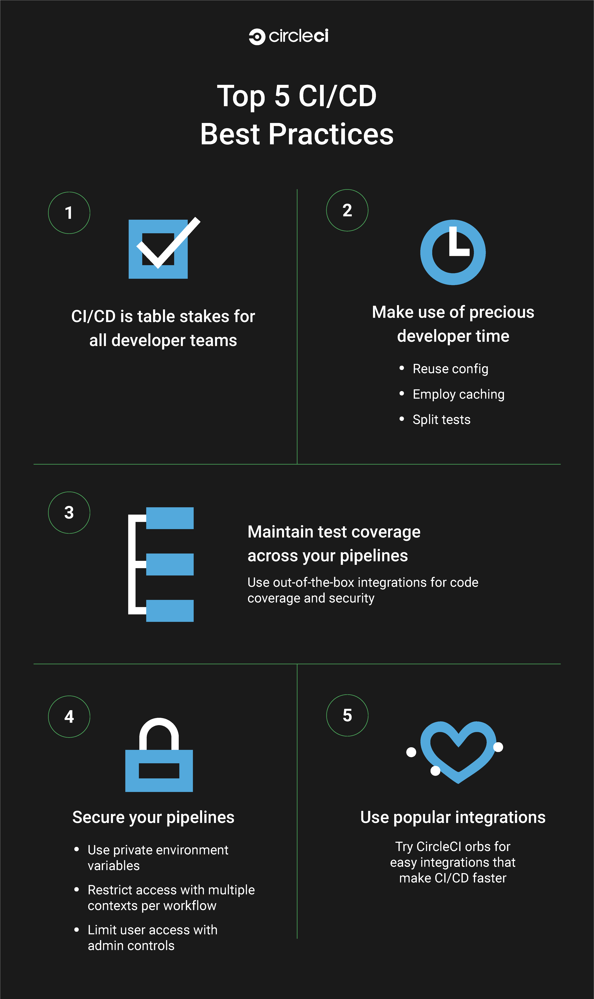

# 5 大 CI/CD 最佳实践| CircleCI

> 原文：<https://circleci.com/blog/top-5-ci-cd-best-practices/>

## 利用这些 CI/CD 最佳实践优化您的渠道

对于工程团队来说，CI/CD 是改善他们开发周期的关键。CircleCI 致力于帮助我们的客户优化他们的管道，以简化生产交付。

[软件开发团队的顶级 CI/CD 策略](https://youtu.be/Is3U2a_TOF4)

[https://www.youtube.com/embed/Is3U2a_TOF4](https://www.youtube.com/embed/Is3U2a_TOF4)

视频

如果你的团队重视加快你的上市时间，承诺尝试这 5 个最佳实践。这些是 CircleCI 为减少你的开发周期时间和总体上改进你的 CI/CD 过程而提出的建议。

### CI/CD 最佳实践

1.  CI/CD 并不新奇——它是所有开发团队的需求
2.  充分利用开发人员宝贵的时间
3.  保护您的管道
4.  维护跨管道的测试覆盖率
5.  让受欢迎的球进入你的舵手室

## CI/CD 最佳实践 1: CI/CD 并不新奇——它是所有开发团队的需求

组织发现他们的开发周期对于提高代码生产质量是多么重要。在我们的 [2022 年软件交付状态报告](https://circleci.com/resources/2022-state-of-software-delivery/)中，我们看到一些组织脱颖而出:与行业中的其他组织相比，他们正在更快、更成功地进行规模化建设。通过我们的分析，我们发现这些表现最佳的团队在 4 个关键基准上都有所提高。

## CI/CD 最佳实践 2:充分利用开发人员宝贵的时间

既然您已经知道如何使用度量基准来优化您的管道，我们的下一个建议是最好地利用宝贵的开发时间。您可以通过以下方式做到这一点:

*   重用配置
*   使用缓存策略
*   实现测试拆分

### 重用配置

一个很好的优化方法是永远不要写两次相同的配置。使用 CircleCI 的 [orbs](https://circleci.com/orbs/) ，YAML 配置的可重复使用的软件包，它自动化重复的过程并加速项目设置。

私有 orb 允许您在组织的范围内跨多个项目共享配置。

还有许多开源 orb 可供使用:

1.  开发者中心(Developer Hub)——扫描我们的公共注册表，寻找开源 orb，这些 orb 是可重用的配置包，可以自动执行重复的过程，加快项目设置。
2.  orb 开发套件-orb 开发套件有助于简化工程师创建自己的 Orb 的整个 Orb 创作过程。开发人员现在可以从 CLI 生成一个全功能的 orb 示例项目。

### 使用缓存策略

优化项目构建和工作流的一种简单方法是实现特定的缓存策略，允许重用以前构建和工作流中的现有数据。无论是选择包管理应用程序还是手动改进缓存，缓存都是提高作业速度的最有效方法之一。

*在我们的[文档](https://circleci.com/docs/optimization-cookbook/#using-caching-to-optimize-builds-and-workflows)中了解有关如何优化构建和工作流的更多信息。*

### 实现测试拆分

最后，开发人员可以通过利用测试分割来加速他们的项目构建。自动测试分割通过将一套测试自动分割到同一工作的多个实例上——或者更确切地说，是一系列并行运行的测试环境上，从而缩短了反馈循环。

*了解如何根据您的应用需求[在此](https://circleci.com/docs/optimization-cookbook/#test-splitting-to-speed-up-pipelines)显著减少您的测试时间。*

## CI/CD 最佳实践 3:保护您的管道

使用符合行业安全标准的 CI/CD 平台与有意采取措施保护您的管道一样重要。本建议旨在确保您使用我们在 CircleCI 平台上提供的附加产品安全功能来保护您的管道:

### 私人环境

私有环境变量使开发人员能够安全地存储秘密，即使是他们的公共项目。秘密屏蔽增加了另一层安全性，因为它在作业输出中隐藏了项目和上下文中的环境变量。

### 每个工作流有多个上下文

为了进一步限制访问，每个工作流拥有多个上下文允许开发人员通过让环境变量包含特定域中的值而不是给定的工作流来限制对环境变量的访问。当需要访问工作流中的特定上下文时，这提供了更大的粒度，从而提高了组织的安全性。

### 灵活的管理控制

灵活的管理控件允许您管理跨项目的用户访问。通过在整个组织内标准化 CI 平台的可访问性和使用，您可以维护应用程序的安全性。保护您的管道与确保您的工作流程快速运行同样重要。

要了解更多有关 CircleCI 产品特性的信息，请查看我们的[CI/CD 安全性终极指南和 DevSecOps](https://circleci.com/blog/security-best-practices-for-ci-cd/) 博文。

## CI/CD 最佳实践 4:维护整个管道的测试覆盖率

使用 CircleCI，开发人员可以以合作伙伴 orb 的形式集成一些最好的开发工具。

orb 是可重用的配置包，有助于加快项目设置。CircleCI 的合作伙伴提供了多个类别的 orb，从代码分析到部署，但我们希望找出那些有助于保持整个管道测试覆盖率的 orb。

考虑将这些流行的合作伙伴 orb 集成作为您开发周期的一部分:

1.  Codecov 将您的覆盖报告上传到 Codecov，无需处理复杂的配置。快速获得您的应用程序的覆盖率结果，这样您就可以更轻松地呼吸，并满怀信心地提交您的代码。
2.  [Cypress](https://circleci.com/developer/orbs/orb/cypress-io/cypress) 在 Cypress 仪表板上记录结果，并以并行模式进行负载平衡测试。运行端到端浏览器测试，无需花费时间配置 CircleCI。
3.  Sonarcloud 在问题出现之前，检测您的存储库中的错误和漏洞。
4.  [工作包](https://circleci.com/developer/orbs/orb/coveralls/coveralls)将您的测试套件的 LCOV 覆盖数据发布到工作包. io 中，用于分析、变更跟踪和通知。在运行拉式请求构建时，将在 PR 中添加一条注释，详细说明如果合并将如何影响覆盖率。
5.  [Snyk](https://circleci.com/developer/orbs/orb/snyk/snyk) 查找、修复并监控您的应用程序依赖项和 Docker 映像中的已知漏洞。

## CI/CD 最佳实践 5:让这些受欢迎的球进入你的舵手室

我们想把最好的留到最后:我们最好的圆形球体。包含这些 orb 是增强您的 CI/CD 实践策略的一个很好的方法:

1.  [Node](https://circleci.com/developer/orbs/orb/circleci/node) 轻松安装 Node.js 及其包管理器(npm，yarn)。最重要的是，安装软件包时默认启用缓存。
2.  [Slack](https://circleci.com/developer/orbs/orb/circleci/slack) 跨所有 CI/CD 渠道实施基于事件的通知。利用内置的消息模板或 Slack 的可视块工具包构建器，根据您组织的需求创建和定制通知。加速反馈循环，以便更快地修复错误和交付产品。
3.  [AWS-CLI](https://circleci.com/developer/orbs/orb/circleci/aws-cli) 安装并配置 AWS 命令行界面(awscli)。
4.  [Python](https://circleci.com/developer/orbs/orb/circleci/python) 为 Python 编程语言启用常见的 CircleCI 任务。
5.  轻松地自动缓存和安装您的 Ruby Gems，运行并行 Rspec 测试，或者直接安装 Ruby。

阅读我们的 [2022 年软件交付状态报告](https://circleci.com/resources/2022-state-of-software-delivery/)，了解我们从全球软件、医疗保健、零售、金融、房地产和媒体等领域的 50，000 多个组织中收集到的关于构建优秀软件开发团队的最佳实践。