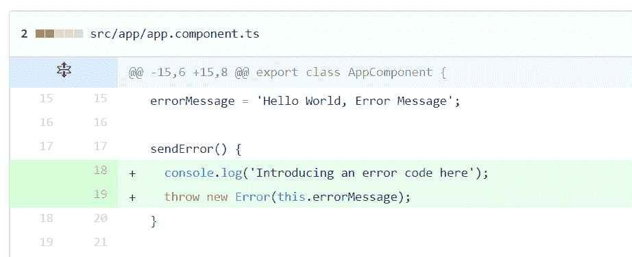
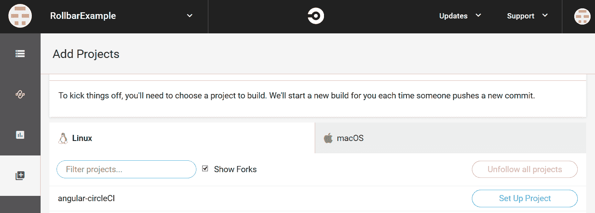
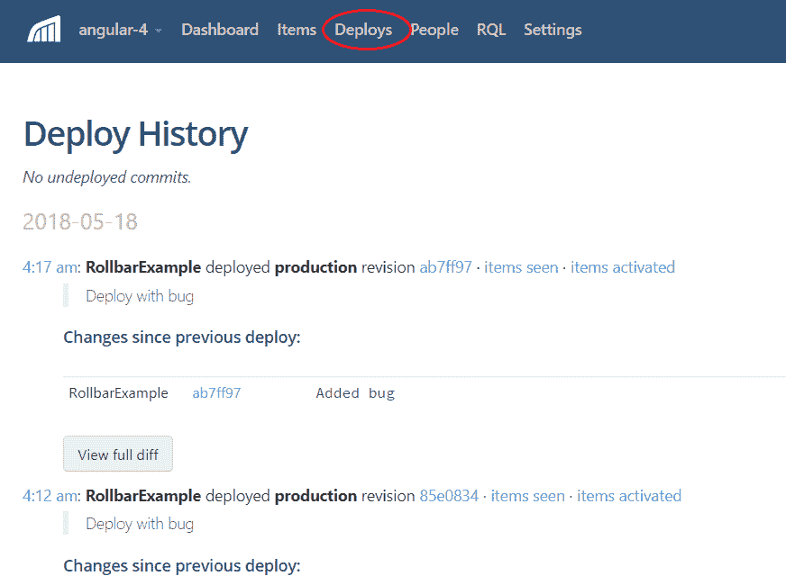
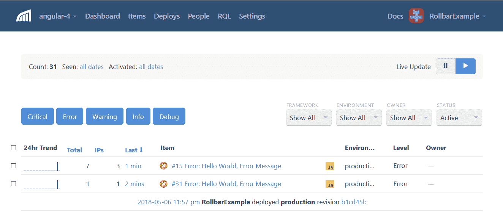
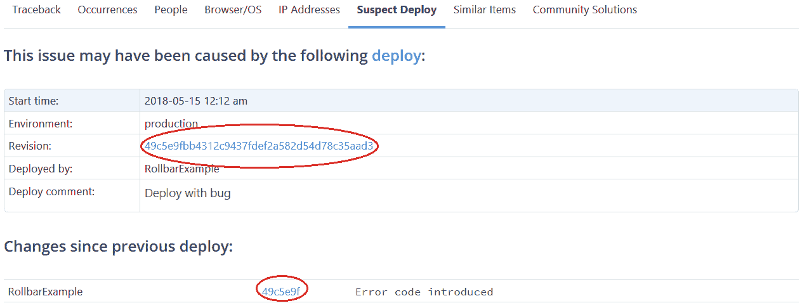
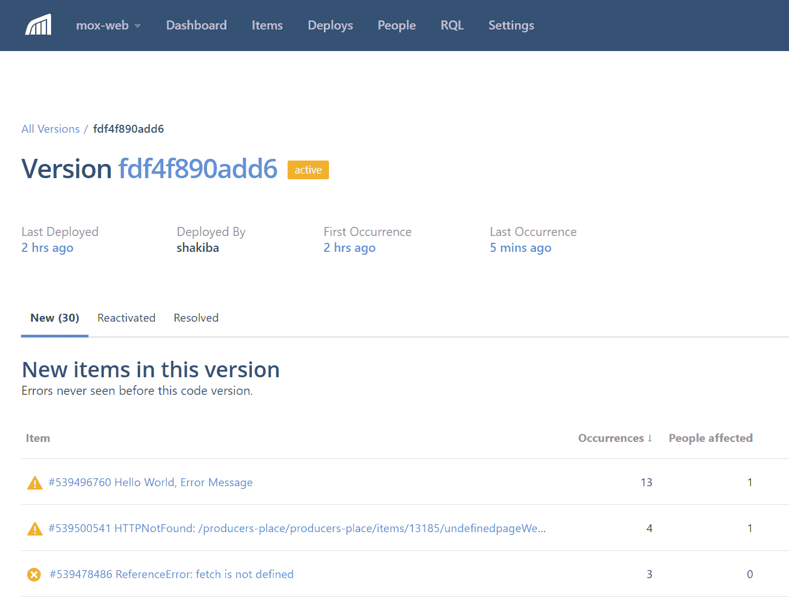

# 使用 Rollbar 和 CircleCI 进行部署后跟踪错误

> 原文：<https://circleci.com/blog/tracking-errors-after-deployments-with-rollbar-and-circleci/>

*今天的博文是由 Rollbar 技术内容的首席编辑[杰森·斯科沃龙斯基](https://twitter.com/mostlyjason)撰写的两部分系列文章的第一部分。Jason 的职业生涯始于亚马逊的一名软件开发人员，现在他乐于成为最新技术的开发者倡导者。*

应用程序错误会给客户带来令人沮丧的问题，最终可能导致失去他们的信任和业务。有经验的开发人员知道一个关键的产品问题是什么样的，他们会花几分钟甚至几个小时来诊断一个棘手的问题。当几个开发人员同时进行变更和部署时，就更难诊断了。

Rollbar 是一个错误监控解决方案，它可以告诉您在部署后发生了什么错误，并向您显示可能导致这些错误的部署和代码更改。它与您的持续集成和交付(CI/CD)系统集成，以跟踪部署何时提升到生产环境。当一个新的错误发生时，它会像 GitHub 一样在您的源代码库中查找已部署的版本，以确定哪些代码被更改以及是谁更改了它。这将帮助您更快地缩小由于代码错误导致的错误。

在本帖中，我们将通过一个例子展示 Rollbar 如何与 CircleCI 和 GitHub 集成来实现这一点。只需点击几下鼠标，您就可以看到可能导致错误的代码更改。



### 简单的例子

Rollbar 集成了大多数主流编程语言、框架、CI/CD 解决方案和源代码库。在这个例子中，我们将使用 CircleCI 和 Angular，这样我们可以演示 JavaScript 源代码映射。我们的例子是免费提供的，运行或修改都很简单。源代码可以在 Github 上的 [angular-circleCI](https://github.com/RollbarExample/angular-circleCI) 库中找到。

如果您的应用程序使用不同的语言或框架，您仍然可以遵循这些说明，但是最相关的部分是将部署 API 调用添加到滚动条。这个 API 调用对于任何语言都是一样的。

## 打开您的 CircleCI 配置

首先，我们将向您展示如何为我们的示例应用程序设置 CircleCI。然后，我们将向滚动条发送部署通知，以便它可以跟踪何时进行部署。

我们将假设您已经拥有 CircleCI 的帐户。如果没有，[注册](https://circleci.com/signup/)然后配置源代码库比如 GitHub 或者 BitBucket。



CircleCI 在名为。项目目录下的 circleci。它应该包含一个名为 config.yml 的文件。在我的例子中，配置文件部署到一个 S3 桶，因为 Angular 示例是一个静态站点。根据您部署应用的位置，您的应用会有所不同。

```
# Deploy our app to the S3 by copying the files
- run:
     name: Deploy to S3
     command: |
     aws --region us-east-2 s3 sync dist s3://rollbar-example/ --delete     --acl public-read 
```

## 向滚动条发送部署通知

现在我们可以在成功部署后通知滚动条，这样它就可以跟踪已部署的版本。在部署脚本后插入下面的[滚动条部署通知](https://docs.rollbar.com/docs/deploy-tracking)。确保用您自己的访问令牌、用户名等替换示例变量。

```
- run:
     name: Deployment notification to Rollbar
     command: |
    # Deployment script
      …
    # Notify rollbar
     curl https://api.rollbar.com/api/1/deploy/ \
     -F access_token=2a208f30fa1b4f0183adb694c4432038 \
     -F environment=production \
     -F revision=$CIRCLE_SHA1 \
     -F rollbar_username=RollbarExample \
     -F local_username=$CIRCLE_USERNAME \
     -F comment='Deploy with bug' 
```

**access_token:** 滚动条上的目标项目令牌。这个令牌是在滚动条上创建项目时生成的。

**环境:**部署服务的部署环境。我们可以配置不同的环境，例如开发、试运行和生产。

**版本:**部署的应用版本。这应该是存储库组件 ID。如果提供的版本是提交 ID，滚动条将创建一个到存储库提交源代码的链接。

**local_username:** 将构建部署到服务器的用户。

现在可以在滚动条上看到部署版本历史。它还可以识别每次部署所做的代码更改。稍后，我们将向您展示 Rollbar 如何使用它来识别这个部署中发生了哪些错误。



## 将滚动条 SDK 添加到您的应用程序中

在前面的章节中，我们学习了如何设置连续交付作业以及与 Rollbar 的集成。现在我们将学习如何集成 Rollbar 的 SDK 来监控应用程序错误。如果抛出了已处理或未处理的异常，应用程序将捕捉它们并通知滚动条错误细节。

**第一步:**

先决条件:

创建一个 roll bar https://rollbar.com 帐户。创建您的项目，并从通告程序列表中选择 Java。选择创建项目时生成的服务器端访问令牌。

**第二步:**

为项目中的 Rollbar-Angular 添加 package.json 文件中的依赖项。正如我们之前提到的，Rollbar 为许多其他语言提供了[SDK。](https://rollbar.com/platforms/)

```
"dependencies": {
   "rollbar": "2.2.8"
 } 
```

**第三步:**

用强制参数配置 [app.module.ts](https://github.com/RollbarExample/angular-circleCI/blob/master/src/app/app.module.ts) 中的滚动条。你可以在 [Javascript SDK 文档](https://docs.rollbar.com/docs/javascript#section-reference)中了解更多关于这些参数的信息。记得在配置中添加您自己的访问令牌。

```
const rollbarConfig = {
  accessToken: 'f627d5e044a24b9987a23e54c5df352e',
  captureUncaught: true,
  captureUnhandledRejections: true,
  enabled: true,
  source_map_enabled: true,
  environment: 'production',
  payload: {
	server: {
  	   branch: 'master',
  	   root: 'webpack:///./'
	},
	client: {
  	   javascript: {
    	       code_version: versions.versions.revision
  	   }
	}
  }
}; 
```

代码版本应该与您正在部署的版本相匹配，并且通常设置为 git 提交的 SHA。服务器根帮助滚动条定位源代码的基本路径。它们允许 Rollbar 匹配您回溯到已部署版本的源代码中报告的错误。我们将在本系列的第二部分对此进行更深入的讨论。

**第四步:**

我们将使用`rollbar`包来通知滚动条错误。让我们从产生错误的 [app.component.ts](https://github.com/RollbarExample/angular-circleCI/blob/49c5e9fbb4312c9437fdef2a582d54d78c35aad3/src/app/app.component.ts) 开始。为了跟踪滚动条中的错误，我们需要用我们刚刚创建的访问令牌来配置它。为了测试它，我们可以用一个方法 sendError()触发一个错误，如下所示。当抛出异常时，manualHandle()方法将通过 rollbar.error(e)方法调用通知 Rollbar。

```
export class AppComponent {

 constructor(private rollbar: Rollbar) {

 }
 title = 'Angular 4 with Rollbar';
 errorMessage = 'Hello World, Error Message';

 sendError() {
   console.log('Introducing an error code here');
   throw new Error(this.errorMessage);
 }
} 
```

**第五步:**

现在，我们将测试刚刚组装好的所有部件。我们将在 CircleCI 上执行构建，运行应用程序，然后生成一个测试错误。

## 找到错误的根本原因

在**项**菜单选项卡上检查滚动条仪表板的错误记录，它将显示错误细节以及导致错误的源代码文件的链接。该错误将显示可疑的部署版本以及导致错误的代码。



调查错误原因的第二种方法是使用可疑部署选项卡。它显示了首次发现错误的修订，以及自上次部署以来对代码所做的更改。我们可以看到提交消息，表明引入了一个错误代码。



单击带有修订签名的链接会向我们显示一个差异，在这里我们可以看到可能导致此错误的源代码更改。


总之，我们已经成功地生成了一个错误，用 Rollbar 跟踪了错误，并用 Rollbar 快速地确定了问题的根本原因。

最近在其测试版特性实验室中推出的一个新特性 Rollbar 能够看到部署后发生的所有错误。这与从错误开始，然后识别部署是相反的。这有助于在部署后监控应用程序，以查看哪些新错误正在发生，哪些已重新激活，以及哪些已解决。下面，我们可以看到这个部署是在 2 小时前进行的，并生成了我们的“Hello World”错误。



结论 Rollbar 是一种跟踪生产中出现的错误的好方法。对于每个部署，它会告诉您发生了哪些错误，以及哪些代码更改是导致错误的原因。这可以大大加快您的故障诊断时间，这将使您的团队和您的客户都更高兴。

继续阅读我们博客系列的[第二部分，了解如何自动识别哪些代码变更导致了错误。我们将深入研究源代码集成是如何工作的，包括 JavaScript 源代码图。](https://circleci.com/blog/automatically-identify-which-code-changes-caused-errors/)