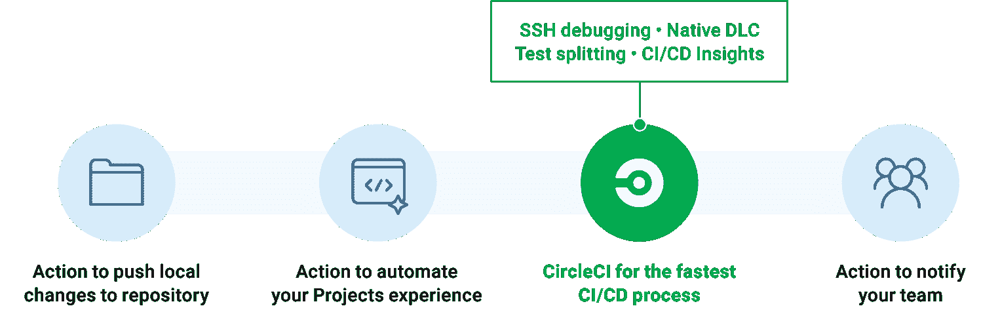
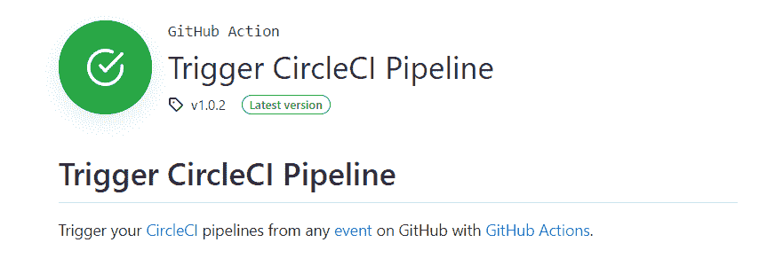

# 从 GitHub 操作工作流| CircleCI 触发您的 CircleCI 管道

> 原文：<https://circleci.com/blog/trigger-circleci-pipeline-github-action/>

如果您已经是 GitHub 用户，您可能知道 GitHub Actions 为您提供了强大的工具来提高软件交付生命周期的效率。行动可以对团队协作和流程简化产生影响。例如，您可以自动完成构建容器、欢迎新用户加入您的开源项目、管理分支或对问题进行分类等工作。

对正确的工作使用正确的工具很重要。将 GitHub 动作与 CircleCI 一起使用，可以让您自动化版本控制系统的各个方面，同时还可以受益于只有在 CircleCI 管道中才有的特性。想象一下，扩展你的 VCS 工作流，使之包括高级功能，如 [SSH 调试](/blog/debugging-ci-cd-pipelines-with-ssh-access/)、[测试分割](/blog/a-guide-to-test-splitting/)、健壮的 [CPU 和 RAM 选项](https://circleci.com/docs/configuration-reference/#resourceclass)以及 GPU 和 [Arm 支持](/blog/managing-ci-cd-pipelines-with-arm-compute-resource-classes/)。

例如，您可以使用动作进行团队协作和流程简化，同时使用 CircleCI 加速构建、测试和部署阶段。



为了让 GitHub 上的任何事件都能更容易地启动 CircleCI Pipeline，我们的团队构建了 Trigger CircleCI Pipeline action，它现在[可以在 GitHub Marketplace](https://github.com/marketplace/actions/trigger-circleci-pipeline) 上获得。



在本文中，我们将介绍几种方法，您可以将触发 CircleCI 管道操作合并到您的工作流中，以充分利用您的 GitHub automation 信用，同时受益于 CircleCI 世界级的持续集成能力。

## 触发 CircleCI 管道:一个 GitHub 动作，用于触发 CircleCI 中的工作流

使用 Trigger CircleCI Pipeline 操作，可以从给定分支或标记上的任何事件启动 CircleCI 管道。该操作会传递一组包含元数据的管道参数，这些元数据可用于控制 CircleCI 管道和工作流的流动。

触发 CircleCI 管道操作的一个潜在用例是每当开发人员打开一个 pull 请求时触发 CircleCI 管道。在 pull 请求上触发允许您测试 PR 中的更改，即使最后一次提交是在 PR 打开之前进行的(或者在任何时候将更改推送到打开 PR 的分支时触发构建和测试循环)。

Trigger CircleCI Pipeline 动作的另一个用例是每当在 GitHub 中创建、编辑或发布一个[版本](https://docs.github.com/en/repositories/releasing-projects-on-github/about-releases)时，从 CircleCI 触发一个构建和部署。当 repo 所有者指定应用程序的新发布版本时，触发发布允许您构建和部署应用程序，例如将 Dockerized 微服务部署到 Kubernetes 集群或将二进制文件发布到 app store。

您可以在触发器 CircleCI 管道库的[示例目录中查看这两个用例的完整实现，包括您的 CircleCI 和 GitHub 操作配置文件的模板。接下来，我们将探索一个使用触发器 CircleCI 管道操作在发布新版本时启动 CircleCI 工作流的示例。](https://github.com/CircleCI-Public/trigger-circleci-pipeline-action/tree/main/examples)

## 如何使用 Trigger CircleCI Pipeline 操作从新版本中触发管道

设置 GitHub 操作以使用 CircleCI 的第一步是为所需的 CircleCI 管道创建 GitHub 操作工作流。您可以通过向`./.github/workflows`添加一个工作流 YAML 文件(我们将使用`main.yml`)来做到这一点。

在下面的例子中，您使用`on`和`types`语法来指定在发布新版本时触发`trigger-circleci`动作。为该步骤选择一个定制的`name`和`id`，以便在 CircleCI 管道中提供额外的上下文元数据:

```
on:
  release:
    types: [published]
jobs:
  trigger-circleci:
    runs-on: ubuntu-latest
    steps:
      - name: <customize name>
        id: <customize id>
        uses: circleci/trigger_circleci_pipeline@v1.0
        env:
          CCI_TOKEN: $ 
```

接下来，创建一个名为`CCI_TOKEN`的[加密秘密](https://docs.github.com/en/actions/security-guides/encrypted-secrets#creating-encrypted-secrets-for-a-repository)，其中包含将用于触发管道的[个人 API 令牌](https://circleci.com/docs/managing-api-tokens/)。我们建议将此设为[机器用户](https://docs.github.com/en/developers/overview/managing-deploy-keys#machine-users)。

现在您已经设置了 GitHub 工作流，您可以修改 CircleCI 配置文件，以便在 GitHub 动作启动时运行。首先将[管道参数](https://circleci.com/docs/pipeline-variables/)定义添加到您的 CircleCI 配置中。当 GitHub 动作被触发时，该数据将被输入。

将以下内容添加到您的`.circleci/config.yml`文件的顶部。确保您指定了版本 2.1:

```
version: 2.1
parameters:
  GHA_Event:
    type: string
    default: ""
  GHA_Actor:
    type: string
    default: ""
  GHA_Action:
    type: string
    default: ""
  GHA_Meta:
    type: string
    default: "" 
```

该操作会生成几个管道参数:

*   `GHA_Actor`表示哪个用户触发了管道。
*   `GHA_Action`是工作流配置中分配的`id`。
*   `GHA_Event`是触发管道的 GitHub 事件的类型。
*   `GHA_Meta`是可选的附加元数据参数，允许您使用[输入参数](https://docs.github.com/en/actions/creating-actions/metadata-syntax-for-github-actions#inputs)指定附加元数据。

您可以使用此管道参数数据来[有条件地运行工作流](https://circleci.com/docs/pipeline-variables/#conditional-workflows)。在本例中，`GHA_Event`参数将用值`release`填充，您可以在 CircleCI 配置中使用一个 [`when`子句](https://circleci.com/docs/configuration-reference/#using-when-in-workflows)来指定仅在 GitHub 工作流触发时运行的工作流:

```
jobs:
  release:
    docker:
      - image: cimg/node:lts
    steps:
      - run: npm install
      - run: npm build
      - run: npm publish

workflows:
  release:
    when:
      equal: [ "release", << pipeline.parameters.GHA_Event >>]
    jobs:
      - release 
```

这个配置片段指定了一个发布 npm 包的`release`作业和一个调用`release`作业的`release`工作流。在`when`子句中，您指定`release`工作流仅在 GitHub 工作流运行时运行，并用值`release`填充`GHA_Event`参数。

虽然这个例子演示了如何设置释放触发器，但是您可以使用相同的技术从任何可用的 [GitHub 事件中启动 CircleCI 管道来触发工作流](https://docs.github.com/en/actions/learn-github-actions/events-that-trigger-workflows)。要查看从 pull 请求的事件中触发 CircleCI 的完整设置，请访问[示例 GitHub repo](https://github.com/CircleCI-Public/trigger-circleci-pipeline-action/tree/main/examples/01-Trigger-Workflow-On-Pull_Request) 。

## 如何防止 GitHub 和 CircleCI 中的作业重复执行

需要强调的是，GitHub Actions 与本地 CircleCI 集成并行运行。默认情况下，当存储库连接到 CircleCI 时，如果该项目配置中的工作流没有指定任何会阻止执行的条件或过滤器，则默认情况下工作流将在每个推送事件时执行。这意味着一个作业可能会意外运行两次，一次是在 CircleCI 的 push 事件上，另一次是在 GitHub 动作触发的其他事件上。

如果您依赖 GitHub 操作来提供所有 API 触发器，请确保您的每个 CircleCI 配置工作流都包含一个条件，限制其仅执行 GitHub 操作触发器，如下例所示:

```
workflows:
  # This workflow is set to be triggered conditionally, only when
  # the GitHub Action is triggered.
  # With no other workflows, normal push events will be ignored.
  when: << pipeline.parameters.GHA_Action >>
  test:
    jobs:
      - test 
```

在您的工作流声明中使用`when`子句允许您指定 CircleCI 应该只在指定的`GHA_Action`被触发时运行工作流，而不是在正常的推送事件之后。

## 结论

GitHub Actions 是一个非常有用的工具，可以自动执行各种版本控制过程，从检查特定版本的 Git 存储库到自动创建或合并 pull 请求，再到根据代码的更改更新 README 文件。在 Trigger CircleCI Pipeline 操作的帮助下，您可以将版本控制自动化节省时间的优势与只有最快、最安全、功能最丰富的持续集成平台才能提供的强大工作流加速相结合。

要将触发 CircleCI 管道操作添加到您的存储库中，请访问 [GitHub Marketplace](https://github.com/marketplace/actions/trigger-circleci-pipeline) ，并将工作流语法复制到您的`workflow.yml`文件中。如果你的团队还没有使用 CircleCI 来快速自信地验证并向你的用户发布变更，[今天就注册一个免费账户](https://circleci.com/signup/)。