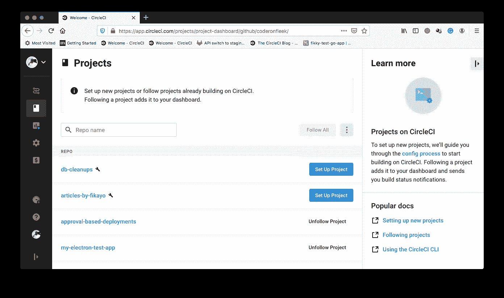

# 触发数据库清理作业| CircleCI

> 原文：<https://circleci.com/blog/triggering-jobs-for-db-clean-up/>

随着时间的推移，大型应用程序会生成“陈旧”的数据。一年前的请求日志或已交付订单的派送附件的坐标不再相关。删除冗余或过时的数据可以保持数据库干净整洁。这些类型的数据应该定期存档或从数据库中删除。

在本教程中，我将演示一种清理数据库的策略。我们将使用 [CI 管道](https://circleci.com/blog/what-is-a-ci-cd-pipeline/)中的自动调度作业清除 Node.js 应用程序中的日志数据。

## 先决条件

要完成本教程，您需要:

1.  JavaScript 的基础知识
2.  系统上安装的 [Node.js](https://nodejs.org)
3.  [Postman for desktop](https://www.postman.com/downloads/) 安装在您的系统上
4.  Heroku 或其他应用托管平台
5.  一个[圆](https://circleci.com/signup/)的账户
6.  GitHub 的一个账户

当这些项目被安装和设置后，我们就可以开始教程了。

## 克隆日志演示项目

首先，您需要克隆 Node.js 项目。我们将使用一个简单的 Node.js API 应用程序，它有一个根端点和另外两个端点，用于获取和清理日志数据。通过运行以下命令克隆项目:

```
git clone --single-branch --branch base-project https://github.com/coderonfleek/db-cleanups.git 
```

克隆过程完成后，转到项目的根目录并安装依赖项:

```
cd db-cleanups
npm install 
```

接下来，运行应用程序:

```
npm start 
```

应用程序将开始监听默认端口`3000`。打开 Postman 并向`http://localhost:3000/logs/fetch/50`端点发出一个`GET`请求。这将返回一个包含 50 个日志数据的数组，每个数据包含一个事件及其发生日期。


请注意，有些日志已经超过一年了。

## 在本地测试`logs`清理

记住，这个项目还包含一个清理过时数据的端点。下面是`server.js`中清理端点的代码:

```
app.get("/logs/clean", async (req, res) => {
  try {
    let d = new Date();
    let currentYear = d.getFullYear();
    let today = new Date(`${currentYear}-01-01`);

    let total_records_to_delete = await req.db
      .collection("logs")
      .find({
        date: {
          $lt: today
        }
      })
      .count();

    const removedResult = await req.db.collection("logs").deleteMany({
      date: { $lt: new Date(today) }
    });

    res.status(200).send({
      message: `There are ${total_records_to_delete} to delete`,
      result: removedResult
    });
  } catch (error) {
    console.log(error);
    return res.status(500).send(error);
  }
}); 
```

清理端点的处理程序脚本获取当前年份。然后，它会删除早于当前年份的所有日志记录。

在 Postman 中运行这个端点(`http://localhost:3000/logs/clean`)。


清除操作的成功消息显示，根据设置的标准，找到了 21 个要删除的过时行(该数字可能会有所不同)。删除操作的返回值在响应数据的`result`属性中被捕获。

为了最有效，应该按照对您的团队有意义的时间表定期调用像这样的清理端点。本教程的下一部分是使用计划作业自动清理。

## 创建项目的 Heroku 应用程序进行托管

我们需要部署应用程序，然后才能调度一个作业来调用它的清理端点。对于本教程，我们将创建一个 **Heroku** 应用程序。

转到您的 Heroku 仪表板，创建一个新的托管应用程序。点击**新建**，然后**新建 app** 。


设置好应用程序后，记下应用程序的名称(在本例中为`db-cleanups`)。从**账户设置**页面获取 Heroku API 密钥。稍后我们将使用 API 键在 CircleCI 上设置[环境变量](https://circleci.com/docs/env-vars/)。

## 将项目连接到 CircleCI

从[将你的项目推送到 GitHub](https://circleci.com/blog/pushing-a-project-to-github/) 开始。

**注意** : *克隆的项目可能会抛出一个关于已经被初始化为 git repo(或者已经包含远程 repo)的错误。如果发生这种情况，运行`rm -rf .git`删除任何现有的`git`工件。然后用`git init`* 重新初始化

在您提交了所有更改之后，转到 CircleCI 仪表板上的**添加项目**页面来添加项目。



点击**设置项目**。


在设置页面上，点击 **Use Existing Config** 以指示您正在手动设置配置文件，并且不使用显示的示例。接下来，您会得到一个提示，要么下载管道的配置文件，要么开始构建。


点击**开始建造**。这个构建将会失败，因为我们还没有设置配置文件。我们将在下一步中这样做。

在离开 CircleCI 控制台之前，您需要设置环境变量，以便将应用程序部署到 Heroku 上的两个环境(登台和生产)中。

从**管道**页面，选择您的应用程序，然后点击**项目设置**。


从**项目设置**侧菜单中，点击**环境变量**，然后点击**添加环境变量**。


添加这些变量:

*   `HEROKU_APP_NAME`:Heroku 应用名称项目(在本例中为`db-cleanups`)
*   你的 Heroku API 密钥

现在，您已经准备好将项目部署到 Heroku 托管平台。

## 编写部署和计划清理管道脚本

我们已经达到了本教程的主要目标，即编写一个脚本来定期调用清理端点来清除过时的日志数据。

首先在项目的根目录下创建一个名为`.circleci`的文件夹。在刚刚创建的文件夹中添加一个名为`config.yml`的配置文件。输入以下代码:

```
version: 2.1
orbs:
  heroku: circleci/heroku@0.0.10
jobs:
  build:
    executor: heroku/default
    steps:
      - checkout
      - heroku/install
      - heroku/deploy-via-git

  clean:
    docker:
      - image: circleci/node:10.16.3
    steps:
      - run:
          name: Clean Database
          command: "curl https://[YOUR_HEROKU_APP_NAME].herokuapp.com/logs/clean"

workflows:
  deploy:
    jobs:
      - build
  clean_old_logs:
    triggers:
      - schedule:
          cron: "* * * * *" # use cron syntax to set the schedule
          filters:
            branches:
              only:
                - main
    jobs:
      - clean 
```

在此脚本中，有两个作业执行以下操作:

*   `build`:使用 CircleCI [Heroku orb](https://circleci.com/developer/orbs/orb/circleci/heroku) 将日志项目部署到 Heroku
*   `clean`:运行一个`curl`命令，调用已部署应用程序的清理端点。

**注意:** *确保将`YOUR_HEROKU_APP_NAME`替换为您为 Heroku 应用程序输入的名称。*

创建部署和运行清理端点的作业后，脚本定义了两个工作流:

*   `deploy`:运行`build`任务，将应用程序部署到 Heroku
*   `clean_old_logs`:定义一个触发器，该触发器使用`cron`语法来设置时间表，并每分钟运行一次`clean`任务

在本教程中，我们每分钟触发一次`clean`作业，以演示作业如何定期运行。实际上，您应该每年运行一次这种类型的作业。使用适当的`cron`语法来实现正确的时间表。为了找出最有效的方法，您可以修改这个 [cron 时间表表达式](https://crontab.guru/#0_0_1_1_*)。

提交您的所有更改，并将代码推送到远程存储库，以运行脚本并触发部署管道。

**管道**页面显示了`deploy`工作流的运行。它还显示，每一分钟，预定的`clean_old_logs`工作流都在运行。


单击第一个`clean_old_logs`操作中的`clean`作业，查看对清理端点的调用响应。


响应从数据库中删除了 18 条记录(实际数字可能不同)。点击`clean`任务的下一次运行。响应显示有 0 个过期记录。


第一个`clean`操作删除了今年之前的所有记录。

## 结论

在本教程中，您已经使用脚本来安排清理数据库中的过时数据。定期的数据库清理是喜欢 CI/CD 管道和流程自动化的另一个原因。

编码快乐！

* * *

Fikayo Adepoju 是 LinkedIn Learning(Lynda.com)的作者、全栈开发人员、技术作者和技术内容创建者，精通 Web 和移动技术以及 DevOps，拥有 10 多年开发可扩展分布式应用程序的经验。他为 CircleCI、Twilio、Auth0 和 New Stack 博客撰写了 40 多篇文章，并且在他的个人媒体页面上，他喜欢与尽可能多的从中受益的开发人员分享他的知识。你也可以在 Udemy 上查看他的视频课程。

[阅读 Fikayo Adepoju 的更多帖子](/blog/author/fikayo-adepoju/)