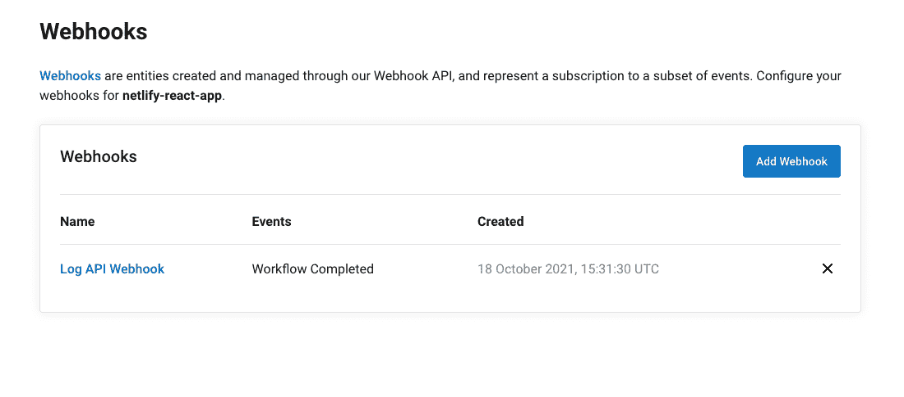

# CircleCI webhooks | CircleCI 故障排除

> 原文：<https://circleci.com/blog/troubleshooting-webhooks/>

> 本教程涵盖:
> 
> 1.  设置 CircleCI webhooks
> 2.  使用 Hookdeck CLI 隧道传输 HTTP 请求
> 3.  常见错误疑难解答

CircleCI webhooks 开辟了各种令人兴奋的用例，从数据记录和与第三方监控和可观察性解决方案的[集成到](https://circleci.com/blog/create-customizable-experiences-with-circleci-webhooks/)建立自己的定制仪表板来监控管道健康状况。为了确保您可以正确地监视事件、解决身份验证错误，以及访问事件中包含的信息，您需要一个可靠的过程来调试您可能遇到的任何错误。

在本教程中，我将向您展示如何在 CircleCI 上设置 webhook，以及如何排除 webhook 连接的常见错误，这样您就可以对您和您的团队所做的工作充满信心。

## 先决条件

首先，您需要准备一些东西，包括:

*   一个 [CircleCI 账户](https://circleci.com/signup/)和关联项目
*   [Node.js](https://nodejs.org/en/) 安装在您的系统上以运行示例项目
*   API 端点的可公开访问的 URL
*   用于编辑代码的文本编辑器

有了这个设置，您就有了一个可以方便地对 CircleCI webhooks 进行故障诊断的环境。

## 克隆和运行演示 API

首先，您将克隆一个样本 Node.js API。这个 API 接收并在内存数据库中记录您的 CircleCI webhook 信息的子集。我故意在这个应用程序中引入了一个身份验证错误和一个`not found`错误。这些是您在学习本教程时将要调试和修复的错误类型。

通过运行以下命令克隆项目存储库:

```
git clone --single-branch --branch base-project https://github.com/coderonfleek/circleci-webhooks-api 
```

通过运行以下命令，导航到项目的根目录并安装所需的依赖项:

```
cd circleci-webhooks-api
npm install 
```

安装完成后，使用以下命令运行 Node.js 服务器:

```
npm start 
```

这将启动 API 应用程序，并在屏幕上打印一条消息，指示 API 正在运行并监听端口`1337`上的连接。

我们在这个项目中使用两个端点:

*   `/log-circleci-webhook`是将接收 CircleCI webhook 并将其记录到内存数据库中的端点。它记录了一个简单的对象，该对象包含来自 webhook 有效负载的信息子集。
*   可以调用`/fetch-webhooks-logs`端点来检索记录的 webhook 数据的集合。

## 使用 Hookdeck CLI 排除 CircleCI webhooks 故障

对 webhooks 进行本地故障排除需要您有一个可公开访问的 URL。但是，本地运行的 API 没有可公开访问的端点。您需要一种方法使您的本地端点可以公开访问，这可以通过使用 HTTP 请求隧道系统来实现。

HTTP 请求隧道系统有助于将您的 webhooks 隧道到您的本地开发环境中，以您的本地 API 上的端点为目标。

有许多开源工具可以帮助您实现这一点。我发现最方便的是 [Hookdeck CLI](https://hookdeck.com/cli) 。Hookdeck CLI 不仅为您提供了一个指向本地 API 端点的可公开访问的 URL，而且它还提供了报告、一个查看您的头文件和有效负载的事件页面，以及其他使调试 webhooks 不那么令人沮丧的工具。

您可以运行以下命令来安装 macOS 的 CLI 工具:

```
brew install hookdeck/hookdeck/hookdeck 
```

如果您使用的是 Windows 操作系统，请使用以下命令安装 CLI 工具:

```
scoop bucket add hookdeck https://github.com/hookdeck/scoop-hookdeck-cli.git
scoop install hookdeck 
```

对于 Linux 用户，你可以按照这里的说明在 Linux 上安装该工具[。](https://hookdeck.com/cli)

## 获取 CircleCI webhook URL

下一步是使用 CLI 生成指向正在运行的 API 应用程序的 webhook URL。运行以下命令:

```
hookdeck listen 1337 
```

此命令会启动一个交互式会话，在该会话中，CLI 会收集有关您将要创建的端点的信息。回答下表中记录的问题。确保在每次回答后按下**回车**。

*   问:你的新源标签应该是什么？
*   问:webhooks 应该被转发到什么路径(即:/webhooks)？
*   问:什么是连接标签(即:我的 API)？
    *   答:我的 CircleCI Webhooks 服务器

CLI 使用您输入的信息来生成 URL。当该过程完成时，URL 被打印到屏幕上。然后，CLI 指示它已准备好接收请求。

```
fikayo $ hookdeck listen 1337
🚩 Not connected with any account. Creating a guest account...
? What should be your new source label? CircleCI
? What path should the webhooks be forwarded to (ie: /webhooks)? /log-circleci-w? What's your connection label (ie: My API)? My CircleCI Webhooks Server

Dashboard
👤 Login URL: https://api.hookdeck.com/signin/guest?token=13cpjezttzt1ll5w0jb1403lj8sd8t5j2dbfv2di6k1kpshgop
Sign up in the dashboard to make your webhook URL permanent.

👉 Inspect and replay webhooks: https://dashboard.hookdeck.com/cli/events

circleci Source
🔌 Webhook URL: https://events.hookdeck.com/e/src_A345Rx6enuPRpUFuc526wiua

Connections
my-circleci-webhooks-server forwarding to /log-circleci-webhook

> Ready! (^C to quit) 
```

**注意:** *您需要使用控制台中的访客链接来访问仪表板。*

将`Login URL`复制并粘贴到您的浏览器中，开始访客登录会话。

确保侧菜单上的连接状态显示`Connected`。

## 设置 CircleCI webhook

有了你的 webhook URL，你现在可以在 CircleCI 上设置一个 webhook 了。转到你的任何 CircleCI 项目，导航到**项目设置> Webhooks** 。在 Webhooks 页面，点击**添加 Webhook** 。

像这样填写表单上的字段:

*   **Webhook 名称:**输入 Webhook 的描述性名称。使用类似`Log API Webhook`这样简单的东西。
*   **接收者 URL:** 将 Hookdeck CLI 输出中的 webhook URL 粘贴到此处。
*   **秘密令牌:**这是一个安全特性，允许你验证你的 webhook 来源(稍后会详细介绍)。在此输入数值`ABCD123`。
*   **证书验证:**如果选中此项，则验证您的 API 上的 SSL 证书是真实的和最新的。单击此框。
*   **事件:**检查**工作流完成**事件。


点击**添加网页挂钩**创建你的网页挂钩。它将显示在可用网页挂钩列表中。



接下来，确认您现在可以从 CircleCI 项目接收 webhooks 了。要运行项目构建，请执行以下操作之一:

*   进行新的提交
*   点击**从开始处重新运行工作流程**

构建完成后，转到运行 Hookdeck CLI 会话的终端。您应该有一个新条目。


CLI 上的条目确认您正在成功接收 webhook。但是有一个`500`服务器错误。

CLI 上的 webhook 条目按顺序由 4 个元素组成:

1.  HTTP 状态代码(`500`)
2.  请求方法(`POST`)
3.  您配置 CLI 以将 webhooks 路由到的端点(`/log-circleci-webhook`)
4.  活动页面 URL，您可以在此查看您的网页挂钩的详细信息

继续下一节，修复`500`错误。

## 身份验证错误故障排除

在做出任何假设之前，使用事件的页面检查服务器响应。从 Hookdeck CLI 会话中复制事件页面链接，并将其加载到您的浏览器中。


在这个页面上，您可以查看您刚刚收到的 webhook 的所有详细信息。花点时间查看一下**标题**部分。


查看**主体**部分中的 webhook 有效载荷。


向下滚动到**尝试**部分。单击红色状态代码标记，查看服务器响应的详细信息。


响应消息显示我们没有通过 webhook 有效负载的安全检查。因为我们定义了一个 API `secret`，CircleCI 发送`circleci-signature`头。该报头包含真实有效载荷的加密版本，并且必须对照通过使用秘密密钥接收的未加密有效载荷进行验证。

这是一项安全检查，目的是防止攻击者用可能破坏您的 API 的恶意有效负载替换实际有效负载。

我们知道我们正在接收来自 CircleCI 的实际有效载荷，因为我们设置好了一切并触发了 webhook。我们知道导致身份验证失败的不是攻击者的有效负载。我们的设置一定是出了什么问题。

我们的下一步是回顾 API 上的验证逻辑。这可以在`server.js`文件中找到。

```
//Validate payload
function validatePayload(req, res, next) {
  if (req.method == "POST") {
    if (!req.rawBody) {
      return next("Request body empty");
    }

    const sig = Buffer.from(req.get(sigHeaderName) || "", "utf8");
    const hmac = crypto.createHmac(sigHashAlg, secret);
    const digest = Buffer.from(
      "v1=" + hmac.update(req.rawBody).digest("hex"),
      "utf8"
    );

    if (sig.length !== digest.length || !crypto.timingSafeEqual(digest, sig)) {
      return next(
        `Request body digest (${digest}) did not match ${sigHeaderName} (${sig})`
      );
    }
  }

  return next();
}
app.use(validatePayload); 
```

代码中使用的三个变量值得检查，以确认它们引用了正确的值。这些是:

*   `sigHeaderName`，代表 CircleCI 发送的签名头名称。
*   `sigHashAlg`，用于加密的算法。
*   `secret`，这是我们 CircleCI webhook 上设置的 API secret。

这些值设置在`server.js`文件的第 10-12 行。以下是这些定义的代码:

```
const sigHeaderName = "circleci-signature";
const sigHashAlg = "sha256";
const secret = "XXX-XXX"; 
```

你发现错误了吗？如果这个秘密与我们在 webhook 表单中设置的不一样，那么验证总是会失败。

CircleCI 不允许您再次查看您在 webhooks 中设置的 API 秘密；你只能重置它。这就是为什么你需要确保你记住这个值或者把它存放在安全的地方。

对于本教程，我们知道我们将秘密设置为一个简单的`ABCD123`字符串。在真实的应用程序中，您会想要设置一个更复杂的秘密，并从代码中的环境变量引用它。

将`secret`的值更改为正确的值，保存文件，并重启服务器。

要测试修复，您需要触发一个新的 webhook。您可以在 CircleCI 项目上触发另一个构件。如果不想等待新的构建，可以使用**重试**按钮来重新运行 webhook。**重试**按钮在**书签**按钮旁边的活动页面顶部。

在您点击**重试**之后，一个新的请求将被列在事件页面的**尝试**部分。


CLI 上将会有一个新的 webhook 条目。


干得好！我们已经清除了`500`错误，但是现在我们有了一个新的错误。这个`404` not found 错误表示找不到我们指定的端点(`/log-circleci-webhook`)。

## 排除“未找到”错误

我们的第二次 webhook 尝试在目的地端点上导致了一个`404`错误。这告诉我们，即使我们成功地接收了 webhooks，端点也不在指定的位置，或者它不存在。大多数情况下，可以通过检查指定路线名称中的拼写错误来修复错误。最坏的情况是，路由确实不存在，需要创建。

点击**尝试**部分的红色 **404** 徽章，查看服务器对此错误的响应。


这显示了来自正在运行的服务器的实际响应，并确认无法找到指定的端点。

为 webhook 指定的要命中的端点是`/log-circleci-webhook`，可以在项目目录根目录下的`routes.js`文件中找到。

```
router.post("/log-circleci-hook", async function (req, res) {
  //console.log(req.body);

  const payload = req.body;

  let webhook_info = {
    name: payload.webhook.name,
    project: payload.project.name,
    workflow: payload.workflow.name,
    status: payload.workflow.status
  };

  const save_webhook = await req.db
    .collection("webhooks")
    .insertOne(webhook_info);

  res.status(201).send({
    message: "Webhook Event successfully logged"
  });
}); 
```

仔细检查路由处理程序发现了一个错别字。第 10 行的`webhook`被错误地拼写为`hook`。纠正拼写错误并保存文件。

您需要重新启动 Node.js 服务器，以使更改生效。使用`Ctrl + C`关闭服务器，然后使用`npm start`命令重启。

再次点击**重试**按钮，查看新 webhook 请求的尝试部分。成功的 webhook 将由`201`状态代码指示。


在您的 Hookdeck CLI 会话中也会有一个 webhook 条目。


我们的 API 操作成功。

在**尝试**部分，单击绿色状态标记以显示服务器响应。服务器返回成功消息。


随着对我们的 API 的成功操作，我们的 webhook 应该被记录。访问端点`/fetch-webhooks-logs`以查看集合。


## 结论

就像应用程序的任何其他架构组件一样，webhooks 可能会出错。开发应用程序或设置应用程序基础结构时，调试是工作流的一部分。错误是不可避免的，因此知道当某个错误发生时要注意什么，并拥有正确的工具来调试它们，可以使故障排除更快、更容易。

在本文中，我们已经演示了如何调试 CircleCI webhooks，以便清楚地了解正在发生的错误。

编码快乐！

* * *

Fikayo Adepoju 是 LinkedIn Learning(Lynda.com)的作者、全栈开发人员、技术作者和技术内容创建者，精通 Web 和移动技术以及 DevOps，拥有 10 多年开发可扩展分布式应用程序的经验。他为 CircleCI、Twilio、Auth0 和 New Stack 博客撰写了 40 多篇文章，并且在他的个人媒体页面上，他喜欢与尽可能多的从中受益的开发人员分享他的知识。你也可以在 Udemy 上查看他的视频课程。

[阅读 Fikayo Adepoju 的更多帖子](/blog/author/fikayo-adepoju/)