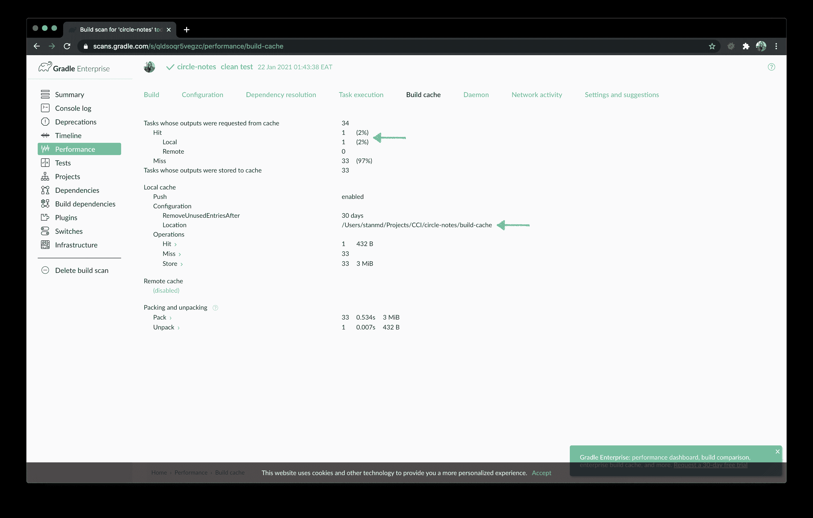

# 使用构建缓存| CircleCI 加速您的 Android Gradle 构建

> 原文：<https://circleci.com/blog/turbocharging-your-android-gradle-builds-using-build-cache/>

Gradle [构建缓存](https://docs.gradle.org/current/userguide/build_cache.html)旨在通过重用先前构建产生的输出来帮助您节省时间。它的工作方式是存储(本地或远程)构建输出，并允许构建在确定输入没有改变时从缓存中获取这些输出。构建缓存使您能够避免重复工作以及重新生成耗时且昂贵的流程的成本。

使用构建缓存可以为您带来以下好处:

*   使用本地缓存加速开发人员构建
*   在 CI 构建之间共享结果
*   通过重用 CI 结果加速开发人员构建
*   将远程结果与本地缓存相结合以获得复合效果

构建缓存允许您在团队中共享和重用未更改的构建和测试输出。这加速了本地和 CI 构建，因为不会浪费周期来重新构建不受新代码更改影响的组件。

**注意** : *Gradle 企业构建缓存支持 Gradle 和 Maven 构建工具环境。*

## 先决条件

要遵循本教程，需要做一些事情:

1.  对 [Gradle 构建工具](https://gradle.org/)的基本理解
2.  如何在 [CircleCI](https://circleci.com/docs/language-android/) 上建立 Android 项目的知识
3.  了解 [Android 构建流程](https://developer.android.com/studio/build)。

## 构建应用程序

为了节省时间，我们将使用本系列前一篇教程中的一个入门项目 [Gradle build 扫描 Android 项目:本地和 CI 构建](/blog/gradle-build-scans-for-android-projects-local-and-ci-builds/)。在这里下载启动项目[。我们还将使用 Gradle 的构建缓存](https://github.com/CIRCLECI-GWP/circle-notes)[文档](https://docs.gradle.org/current/userguide/build_cache.html)。

要开始，请单击 Android Studio 上的运行按钮。

 </blog/media/2020-07-19-circle-notes.mp4> 

**注意** : *如果 app 不在 Android Studio 上运行，通过从**文件**菜单中选择**无效缓存/重启**来使缓存无效并重启。*

## 设置分级构建缓存

对于本教程，我们使用的是 Gradle 版本 6.7。这是对前一教程的更改，因此将提示您更新项目文件。

首先，将文件`gradle/wrapper/gradle-wrapper.properties`中的最后一行改为:

```
distributionUrl=https\://services.gradle.org/distributions/gradle-6.7-all.zip 
```

另一个变化是我们将使用`com.gradle.enterprise`作为插件 ID。这个插件必须应用在项目的`settings.gradle`文件中。

更新`settings.gradle`文件:

```
plugins {
    id "com.gradle.enterprise" version "3.4.1"
}
include ':app' 
```

作为最后的改变，移除`build.gradle`中的`plugins`块(线 24-26)。这种格式在 Gradle 6.7 中已被弃用。

如果你愿意，你可以使用项目的[替代设置分支。在这个](https://github.com/CIRCLECI-GWP/circle-notes/tree/alternative-setup) [GitHub pull 请求](https://github.com/CIRCLECI-GWP/circle-notes/pull/1/files)中可以看到上面概述的对项目文件的更改。

这样一来，我们可以继续了。

## 启用分级构建缓存

默认情况下，不启用构建缓存。您可以通过几种方式启用构建缓存:

1.  在命令行上，运行带有`--build-cache`标志的任务。Gradle 将只为这次构建使用构建缓存。

2.  将`org.gradle.caching=true`放到你的`gradle.properties`文件中。Gradle 将尝试在所有构建中重用以前构建的输出。您可以通过使用`--no-build-cache`标志来防止 Gradle 重用任何文件的输出。

对于本教程，我们将使用第二个选项。打开`gradle.properties`文件并新建一行:

```
org.gradle.caching=true 
```

## Gradle 构建缓存的工作原理

让我暂停一下，给你一些关于构建缓存如何工作的背景知识。这将有助于教程，你可以与你的团队分享信息。Gradle 支持本地和远程构建缓存。每个都可以单独配置。当两个构建缓存都启用时，Gradle 首先尝试从本地构建缓存加载构建输出。如果没有找到构建输出，Gradle 会尝试远程构建缓存。如果在远程缓存中找到输出，那么它们也存储在本地缓存中，所以下次它们将在本地被找到。


Gradle 有 3 层重用，防止不必要的执行潜在的昂贵任务。这些层使您在以下 3 个目标场景中的构建速度更快:

1.  在开发人员连续运行一个 Gradle build 的过程中，很多东西保持不变是很常见的。Gradle 增量构建特性只执行自上次执行以来发生了变化的任务。

2.  开发人员通常在许多分支上维护许多工作区，以执行逻辑上不同的任务。本地缓存允许跨工作区和分支机构快速重用输出，而无需通过任何网络。

3.  CI 节点和开发人员通常使用相同的变更集运行相同的任务。远程缓存允许输出在用户和构建代理之间重用，这样您的团队就不必两次构建相同的东西。

**注意** : *Gradle 在任何`enabled`并且`BuildCache.isPush()`设置为 true 的构建缓存中存储(“推送”)构建输出。*

## 配置梯度构建缓存

下一步是通过使用`settings.gradle`文件的`Settings.buildCache(org.gradle.api.Action)`块来配置构建缓存。我们将从配置本地缓存开始，然后转到远程缓存。

### 配置内置的本地构建缓存

内置的本地构建缓存`DirectoryBuildCache`，使用一个目录来存储构建缓存工件。默认情况下，该目录存储在 Gradle 用户主目录中，但其位置是可配置的。

Gradle 将通过删除最近没有使用的条目来定期清理本地缓存目录。

有关配置选项的更多详细信息，请参考 DirectoryBuildCache 的 [DSL 文档。](https://docs.gradle.org/current/dsl/org.gradle.caching.local.DirectoryBuildCache.html)

将这段代码添加到`settings.gradle`文件中:

```
...

buildCache {
    local {
        enabled = true
        directory = new File(rootDir, 'build-cache')
        removeUnusedEntriesAfterDays = 30
    }
    remote(HttpBuildCache) {
        enabled = false
    }
} 
```

同步项目。


从 Android Studio 工具栏中，选择**构建**，然后选择**重建**。这将在`build-cache`目录中生成工件。


将`build-cache`文件夹添加到`.gitignore`中。这种添加阻止您将工件提交到源代码控制。

将以下内容添加到`.gitignore`文件中:

```
...
# Local build cache
build-cache 
```

接下来，在您的本地机器上运行以下步骤序列。这些步骤将使您的构建在本地运行时完全可缓存，无论项目位于何处:

1.  删除存储在`build-cache`目录中的本地构建缓存
2.  在命令行上运行`./gradlew clean test` Gradle 任务
3.  重新运行`./gradlew clean test`,以便它使用您在上一步中生成的本地构建缓存
4.  确保两个版本都成功，并访问它们的版本扫描链接


单击链接打开每个构建扫描。

如果这是您第一次使用，系统会提示您输入电子邮件地址，以便您可以将构建扫描链接发送给您。输入您的电子邮件地址，单击“Go”。检查您的电子邮件中的版本扫描通知，然后单击链接打开您的版本扫描。


如果您已经激活了构建扫描，Android Studio 的链接会将您重定向到一个没有“激活构建扫描”和“发送电子邮件”步骤的页面。

通过查看性能选项卡的构建缓存部分，确保缓存配置正确。




**注意:** *注意，截图中的第二个链接有 100%的输出请求来自缓存。*

从第二个构件的构件扫描中，单击**时间轴**。确保没有可缓存的任务做任何工作。在您的构建扫描 URL 的末尾，添加:

`/timeline?cacheableFilter=cacheable&outcomeFilter=SUCCESS`


您还可以观察还不可缓存的构建任务。在您的构建扫描 URL 的末尾，添加:

`/timeline?cacheableFilter=any_non-cacheable&outcomeFilter=SUCCESS`


### 使用远程 HTTP 构建缓存

Gradle 内置了对通过 HTTP 连接到远程构建缓存后端的支持。使用以下配置，本地生成缓存用于存储生成输出，而本地和远程生成缓存用于检索生成输出。

**注意** : *对于这个实现，您需要一个[构建缓存节点](https://docs.gradle.com/build-cache-node/)。如果你还没有创建一个构建缓存节点，你可以使用[这个](http://34.75.139.200:5071/)。*

更新`settings.gradle`文件的内容:

```
plugins {
    id "com.gradle.enterprise" version "3.4.1"
}
include ':app'

boolean isCiServer = System.getenv().containsKey("CI")

buildCache {
    local {
        enabled = false
        directory = new File(rootDir, 'build-cache')
        removeUnusedEntriesAfterDays = 30
    }
    remote(HttpBuildCache) {
        url = 'http://34.75.139.200:5071/cache/'
        allowUntrustedServer = true
        enabled = true
        push = !isCiServer
    }
} 
```

这个片段使我们的项目能够从`HttpBuildCache`加载工件。将`url`(第 15 行)追加到`/cache/`，更新到您的`build cache node`链接。请注意结尾的斜线。在这种情况下，我使用了之前分享的 URL。

同步项目:


远程构建缓存配置有几个有用的属性:

*   `url`是共享远程构建缓存后端的位置
*   如果您不使用自签名或不受信任的证书，请使用`allowUntrustedServer`参数。
*   `enabled`激活或禁用远程构建缓存
*   如果您的持续集成服务器使用干净的构建来填充远程构建缓存，而开发人员从远程构建缓存中提取构建，并将其推送到本地构建缓存，则使用`push`

在本地计算机上运行下一系列步骤。完成这些步骤将使您的构建在本地运行时完全可缓存，无论项目位于何处。这些步骤类似于我们之前对本地缓存所做的。

1.  删除存储在`build-cache`目录中的本地构建缓存
2.  在命令行上运行`./gradlew clean test` Gradle 任务
3.  再次运行`./gradlew clean test` Gradle 任务
4.  确保两个版本都成功，并访问它们的版本扫描链接
5.  在构建扫描中，转到性能选项卡上的构建缓存部分，以确保缓存配置正确


现在，您已经确认了远程构建缓存正在按预期工作。恭喜你！

现在，更新设置，以确保它按照 CI 构建的预期工作。因为我们已经验证了可以从本地项目推送至远程缓存，所以我们应该将这种推送限制在 CI 环境中。

### 为 CircleCI 设置

下面是一个更新的`settings.gradle`文件，展示了 CI 推送用例的推荐设置:

```
plugins {
    id "com.gradle.enterprise" version "3.4.1"
}
include ':app'

boolean isCiServer = System.getenv().containsKey("CI")

buildCache {
    local {
        enabled = true
        directory = new File(rootDir, 'build-cache')
        removeUnusedEntriesAfterDays = 30
    }
    remote(HttpBuildCache) {
        url = 'http://34.75.139.200:5071/cache/'
        allowUntrustedServer = true // Allow untrusted cache server
        enabled = true
        push = isCiServer
    }
} 
```

清除您的`remote build cache node`,以便当我们检查 CI 推送机制是否工作时，不存在任何工件。


在您进行代码更改之后，将它们提交到源代码控制并推送到您的远程分支。

在成功的 CI 构建之后，在 Circle CI 仪表板上的 **Run Tests** 作业下找到构建扫描。


在浏览器中打开构建扫描。在构建扫描的性能选项卡上，查看构建缓存部分以确保缓存配置正确。


这是上一张截图上显示的项目的关键。

*   (1)来自本地和远程构建缓存的命中
*   (2)本地缓存已启用
*   (3)本地缓存路径
*   (4)远程缓存已启用
*   (5)远程缓存 URL 路径

检查远程构建缓存节点，确保缓存工件被保存。


## 结论

在本教程中，您学习了如何:

*   在我们的项目中启用构建缓存
*   为本地和 CI 生成配置生成缓存。
*   向你的朋友和团队成员解释构建缓存是如何工作的
*   查看构建扫描信息以确认缓存按预期工作

这样，您就可以有意义地改进您的构建性能并提高开发人员的生产率。对于下一个相关教程，请参见[使用 GCP](https://circleci.com/blog/deploying-gradle-build-cache-node-to-gcp/) 部署您的 Gradle build 缓存节点或者[在 Android 项目中使用 Gradle Build 扫描](https://circleci.com/blog/gradle-build-scans-for-android-projects-local-and-ci-builds/)。

* * *

Taracha 是一个创造者，他的使命是帮助公司用最简单的方式解决复杂的问题。他关心寻找他热爱的愿景&事业，并利用技术帮助这些公司解决他们的挑战。

他有超过 6 年的本地移动应用程序开发经验&大约 4 年的 web 应用程序开发经验。

他目前是 Premise Data 的高级软件工程师，负责新产品功能的开发和部署，对开发人员生产力工程领域特别感兴趣。