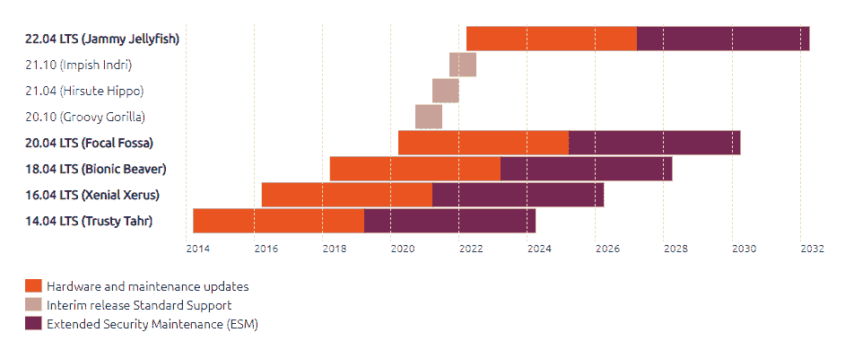

# 弃用 Ubuntu 14.04 和 16.04 映像:使用现代 Ubuntu | CircleCI 保持安全

> 原文：<https://circleci.com/blog/ubuntu-14-16-image-deprecation/>

CircleCI 的 Ubuntu 14.04 和 16.04 Linux 虚拟机(VM)镜像将于 2022 年 3 月下旬、2022 年 4 月下旬和 2022 年 5 月中旬暂时不可用，并且它们将于 2022 年 5 月 31 日永久不可用。如果你正在使用这些镜像，在 2022 年 5 月底 14.04 和 16.04 镜像被移除之前，用一个[更新的 Ubuntu `machine`镜像](https://circleci.com/docs/configuration-reference/#available-machine-images)更新你的配置。

## Ubuntu 14.04 和 Ubuntu 16.04 映像现在已被弃用

截至 2022 年 2 月 15 日，与我们的 [`machine`执行程序](https://circleci.com/docs/executor-types/#using-machine)一起使用的 Ubuntu 14.04 和 16.04 Linux VM 镜像已被弃用。这意味着将不会有新的版本或对这些图像的支持。当这些映像在 2022 年 5 月 31 日达到寿命终止(EOL)时，任何利用 Ubuntu 14.04 或 16.04 映像的管道都将失败。

如果您的任何项目目前使用受影响的映像，我们将直接联系您的团队，鼓励您迁移到更新的 Ubuntu 映像。但是，我们意识到电子邮件通知很容易被错过，因此在通知期结束后，我们还会对受影响的映像实施偶尔的限电或短暂的不可用，直到停产日期。

## Ubuntu 图像弃用时间表

请参考下表，了解关于弃用旧 Ubuntu 映像的重要日期:

| **日期** | **发生了什么** |
| 2022 年 2 月 15 日 | 通知电子邮件发送给受影响的团队。CircleCI 的 [Ubuntu 20.04 映像已经对想要立即迁移的团队可用](https://circleci.com/developer/images?imageType=machine)。 |
| 2022 年 3 月 29 日 | CircleCI 发布首张 Ubuntu 22.04 测试版图片。 |
| 2022 年 3 月 29 日 | **首次限电。**被弃用的图像将在以下时间段内每次 10 分钟不可用:

-UTC 00:00—00:10&UTC 01:00—01:10
-UTC 10:00—10:10&UTC 11:00—11:10
-UTC 15:00—15:10&UTC 16:00—16:16 |
| 2022 年 4 月 25 日 | CircleCI 发布 Ubuntu 22.04 稳定镜像。 |
| 2022 年 4 月 26 日 | 第二次限电。不推荐使用的映像将在以下时间段内每次 60 分钟不可用:

-UTC 00:00—01:00
-UTC 10:00—11:00
-UTC 15:00—16:00

[(时区助手)](https://www.timeanddate.com/worldclock/meetingdetails.html?year=2022&month=4&day=26&hour=0&min=0&sec=0&p1=224&p2=136&p3=248&p4=179)

任何引用这些映像的作业都将收到一个`failed to create host: Image <image-name> is not supported`错误。 |
| 2022 年 5 月 19 日 | **第三次限电。**不推荐使用的映像将在以下时间段内一次不可用 3 小时:

-UTC 00:00—03:00
-UTC 08:00—11:00
-UTC 16:00—19:00

[(时区助手)](https://www.timeanddate.com/worldclock/meetingdetails.html?year=2022&month=5&day=19&hour=0&min=0&sec=0&p1=224&p2=136&p3=248&p4=179)

任何引用这些映像的作业都将收到一个`failed to create host: Image <image-name> is not supported`错误。

Ubuntu 22.04 成为`machine: true`的新默认图像 |
| 2022 年 5 月 31 日 | **Ubuntu 14.04 & 16.04 生命终结。**这些图像永久不可用。 |

受影响图像的第一次限电将于 2022 年 3 月 29 日进行，随后将于 2022 年 4 月 26 日进行另一轮限电，第三次将于 2022 年 5 月 19 日进行。任何依赖于这些图像的管道运行将在指定的限电期间失败。14.04 和 16.04 映像将于 2022 年 5 月 31 日永久删除，使用受影响映像的管道将永久失败，直到指定更新的映像。

## 为什么 Ubuntu 14.04 和 16.04 镜像被弃用？

CircleCI 致力于为您和您的团队提供最稳定、最安全的体验。放弃我们的 Ubuntu 14.04 和 16.04 映像而支持新版本有几个好处，包括改进上游支持和增强基于 Linux VM 管道的安全性和兼容性。

### 上游支持

简单明了，Ubuntu 14.04 和 16.04 镜像老了！Ubuntu 背后的企业赞助商 Canonical 于 2019 年停止支持 Ubuntu 14.04，2021 年停止支持 16.04。这可以在下面的图表中看到，Ubuntu 的标准支持窗口(CircleCI 和大多数提供商提供的图片)是橙色的。



### 安全性和兼容性

缺少对这些图像的上游支持意味着缺少错误修复和安全更新。这意味着没有新版本的包含软件，如 Node.js、Python、OpenJDK 等。但更重要的是，当安全漏洞影响到行业时，我们无法为您提供更新的图像。

诸如 [log4j CVEs](https://cve.mitre.org/cgi-bin/cvename.cgi?name=CVE-2021-44228) 、GitHub 的 [OpenSSH 协议弃用](https://github.blog/2021-09-01-improving-git-protocol-security-github/)、[让我们加密证书过期](https://letsencrypt.org/docs/dst-root-ca-x3-expiration-september-2021/)等安全问题在这些映像上要么极其困难，要么几乎不可能缓解。随着年龄的增长，这个问题会越来越严重。

## Ubuntu 14.04 和 16.04 镜像弃用对我有影响吗？

如果您的任何项目使用了一个或多个受影响的图像，我们将通过电子邮件直接通知您或您团队中的其他人。由于电子邮件有时会被忽略，我们也将对受影响的图像实施限制。这些将是一个准确的指标，当这些图像在 5 月底被永久删除时，项目是否会受到影响。提醒一下，请查看上表了解确切日期。

要自行检查项目，您可以参考以下受影响图像的完整列表。

**以下基于 Ubuntu 14.04 的图像将被移除**:

*   `machine: true`(见下面的注释)
*   circleci/classic:201703-01
*   circleci/classic:201707-01
*   circleci/classic:201708-01
*   circleci/classic:201709-01
*   circleci/classic:201710-01
*   circleci/classic:201710-02
*   circleci/classic:201711-01
*   圆形/经典
*   circleci/classic:最新
*   circle ci/经典:边缘

**注意:**使用默认镜像意味着你在你的配置中使用了`machine: true`，因此得到了一个基于 Ubuntu 14.04 的镜像。如果你运行的是 [CircleCI 服务器](https://circleci.com/docs/server-3-overview/)或 [CircleCI 运行程序](https://circleci.com/docs/runner-overview/)，那么这不适用于你。否则，这种反对意见适用，您需要切换到受支持的映像。

此外，**以下基于 Ubuntu 16.04 的图像将被删除**:

*   circleci/classic:201808-01
*   ubuntu-1604:201903-01
*   ubuntu-1604:202004-01
*   ubuntu-1604:202007-01
*   ubuntu-1604:202010-01
*   ubuntu-1604:202101-01
*   ubuntu-1604:202104-01

这是其中一个图像在您的配置中的外观示例:

```
jobs:
  my-job:
    machine:
      image: ubuntu-1604:202010-01 
```

## 如何迁移到受支持的 Ubuntu 映像

根据您的技术需求，有几种方法可以将您的项目迁移到受支持的 Ubuntu 映像。两种最常见的方法是使用 Docker 便利映像而不是 VM，以及更新您的配置以使用更新的 Ubuntu `machine`映像。

### 试试我们的便利图片

首先要考虑的是您的团队是否真的需要首先使用 Linux 机器/VM 镜像。我们有一批基于 Docker 的图像，称为[便利图像](https://circleci.com/developer/images)，快速灵活，涵盖大多数用例。《T2 如何选择遗嘱执行人》可以帮你做出决定。

### 切换到更新的 Ubuntu 机器镜像

认定`machine`执行人是一个要求？太好了。我们有一个受支持的 Ubuntu 20.04 映像，您可以从今天开始使用。关于这个和任何其他虚拟机镜像的信息可以在[开发者中心](https://circleci.com/developer/machine/image/ubuntu-2004)找到。有关迁移到较新映像的信息可以在以下两个 CircleCI 文档页面中找到:

**注:** Canonical 将在 4 月发布下一个 Ubuntu 长期支持(LTS)版本 Ubuntu 22.04。CircleCI 将于 3 月 29 日发布该图像的测试版，并定期更新，直到 4 月 25 日正式发布，即 Canonical 提供其正式发布版本的几天后。有关日期，请参见上面的时间表。

## 结论

如果您的任何项目当前使用 Ubuntu 14.04 和 16.04，请计划尽快迁移过时的映像。如果您在 2022 年 3 月、4 月和 5 月的限电日期之前迁移，您的管道将不会受到影响。在 5 月 31 日截止日期之前迁移这些映像是至关重要的，因为在此日期之后，所有仍然使用基于 Ubuntu 14.04 或 16.04 的机器映像的构建都将失败。

如果您有任何关于您的项目是否受到弃用影响或者如何迁移到受支持的 Ubuntu 映像的问题，请[联系支持](https://support.circleci.com/hc/en-us/articles/4421154407195)。