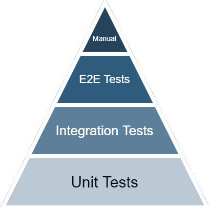

# 单元测试与集成测试

> 原文：<https://circleci.com/blog/unit-testing-vs-integration-testing/>

软件是为实际应用而发明的最复杂的工具之一。一个放错位置的字符可能会破坏整个应用程序。因此，在发布任何代码之前，仔细的测试是一个基本要求。在本文中，您将了解两种基本的软件测试类型，**单元测试**和**集成测试**，以及您的团队如何在您的 [CI/CD 管道](/blog/what-is-a-ci-cd-pipeline/)中实现它们，以快速验证您的代码，并满怀信心地向您的用户交付新功能。

这些年来，DevOps 团队和开发人员已经引入了几种软件测试的方法。这些方法中的大多数已经找到了进入测试金字塔的一个或另一个变体的方法。在大多数情况下，单元测试和集成测试构成了金字塔的两个基础层，强调了它们在全面测试策略中的重要性:

虽然这形成了一个很好的图表，但实际上在单元测试、集成测试和许多其他类型的测试之间没有清晰的界限。不同的测试类别不是排他的，而是互补的。因此，虽然开发人员可能会争论单元测试和集成测试的相对重要性，但是在您的持续集成管道中找到使用这两种测试的理想位置对您的团队最有利。但是，在这样做之前，您需要了解这两种测试的基础。

## 什么是单元测试？

单元测试集中在整个应用程序的一个单独的部分，通常是一个单独的类或函数。理想情况下，被测组件没有副作用,因此尽可能容易隔离和测试。

实际上，DevOps 不可能总是达到这种隔离级别。这时测试开始变得更具挑战性。

其他因素会限制单元测试的能力。例如，在带有访问修饰符(如 private 或 public)的编程语言中，不能测试私有函数。特殊的编译器指令或标志有时有助于避开这些限制。否则，您需要应用代码更改，以使这些受限的帮助器可用于单元测试。

使单元测试成为好选择的一个关键因素是它的执行速度。因为这些测试应该是无副作用的，所以您会想要直接运行它们，而不需要任何其他系统的参与。理想情况下，这不包括对底层操作系统的依赖，例如文件系统访问或网络功能。实际上，可能存在一些依赖性。其他的依赖关系可以被交换出来，以便进行独立的测试。这个过程叫做[嘲讽](/blog/how-to-test-software-part-i-mocking-stubbing-and-contract-testing/)。

单元测试也是高级软件开发过程的核心，称为测试驱动开发。在测试驱动的开发过程中，DevOps 专业人员和开发人员在实际实现之前编写测试。目标是在实现之前推出单个单元的规范。

尽管执行这种合同可能很有吸引力，但也有明显的不利之处。规范需要精确，测试人员至少需要从概念的角度了解部分实现。这个需求与一些敏捷原则相矛盾。

既然我们已经详细探讨了单元测试，我们可以了解集成测试的不同之处。

## 什么是集成测试？

我们已经了解到，在实践中，单元测试的隔离属性对于某些功能可能是不够的。在这种情况下，一个解决方案是测试应用程序的各个部分如何作为一个整体协同工作。这种方法被称为集成测试。

与单元测试不同，集成测试从一开始就考虑副作用。这些副作用甚至可能是可取的。

例如，集成测试可以使用到数据库的连接(单元测试中的依赖项)来查询和改变数据库，就像它通常会做的那样。您需要准备数据库，然后正确地读出它。DevOps 经常“嘲笑”这些外部资源，就像单元测试中使用嘲笑一样。这导致掩盖了由 API 引起的超出其控制的故障。

集成测试有助于通过检查应用程序或特定单元的实现来发现不明显的问题。集成测试在几个应用程序部分的相互作用中发现缺陷。有时，这些缺陷很难跟踪或重现。

虽然各种测试类别之间的界限很模糊，但是集成测试的关键属性是它处理应用程序的多个部分。虽然单元测试总是从单个单元中获取结果，比如一个函数调用，但是集成测试可能会从不同的部分和来源聚集结果。

在集成测试中，没有必要模仿应用程序的各个部分。您可以替换外部系统，但是应用程序以集成的方式工作。这种方法可以用于 CI/CD 管道中的验证。

## CI/CD 中的单元测试和集成测试

测试需要运行才能有效。自动化测试的最大优势之一是它们可以无人值守地运行。根据大多数 DevOps 原则，在 CI/CD 管道中自动化测试被认为是一种最佳实践，即使不是强制性的。

当系统能够并且应该触发测试时，有多个阶段。首先，测试应该在有人将代码推到一个主要分支时运行。这种情况可能是拉请求的一部分。在任何情况下，您都需要保护代码到主分支的实际合并，以确保所有的测试在代码被合并之前通过。

设置 CD 工具，以便仅当所有测试都通过时才部署代码更改。这种设置可以应用于任何环境，或者只应用于生产环境。这种故障保护对于避免在没有正确检查副作用的情况下发布问题的快速修复是至关重要的。虽然额外的检查可能会让你慢一点，但通常额外的时间是值得的。

您可能还希望针对生产环境或其他环境中的资源定期运行测试。这种做法让你知道一切都还在运行。服务监控对于保护您的生产环境免受不必要的中断更为重要。

因为您的 CI/CD 管道应该很快，所以尽可能快地运行大多数测试是有意义的。通常，最快的选择是使用许多单元测试，但是总的关键度量是[覆盖率和相关性](/blog/well-tested-code-in-search-of-meaningful-coverage/)。

开发团队必须为他们的项目创建一个有效、可靠的测试设置，一个覆盖所有相关代码路径的测试设置。使在您的 CI/CD 管道中自动运行这些测试成为您的团队的一个高优先级。测试方法的结合提高了测试覆盖率，并使你的软件尽可能地没有错误。

## 结论

单元测试和集成测试都是成功软件开发的重要部分。虽然它们服务于不同但相关的目的，但一个不能取代另一个。他们很好地互补。

虽然编写单元测试通常更快，但是集成测试的可靠性往往会为关键的利益相关者建立更多的信心。使用这两种测试类别来确保您的应用程序今天工作，明天继续工作。

使用您的 CI/CD 工具来自动运行您团队的测试，当事情发生变化时触发，定期地，或者按需地。更多的测试意味着更多的数据，以及更多的方法来确保您团队的软件应用程序在生产中保持稳定。要了解自动化测试策略如何提高您团队的开发速度，并消除昂贵且低效的手动过程，[今天就注册一个免费的 CircleCI 帐户](https://circleci.com/signup/)。