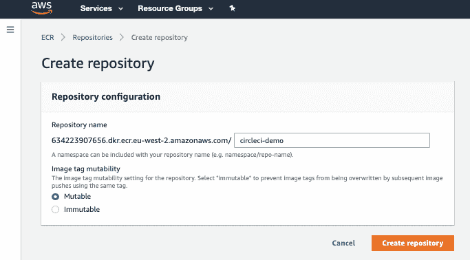

# 持续构建、测试和部署 Golang 应用程序| CircleCI

> 原文：<https://circleci.com/blog/use-circleci-orbs-to-build-test-and-deploy-a-simple-go-application-to-aws-ecs/>

在本教程示例中，我们将向 Amazon EC2 容器服务(ECS)部署一个简单的 [Go](https://golang.org/) 应用程序。然后，我们将使用 CircleCI 自动构建、测试和部署应用程序的后续版本。为了确保很好地掌握所使用的技术，我们将逐步做到这一点，主要步骤如下:

1.  创建安全组
2.  创建一个包含 1 个实例的 ECS 集群
3.  创建 ECS 任务定义
4.  创建运行任务定义的服务
5.  创建并配置一个 Amazon 弹性负载平衡器(ELB)和目标组，它将与我们集群的 ECS 服务相关联
6.  使用我们的 ELB 上的 DNS 名称来访问应用程序(测试它的工作)
7.  使用`circleci/aws-ecr@6.2.0` orb 配置 CircleCI，以构建一个更新的映像并将其推送到 Amazon 弹性容器注册中心(ECR)
8.  使用`circleci/aws-ecs@0.0.11` orb 配置 CircleCI，将更新后的映像部署到我们之前创建的集群中

要充分体会亚马逊 ECS 的好处，首先需要了解 [Docker](https://opensource.com/resources/what-docker) 。在本教程中，我们假定您对码头和集装箱化有所了解。此外，您需要对持续集成和持续部署(CI/CD)有一个初步的了解。在下一节中，我们将介绍一些我们将使用的技术和术语。

## 使用的技术和术语概述

*   **ECS 概述** : ECS 是[亚马逊网络服务](https://searchaws.techtarget.com/definition/Amazon-Web-Services) (AWS)中管理容器的云计算服务。它使开发人员能够通过应用程序编程接口(API)调用和任务定义来部署和管理运行在服务器组(称为集群)上的可伸缩应用程序。本质上，它是一个任务调度器。它创建的任务映射到正在运行的 Docker 容器。它根据可用的资源确定在集群中的资源上运行任务的位置。而其他集装箱技术存在(LXC，rkt 等。)，因为 Docker 的大量采用，ECS 被设计为本机使用 Docker 容器。

*   [**任务定义**](https://docs.aws.amazon.com/AmazonECS/latest/userguide/task_definitions.html) :把它看作是描述如何运行你的容器的配方。它包含诸如要在容器上公开的端口、要分配的内存和 CPU，以及从中启动容器的 Docker 映像等信息。在我们的例子中，它是一个容器、要使用的映像、要分配的 CPU 和内存以及要公开的端口。

*   **任务**:ECS 任务是从任务定义实例化的运行容器的单元。它们是在同一实例上一起运行的 1 到 N 个容器的逻辑分组，N 由您在 1 到 10 之间定义。根据需要，一个任务定义可以创建多个任务。

*   **服务**:ECS 服务用于保证您始终有一些任务在运行。如果任务的容器由于错误而退出，或者底层 EC2 实例失败并被替换，ECS 服务将替换失败的任务。我们创建集群，以便服务在 CPU、内存和网络端口方面有足够的资源可以使用。对我们来说，任务在哪个实例上运行并不重要，只要它们能够运行。服务配置引用任务定义。服务负责创建任务。

*   **集群**:一个 [ECS 集群](http://docs.aws.amazon.com/AmazonECS/latest/developerguide/ECS_clusters.html)是一组(容器)实例(或者 Fargate 中的任务)，它们位于一个区域内，但是可以跨越多个可用性区域。ECS 处理调度、维护和处理对这些实例的扩展请求的逻辑。它还消除了根据您的 CPU 和内存需求寻找每个任务的最佳位置的工作。一个集群可以运行许多服务。如果您的产品中有多个应用程序，您可能希望将其中几个放在一个集群中。这有效地利用了可用资源，并最大限度地减少了设置时间。

*   **容器实例**:这是一个运行 Amazon ECS 容器代理的 Amazon 弹性计算云(EC2)实例。它有一个明确定义的 [IAM 策略](http://docs.aws.amazon.com/AWSEC2/latest/UserGuide/UsingIAM.html)和[角色](http://docs.aws.amazon.com/AmazonECS/latest/developerguide/instance_IAM_role.html)，并且已经注册到一个集群。当您使用 Amazon ECS 运行任务时，您的任务(使用 EC2 启动类型)被放置在您的活动容器实例中。

*   CircleCI orb:orb 是 circle ci 配置的包，可以跨项目共享。orb 允许您创建一个作业、命令和执行器的捆绑包，它们可以相互引用，可以导入到 CircleCI 构建配置中，并在它们自己的名称空间中调用。

## 一个简单的围棋程序

以下是我们项目的目录结构:

```
.
├── .circleci
│   └── config.yml
├── Dockerfile
├── README.md
├── ecs-service.json
├── main.go
└── task-definition.json

1 directory, 6 files 
```

完整的申请可在本[报告](https://github.com/daumie/circleci-ecs)中找到。要跟进，在您的终端中将它克隆到所需的位置:

```
$ git clone https://github.com/daumie/circleci-ecs.git 
```

如果你只对 Dockerfile 感兴趣，你可以在这里找到。Go 应用的`main.go`文件可以在这里[找到。](https://gist.github.com/daumie/6a1ee46a99e31a3e1fceaaecd17ac352)

让我们把它们放在一起。首先，创建并激活一个 [AWS 账户](https://aws.amazon.com/premiumsupport/knowledge-center/create-and-activate-aws-account/)。然后，在本地机器上安装并配置 [AWS CLI](https://docs.aws.amazon.com/cli/latest/userguide/cli-chap-configure.html) 。我们将使用它从命令行界面与 AWS 进行交互。

接下来，我们将使用创建 AWS 帐户时自动创建的默认虚拟私有云(VPC)。如果它不可用，您可以通过运行以下命令来创建默认 VPC:

```
$ aws ec2 create-default-vpc 
```

通过运行以下命令，确认我们有一个可以使用的 VPC:

```
$ aws ec2 describe-vpcs 
```

在确认我们有一个默认的 VPC 后，让我们创建一个稍后将使用的安全组:

```
$ aws ec2 create-security-group --group-name circleci-demo-sg --description "Circle CI Demo Security Group" 
```

接下来，我们将[创建一个 ECS 集群](https://docs.aws.amazon.com/AmazonECS/latest/userguide/create_cluster.html)和相关的 EC2 实例。我们将称这个集群为`circleci-demo-cluster`。我们需要附加我们在前面创建的`circleci-demo-sg`安全组。

*   **集群名称** : `circleci-demo-cluster`
*   **EC2 实例类型** : t2.medium
*   **联网**:对其所有子网使用默认 VPC
*   安全组 : (circleci-demo-sg)您将使用它的 id
*   **容器实例 IAM 角色** : ecsInstanceRole


等待几分钟，然后确认容器实例已经成功注册到`circleci-demo-cluster`。您可以通过单击 **Clusters/my-cluster** 下的 **ECS Instances** 选项卡进行确认。

### 创建应用程序映像并将其推送到 AWS ECR

在本地创建 Docker 映像，并将其推送到 ECR:

```
$ docker build -t circleci-ecs:v1 .

Step 1/14 : FROM golang:latest as builder
 ---> be63d15101cb
... 
```

按照以下说明在 ECR 上创建一个图像存储库。将其命名为`circleci-demo`:



AWS 帐户有唯一的 ID。适当修改以下命令中的 **634223907656** 。获得存储库名称后，我们现在可以相应地标记图像:

```
$ docker tag circleci-ecs:v1 634223907656.dkr.ecr.eu-west-2.amazonaws.com/circleci-demo:latest 
```

您可以使用 credential helper 对 Docker CLI 的 AWS ECR 存储库进行身份验证。让我们使用下面的命令进行身份验证(根据需要更改区域)。

```
$ aws ecr get-login --no-include-email --region eu-west-2 | bash 
```

然后，将映像推送到 ECR 存储库:

```
$ docker push 634223907656.dkr.ecr.eu-west-2.amazonaws.com/circleci-demo:latest 
```

现在我们在 ECR 注册中心有了一个映像，我们需要一个任务定义，它将成为我们启动 Go 应用程序的蓝图。项目根目录中的`task-definition.json`文件包含以下几行代码:

```
{
    "family": "circleci-demo-service",
    "containerDefinitions": [
        {
            "name": "circleci-demo-service",
            "image": "634223907656.dkr.ecr.eu-west-2.amazonaws.com/circleci-demo:latest",
            "cpu": 128,
            "memoryReservation": 128,
            "portMappings": [
                {
                    "containerPort": 8080,
                    "protocol": "tcp"
                }
            ],
            "command": [
                "./main"
            ],
            "essential": true
        }
    ]
} 
```

**注意** : *记得把`image`改成你推到 ECR 的那个。*

让我们从命令行界面使用以下命令注册任务定义:

```
$ aws ecs register-task-definition --cli-input-json file://task-definition.json 
```

确认任务定义已在 ECS 控制台中成功注册:


### 创建一个 ELB 和一个目标组，以便以后与我们的 ECS 服务关联

我们正在创建一个 ELB，因为我们最终想要跨多个容器负载平衡请求，并且我们还想要将我们的 Go 应用程序公开到互联网上进行测试。为此，我们将使用 AWS 控制台。进入 **EC2 控制台** > **负载均衡** > **负载均衡器**，点击**创建负载均衡器**，选择**应用负载均衡器**。

#### 配置负载平衡器

*   将其命名为`circleci-demo-elb`，选择面向互联网。
*   在侦听器下，使用带有 HTTP 协议和端口 80 的默认侦听器。
*   在“可用性区域”下，选择在群集创建期间使用的 VPC，并选择所需的子网。

#### 配置安全设置

*   跳过警告，因为我们不会使用 SSL。

#### 配置安全组

*   创建一个名为`circleci-demo-elb-sg`的新安全组，打开端口 80 和 source `0.0.0.0/0`，这样外界的任何东西都可以通过端口 80 访问 ELB。

#### 配置路由

*   使用端口 80 创建一个名为`circleci-demo-target-group`的新目标组。

#### 注册目标

*   通过选择 ECS 实例注册现有目标。

#### 回顾

*   查看负载平衡器的详细信息

`circleci-demo-elb-sg`安全组向外界开放`circleci-demo-elb`负载平衡器的端口 80。现在，我们需要确保与 ECS 实例相关联的`circleci-demo-sg`安全组允许来自负载平衡器的流量。要允许所有 ELB 流量到达容器实例，请运行以下命令:

```
$ aws ec2 authorize-security-group-ingress --group-name circleci-demo-sg --protocol tcp --port 1-65535 --source-group circleci-demo-elb-sg 
```

确认已通过 EC2 控制台将规则添加到安全组:


使用这些安全组规则:

*   只有 ELB 的 80 号港口对外界开放。
*   允许从 ELB 到带有`circleci-demo-target-group`组的容器实例的任何流量。

#### 创建服务

下一步是创建一个运行`circleci-demo-service`任务定义(在`task-definition.json`文件中定义)的服务。我们的`ecs-service.json`文件在我们项目的根目录下有这几行代码:

```
{
    "cluster": "circleci-demo-cluster",
    "serviceName": "circleci-demo-service",
    "taskDefinition": "circleci-demo-service",
    "loadBalancers": [
        {
            "targetGroupArn": "arn:aws:elasticloadbalancing:eu-west-2:634223907656:targetgroup/circleci-demo-target-group/a5a0f047c845fcbb",
            "containerName": "circleci-demo-service",
            "containerPort": 8080
        }
    ],
    "desiredCount": 1,
    "role": "ecsServiceRole"
} 
```

要找到创建`circleci-demo-elb`负载平衡器时创建的`targetGroupArn`，请转到 **EC2 控制台** > **负载平衡** > **目标组**并单击`circleci-demo-target-group`。复制并替换`ecs-service.json`文件中`targetGroupArn`的文件。

现在，创建`circleci-demo-service` ECS 服务:

```
$ aws ecs create-service --cli-input-json file://ecs-service.json 
```

从 ECS 控制台进入**集群**>**circle ci-demo-cluster**>**circle ci-demo-service**并查看**任务**选项卡。确认容器正在运行:


#### 测试一切是否正常

使用 curl 验证 ELB 公开可用的 DNS 端点:

```
$ curl circleci-demo-elb-129747675.eu-west-2.elb.amazonaws.com; echo

Hello World! 
```


同样可以通过浏览器确认:


## 配置 CircleCI 来构建、测试和部署

在成功地将我们的 Go 应用程序部署到 ECS 之后，我们现在想要在每次更新时重新部署该应用程序。通过使用 [CircleCi orbs](https://circleci.com/developer/orbs/orb/circleci/aws-ecs) ，我们将通过将预先构建的命令、作业和执行器导入到我们的配置文件中来节省大量时间。这也将通过消除 AWS 部署所需的大量 bash 脚本来大大减少我们配置中的代码行。我们将使用`orbs`键调用这个项目中的以下 orb:

*   `circleci/aws-ecr@6.2.0`:一个 orb，用于与 Amazon 的 ECR 一起构建、推送和更新图像
*   `circleci/aws-ecs@0.0.11`:一个 orb，用于与 Amazon 的 ECS 一起工作，将更新后的映像部署到之前创建的集群中

orb 由以下元素组成:

*   命令
*   作业:一组可执行的命令或步骤
*   执行者:它们定义了一个作业的步骤将在其中运行的环境，例如 Docker、Machine、macOS 等。除了该环境的任何其他参数

要使用 CircleCI，我们需要一个配置文件，CircleCI 将使用它来安排构建、测试和部署操作。对于这个项目，`config.yml`文件包含以下代码行:

```
version: 2.1

orbs:
  aws-ecr: circleci/aws-ecr@6.2.0
  aws-ecs: circleci/aws-ecs@0.0.11

workflows:
# Log into AWS, build and push image to Amazon ECR
  build_and_push_image:
    jobs:
      - aws-ecr/build-and-push-image:
          account-url: AWS_ECR_ACCOUNT_URL
          aws-access-key-id: AWS_ACCESS_KEY_ID
          aws-secret-access-key: AWS_SECRET_ACCESS_KEY
          create-repo: true
          # Name of dockerfile to use. Defaults to Dockerfile.
          dockerfile: Dockerfile
          # AWS_REGION_ENV_VAR_NAME
          region: AWS_DEFAULT_REGION
          # myECRRepository
          repo: '${MY_APP_PREFIX}'
          # myECRRepoTag
          tag: "$CIRCLE_SHA1"
      - aws-ecs/deploy-service-update:
          requires:
            - aws-ecr/build-and-push-image
          aws-region: AWS_DEFAULT_REGION
          family: '${MY_APP_PREFIX}-service'
          cluster-name: '${MY_APP_PREFIX}-cluster'
          container-image-name-updates: 'container=${MY_APP_PREFIX}-service,tag=${CIRCLE_SHA1}' 
```

我们将使用 GitHub 和 CircleCI。如果您没有 CircleCI 帐户，请创建一个 circle ci 帐户。注册 GitHub。从 CircleCI 仪表板点击**添加项目**，从显示的列表中添加项目。

添加以下环境变量:

*   AWS_ACCESS_KEY_ID
*   AWS_SECRET_ACCESS_KEY
*   AWS _ 默认 _ 区域
*   AWS_ECR_ACCOUNT_URL(本例中为“634223907656 . dkr . ECR . eu-west-2 . Amazon AWS . com”)
*   MY_APP_PREFIX(本例中为“circle ci-demo”)
    

让我们在`main.go`文件中修改这一行:

```
html := "Hello World!" 
```

到

```
html := "Hello World! Now updated with CircleCI" 
```

将您的更改提交并推送到 GitHub。

您可以通过运行以下命令来确认从终端应用了更改:

```
$ curl circleci-demo-elb-129747675.eu-west-2.elb.amazonaws.com ; echo

Hello World! Now updated with CircleCI 
```

从浏览器中也可以确认这一点:


## 结论

我们已经构建了一个简单的 GO 应用程序，并将其部署到 ECR。现在，我们可以向应用程序添加测试，以确保在更新 ECS 实例之前通过这些测试。虽然本教程使用了一个基本的应用程序，但这是一个成熟的部署管道，适用于许多现实情况。

此外，使用 CircleCI orbs 通过简化我们编写 CircleCI 配置的方式提高了生产率。orb 也可以共享，这通过在我们的配置文件中反复使用预构建的命令、作业和执行器来节省时间。orb 不限于 CircleCI + ECS 部署。您可以浏览 [Orb 注册表](https://circleci.com/developer/orbs)中可用 Orb 的完整列表，找到符合您选择的云平台、编程语言等的 Orb。

* * *

Dominic Motuka 是 Andela 的 DevOps 工程师，在 AWS 和 GCP 支持、自动化和优化生产就绪部署方面拥有 4 年多的实践经验，利用配置管理、CI/CD 和 DevOps 流程。

[阅读多米尼克·莫图卡的更多帖子](/blog/author/dominic-motuka/)