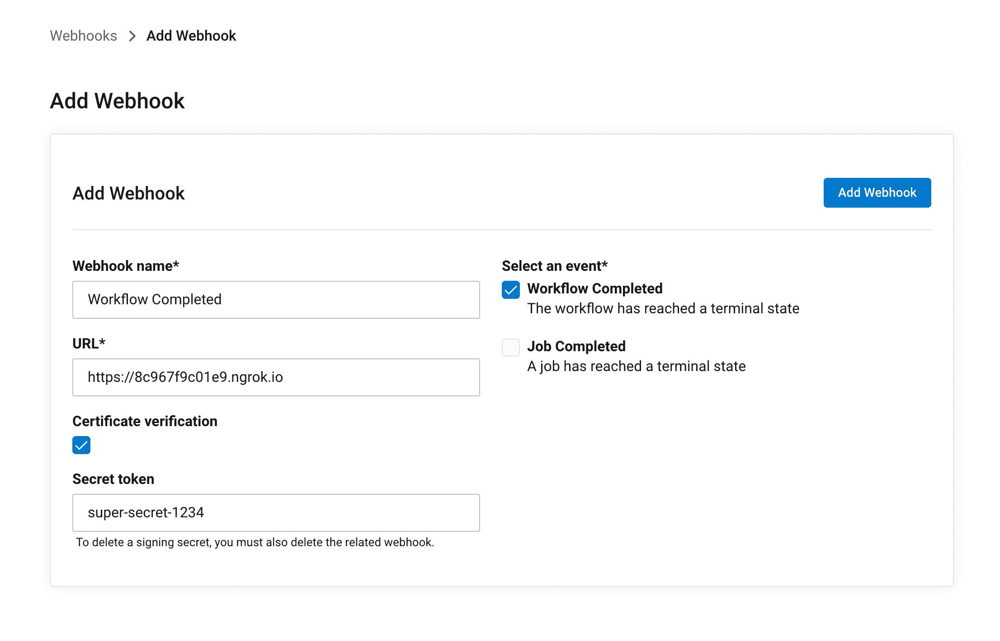
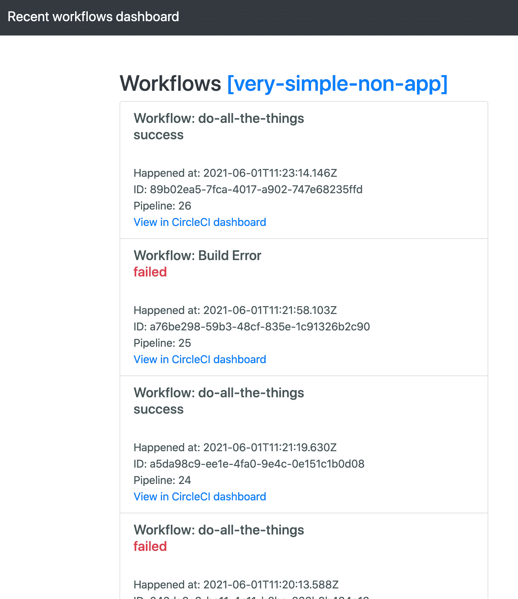

# 使用 CircleCI webhooks | CircleCI 创建集成、仪表板、通知等

> 原文：<https://circleci.com/blog/using-circleci-webhooks/>

Webhooks 允许服务和 API 之间的通信，这使它们成为我们互连的、基于云的应用环境的粘合剂。如果你熟悉 API，你可以学习使用 webhooks。CircleCI 为我们的 CI/CD 平台提供了一个 webhooks 特性，允许您订阅和响应 CircleCI 事件，例如工作流和作业完成。

本教程展示了 webhooks 特性，并给出了入门步骤。它是为那些已经在使用 CircleCI 进行项目建设的人设计的。还有一个免费的[样本 NodeJS webhook 消费者项目](https://github.com/CircleCI-Public/webhooks-consumer-sample)。

## webhooks 和 API 有什么不同？

webhooks 和 API 的主要区别在于，对于开发者来说，API 是一种*拉*体验，而 webhooks 是一种*推*体验。客户端从 API 请求数据。如果客户端需要更多数据，或者需要检查数据是否已经更新，它会发出另一个请求。使用 webhook，一个服务(客户端)被设置为 webhook 端点，您将该端点交给另一个服务。另一个服务(在我们的例子中是 CircleCI)在您感兴趣的事件发生时调用您的 webhook 端点。webhooks 有很多用途，从 GitHub 集成到 Discord 聊天机器人、Slack 通知等等。有成百上千种可能性。

CircleCI 允许您为项目中的工作流和作业完成事件设置 webhooks。当每个事件成功或不成功完成时，都会触发这些事件。

如果没有 webhooks，这只能通过重复轮询 CircleCI APIs 来实现。为了以这种方式使用 API，服务必须重复请求以获得最新的数据。这种方法对于开发团队来说并不理想，因为他们必须维护一个每天发出数百个(如果不是数千个)请求的服务。重复的 API 请求对 CircleCI 来说也不是什么好事，因为我们必须满足所有成千上万的请求。

## webhooks 解锁的用例有哪些？

在 CI/CD 环境中，webhooks 允许您构建各种集成，如仪表板、数据记录和项目管理工具。Webhooks 使您的团队能够自动通知下游客户，例如，通知他们需要更新的新版本。您可以在单个项目或多个项目上设置 webhooks，然后聚合它们的事件。然后，您可以在后端以适合您的用例的方式处理它们。

## 设置 CircleCI webhook

要使用 CircleCI web 界面在单个项目上设置新的 webhook，请转到您的 CircleCI 项目的项目设置。选择 **Webhooks** 部分，然后点击**添加 Webhook** 按钮。



创建 webhook 时可以传递的选项有:

*   名字
*   webhook 将发送到的端点的 URL
*   要发送哪些事件
*   证书验证
*   秘密价值

在示例图像中，我们使用 Ngrok 隧道从本地服务器生成的临时 URL 和一个秘密令牌`super-secret-1234`。当然，这只是举例说明一个观点；你的秘密将会不同。

点击**保存网页挂钩**将其打开。CircleCI 会将所有工作流完成事件发送到您在 URL 字段中输入的端点。

## 处理有效负载并响应 webhook

webhook 将有效负载作为 POST 请求主体发送到您在设置它时指定的端点。

处理 webhook *的服务器必须*发送一个 200 状态码作为响应，否则 webhook 可能会被重新发送多次，这可能会导致您这边出现重复事件。最佳实践是将所有传入的 webhook 有效负载传递给一个消息队列，比如 RabbitMQ 或亚马逊 SQS，并异步处理它们。

## webhook 有效负载中有什么？

有效负载包含有关已完成工作流的信息，包括其名称、状态、计时、项目和管道、与之关联的提交以及开始管道执行的触发器。对于 VCS 提交请求，流水线触发器的值将是`webhook`。另外两个选项是:`api`和`schedule`。

以下是完整工作流有效负载的示例:

```
{
  type: 'workflow-completed',
  id: 'f85a2fd5-108d-38e2-a990-fb49e7001515',
  happened_at: '2021-06-01T11:23:14.146Z',
  webhook: {
    id: '1154a973-e434-407c-8051-9259d8a53e99',
    name: 'Workflow Completed'
  },
  workflow: {
    id: '89b02ea5-7fca-4017-a902-747e68235ffd',
    name: 'do-all-the-things',
    status: 'success',
    created_at: '2021-06-01T11:23:07.441Z',
    stopped_at: '2021-06-01T11:23:13.942Z',
    url: 'https://app.circleci.com/pipelines/github/zmarkan/very-simple-non-app/26/workflows/89b02ea5-7fca-4017-a902-747e68235ffd'
  },
  pipeline: {
    id: 'ac0cc08f-67a2-4adb-9fa6-db633e390670',
    number: 26,
    created_at: '2021-06-01T11:23:07.371Z',
    trigger: { type: 'webhook' },
    vcs: {
      provider_name: 'github',
      origin_repository_url: 'https://github.com/zmarkan/very-simple-non-app',
      target_repository_url: 'https://github.com/zmarkan/very-simple-non-app',
      revision: 'f1e37011b5ff2d1703d4de9143c52ba650acae53',
      commit: [Object],
      branch: 'streamline'
    }
  },
  project: {
    id: 'e5c5dce3-7ef8-4227-9888-6b2b97b0a5ab',
    name: 'very-simple-non-app',
    slug: 'github/zmarkan/very-simple-non-app'
  },
  organization: { id: '8995ddc0-b07a-4bc2-8eb6-816c67a512fa', name: 'zmarkan' }
} 
```

webhook 中的所有对象都包含唯一的`id`字段。如果您需要来自 CircleCI 的更多上下文，您可以使用一个`id`来查询 CircleCI APIs。

## 验证 webhook 签名

你的 webhook 端点可以从 web 上的任何地方接收事件，而不仅仅是 CircleCI，不管是谁知道端点地址。您无法控制请求来自何处，因此验证事件发送方的完整性非常重要。你需要确保你没有让恶意的请求进来。

为了确保请求的安全性，webhooks 允许秘密验证。当你建立一个新的 webhook 时，你可以传入一个`secret`值。在示例中，我们使用了`super-secret-1234`。CircleCI 可以使用它来创建 webhook 请求体的 HMAC SHA256 摘要。当 webhook 有效载荷被接收时，秘密摘要在一个`circleci-signature`报头中。该值将是形式为`circleci-signature: v1=YOUR_HMAC_SHA256_DIGEST`的`v1`参数。

您可以通过使用相同的密钥和相同的算法创建您自己的请求主体的摘要来验证请求，然后将它们与`circleci-signature`头中的内容进行比较。如果两个值相同，您可以假设它确实来自 CircleCI。不匹配的签名可能意味着它是由恶意参与者发送的。

下面是来自样本 NodeJS Express 应用程序的[示例片段](https://github.com/CircleCI-Public/webhooks-consumer-sample/blob/main/server.js#L38-L51):

```
// req, res are Express objects

let signature = req.headers["circleci-signature"].substring(3)
const key = "super-secret-1234" // Same string as used in webhook setup
let testDigest = crypto.createHmac('sha256', key).update(JSON.stringify(req.body)digest('hex')

if (testDigest !== crypto.sign) {
    console.log("Webhook signature not matching")
    console.log(`Signature: ${signature}`)
    console.log(`Test digest: ${testDigest}`)
    res.status(403).send("Invalid signature")
} 
```

## 使用 webhooks 创建仪表板集成

一旦您能够接收和处理 webhooks，您就可以用它们构建许多类型的集成。我已经创建了一个示例仪表板，它显示了使用 Vue 和 Express 进入的工作流的状态。



你可以[在 GitHub](https://github.com/CircleCI-Public/webhooks-consumer-sample) 上找到源代码。我用来测试 webhooks 的项目在 GitHub 上也有[。](https://github.com/zmarkan/very-simple-non-app)

## 结论

CircleCI webhooks 是将 CircleCI pipelines 与您的其他业务相集成的强大方法。从仪表板到项目跟踪再到通知，webhooks 为创建获取和共享信息的新方法提供了许多可能性。在本教程中，您已经学习了如何开始为项目设置 webhook，以便在工作流完成时通知您。既然您已经了解了一些处理 webhooks 和确保系统安全的最佳实践，我希望您和您的团队能够找到许多方法在自己的项目中使用它们。

如果你对我接下来要讨论的话题有任何反馈或建议，请通过 [Twitter - @zmarkan](https://twitter.com/zmarkan/) 联系我。