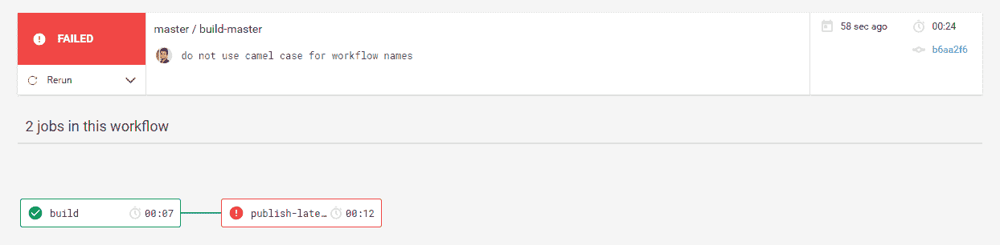
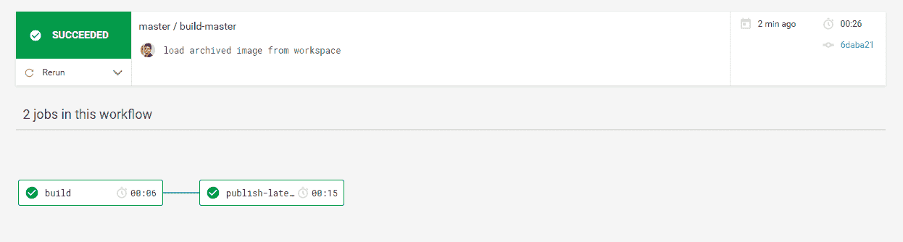
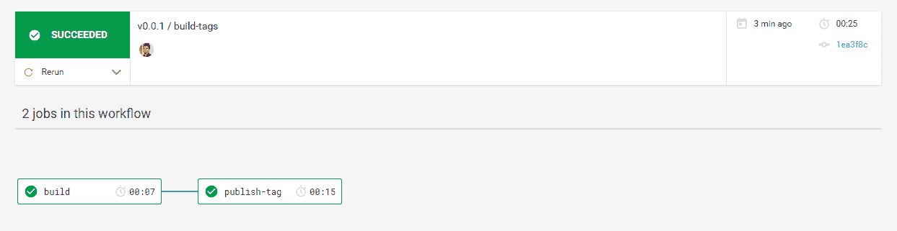
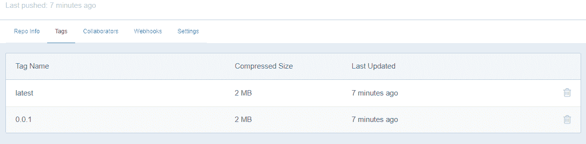
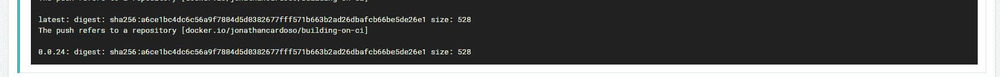
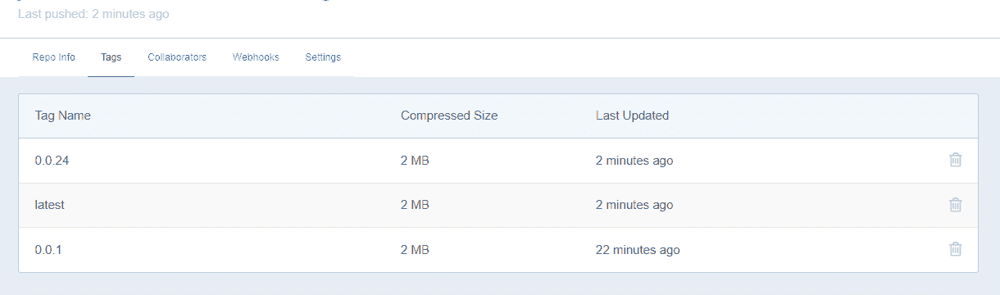

# 使用 CircleCI 工作流复制 Docker Hub 自动构建| CircleCI

> 原文：<https://circleci.com/blog/using-circleci-workflows-to-replicate-docker-hub-automated-builds/>

**发布者声明** : *支持工程师 Nick Bialostosky 于 2020 年 10 月 9 日更新了此内容，以反映 Docker Hub 对访问令牌支持的变化。*

* * *

[CircleCI workflows](https://circleci.com/docs/workflows/) 是一项强大的功能，可用于使您的部署过程简单直观。在本文中，我们将学习如何使用它们将图像自动推送到 Docker registry，就像 Docker Hub 自己的自动构建过程一样，但是具有您自己的构建过程提供的所有定制功能。

## CircleCI 工作流程

> 一个**工作流**是一组规则，用于定义一组作业及其运行顺序。工作流使用一组简单的配置密钥支持复杂的作业编排，帮助您更快地解决故障。- [CircleCI 工作流程文件](https://circleci.com/docs/workflows/)

在我们的工作流中，将提交推送到`master`分支将运行一个特定的作业，该作业在 Docker Hub 上发布带有`latest`标签的图像。每次提交还会向图像添加一个 Git 标记作为图像标记，并发布带有该标记的图像。最后，我们将研究如何使用 CircleCI 的[环境变量](https://circleci.com/docs/env-vars/)来自动发布图像的增量版本，而不是使用 Git 标签。

## 建立我们的码头工人形象

让我们从一个基本的 Docker 映像开始，它只打印运行时传递的参数。docker 文件看起来就像这样简单:

```
FROM alpine:3.8

ENTRYPOINT [ "echo" ] 
```

在本地构建和运行映像应该向我们显示它工作正常:

```
$ docker build -t building-on-ci .
Sending build context to Docker daemon  4.608kB
Step 1/2 : FROM alpine:3.8
 ---> 196d12cf6ab1
Step 2/2 : ENTRYPOINT [ "echo" ]
 ---> Running in fe2151b22bc1
Removing intermediate container fe2151b22bc1
 ---> edc0ca6e654a
Successfully built edc0ca6e654a
Successfully tagged ci-workflows:latest

$ docker run building-on-ci "Hello!"
Hello! 
```

现在我们有了我们的图像，我们需要把它推送到我们的 GitHub 库。

为了开始在每次提交时构建我们的映像，我们将用下面的配置文件引导我们的项目。在项目的根目录中，创建一个`.circle`目录，并将下面几行保存为`config.yml`:

```
version: 2
jobs:
  build:
    environment:
      IMAGE_NAME: jonathancardoso/building-on-ci
    docker:
      - image: circleci/buildpack-deps:stretch
    steps:
      - checkout
      - setup_remote_docker
      - run:
          name: Build Docker image
          command: docker build -t $IMAGE_NAME:latest .
workflows:
  version: 2
  build-master:
    jobs:
      - build:
          filters:
            branches:
              only: master 
```

我们使用 CircleCI 提供的名为`circleci/buildpack-deps`的预构建 Docker 映像来运行我们的构建。CircleCI 在 Docker Hub 上有许多自定义映像，它们通过在 CI/CD 环境中有用的额外工具扩展了官方映像。查看 [CircleCI 图像](https://circleci.com/docs/circleci-images/)文档了解更多信息。

还有一个名为`IMAGE_NAME`的环境变量，我们将使用它来设置 Docker 图像的名称。您必须将其更改为您的用户名/组织名，而不是使用我的(`jonathancardoso`)。否则，当您试图将该图像发布到 Docker Hub 时，将会出现一个错误。

目前，我们的配置只有一个名为`build-master`的工作流，当我们向`master`分支提交时，它运行一个`build`任务。这份工作只是建立我们的码头工人形象，仅此而已。

我们的一个步骤叫做`setup_remote_docker`，是在 CircleCI 上构建 Docker 图像时最重要的步骤之一。因为我们的作业步骤是在 Docker 映像中运行的，所以它们不能构建其他 Docker 映像。`setup_remote_docker`命令告诉 CircleCI 分配一个新的 Docker 引擎，与运行我们作业的环境分开，专门执行 Docker 命令。查看[建筑 Docker 图像](https://circleci.com/docs/building-docker-images/)文档了解更多信息。

执行示例:[https://circleci.com/gh/JCMais/docker-building-on-ci/1](https://circleci.com/gh/JCMais/docker-building-on-ci/1)

## 将映像发布到 Docker Hub，并在每次提交到主机时使用:latest 标记

既然我们在每个对`master`的提交上构建了我们的映像，我们需要创建一个新的作业来将该映像发布到 Docker Hub。

Docker Hub 没有可用于访问您的帐户的访问令牌，因此我们需要使用自己的用户名/密码登录 Docker Hub 注册表。这通常通过运行以下命令来完成:

```
docker login -u "username" -p "password" 
```

**注意** : *Docker Hub 现在支持[访问令牌](https://docs.docker.com/docker-hub/access-tokens/)，因此如果您愿意，您可以使用令牌代替密码来执行以下指令。*

然而，像这样以明文形式保存您的凭证是一种不好的做法，因为它会暴露您的密码。我们需要用我们的用户名和密码创建新的 [CircleCI 环境变量](https://circleci.com/docs/env-vars/)。在 CircleCI 中有多种方法可以做到这一点，但是如果多个项目要将图像推送到 Docker Hub，推荐的方法是使用[上下文](https://circleci.com/docs/contexts/)。否则，我们可以直接在项目设置中设置它们。对于本文，我们将采用后一种方法。

在设置了环境变量`DOCKERHUB_USERNAME`和`DOCKERHUB_PASS`之后，让我们创建我们的作业:

```
version: 2
jobs:
  build:
    environment:
      IMAGE_NAME: jonathancardoso/building-on-ci
    docker:
      - image: circleci/buildpack-deps:stretch
    steps:
      - checkout
      - setup_remote_docker
      - run:
          name: Build Docker image
          command: docker build -t $IMAGE_NAME:latest .
  publish-latest:
    environment:
      IMAGE_NAME: building-on-ci
    docker:
      - image: circleci/buildpack-deps:stretch
    steps:
      - setup_remote_docker
      - run:
          name: Publish Docker Image to Docker Hub
          command: |
            echo "$DOCKERHUB_PASS" | docker login -u "$DOCKERHUB_USERNAME" --password-stdin
            docker push $IMAGE_NAME:latest
workflows:
  version: 2
  build-master:
    jobs:
      - build:
          filters:
            branches:
              only: master
      - publish-latest:
          requires:
            - build
          filters:
            branches:
              only: master 
```

我们向`build-master`工作流添加了一个新的`publish-latest`任务。这项工作试图推动我们刚刚建立的形象到 Docker 枢纽。然而，如果我们提交变更并检查构建日志，我们会看到它失败了，因为 Docker 找不到映像`jonathancardoso/building-on-ci`。



这是因为工作流中的作业相互隔离，我们在`build`作业上构建的映像对`publish-latest`不可用。

请注意我们在配置文件中的重复。我们用环境变量`IMAGE_NAME`的定义和将用于运行我们的作业的 Docker 映像重复了两次。

解决重复问题的一个方法是使用 YAML 锚。然而，CircleCI 已经发展了，在版本`2.1`中，我们现在可以通过指定一个[可重用执行器](https://circleci.com/docs/reusing-config/#authoring-reusable-executors)来直接重用一些配置。在文件的顶部，我们将把版本从`2`更改为`2.1`，并添加一个新的`executors`密钥:

```
version: 2.1
executors:
  docker-publisher:
    environment:
      IMAGE_NAME: building-on-ci
    docker:
      - image: circleci/buildpack-deps:stretch 
```

现在，对于每个作业，我们将指定一个`executor`键，而不是声明`docker`和`environment`键:

```
# ...
jobs:
  build:
    executor: docker-publisher
    # ...
  publish-latest:
    executor: docker-publisher
    # ... 
```

重复已解决。是时候解决我们的 Docker 图像在`publish-latest`作业中不可用的问题了。我们将使用[工作流的工作区](https://circleci.com/docs/workflows/#using-workspaces-to-share-data-among-jobs)在两个作业之间共享图像。

让我们在`build`任务的末尾添加一个新的运行步骤。该运行步骤将图像保存为 tar 归档文件:

```
 # ...
      - run:
          name: Archive Docker image
          command: docker save -o image.tar $IMAGE_NAME
      # ... 
```

现在，我们可以通过添加另一个名为`persist_to_workspace`的步骤将该文件持久化到工作流工作区中:

```
 # ...
      - run:
          name: Archive Docker image
          command: docker save -o image.tar $IMAGE_NAME
      - persist_to_workspace:
          root: .
          paths:
            - ./image.tar
      # ... 
```

为了检索`publish-latest`作业中的`image.tar`文件，我们将在其他步骤之前添加一个新步骤`attach_workspace`:

```
 # ...
   steps:
      - attach_workspace:
          at: /tmp/workspace
      # ... 
```

在我们试图将存档的图像推送到 Docker Hub 注册表之前，用`docker load`加载它:

```
 # ...
      - run:
          name: Load archived Docker image
          command: docker load -i /tmp/workspace/image.tar
      # ... 
```

我们的完整配置文件如下所示:

```
version: 2.1
executors:
  docker-publisher:
    environment:
      IMAGE_NAME: jonathancardoso/building-on-ci
    docker:
      - image: circleci/buildpack-deps:stretch
jobs:
  build:
    executor: docker-publisher
    steps:
      - checkout
      - setup_remote_docker
      - run:
          name: Build Docker image
          command: |
            docker build -t $IMAGE_NAME:latest .
      - run:
          name: Archive Docker image
          command: docker save -o image.tar $IMAGE_NAME
      - persist_to_workspace:
          root: .
          paths:
            - ./image.tar
  publish-latest:
    executor: docker-publisher
    steps:
      - attach_workspace:
          at: /tmp/workspace
      - setup_remote_docker
      - run:
          name: Load archived Docker image
          command: docker load -i /tmp/workspace/image.tar
      - run:
          name: Publish Docker Image to Docker Hub
          command: |
            echo "$DOCKERHUB_PASS" | docker login -u "$DOCKERHUB_USERNAME" --password-stdin
            docker push $IMAGE_NAME:latest
workflows:
  version: 2
  build-master:
    jobs:
      - build:
          filters:
            branches:
              only: master
      - publish-latest:
          requires:
            - build
          filters:
            branches:
              only: master 
```

现在一切都应该是绿色的！



现在，我们可以从 Docker Hub 注册表中检索并运行我们的映像:

```
$ docker run jonathancardoso/building-on-ci "Workflows are awesome!"
Unable to find image 'jonathancardoso/building-on-ci:latest' locally
latest: Pulling from jonathancardoso/building-on-ci
4fe2ade4980c: Already exists
Digest: sha256:f719ca403b0fc6a5214823c61c750a5e48ce5809a24b882b3a45d6d119870366
Status: Downloaded newer image for jonathancardoso/building-on-ci:latest
Workflows are awesome! 
```

## 发布 Git 标签作为坞站中心上的坞站图像标签

依赖带有标签的图像很容易引起混乱，因为我们无法控制运行的图像版本。推荐的方法是使用特定的标签。

假设我们将使用 Git 标签来发布 Docker 图像的新版本，并且我们希望 CircleCI 在 Docker Hub 上发布带有每个 Git 标签的图像作为图像标签。以下是我们的做法。

首先，我们将添加一个新的工作流，`build-tags`:

```
# ...
  build-tags:
    jobs:
      - build:
          filters:
            tags:
              only: /^v.*/
            branches:
              ignore: /.*/
      - publish-tag:
          requires:
            - build
          filters:
            tags:
              only: /^v.*/
            branches:
              ignore: /.*/ 
```

这两个作业共享相同的过滤器，基本上就是说它们必须为每个以`v`开头的标签运行，而不应该为分支执行。

`build`作业是相同的(我们可以在工作流之间重用作业)，但是`publish-tag`作业将如下所示:

```
# ...
  publish-tag:
    executor: docker-publisher
    steps:
      - attach_workspace:
          at: /tmp/workspace
      - setup_remote_docker
      - run:
          name: Load archived Docker image
          command: docker load -i /tmp/workspace/image.tar
      - run:
          name: Publish Docker Image to Docker Hub
          command: |
            echo "$DOCKERHUB_PASS" | docker login -u "$DOCKERHUB_USERNAME" --password-stdin
            IMAGE_TAG=${CIRCLE_TAG/v/''}
            docker tag $IMAGE_NAME:latest $IMAGE_NAME:$IMAGE_TAG
            docker push $IMAGE_NAME:latest
            docker push $IMAGE_NAME:$IMAGE_TAG
# ... 
```

这个作业和`publish-latest`的区别在于，这个作业使用了 CircleCI 自动设置的环境变量`CIRCLE_TAG`。我们检索该值并删除`v`前缀，例如`v0.0.1`变成了`0.0.1`。然后，我们继续用该版本标记我们的映像，并将其推送到 Docker Hub 注册中心。我们还要确保按下`latest`标签，这样两者就能保持同步。如果我们提交一个标签，我们可以看到它的工作:



如果我们访问图像的 Docker Hub 页面，我们可以看到标签:



现在，我们可以使用我们的标签运行我们的图像:

```
docker run jonathancardoso/building-on-ci:0.0.1 "Tags are working!"
Unable to find image 'jonathancardoso/building-on-ci:0.0.1' locally
0.0.1: Pulling from jonathancardoso/building-on-ci
4fe2ade4980c: Already exists
Digest: sha256:1a3a6c74860832704df55acdcbd875f662957d757d69fa340a48b41b890469bc
Status: Downloaded newer image for jonathancardoso/building-on-ci:0.0.1
Tags are working! 
```

## 每个构件的自动图像标签

如果我们有一个不经常使用的图像或者一个我们不想使用 git 标签的图像怎么办？一个我们想要严格控制使用哪个版本的图像，所以我们不能依赖于`latest`标签？

CircleCI 允许我们这样做:它公开了一个名为`CIRCLE_BUILD_NUM`的环境变量，这个变量的数量一直在增加。使用它，我们可以让 CircleCI 为每个构建发布一个新版本的映像。让我们修改一下我们的`publish-latest`作业来做到这一点:

```
 # ...
      - run:
          name: Publish Docker Image to Docker Hub
          command: |
            echo "$DOCKERHUB_PASS" | docker login -u "$DOCKERHUB_USERNAME" --password-stdin
            IMAGE_TAG="0.0.${CIRCLE_BUILD_NUM}"
            docker tag $IMAGE_NAME:latest $IMAGE_NAME:$IMAGE_TAG
            docker push $IMAGE_NAME:latest
            docker push $IMAGE_NAME:$IMAGE_TAG
      # ... 
```

我们使用`CIRCLE_BUILD_NUM`创建图像标签，并将其与`latest`标签一起发布到 Docker Hub 注册中心。如果我们将它提交给 master 并等待工作流完成，我们可以看到它已发布:





## 摘要

这些版本控制技术只是构建模块。您可以根据需要将图像版本的标记变得复杂或简单。对于特定的标签，您甚至可以使用这些知识将图像上传到您自己的私有注册表，而不是 Docker Hub。

撰写本文时使用的资源库可以在 GitHub 上找到:[https://github.com/JCMais/docker-building-on-ci](https://github.com/JCMais/docker-building-on-ci)。

* * *

Jonathan Cardoso 热衷于 DevOps、开源和游戏。他有六年的经验，帮助世界各地的公司通过技术解决方案推进他们的目标。他目前在巴西远程工作，是 HelloMD 的全栈开发人员和 DevOps 专家。

[阅读乔纳森·卡多佐的更多帖子](/blog/author/jonathan-cardoso/)