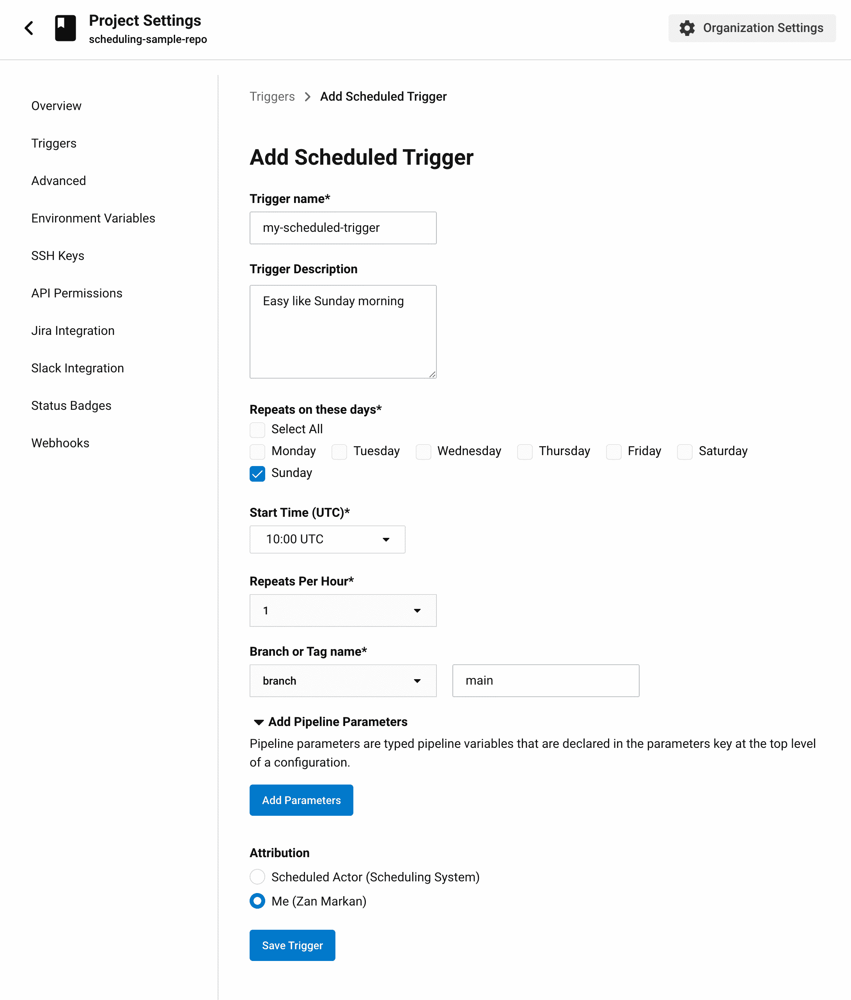

# 计划管道入门| CircleCI

> 原文：<https://circleci.com/blog/using-scheduled-pipelines/>

[CircleCI 的预定管道](https://circleci.com/docs/scheduled-pipelines/#overview)让你定期运行管道；每小时、每天或每周。如果您使用过[计划的工作流](https://circleci.com/blog/manual-job-approval-and-scheduled-workflow-runs/)，您会发现用计划的管道代替它们会给您更多的能力、控制和灵活性。在本教程中，我将引导你了解[计划管道](https://circleci.com/blog/benefits-of-scheduling-ci-pipelines/)是如何工作的，描述它们的一些很酷的用例，并向你展示如何开始为你的团队设置它们。我将演示如何使用 API 和 UI，以及如何从头开始设置预定的管道或从预定的工作流迁移到它们。

## 先决条件

以下是您学习本教程所需的内容:

您可以在完成这些步骤时使用[示例项目](https://github.com/zmarkan/android-espresso-scrollablescroll)。

[https://www.youtube.com/embed/x3ruGpx6SEI](https://www.youtube.com/embed/x3ruGpx6SEI)

视频

CircleCI 开发者倡导者 Zan Markan 解释了计划管道的工作原理、常见用例以及入门方法。

## 安排定期构建和测试

有许多理由安排 CI/CD 工作，而不仅仅是在将代码推送到存储库时执行。计划的第一个也是最明显的原因是定期构建软件。开发团队之外的人(产品经理、QA 工程师和其他利益相关者)经常需要访问您和您的团队正在开发的软件的最新版本。当然，您总是可以根据需要手动触发构建，但是这会分散您和团队中其他开发人员的注意力。自动化这一过程并向所有涉众指出他们可以在哪里找到最新的构建要容易得多。这适用于一切，从网络应用和移动应用，到后端服务，图书馆，以及两者之间的任何东西。

预定的构建在晚上或者下班时间没有开发的时候自动构建软件。这些每夜构建(正如他们有时被称为的那样)从您的主分支中取出最新的版本，并产生软件的一个阶段或测试版本。

您可以使用预定的管道来运行整个测试套件，这样每夜的构建也可以验证您的软件工作正常，并且在您开始下一个工作日的时候已经准备好了。调度允许您在每次提交时运行那些您不想运行的昂贵且耗时的功能或集成测试。构建不需要在夜间运行。您可以以适合您团队的节奏运行它，每隔几个小时，甚至每小时几次。

## 安排其他种类的工作

但是为什么要停留在构建阶段呢？您还可以安排不一定是构建但需要定期发生的工作，如批处理、数据库备份或重新启动服务。如果可以将它添加到能够访问您的环境的机器上的脚本中，那么它可以在 CI/CD 系统中完成。

## 传统的计划方式—计划的工作流

对 CircleCI 来说，安排工作的能力并不新鲜。开发团队已经能够将调度作为配置的一部分，使用 cron 语法在工作流级别定义调度。不过，这种方法也有一些缺点:

*   它需要开发工作来对时间表进行任何更改，甚至审查已经到位的时间表。
*   在 CircleCI 中，触发的是管道，而不是工作流。
*   微调权限是很困难的，因为并不总是清楚是谁调度了被触发的工作。

## 预定管道如何改善开发者体验

以下是使用预定管道的一些优点:

*   可以调度整个管线，包括要传递的任何管线参数。
*   通过在配置文件之外处理调度，您可以使用 API 和 UI 来查询和设置调度。这种能力为谁来管理调度和执行提供了更大的灵活性。
*   调度管道与[上下文](https://circleci.com/docs/contexts/)一起工作。上下文可以让您更好地控制谁有权执行和安排某些作业。您可以将您的部署凭证只授予具有足够权限的工程师，这样其他人就无法设置这些时间表。上下文还可以与动态配置一起使用，为您的 CI/CD 设置提供更多的灵活性。

现在我们已经介绍了一些关于调度管道的基本事实，我们可以实现一个了。

## 实现预定的管道

首先，我们需要一个管道来调度。幸运的是，我有一个使用预定工作流的[项目。这是一个开放源代码的 Android 库项目，运行夜间部署，所以它是调度用例的理想选择。我建议你在 GitHub 上分叉这个项目，在 CircleCI 上设置成一个项目。](https://github.com/zmarkan/android-espresso-scrollablescroll)

对于我们的示例时间表，我们希望每天晚上运行一次构建，并将其部署到 Sonatype 快照存储库中。这个版本使得任何人都可以使用这个库并获得最新的代码。

在我们的`.circleci/config.yml` - `nightly-snapshot`中已经为其定义了一个工作流:

```
 parameters:
    run-schedule:
        type: boolean
        default: false

  nightly-snapshot:
    when: << pipeline.parameters.run-schedule >>
    jobs:
      - android/run-ui-tests:
          name: build-and-test
          system-image: system-images;android-23;google_apis;x86
          test-command: ./gradlew assemble sample:connectedDebugAndroidTest
      - deploy-to-sonatype:
          name: Deploy Snapshot to Sonatype
          requires:
            - build-and-test 
```

工作流有两个任务:一个运行测试，另一个部署快照。除了检查`run-schedule`管道参数的`when`语句之外，管道本身没有调度逻辑。我们的调度程序将在触发管道时设置参数。

## 使用 API 调度管道

要开始使用 API 进行调度，您需要 API 令牌。要获得令牌，请登录 CircleCI 并点击左下角的头像。点击你的头像打开用户设置。导航到个人 API 令牌，创建一个新令牌，并将其保存在安全的地方。在示例项目中有一个`build-scheduling`目录，其中有一个名为`.env.sample`的文件。您可以将该文件复制到`.env`，并用您的替换占位符令牌。你应该对`.env`文件的其他部分做同样的操作:`PROJECT_ID`和`ORG_NAME`。

```
CIRCLECI_TOKEN=YOUR_CIRCLECI_TOKEN
PROJECT_ID=YOUR_PROJECT_ID
ORG_NAME=YOUR_VCS_USERNAME
VCS_TYPE=github 
```

设置环境变量后，我们可以进行 API 调用。预定管道使用 [CircleCI API v2](/blog/introducing-circleci-api-v2/) 。要发布新的时间表，您需要向端点发出发布请求。端点由您的 CircleCI 项目、您的用户名和您的 VCS 提供者组成。这里有一个例子:`https://circleci.com/api/v2/project/github/zmarkan/android-espresso-scrollablescroll/schedule`

这个来自`setup_nightly_build.js`脚本的 POST 调用示例使用了 Axios JavaScript 库:

```
const token = process.env.CIRCLECI_TOKEN

axios.post("https://circleci.com/api/v2/project/github/zmarkan/android-espresso-scrollablescroll/schedule", {
    name: "Nightly build",
    description: "Builds and pushes a new build to Sonatype snapshots every night. Like clockwork.",
        "attribution-actor": "system",
        parameters: {
          branch: "main",
          "run-schedule": true
        },
        timetable: {
            per_hour: 1,
            hours_of_day: [1],
            days_of_week: ["TUE", "WED", "THU", "FRI", "SAT"]
        }
    },{
        headers: { 'circle-token': token }
    }
) 
```

正文有效负载包含计划名称(必须是唯一的)和可选描述。它包括一个 attribution actor，可以是中立 actor 的`system`或获取当前用户权限的`current`(根据您使用的令牌)。有效负载还包括参数，如触发管道时使用哪个分支，以及您设置的任何其他参数。本教程在配置文件中使用了`run-schedule`。主体的最后一部分是`timetable`，在这里我们定义何时以及多频繁地运行我们的调度管道。这里使用的字段是`per_hour`、`hours_of_day`和`days_of_week`。注意，这没有采用 cron 表达式，这使得它更容易被使用 API 推理的人解析。

在消息头中，我们将使用之前在 CircleCI UI 中生成的令牌传递一个`circle-token`。

在时间表中，我们将一切都设置为在周二到周六的凌晨 1:00(UTC)运行，即工作结束后的第二天晚上。我们不需要在周日和周一运行，因为在我们的示例项目中，没有人在周末工作。代码库在那几天不会改变。

除了 POST 方法，API 还公开了其他方法，如 GET、DELETE 和 PUT，用于检索、删除和更新计划。存储库中有`get_schedules.js`和`delete_schedule.js`的样本。

## 使用图形用户界面

除了使用 API，您还可以在 CircleCI 仪表板中设置预定的管道。在 CircleCI 的项目中，进入项目设置，从左侧菜单中选择**触发器**。

点击**添加调度触发器**打开页面，可以设置新的调度管道。该表单具有与 API 相同的选项:触发器名称、星期几、开始时间、参数、属性用户等。

点击**保存触发器**将其激活。触发器将准备好在您指定的日期和时间开始调度您的管道。



## 从计划的工作流迁移

到目前为止，我们已经探索了如何使用 API 和 GUI 来设置和检查管道。现在，我们可以专注于将您现有的计划工作流迁移到更有利的计划管道。

此示例显示了一个计划的工作流，其中所有内容都在配置文件中定义。它包括工作流定义的触发器配置，通过 cron 表达式传入时间表:

```
nightly-snapshot:
    triggers: #use the triggers key to indicate a scheduled build
      - schedule:
          cron: "0 0 * * *" # use cron syntax to set the schedule
          filters:
            branches:
              only:
                - main
    jobs:
      - android/run-ui-tests:
          name: build-and-test
          system-image: system-images;android-23;google_apis;x86
          test-command: ./gradlew assemble sample:connectedDebugAndroidTest
      - deploy-to-sonatype:
          name: Deploy Snapshot to Sonatype
          requires:
            - build-and-test 
```

在我们的例子中，它在每天午夜运行，我们希望只在主分支上触发它。

要进行迁移，需要完成几个步骤:

1.  触发计划管道中现有的`nightly-snapshot`工作流。
2.  引入一个名为`run-schedule`的新管道变量，就像我们在第一个例子中所做的那样。
3.  对于所有工作流，添加表示当`run-schedule`为`true`时运行它们并且除非`run-schedule`为`false`否则不运行其他工作流的`when`表达式。

```
parameters:
  run-schedule:
    type: boolean
    default: false

workflows:
  build-test-deploy:
    when:
      not: << pipeline.parameters.run-schedule >>
    jobs:
      ...

  nightly-snapshot:
    when: << pipeline.parameters.run-schedule >>
    jobs:
      ... 
```

其余过程与从头开始设置时相同:

1.  解析 cron 表达式；你可以像这样使用一个在线工具。
2.  使用带有新时间表配置和`run-schedule`管道参数的 API 或 GUI 设置时间表。

## 结论

预定管道是 CI/CD 工具包的一个多功能组件，允许您:

*   重复触发您的构建
*   利用管道参数
*   微调控制谁可以设置管道
*   使用 CircleCI 上下文清楚地定义它们运行时所需的权限

在本教程中，您了解了预定管道在 CircleCI 中的工作方式以及如何设置它们，无论是从头开始还是从预定工作流移植。我们还讲述了如何使用 API 和 web UI，并回顾了它们的一些用例来帮助您入门。

请告诉我们您和您的团队在计划管道、移植您的计划工作流方面的进展，或者您是否希望看到 UI 或 API 功能的任何补充。

如果你对我接下来要讨论的话题有任何反馈或建议，请通过 [Twitter - @zmarkan](https://twitter.com/zmarkan/) 联系我。