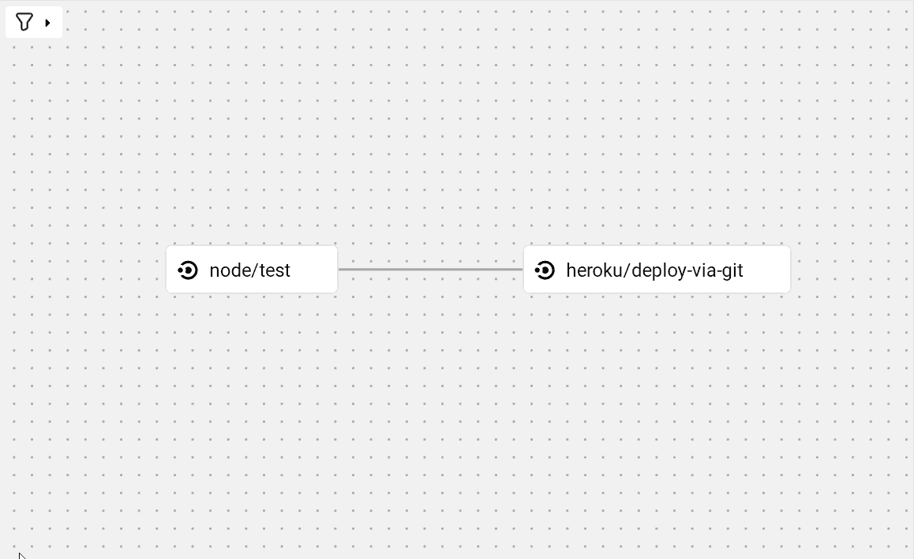

# CircleCI 可视化配置编辑器| CircleCI 简介

> 原文：<https://circleci.com/blog/visual-config-editor/>

CircleCI [可视化配置编辑器(VCE)](https://circle.ci/visual-config-editor) 现在作为一个开源项目普遍可用。开发团队现在可以在可视化的拖放、低代码环境中创建和修改 CircleCI 配置文件。

VCE 是一个节点图编辑器，可以用来修改 CircleCI 配置元素和生成配置文件。它提供了一种无摩擦的方式来构建 [CI/CD 管道](https://circleci.com/blog/what-is-a-ci-cd-pipeline/)，并以高效、用户友好的可视化界面与 CircleCI 的平台进行交互。

我们的目标不是取代作为代码语言的[YAML](https://circleci.com/blog/what-is-yaml-a-beginner-s-guide/)，我们事实上的[配置，而是提供一种替代方案，在其中你可以可视化地编排你的管道开发。在本帖中，我们将触及可视化配置编辑器背后的动机，浏览其元素和支持的功能，解释常见用例，并演示如何使用 VCE 建立管道。](https://circleci.com/blog/configuration-as-code/)

## 可视化配置编辑器的用例

可视化配置编辑器为配置编辑提供了一体化的环境，包括创建组件定义和用法。视觉生态系统用 YAML 换取了低代码(或者，当使用正确的球体时，甚至没有代码！)开发经验。

CircleCI 的新用户会发现可视化配置编辑器在以下方面很有用:

*   无需学习或编写 YAML 即可生成配置
*   只需轻轻一点，即可访问 [CircleCI orbs](https://circleci.com/orbs/) ，快速集成流行服务
*   可视化管理标签和分支过滤器
*   实时验证输入
*   简化配置构建体验，因此您可以满怀信心地协调您的管道

更有经验的用户会发现可视化配置编辑器在以下方面很有用:

*   无需通过 YAML 即可快速更改
*   预览工作流程编排
*   提供一个可视化的解释器，用于在你的项目的 CI 管道上教育同行
*   轻松访问 orb 的高级功能

## 可视化配置编辑器功能

创建管道配置文件所需的一切都是预先提供的。VCE 分为三个焦点窗格:**可视化工具、检查器和输出**。


**可视化窗格**由一个节点图组成，其中[工作流](https://circleci.com/docs/workflows/)被创建和组织。

组件内置在**检查器面板**中，在这里您可以创建、查看和编辑组成配置的组件。

**输出窗格**是一个集成的代码编辑器，提供查看您的配置的 YAML 输出的能力。

## 如何使用可视化配置编辑器设置管道

让我们看看它的实际效果吧！在这一节中，我们将演示如何使用 VCE 来建立一个管道来测试和部署一个用 [Vue.js](https://vuejs.org/) 构建的示例前端应用程序。您可以派生出[连续食品交付示例项目](https://github.com/CircleCI-Public/sample-javascript-cfd)并跟随，或者使用您自己的(最好是基于节点的)项目。

### 入门指南

为了跟随演示并学习如何使用 VCE 来管理自己的管道，你还需要注册一个[免费的 CircleCI 账户](https://circleci.com/signup/)和 [Heroku 账户](https://signup.heroku.com/)，如果你还没有的话。登录 Heroku 后，进入[仪表盘](https://dashboard.heroku.com/apps)，点击**新建**，然后选择**创建新应用**。请记下您在此处选择的应用程序名称，因为您稍后会用到它。目前，这是 Heroku 需要的所有设置。

要访问 VCE 并开始构建您的配置文件，请访问 [VCE 主页](https://circle.ci/visual-config-editor)。

### 将测试作业添加到管道中

好消息！我们实际上不需要做太多来让 CI 参与这个项目。VCE 具有 orb 支持，提供对各种预打包配置的快速访问，以便与您喜欢的所有服务集成。要从 VCE 向您的管道添加 orb，只需单击 orb 旁边的**加**按钮，并选择您想要使用的 orb。

在这个例子中，我们将使用 Node.js orb 向我们的工作流添加测试。因为 Node.js 是我们最受欢迎的 orb 之一，所以它是菜单中第一个可用的 orb。单击圆形图标查看管道中可用的作业、命令和执行器。要添加测试任务，将`node/test`任务拖到可视化窗格中。依赖项安装和缓存将为我们处理。然而，在连续食品交付应用程序的情况下，我们需要添加一些额外的属性来告诉节点测试作业我们想要运行哪个测试。

单击您刚刚放入工作流阶段的`node/test`作业，以配置其设置。样本库中的文件 [`package.json`](https://github.com/CircleCI-Public/sample-javascript-cfd/blob/master/package.json) 包含了我们需要的关于这个项目脚本的信息。

```
{
  "name": "sample-javascript-cfd",
  "version": "0.1.0",
  "private": true,
  "scripts": {
    "build": "vue-cli-service build",
    "test:unit": "vue-cli-service test:unit",
    "test:e2e": "vue-cli-service test:e2e",
    "lint": "vue-cli-service lint",
    "start": "vue-cli-service serve"
  } 
```

在连续食品交付示例应用程序中，有两种不同类型的测试:端到端测试(`test:e2e`)和单元测试(`test:unit`)。对于我们的`node/test`工作，我们将把`run-command`参数设置为`test:unit`，因为 e2e 测试将需要进一步的配置。


### 添加部署作业

现在我们已经在管道中添加了测试，我们可以放心地部署到 Heroku。是时候再次搜索球体并为认证的 Heroku 球体导入一个任务了。就像前面一样，导航到检查器面板的 Orbs 部分并点击**导入**。在搜索栏中输入`Heroku`来查找 Heroku orb。

接下来，将`heroku/deploy-via-git`任务拖到可视化窗格中。要将测试作业标记为部署作业的需求，通过长按测试作业旁边的节点并将鼠标拖到部署作业上，绘制一个从`node/test`作业到`heroku/deploy-via-git`作业的连接。


为了让 Heroku 部署我们的项目，需要使用您为 Heroku 项目选择的应用程序名称来配置部署作业。确保在作业属性的`app-name`字段中使用相同的名称。

当连接像 Heroku 这样的第三方服务时，通常需要一个 API 密钥。在我们开始项目之前，让我们记下将我们需要的键添加到[上下文](https://circleci.com/docs/contexts)中。尽管还没有配置，我们将告诉 Heroku 作业使用`cfd-deploy`上下文。

还有一点:大多数开发团队不想在每次提交时都进行部署。为了确保部署作业仅在对存储库的主分支进行更改时运行，请将作业属性菜单中的分支参数设置为`main`。


使用过滤来控制作业何时在管道中运行还有许多更高级的方法。您可以使用屏幕左上方的预览工具箱来直观预览不同的过滤器如何影响您的工作流程。



下面是完成所有步骤后最终生成的配置。

```
# This configuration has been automatically generated by the CircleCI Config SDK.
# For more information, see https://github.com/CircleCI-Public/circleci-config-sdk-ts
# SDK Version: 0.9.0-alpha.14
# VCE Version: v0.10.0
# Modeled with the CircleCI visual config editor.
# For more information, see https://github.com/CircleCI-Public/visual-config-editor

version: 2.1
setup: false
jobs: {}
workflows:
  build-and-deploy:
    jobs:
      - node/test:
          run-command: test:unit
          pkg-manager: yarn
      - heroku/deploy-via-git:
          context:
            - cfd-deploy
          requires:
            - node/test
          filters:
              branches:
                  only:
                    - main
          app-name: cfd-sample
orbs:
  node: circleci/node@5.0.2
  heroku: circleci/heroku@1.2.6 
```

您也可以[在 VCE](https://circleci-public.github.io/visual-config-editor/?example=blogpost) 中打开这个例子，查看生成的配置文件和工作流程图。

### 验证您的管道构建绿色

现在配置完成了！要在 CircleCI 管道中使用它，请将新生成的配置复制并粘贴到样例项目 fork 中预先存在的`config.yml`文件中。确保[推动这些变化](https://circleci.com/blog/pushing-a-project-to-github/)。

最后，是时候去 CircleCI 了。在添加项目之前，您需要配置我们的上下文，以便安全地将 Heroku 凭证传递到您的作业。首先，在 Heroku 应用程序页面中生成一个新的 Heroku 令牌。然后，转到 CircleCI web 应用程序中的组织设置>上下文。使用您之前选择的名称`cfd-deploy`创建一个上下文，并添加`HEROKU_API_KEY`环境变量。


现在，该项目已准备好添加到 CircleCI 中。转到项目仪表板，单击示例项目的**设置项目**按钮。选择**使用项目**中现有的 config.yml。输入总分行名称，点击**继续**。这将触发您设置的管道的构建。

如果一切按预期进行，您的管道将导致一个成功的构建，并且应用程序现在将在 Heroku 上可用。恭喜你！您已经使用可视化配置编辑器在 CircleCI 上创建了一个自动化测试和部署管道。


## 结论

可视化配置编辑器为任何级别的 CircleCI 用户提供了编排和维护 CI 管道的替代方法。从构建您的第一个管道到新团队成员入职，再到促进复杂的配置审查，VCE 让您可以访问 CircleCI 云平台的所有强大功能，而无需管理复杂的 YAML 带来的额外开销。

VCE 项目是开源的，我们欢迎社区所有成员的贡献。要投稿，请访问 GitHub 上的[投稿指南或在我们的社区](https://github.com/CircleCI-Public/visual-config-editor/blob/main/CONTRIBUTING.md)[讨论](https://discuss.circleci.com/t/visual-config-editor-for-circleci-is-now-ga/45126)上评论该主题。我们还有一个社区[Discord](https://circle.ci/discord)——来和我们在`#visual-config-editor`频道聊聊这个项目吧。

寻找更高级的配置即代码解决方案的用户可能也会对使 VCE 成为可能的底层技术感兴趣，即 [CircleCI config SDK](https://circleci.com/blog/config-sdk/) 。要了解关于 config SDK 以及如何使用它从本地 JavaScript 或 TypeScript 生成 CircleCI 配置文件的更多信息，请访问 GitHub 上的[开源配置 SDK 项目。](https://github.com/CircleCI-Public/circleci-config-sdk-ts)