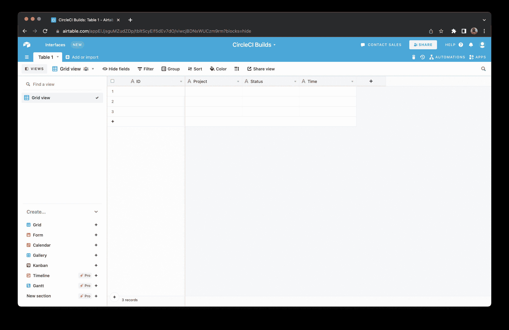

# 使用 CircleCI webhooks 和 Airtable Automations 开发管道构建测井系统

> 原文：<https://circleci.com/blog/webhooks-airtable/>

> 本教程涵盖:
> 
> 1.  在 air table 中设置 webhook 自动化
> 2.  在 CircleCI 上创建 webhook
> 3.  测试构建日志系统

自从 CircleCI 推出 webhooks 以来，我一直对这种新的集成方式向开发人员开放的可能性感到兴奋。我决定尝试在 [webhooks 文档](https://circleci.com/docs/webhooks/#use-cases)中描述的用例之一。这个用例包括将关于构建管道工作流的信息传输到一个 [Airtable](https://airtable.com/) 数据库中。通过管道传输到 Airtable 的数据会形成一个日志，供您监控工作流，您还可以设计图表和其他可视化工具来分析构建数据。

在本教程中，我将指导您使用 CircleCI webhooks 和 Airtable Automations 来构建这个设置。

## 先决条件

要完成本教程，您需要:

1.  一个 [CircleCI](https://circleci.com/) 项目
2.  [飞行表](https://airtable.com/)账户

有了这些，你就可以开始了。

## 创建航空表数据库

第一步是创建一个 Airtable 数据库。前往您的 Airtable 帐户，在工作区内创建一个新的 **Airtable Base** 。


单击底部以打开数据库表格。在表格上，使用`Single line text`字段类型创建以下字段:

*   `ID`:web hook 的 id
*   `Project`:触发 webhook 的 CircleCI 项目的名称
*   `Status`:项目构建的状态
*   `Time`:触发 webhook 的时间

**注意:** *您可以编辑或删除默认创建的字段，并创建我刚才列出的新字段。*

这是您将在 Airtable 中捕获的 webhook 有效负载的子集。



## 在 Airtable 中设置 webhook 自动化

要在 Airtable 中捕获 webhook 有效负载，您需要在刚刚创建的基础上设置一个自定义的 Airtable 自动化。点击屏幕右上角的**自动**。


在自动化页面上，点击**创建定制自动化**。


这将打开“自定义自动化”页面。在此页面上，将自动化重命名为`Builds Automation`(或任何您喜欢的名称)。点击**添加触发器**，选择`When webhook is received`选项。


这将在右侧显示一个面板，向您显示 Airtable 将接收 webhooks 的端点。点击**复制**按钮，复制该 URL 供下一步使用。

现在，您需要测试这个 webhook 端点，以确保 Airtable 可以在其上成功接收您的 CircleCI webhooks。要在自动化设置中使用 webhook 有效负载，您需要使用您期望的有效负载结构来测试这个端点。

要发送测试 webhook 请求，您将使用 [ReqBin](https://reqbin.com/) 。将 Airtable webhook 端点粘贴到地址栏中，并从请求方法下拉列表中选择 **POST** 。点击**内容**标签，粘贴此样本请求:

```
{
  "id": "3888f21b-eaa7-38e3-8f3d-75a63bba8895",
  "type": "workflow-completed",
  "happened_at": "2021-09-01T22:49:34.317Z",
  "webhook": {
    "id": "cf8c4fdd-0587-4da1-b4ca-4846e9640af9",
    "name": "Sample Webhook"
  },
  "project": {
    "id": "84996744-a854-4f5e-aea3-04e2851dc1d2",
    "name": "webhook-service",
    "slug": "github/circleci/webhook-service"
  },
  "organization": {
    "id": "f22b6566-597d-46d5-ba74-99ef5bb3d85c",
    "name": "circleci"
  },
  "workflow": {
    "id": "fda08377-fe7e-46b1-8992-3a7aaecac9c3",
    "name": "build-test-deploy",
    "created_at": "2021-09-01T22:49:03.616Z",
    "stopped_at": "2021-09-01T22:49:34.170Z",
    "url": "https://app.circleci.com/pipelines/github/circleci/webhook-service/130/workflows/fda08377-fe7e-46b1-8992-3a7aaecac9c3",
    "status": "success"
  },
  "pipeline": {
    "id": "1285fe1d-d3a6-44fc-8886-8979558254c4",
    "number": 130,
    "created_at": "2021-09-01T22:49:03.544Z",
    "trigger": {
      "type": "webhook"
    },
    "vcs": {
      "provider_name": "github",
      "origin_repository_url": "https://github.com/circleci/webhook-service",
      "target_repository_url": "https://github.com/circleci/webhook-service",
      "revision": "1dc6aa69429bff4806ad6afe58d3d8f57e25973e",
      "commit": {
        "subject": "Description of change",
        "body": "More details about the change",
        "author": {
          "name": "Author Name",
          "email": "author.email@example.com"
        },
        "authored_at": "2021-09-01T22:48:53Z",
        "committer": {
          "name": "Committer Name",
          "email": "committer.email@example.com"
        },
        "committed_at": "2021-09-01T22:48:53Z"
      },
      "branch": "main"
    }
  }
} 
```

这个示例负载的结构与 CircleCI 将为一个`workflow-completed`事件发送给 Airtable 的负载结构相同。


你的要求应该和前面的截图差不多。

现在，点击**发送**来测试你的 webhook 端点。成功的测试应该返回成功消息。


返回到 Airtable，并转到您复制 webhook 端点的屏幕。Airtable 可能已经自动检测到您的 webhook 请求，并显示了一条成功消息。如果没有成功消息，按下**测试触发器**按钮。


Airtable 现在理解了 webhook 有效负载的结构，您可以在自动化中使用它。

## 添加自动化操作

下一步是添加从 CircleCI 接收到 webhook 时要执行的操作。转到自动化页面。点击**运行动作**选项卡上的 **+添加动作**按钮。从下拉菜单中选择 **Create Record** ，为接收到的每个 webhook 在 Airtable 中创建一个新条目。在屏幕右侧的**属性**面板上，为**表格**字段选择`Table 1`(这是使用您的 Airtable base 创建的表格的默认名称)。

在表单的**字段**部分，选择`ID`字段。这将在字段下方显示一个文本框。点击加号 **+** 图标。然后点击`Webhook (from Step 1: When webhook received)`选项上的**继续**。点击`body`然后点击**插入**选择`id`属性。

使用相同的方法将下列表格字段映射到其各自的有效负载属性:

*   **项目** : `body` > `project` > `name`
*   **状态** : `body` > `workflow` > `status`
*   **时间**:`body`>

您的字段应该类似于下一个屏幕截图中的字段。


使用名称旁边的切换按钮打开自动化。


返回到表格视图。您的自动化将在屏幕右侧列出。描述应该说:“当一个网页挂钩收到创建一个记录”


## 在 CircleCI 上创建 webhook

下一步是在 CircleCI 上创建 webhook。当您的项目构建或工作流完成时，会向 Airtable 发送一个 webhook 请求，以记录关于构建过程的信息。

准备好 webhook URL 后，现在可以在 CircleCI 上设置 webhook 了。转到你的任何 CircleCI 项目，导航到**项目设置> Webhooks** 。在 Webhooks 页面，点击**添加 Webhook** 按钮。

这将显示一个表单，您可以使用它来创建您的 webhook。按照下一个屏幕截图所示填写表单。给它一个名称，并从 Airtable 中输入您的 webhook 端点 URL。


点击**添加网页挂钩**按钮创建你的网页挂钩。一旦创建，它将显示在网页挂钩列表中。

## 测试构建日志系统

现在，您已经完成了将构建信息记录到 Airtable 中的所有设置。考验它的时候到了。运行几次构建，直到完成。一旦您的项目完成了几个构建，请检查您的 Airtable 基础上的表格以查看条目。


## 结论

现在你有了，一个使用 CircleCI webhooks 和 Airtable automations 为你的 CircleCI 构建的日志系统。当然，您可以通过向表中添加更多的字段并将它们映射到各自的有效负载属性来扩展捕获的信息量。您还可以使用捕获的数据在 Airtable 中创建不同的视图。只需一点努力，您就可以使用该系统执行分析操作，从您的数据中获取可操作的信息。

编码快乐！

* * *

Fikayo Adepoju 是 LinkedIn Learning(Lynda.com)的作者、全栈开发人员、技术作者和技术内容创建者，精通 Web 和移动技术以及 DevOps，拥有 10 多年开发可扩展分布式应用程序的经验。他为 CircleCI、Twilio、Auth0 和 New Stack 博客撰写了 40 多篇文章，并且在他的个人媒体页面上，他喜欢与尽可能多的从中受益的开发人员分享他的知识。你也可以在 Udemy 上查看他的视频课程。

[阅读 Fikayo Adepoju 的更多帖子](/blog/author/fikayo-adepoju/)