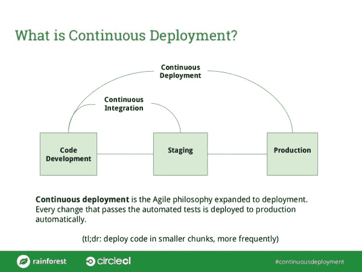

# 到底什么是持续部署？-切尔莱西

> 原文：<https://circleci.com/blog/what-is-continuous-deployment-anyway/>

**来自出版商的说明:**您已经找到了我们的一些旧内容，这些内容可能已经过时和/或不正确。尝试在[我们的文档](https://circleci.com/docs/)或[博客](https://circleci.com/blog/)中搜索最新信息。

* * *

根据 CircleCI 开发人员布道者 Kevin Bell 的说法，“有很多方法可以理解持续部署，但是我现在最喜欢的是将持续部署理解为敏捷开发和交付实践在持续集成之外的自然延伸。”

[持续集成](https://circleci.com/continuous-integration/)只是持续部署道路上的一步。这是 CircleCI 的凯文·贝尔和[雨林 QA](https://www.rainforestqa.com/) 首席执行官兼联合创始人[弗雷德·斯蒂文斯-史密斯](https://twitter.com/fredsters_s)、[实现持续部署](http://info.rainforestqa.com/webinar-getting-to-continuous-deployment-on-demand)最近网络研讨会的主题

该网络研讨会探讨了各种规模的公司如何实现持续部署的基础，包括:

对于感兴趣的人，你可以[点播网上研讨会](http://info.rainforestqa.com/webinar-getting-to-continuous-deployment-on-demand)，幻灯片可在[这里](http://www.slideshare.net/RainforestQA/getting-to-continuous-deployment-webinar-slides)获得。

如果您想亲自听听 Kevin Bell，现在听听他给出的关于使用 Bash 的提示和技巧还为时不晚！立即注册 CircleCI 办公时间:2 月 17 日星期三下午 6 点:[点击此处](http://www.meetup.com/CircleCI-Office-Hours/events/228090957/)回复。