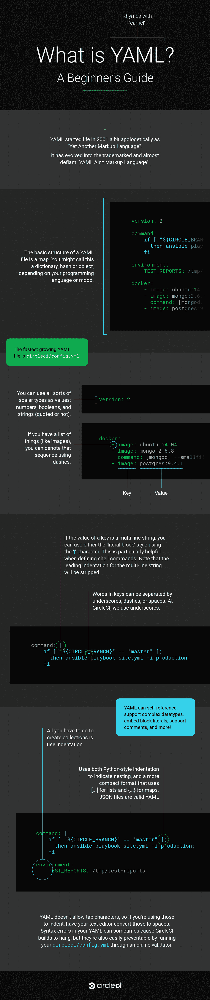

# 什么是 YAML？初学者指南| CircleCI

> 原文：<https://circleci.com/blog/what-is-yaml-a-beginner-s-guide/>

## 什么是 YAML？

YAML 是一种易于理解的数据序列化语言，常用于用任何编程语言创建配置文件。

YAML 是为人类交互而设计的，是另一种数据序列化语言 JSON 的严格超集。但是因为它是一个*严格的*超集，它可以做 JSON 能做的一切，甚至更多。一个主要的区别是，换行符和缩进在 YAML 中实际上是有意义的，与 JSON 相反，JSON 使用括号和大括号。

这种格式有助于指定配置，这就是我们在 CircleCI 使用它的方式。



## 如何写 YAML

YAML 文件的基本结构是地图。你可以称之为字典、散列或对象，这取决于你的编程语言或情绪。

非常普遍的是，键和值一直向下:

```
key: value 
```

### YAML 示例:标量类型

您可以使用各种标量类型作为值:数字、布尔值和字符串(带引号或不带引号)。例如，`config.yml`的第一行通常是:

```
version: 2 
```

键中的单词可以用下划线、破折号或空格分隔。在 CircleCI，我们[使用下划线](https://circleci.com/docs/configuration-reference/#example-full-configuration)。

如果键值是多行字符串，您可以使用带有“|”字符的“文字块”样式。这在定义 shell 命令时特别有用:

```
command: |
    if [ "${CIRCLE_BRANCH}" == "master" ];
      then ansible-playbook site.yml -i production;
    fi 
```

请注意，多行字符串的前导缩进将被去除。

### YAML 示例:集合类型

创建收藏所要做的就是使用缩进:

```
environment:
    TEST_REPORTS: /tmp/test-reports 
```

如果你有一个事物列表(比如图像)，你可以用破折号来表示这个序列:

```
docker:
    - image: ubuntu:14.04
    - image: mongo:2.6.8
      command: [mongod, --smallfiles]
    - image: postgres:9.4.1 
```

注意，序列中的第二项有两个键:`image`和`command`。`command`键使用 JSON 风格的序列，因为(记住！)YAML 是 JSON 的超集。

最后，YAML 不允许制表符，所以如果你使用这些来缩进，让你的文本编辑器把它们转换成空格。你的 YAML 中的语法错误有时会导致 CircleCI 构建挂起，但是通过让你的`circle.yml/config.yml`运行一个[在线验证器](http://codebeautify.org/yaml-validator)也很容易避免。

## 进一步阅读

本指南中的内容应该是您轻松编写 CircleCI 配置文件所需的全部内容。YAML 确实支持额外的功能，你可以在官方网站上读到这些功能，或者在不那么吓人(但不那么详尽)的 T2 网站上读到这些功能。

阅读更多信息: