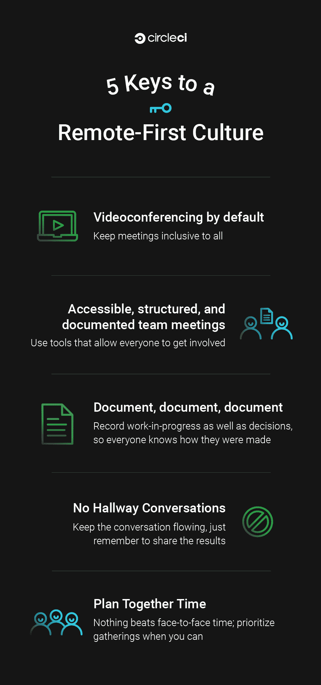

# 远程优先与远程友好循环意味着什么

> 原文：<https://circleci.com/blog/what-it-means-to-be-remote-first-vs-remote-friendly/>

嗨！我是 Rose Jen，CircleCI 的产品经理。我在 CircleCI 进行了一些采访，我被问到的第一个问题是“你对 CircleCI 的分布式文化有什么体验？”

[https://www.youtube.com/embed/XdPe-0am5E4](https://www.youtube.com/embed/XdPe-0am5E4)

视频

我以前在允许远程工作的公司工作过。他们为自己的团队提供工具，使远程工作成为可能。我也曾在一些团队中工作过，这些团队开始时位于同一地点，但随着团队成员的移动，他们不得不分散到不同的地方。通常在这些情况下，远程工作的人变得越来越不受重视，与团队的其他成员越来越疏远。

鉴于这些经历，我最初对在分布式团队中工作犹豫不决，特别是担心沟通会很困难，或者更糟，我可能会感觉与团队脱节。然而，当我在 CircleCI 工作的时候，我注意到公司在建立一个包容性的分布式文化上的深思熟虑的工作减轻了我的许多恐惧。通过这次经历，我看到了这些努力带来的变化，并了解到仅仅允许员工远程工作是不够的。

虽然 CircleCI 从一开始就是一个分散的团队，但我们在旧金山有一个正式的总部。为了支持我们遍布全球的队友感受到完全的联系、包容和授权，我们每天都在努力构建“远程优先”的文化。允许远程工作的团队和努力做到远程优先的团队之间的区别可能听起来像是一个技术问题，但实际上对我们的团队成员来说是一个不同的世界，不管他们在哪里。远程优先意味着远程员工不是事后才想到的。“远程优先”意味着不仅要对所使用的工具有意识，还要对我们如何规划公司文化以尽可能包容远程员工，同时让每个人都发挥最大的生产力有意识。

## 对于任何考虑加入我们的人，或者那些希望在自己的组织中培养远程优先文化的人，这里有 5 种方法可以让它发挥作用:

### 默认视频会议

在 CircleCI，我们非常依赖视频会议——在这里，没有某种视频会议是不可能度过一个工作日的(我们使用 [Zoom](https://zoom.us/) )。为了最大限度地包容，我们对如何使用视频会议工具非常具体。首先，作为一家公司，我们在硬件和软件上进行了大量投资，这使得我们对视频会议的依赖得以实现。我们办公室的每个会议室都完全支持视频。另一方面，我们希望我们的员工能够使用高速互联网连接，并在能够清晰听到和看到他们的地方工作——听不到别人打电话也不会影响工作。这种战术的成功依赖于每个人的参与。我们还在早期决定授予每位员工 Zoom 帐户的完全访问权限，这样每位团队成员都会觉得自己有权召集会议，无论是大型头脑风暴还是临时聊天。

此外，我们有关于如何通过视频会议传播信息的实践。我们在每个活动邀请中都包含一个缩放链接，这样无论参与者在哪里，他们都可以加入。在 CircleCI，我们有一条通用规则，如果不同时区的团队成员无法参加会议，我们会对会议进行录制，供以后查看。这让所有时区的人们都可以灵活地以最适合自己的方式管理自己的一天。

### 可访问的、结构化的和记录的团队会议

在 CircleCI，大多数产品开发团队每周都有各种聚会:计划会议、每日站立会议、头脑风暴、设计回顾和回顾。这些都是通过视频会议完成的。根据会议的类型，我们还利用每个人都可以实时访问的数字工具( [Google Docs](https://www.google.com/docs/about/) )，通过这些工具我们可以促进讨论并记录决策。例如，我们使用 Google Docs 来概述头脑风暴或回顾性讨论主题。对于计划会议和站立会议，我们去我们的共享[吉拉](https://www.atlassian.com/software/jira)板，那里显示我们的交付成果和进展，这样当讨论发生时，每个人都实时跟进。对于设计评审，我们使用[视觉](https://www.invisionapp.com/)，一个设计原型工具，允许设计在团队中共享，并允许团队成员提供评论。这些帮助我们在团队所在的任何地方召开富有成效的会议。我个人并不怀念将整个团队塞进同一个会议室，我当然也很高兴摆脱了寻找可用会议室的挣扎。

### 文档文档文档

谁不喜欢好的文档呢？在远程优先的环境中，要特别注意可能对不在同一地点的团队成员不利的物理工件。当几个人在同一个房间时，总会有实时发生的事情(快速草图，便利贴)，但我们努力记录并与整个团队分享这些 IRL 头脑风暴的结果，并拍摄大量图表，路线图和其他结果的照片，以便每个人都可以在事后访问它们。想办法确保远程团队成员不只是在听，并寻找他们可以实时参与的方式。Zoom 提供协作白板，您可以在电话会议中使用。即使有最好的工具，这个过程通常也是不完美的，因此需要每个人都有意识和创造力。

### 没有走廊谈话

这并不意味着你不能和你的同事面对面或在饮水机旁交谈。但这确实意味着，如果你与工作相关的对话没有被数字化记录，它们应该在事后以某种方式被记录下来:在聊天中做一个总结，写一个简短的文档，或者找到另一种方法来确保信息可以被远程团队成员引用。我们还鼓励我们的团队成员通过视频进行即兴的“走廊”对话，无论是问问题还是迅速让团队就特定主题达成一致。不管在什么地方，有些事情只有一对一的快速聊天才能弄清楚。

### 一起计划时间

只要有可能，就把分散的团队召集到一起！在现实生活中，能够与远方的同事共度时光真的很棒。在 CircleCI，我们计划团队每年至少在一个地点聚会一次。各部门也是如此。这将需要认真的后勤规划和资金预算，但作为团队建设的投资，这是非常值得的。

我所分享的并不是运营分布式公司的权威指南——只是我在 CircleCI 注意到的一些事情，这些事情让我和我的同事在分布式团队中工作时有所不同。值得一提的是:我们总是在重新评估我们的流程，并寻找改进的地方。事情会改变的。例如，现在我们正在向全球扩展，这改变了分布的真正含义(例如，召集一个成员相距 1 小时而不是 8 小时的团队，可能意味着旧金山的人在一天中更早安排会议，以适应北美/南美和欧洲团队成员的时间表)。这些变化促使我们改变使用工具的方式，并给了我们继续迭代和改进的机会。总的来说，如果你所在的组织希望变得更加远程友好，我们鼓励你保持开放的心态，尝试找到最适合你的方式。