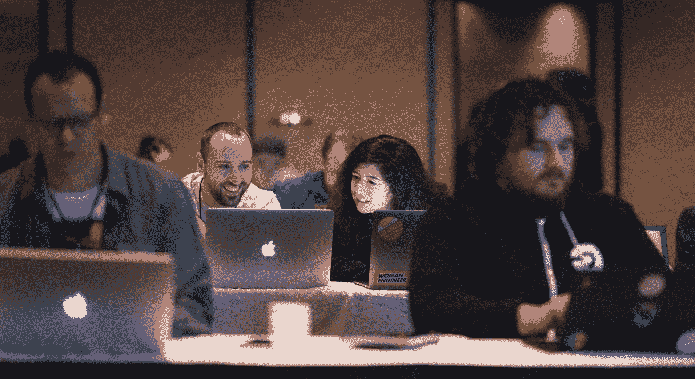
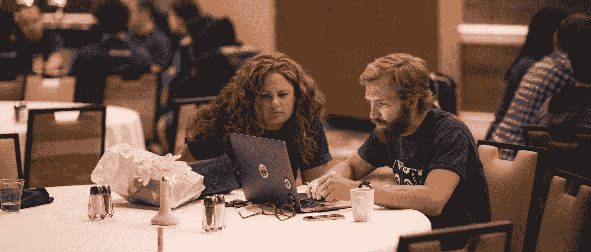
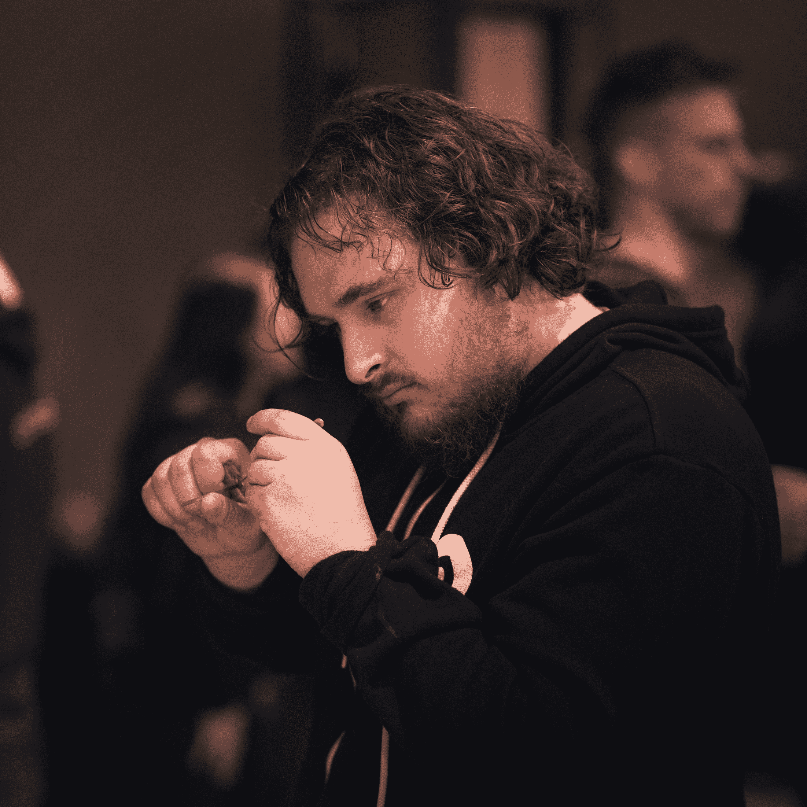
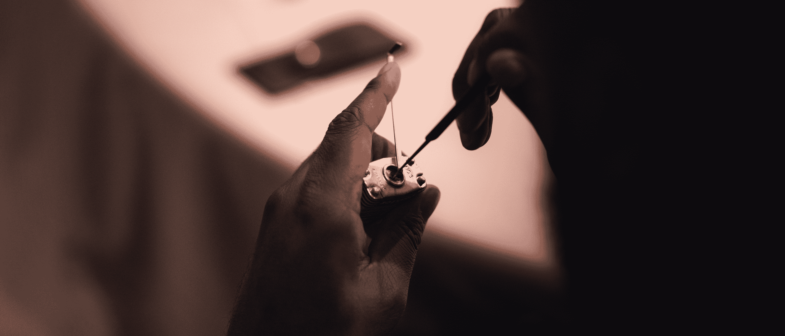

# 工程师安全培训- DefCon -捕捉旗帜| CircleCI

> 原文：<https://circleci.com/blog/why-we-hired-two-defcon-hackers-to-teach-our-team-to-think-like-deviants/>

[INT。-酒店宴会厅】2019 年夏天，拉斯维加斯卢克索酒店的一个寒冷、没有窗户的会议室。几十个人，大多数穿着黑色连帽衫，正趴在笔记本电脑前窃窃私语默认系统密码，并在 Docker 容器中寻找已删除的(据说是)password.txt 文件。由 Aphex Twin 制作的 Hedphelym 轻柔而充满威胁。

不，这不是传说中的 [DefCon 夺旗](https://www.defcon.org/html/links/dc-about.html)比赛。但它被设计成模拟那个事件。这也是我们决定向 CircleCI 的整个工程团队教授安全编码的原因。

> “谁知道安全培训不仅仅是 90 年代的剪贴画，坏人戴着滑雪面罩打字？“-CircleCI 平台副总裁 Michael Stahnke

### 如何教授安全性

几年前，当我开始担任 CircleCI 的第一位安全工程师时，首席技术官 Rob Zuber 要求我处理的第一件事就是安全代码培训。他想让它变得有趣。他想让它在人们的胸中制造紧张感。几年前，他参加了谷歌的一次安全培训活动。在活动的一次演习中，他发现了自己服务中的一个漏洞。当他跑去修补时，他的心开始怦怦直跳。那次脉搏加速的经历改变了他对软件的看法。他想让我们所有的开发人员都体验一下。

我们考虑了所有能想到的培训，从在线课程到让整个部门飞往异地参加安全会议。他们都没有承诺同样的内心体验。

作为[湾区 OWASP 会议](https://www.meetup.com/Bay-Area-OWASP/)的组织者和主持人，我得到了许多演示想法。一个来自匈牙利的一家小公司，名为 [Avatao](https://avatao.com/) ，提供安全代码培训。我试了一下他们的一些培训模块，很快就知道，他们不仅可以展示，我们还找到了 CircleCI 培训的工具。这是动手打破东西，有一些指导。这感觉不同于手工静态代码分析游戏和我所知道的类似的东西。它从上至下捕捉概念，从 OWASP 十大应用程序到后端技术，如 Docker，并专注于打破这些东西。

该训练平台由三名安全研究人员设计，并非巧合的是，他们曾多次入围 CTF DefCon 大会。它包括几百个模块，从二进制代码开发到 SQL 注入，再到特定语言的问题。而且它是可扩展的。如果我们想要他们没有的东西，他们会构建一个模块或帮助我们编写一个。

### 完美的机会

当我的安全培训研究开始取得成果时，我们的工程和产品团队正忙着计划在拉斯维加斯进行为期一周的异地培训。第二天午饭后，我有四个小时的黄金时间来运行一个游戏，我知道这将是一个邀请 Avatao 与我们团队面对面工作的好机会。与我们安全团队的其他几个人一起，我们选择了 12 个模块，重点关注与我们工程师日常生活最相关的主题，如 Docker secrets、OWASP 十大漏洞，如跨站点请求伪造(我们已经在内部处理过)、保险库教程和默认密码。此外，我们还添加了一些真实世界黑客的复制品，比如脸书 Imagekick。

期待着这一事件的奖品购物是一个爆炸:一本开锁书，一套开锁工具，透明的璐彩特手铐和揭示其锁定机制的挂锁。

### 表演时间到了

在拉斯维加斯的第二天午餐后，阿瓦陶的人们在房间的顶端安装了两个大记分牌，开始了比赛，所有的参与者分成两人一组。结对编程是 CircleCI 文化的一个重要组成部分，所以我们也在活动中利用了这一点。作为一个转变，我们有意将工程师与他们通常不一起工作的人和团队配对，并根据经验水平组织他们。两人一组，每个人都有 E3/4 的平均技能水平，以防止一个高年级组践踏每个人。

活动开始几分钟后，有人指出这里太安静了。我有音乐吗？

碰巧的是，我做到了。当我还是私家侦探的时候，我整理了一份邪恶音乐的播放列表(想想迈克尔·曼的所有电影，美国黑帮，黑鹰坠落等等)。)的一个大项目，寻找与伯尼·马多夫庞氏骗局相关的资产。我把手机接到音响系统上，不得不说，一屋子咔哒咔哒的键盘让音乐听起来比我耳机里的更酷。

半小时后，我知道这是成功的。每个工程师都专注于他们的屏幕，没有一个人坐在后面聊天，房间里有一种竞争的感觉。幸运的是，投影屏幕上的两个记分牌显示每个队都在进步。我们的安全小组是随叫随到的助教，但他们都挤在一个角落里互相交谈。没人有问题。

两个小时后，我们颁发了奖品，与 Avatao 人员进行了问答，然后分成六个工程师小组，让他们讨论每个人学到的知识以及最适用于我们内部流程的知识。最后，每个人都搬到隔壁房间喝鸡尾酒，喝咖啡，做开锁练习。

 

### 安全地吸取经验教训

那么，人们从他们的六人小组讨论中报告了什么？

该事件揭开了缓存中毒等具体问题是如何发生的一些神秘面纱。像 Imagetrick 这样对现实世界的黑客进行逆向工程是非常有趣的。这些模块很有挑战性，但并不令人沮丧。安全审查真的很重要。而且，几乎每个小组都要求在 Kubernetes 和 API 验证上添加特定的模块。

与一位首席软件工程师搭档的软件工程师布瑞恩·奈特说:“夺旗太酷了。”。"从一个首席工程师的角度来看，这很有趣."

软件工程师 Jacqueline Garcia 说，直接看到安全漏洞并花两个小时与队友讨论它们是很有趣的。这使得他们对在编码实践中实现安全性有了不同的想法。

“我最喜欢的是其中的合作，”她说。

关键要点:

1.  专注于你的听众每天使用的技术模块。仅仅因为安全团队对深奥的漏洞感兴趣并不意味着其他人也会感兴趣。
2.  保持练习简短，这样人们就不会陷入困境。重要的是让人们感觉他们可以做好安全工作，而不是让他们明白安全工作很难，应该留给专家去做。
3.  召集一组来自整个部门的工程师，他们将通过提前试用来帮助制定课程。这不仅使模块与需求保持一致，还在活动期间创造了可以对问题进行分类的助教。
4.  安全性不仅仅是代码。在编程的两边添加一些东西，比如开锁，以保持较高的乐趣系数。

如果您正在寻找保护 CI/CD 管道的方法，请查看我们关于持续集成的[安全最佳实践](https://circleci.com/blog/security-best-practices-for-ci-cd/)的帖子。