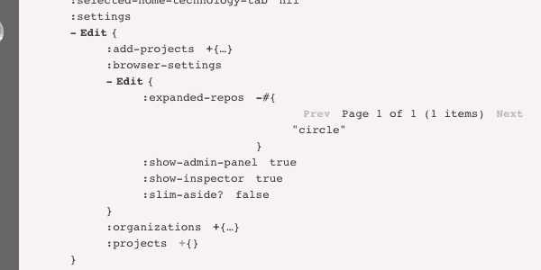
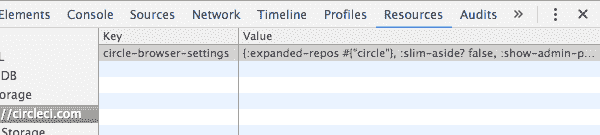

# 为什么我们使用 Om，为什么我们对 Om Next - CircleCI 感到兴奋

> 原文：<https://circleci.com/blog/why-we-use-om-and-why-were-excited-for-om-next/>

**来自出版商的说明:**您已经找到了我们的一些旧内容，这些内容可能已经过时和/或不正确。尝试在[我们的文档](https://circleci.com/docs/)或[博客](https://circleci.com/blog/)中搜索最新信息。

* * *

作为前端开发人员，这是一个激动人心的时刻。脸书的[反应](https://facebook.github.io/react/)颠覆了我们关于渲染用户界面的想法。特别是 [Om](https://github.com/omcljs/om/) ，开启了一种全新的思考用户界面工作方式的方式。过去几年是新思想和发展的高峰期。

但是现在，事情变得越来越好。今年，脸书的 GraphQL 和网飞的 Falcor 相继发布，紧随其后的是一个借鉴了他们的最佳创意的项目:Om Next。Om Next 是当前版本 Om 的继任者(现在被称为“Om Now”)。它保留了 Om 的优点，抛弃了不好的地方，并用一种更好的方法取而代之。

Om Next 目前在 alpha 中，但是一旦它发布，我们计划在 CircleCI 使用它。我想解释一下为什么这对我们来说如此激动人心。但是首先，我们需要看看我们为什么要走这条路。

## 为什么要反应？

自古以来(好吧，自从 JavaScript 出现以来)，web 开发人员一直在为一个特殊的问题而奋斗:当新数据到达时，如何更新 UI？也就是说，如果你在显示一个列表，

*   洋蓟

*   卷心菜

*   茄子

并且添加了两个新项——第一个和第二个之间的“花椰菜”,第二个和第三个之间的“莳萝”——如何更新 DOM 以反映这种变化呢？我们有两个选择，每个都很麻烦:

1.  我们可以将新的列表项插入到现有的 DOM 中，但是找到合适的位置插入它们很容易出错，并且每次插入都会导致浏览器重新绘制页面，这很慢。

2.  我们可以丢弃整个列表并一次性重建它，但是重新呈现大量的 DOM 也很慢。

为了使客户端 web 开发成为可能，我们必须解决——或者至少减轻——其中的一个问题。直到最近，大多数 JS 框架都专注于第一个问题，要么使 DOM 更容易导航，要么将元素绑定到负责保持它们最新的控制器对象。这些方法当然缓解了第一号问题，但是它们还没有解决 T2 的问题。通常，就像在主干中一样，他们将问题分散到许多小组件上。每个都只有一小块 DOM 要处理，但它仍然要处理。我们仍然有很多小的 DOM 更新来重新绘制页面。

React 解决了第二个问题。使用 React，我们*假装*重新呈现整个页面既快又容易。就 React 而言，它让我们*假装*我们正在重新呈现页面，而事实上，我们正在“呈现”一棵 JavaScript 对象树，称为“虚拟 DOM”，这是我们希望页面看起来像什么的完整规范。然后，React 将新的虚拟 DOM 与以前的 DOM 进行比较，以准确地找出在*真实* DOM 中需要更改的内容，然后它只更改那些位，一次全部更改。结果是快速*和*容易。

(如果你仔细看，这里面有猫腻。React only *看起来*像是在解决第二个问题，但最终它真的解决了第一个问题:它要求我们*假装*重新呈现整个列表，以便它可以找到正确的位置来自动插入新项目。)

像这样简单的系统是很难超越的。在许多情况下，视图代码只是一个接收数据并返回 DOM(或者至少是虚拟 DOM)的函数。它是无状态和声明性的。直到你需要一点状态，也就是哪个 React 还能处理。今天，我无法想象用别的东西。

但在 CircleCI，我们不只是运行 React，我们还将代码库切换到 ClojureScript，并用 Om 编写我们的前端。ClojureScript 很容易销售:我们的后端已经用 Clojure 编写，并且已经有几个 ClojureScript 的 React 包装器。但是为什么特别是 Om 呢？

## 为什么是 Om？

Om 即使不是第一个 ClojureScript React 库，也是第一个。但当我们在 2013 年年中开始行动做出反应时，已经有好几个了，包括[试剂](https://holmsand.github.io/reagent/)和[静止](https://github.com/levand/quiescent)。Om 给了我们什么其他人没有的东西？

React 关心的是数据如何流入页面上的每个组件，而 Om 也关心数据如何存储。Om 对应用程序状态的看法与 React 不同。试剂和静态的主要卖点是它们比 Om 更灵活。但是我们*喜欢* Om 的观点，我们喜欢同意它所交换的东西。

1.  **应用程序状态作为一个单一的、不可变的数据结构。**这既是入行的成本，也是(取决于你的看法)收益本身。整个应用程序状态作为单个数据结构存储在单个原子中。改变应用程序的状态总是涉及到原子。这意味着应用程序状态总是(原子地)从一个一致状态变为另一个一致状态。

Om 的创建者 David Nolen 喜欢炫耀这使得实现撤销变得多么容易:只要记住一个旧状态列表，你就可以在任何时候将状态原子添加到其中的任何一个。不过，我们喜欢它的另一个原因是:我们希望序列化应用程序状态，以便用户可以向我们的支持团队发送他们的 CircleCI 界面的快照。我们会弹出他们发送的数据，页面会将它反序列化并`reset!`到状态 atom 中，然后——很快——我们就会看到客户所看到的。

我们还做了另一个技巧:我们将应用程序状态树的一部分保存在浏览器的本地存储中。这是一种在你关闭应用程序后跟踪“粘性”事物的简单方法，比如你在侧边栏中折叠或展开了哪些 repos，或者你喜欢如何排序你的分支。我们观察路径`[:settings :browser-settings]`，并将这些值同步到本地存储中的一个键。然后，在页面加载时，我们将数据从本地存储中取出，并将其放回应用程序状态。如果我们想要一个值持久化，我们只需要把它存储在树的那个部分，它就会自动变成“粘性的”。

 *应用状态树中存储的粘性设置。*



*粘性设置自动同步到本地存储器。*

1.  **光标。** Om 需要一种方法来导航这个巨大的数据结构，这就需要游标。假设您已经得到了上面的购物清单，反映在您的应用程序状态中。

```
(def app-state
  (atom {:grocery-list [{:name "Artichokes"}
                        {:name "Cabbage"}
                        {:name "Eggplant"}]})) 
```

假设用户点击一个编辑按钮，将“朝鲜蓟”改为“鳄梨”。不知何故，您需要`swap!`保存整个页面状态的单个原子，将正确的元素更新为新值。类似于:

```
(swap! app-state assoc-in [:grocery-list 0 :name] "Avocadoes") 
```

除此之外，编辑按钮被绘制为列表*项目*组件的一部分。该列表项不应该知道它表示其包含列表的第 0 项，或者该列表存储在`:grocery-list`。它也不应该知道应用程序状态存储在一个名为`app-state`的变量中。

解决方法如下:Om 让您传递一个*游标*，而不是传递您的组件常规数据(`{:name "Artichokes"}`)。光标包含您需要的三条信息:数据本身(`{:name "Artichokes"}`)、数据的路径(`[:grocery-list 0]`)以及数据所在的原子(`app-state`)。它神奇地表现得好像它只是数据，所以`(:name item-cursor)`是`"Artichokes"`，但是 Om 的`om/update!`函数知道如何获得另外两部分。现在，你要做的就是:

```
(om/update! item-cursor :name "Avocadoes") 
```

Om 隐藏了组件不需要关心的部分。

## 拉伸奥姆的接缝

Om(也就是 Om“Now”)是一个很好的开始，但它还不能完全支撑像我们这样的大规模 ClojureScript 应用程序。(怎么可能:这是在他们存在之前写的。)在 CircleCI，我们一直在发现 Om 的模型出问题的地方。

### 游标的难题:大多数数据不是树。

Om 的面向光标的架构要求你将应用程序的状态组织成一棵树，特别是*一棵与你的 UI* 结构相匹配的树。包含整个应用程序的根 UI 组件被赋予一个指向整个状态的根光标。然后，它将状态的子树(游标)传递给其子组件。上面，根组件会将`(:grocery-list root-cursor)`传递给某个`grocery-list`组件，该组件会将列表中的每个元素传递给某个`grocery-item`组件。状态的结构*就是 UI 的结构*。对于简单的应用程序来说，这非常有效。

但是考虑一下我们之前的技巧。UI 的哪个部分呈现了所有的“粘性”设置？none:*UI 的任何*部分都可能需要在那个分支中存储一两个设置以使其“有粘性”。记住，分支选择器需要存储每个回购的分支列表是折叠的还是展开的。如果分支选择器只被传递了`[:dashboard :branch-list]`中的列表，它将如何读写`[:settings :browser-settings]`？我们从很多角度反复探讨这个问题。事实证明，UI 元素有时有横切关注点。他们的数据并不总是映射到树上。

我们是如何解决这个问题的？我们的大多数组件都将整个应用程序状态作为它们的数据。父组件不仅仅将它们关心的部分传递给它们的子组件，而是将整个 enchilada 传递给它们。然后我们有[在变量](https://github.com/circleci/frontend/blob/7e1be4ce7084fe56a6c9d46817c2b8fa46616f83/src-cljs/frontend/state.cljs#L70-L234)中定义的一系列路径，我们用它们来提取我们想要的数据。不太理想。但这是我们必须做的。

### 突变的管理:组件不仅仅改变它们自己的数据。

当需要更改数据时，Om 再次很好地解决了简单版本的问题，但很快就崩溃了。正如我们在上面看到的，如果杂货项目“朝鲜蓟”想要改变它的名字，这很容易:它可以在它的光标上使用`om/update!`。但是如果它想删除自己呢？它不能。那不会改变*项目*，那会改变*列表*。杂货列表组件可以通过将*的光标*更新为删除了“朝鲜蓟”的版本来删除该商品:

```
(om/update! list-cursor 
  (into [] (remove #(= "Artichokes" (:name %))) list-cursor)) 
```

但是在 UI 中,“删除”按钮应该是食品杂货组件的一部分。正如我们的数据不能完美地映射到我们的 UI，我们的变异操作也是如此。

Om 中这个问题的通常解决方案是 core.async 通道。杂货列表组件将建立一个通道，并将其传递给每个列表项。为了删除自身，item 组件会在该通道上放置一条消息。同时，list 组件将运行一个`go`块来监听消息，当它得到消息时，它将`om/update!`它的光标。

如果这听起来像是一个普通问题的复杂解决方案，你是对的:的确如此。但人就是这样。甚至 Om 的 TodoMVC 例子也诉诸于此。

在 CircleCI 应用程序中，我们做同样的事情，但我们做的规模要大得多。我们有一对多方法， [`frontend.controllers.controls/control-event`和`frontend.controllers.controls/post-control-event!`](https://github.com/circleci/frontend/blob/7e1be4ce7084fe56a6c9d46817c2b8fa46616f83/src-cljs/frontend/controllers/controls.cljs#L85-L93) ，为整个应用程序处理这样的消息。(第一个根据需要转换状态树，第二个执行任何副作用。)这里有很多我们自己建造的建筑。我们尽了很大努力来避免 Om 自己的方法(游标)，因为它们不符合我们在这个规模上的需求。

### 数据的交付:数据是如何进入 app 状态的？

当所有数据都存储在客户机上时，Om 工作得非常好。一旦有了服务器支持，事情就变得更棘手了。对于小型应用程序，比如杂货清单，你可以在页面加载时加载所有你需要的数据。但是在 CircleCI 这样的应用程序中，我们无法预先加载你可能想要看到的所有内容。我们按需装载物品。当您进入仪表板时，我们会加载最新的版本。当您转到一个构建页面时，我们会获取该构建详细信息。随着屏幕上组件的变化，我们发现我们需要不同的信息。

今天，我们的钩子是导航动作。我们的导航系统使用来自[部长](https://github.com/gf3/secretary)的路线，在此之上是一个多方法调度系统，非常类似于我们上面看到的`control-event`系统，称为`navigation-event`。例如，当用户导航到构建页面时，我们点击`post-navigated-to! :build`，这将触发我们获取构建细节所需的任何 API 调用。当这些 API 调用返回时，它们会将新数据`swap!`到状态树中。

与此同时，我们的组件试图呈现状态树中仍然为空的部分。这很好:当它是空的时，他们显示一个装载旋转器。当 API 系统`swap!`在数据中时，Om 在页面上重新呈现组件，显示构建。

这是一个很好的系统，但是它有一个主要的缺陷:它是构建页面组件，知道它需要什么数据来显示，但是它是导航系统，知道 T2 获取什么数据。这些代码在代码库中相距甚远。如果我们希望构建页面显示一些新的东西，我们必须将它添加到构建页面的 UI 上*和*添加一个对导航系统的 API 调用。如果我们*从构建页面中移除*某些东西，我们很容易忘记从导航系统中移除它，并在每次用户查看构建时进行不必要的 API 调用。

幸运的是，未来是光明的。

## 为什么接下来是 Om？

Om 接下来是即将到来的 Om 改版。其实更多的是重启。David Nolen 和 Om 团队采用了 Om 背后的原则，应用了过去几年的经验，并建立了一些新的东西。它目前还处于测试阶段，还没有准备好投入生产，但应该会在几个月后准备好。当它是，我们计划迁移到它。何必呢？很高兴你问了。

### 树实际上是一个图形。

在 Om Next 中，每个组件都确切地声明它需要什么数据。它使用类似于 [Datomic 的拉查询语法](http://docs.datomic.com/pull.html)的语法声明了一个*查询*。不像树中的简单路径，像这样的查询可以在*图*中导航。(事实上，Om Next 的查询类似于脸书的 [GraphQL](https://facebook.github.io/graphql/) ，并且部分受到其启发。)

例如，也许某个组件需要显示当前用户最近启动的构建之前的构建的开始时间**。你永远不会将这些信息存储在路径`[:current-user :initiated-builds 0 :previous :start-at]`下的树中。您不会将您的实际构建记录嵌套在其他构建的`:previous`引用中，就像这样:**

```
{:current-user
 {:initiated-builds 
  [{:id 146
    :repo-name "circleci/frontend"
    :start-at #inst "2015-12-17T17:13:59.167-00:00"
    :previous {:id 144
               :repo-name "circleci/frontend"
               :start-at #inst "2015-12-17T17:05:58.144-00:00"
               :previous {:id 141
                          :repo-name "circleci/frontend"
                          :start-at #inst "2015-12-17T17:05:13.512-00:00"
                          :previous ; and so on...
                          }}}
   {:id 145
    :repo-name "circleci/docker"
    :start-at #inst "2015-12-17T17:09:25.961-00:00"
    :previous {:id 143
               :repo-name "circleci/docker"
               :start-at #inst "2015-12-17T17:05:36.797-00:00"
               :previous {:id 138
                          :repo-name "circleci/docker"
                          :start-at #inst "2015-12-17T17:04:51.124-00:00"
                          :previous ; and so on...
                          }}}]}} 
```

那就太傻了。你可以把它保存在构建列表中。说，`[:builds 145 :start-at]`。您的数据将如下所示:

```
{:current-user {:initiated-builds [[:build/by-id 146]
                                   [:build/by-id 145]]}
 :build/by-id {146 {:id 146
                    :repo-name "circleci/frontend"
                    :start-at #inst "2015-12-17T17:13:59.167-00:00"
                    :previous [:build/by-id 144]}
               145 {:id 145
                    :repo-name "circleci/docker"
                    :start-at #inst "2015-12-17T17:09:25.961-00:00"
                    :previous [:build/by-id 143]}
               144 {:id 144
                    :repo-name "circleci/frontend"
                    :start-at #inst "2015-12-17T17:05:58.144-00:00"
                    :previous [:build/by-id 141]}
               143 {:id 143
                    :repo-name "circleci/docker"
                    :start-at #inst "2015-12-17T17:05:36.797-00:00"
                    :previous [:build/by-id 138]}
               ;; and so on...
               }} 
```

你不能用光标来导航。一旦你缩小到`:current-user`和它的`:initiated-builds`，你就不能构建#146:它在树的不同分支。一旦你缩小到 146 号版本，你就不能退回去找它之前的 145 号版本了。原来你的数据其实不是一棵树，而是一张图表。

查询可以让你从各个方向浏览你的约会图表。Om 接下来的做法非常聪明:它采用类似上面的结构，将您需要的数据反规格化到您期望的位置。你的原始数据是一个图，但是你的 UI 看到的是一棵树，一棵和你 UI 的结构完美匹配的树。在 Om Next 中，您的查询可能类似于:

```
[{:current-user [{:initiated-builds [{:previous [:start-at]}]}]}] 
```

此外，根据您的设置方式(Om Next 非常灵活)，您可能会得到一个如下所示的树:

```
{:current-user
 {:initiated-builds
  [{:previous {:start-at #inst "2015-12-17T17:05:58.144-00:00"}}
   {:previous {:start-at #inst "2015-12-17T17:05:36.797-00:00"}}]}} 
```

注意，在原始数据中，每个构建都引用了前一个构建，但是在这个响应中，我们没有无限深的递归。为什么？因为*我们只得到我们在查询*中请求的内容。我们要求深入一层，这就是我们得到的。

在 Om Now 中，你将你的应用程序状态存储在一个必须与你的 UI 形状相匹配的树中。在 Om Next 中，你以任何有意义的形式存储你的应用程序状态，并让 Om(在你的帮助下)将这些数据转换成一个与你的 UI *匹配的树。当用户界面的形状改变时，查询的形状也会随之改变，因此它接收的数据的形状也会自动改变。*你的用户界面并不驱动数据的形状。*这是一个巨大的胜利。*

### 变异是一流的操作。

因为您不再以数据存储的形式接收数据，所以您不再像以前那样直接操作数据:使用游标。相反，Om 接下来要求您定义一组可以改变应用程序状态的*变异*操作。这些变化被命名，它们做什么在组件本身之外被定义，作为 Om 接下来称之为“解析器”的一部分。

听起来熟悉吗？这正是我们已经在 circle ci`frontend.controllers.controls`中构建的，只是这个版本不涉及 core.async 诡计，也不需要维护一个其他人从未见过的大型定制架构。显然，我们的方向是正确的，但是将这一点嵌入到 Om 本身会更好。

### 您的组件知道它们需要什么。

还记得我们从服务器获取数据的问题吗？我们必须挂钩导航事件，然后猜测我们的组件将要显示什么数据。不会了。在 Om Next 中，我们的组件有查询！我们可以问他们需要什么。我们没有将 API 调用绑定到导航事件，而是将 API 调用绑定到应用程序状态的一部分(比如`[:current-user :initiated-builds]`)。如果我们试图显示一个需要知道当前用户发起的构建的组件，这将触发一个 API 调用，向服务器请求数据。如果我们停止使用那个组件，我们就停止了这个请求。自动地。

因为数据和 API 之间的映射集中在解析器中，所以我们可以将请求分成更少的 API 调用，从而提高性能。我们甚至可以改变哪些 API 提供哪些数据，而根本不用接触 UI 组件！

## 这就是所有大惊小怪的原因

Om Next 让我们兴奋不已，原因有很多。它证明了我们早期做出的一些重大决定，它承担了我们必须定制的许多架构的责任，并且它将极大地简化我们编写大多数前端应用程序的方式。当然，现在最难的是等待它准备好。

与此同时，我们将制定出最好的方法，逐步将我们的应用从现在的 om 迁移到下一个 Om，消除错误，并希望改善每个人的迁移路径。就像我说的:作为一名前端开发人员，这是一个激动人心的时刻！

* * *

如果你对这一切感到兴奋，并想自己尝试一下，我强烈推荐托尼·凯的 om 教程。在 [Om wiki](https://github.com/omcljs/om/wiki) 上还有几个更有针对性的教程。(以上都是正在进行的工作，因为 Om Next 仍在不断变化，但它们仍然值得一试。)