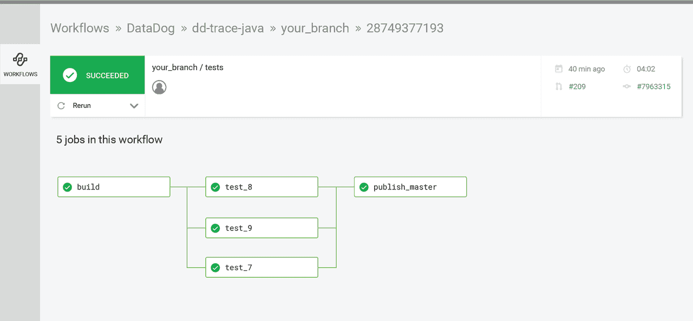
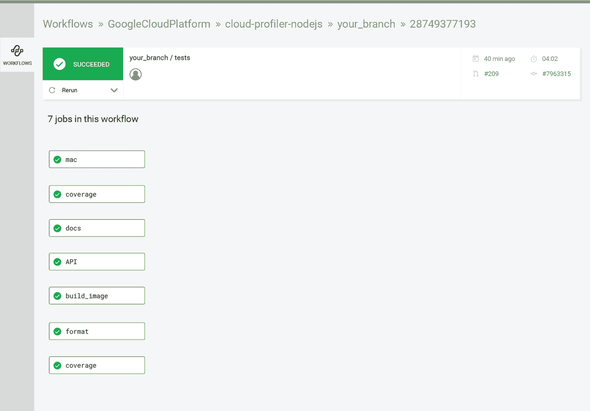
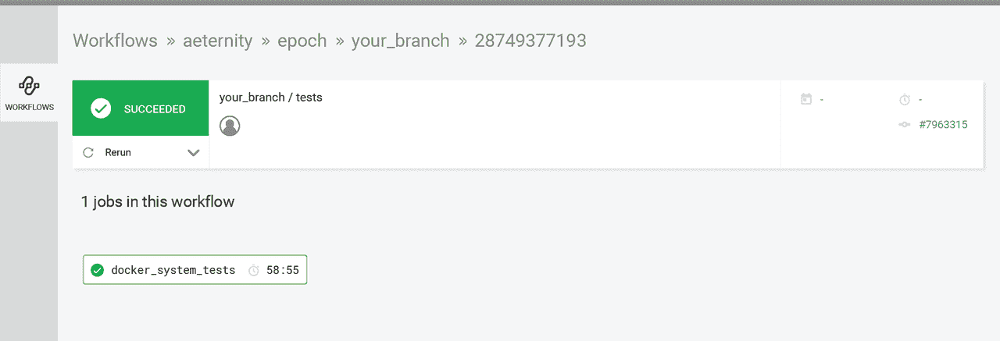
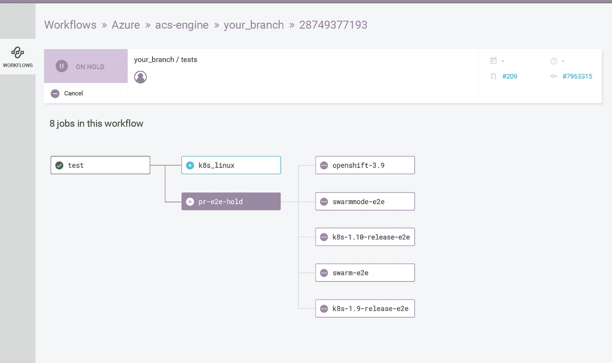

# 工作流的广阔世界:控制圈

> 原文：<https://circleci.com/blog/wide-world-of-workflows-control/>

在我们之前的文章中，我们探讨了[作业编排](https://circleci.com/blog/wide-world-of-workflows-job-orchestration/)的好处，或者你是一次运行一个作业还是并行运行；以及[多执行者工作流](https://circleci.com/blog/wide-world-of-workflows-multi-executor-support/)，这是一个让您在一个工作流中跨不同平台、语言和资源类运行作业的功能。现在，我们将探索各种方法来进一步控制您的工作流，使用分支和标签过滤，以及不同的批准选项。

## 什么是过滤？

有时候，在每次推送时构建整个工作流并不理想。例如，希望仅从特定分支(即主服务器)进行部署，或者如果您有一个大型 monorepo 并希望节省时间。解决这个问题的一个方法是过滤。

工作流中存在两种类型的过滤器:[按分支过滤](https://circleci.com/docs/workflows/#branch-level-job-execution)和[按标签过滤](https://circleci.com/docs/workflows/#git-tag-job-execution)。

分支和标记筛选是控制作业何时运行的方法。通过过滤，您可以为您定义的分支或标记部署或运行测试。这意味着您可以设置一个过滤器，说明“仅在满足此条件时运行此作业”。使用筛选器，您可以创建规则并仅基于这些标准运行作业。这些标准可以在作业配置本身下定义。例如:如果您想从您的默认分支部署到生产，您可以使用过滤来过滤所有其他分支并阻止它们运行。您可以创建条件和规则，仅从您选择的分支或标记运行部署作业。

*注意:*分支和标签过滤器可以在特定于作业和特定于工作流的级别上运行。关于工作流级过滤的例子，请看我们的 [CircleCI 图片](https://circleci.com/gh/circleci/circleci-images)。

 *参见 DataDog 的 config.yml [此处](https://github.com/DataDog/dd-trace-java/tree/master/.circleci)*

把标签想象成书签。您的 git 提交历史一直都在发生，您可以将标记放在您可能想要返回的关键位置。DataDog 正在使用标签[来标记他们的版本](https://github.com/DataDog/dd-trace-java/releases)，因此他们的团队和他们的客户都可以跟踪版本和发行说明。标签有助于保存重要事物的历史记录。

在这个例子中，他们使用标记来运行所有的作业，除了他们的`publish_master`作业，它只为他们的主分支运行。当它们推送时，它们会推送一个 git 标签，这会触发一个工作流及其后续作业。如果标记与配置中该标记的正则表达式中定义的模式匹配，则执行工作流及其后续作业。

_ 见谷歌云的 config.yml [这里 _](https://github.com/GoogleCloudPlatform/cloud-profiler-nodejs/tree/master/.circleci)

在这个例子中，在 Google Cloud 上工作的团队正在对他们所有工作的标签进行正则表达式匹配。运行作业时，团队不仅可以定义分支级别的过滤器，还可以定义标记级别的过滤器。在 Google Cloud 的例子中，他们使用正则表达式来匹配他们的标签:匹配正则表达式的标签就是将要构建的标签。与这些表达式不匹配的工作将不会建立。

 *见[此处](https://github.com/aeternity/epoch/blob/master/.circleci/config.yml)。*

在这里，Aeternity 团队使用调度功能在不同的时间为不同的分支机构运行工作流。在这个例子中，他们在晚上运行他们的`integration_deploy`工作，同时在午夜运行系统测试。对于您希望在特定时间运行的作业，以及长时间运行的作业，将它们安排在工作日结束时运行可能是一个明智的选择，因为您知道您将有足够的带宽。例如，如果你有两个容器，你要在中午运行这些作业，你的团队可能会发现他们在容器上等待，而你[永远不希望你的团队在机器上等待](https://circleci.com/blog/mathematical-justification-for-not-letting-builds-queue/)。

### 例 4: [天蓝色](https://github.com/Azure/acs-engine/blob/master/.circleci/config.yml)

 *见 Azure 的 config.yml [此处](https://github.com/Azure/acs-engine/blob/master/.circleci/config.yml)。*

该团队正在运行两种不同的工作流:其 PRs 的工作流和其主分支的工作流。在名为`build_and_test_PR`的工作流中，他们使用手动批准特性来控制在不同 Kubernetes 环境中运行的作业。这样，他们就不会在每次提交时都运行作业，而是在手动批准后才运行作业。一旦这些工作被批准，他们将会遇到所有不同的 Kubernetes 环境。使用手动批准对长时间运行的作业或非常耗费资源的作业很有好处。此外，在呼叫第三方服务或试图保护计算时，批准也很方便。在这些情况下，您可以设置您的工作，以便来自 QA 或产品团队的批准者需要给予许可。

我们已经向您展示了如何建立工作流的各种方式的示例，以利用各种[作业编排](https://circleci.com/blog/wide-world-of-workflows-job-orchestration/)设置，在[多个平台和跨执行者](https://circleci.com/blog/wide-world-of-workflows-multi-executor-support/)运行工作流，以及[控制运行作业的流程](https://circleci.com/blog/wide-world-of-workflows-control/)。在我们系列的下一篇文章中，我们将看看我们自己的工作流程，向您展示[我们如何构建 Docker 便利图像](https://circleci.com/blog/wide-world-of-workflows-how-we-build-our-docker-convenience-images/)。