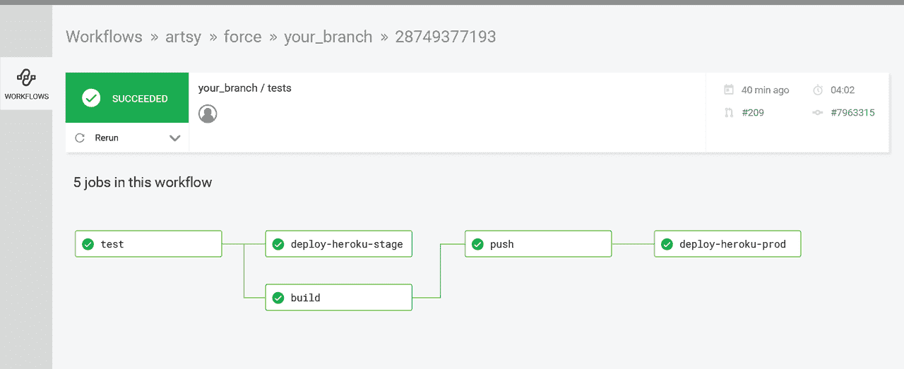
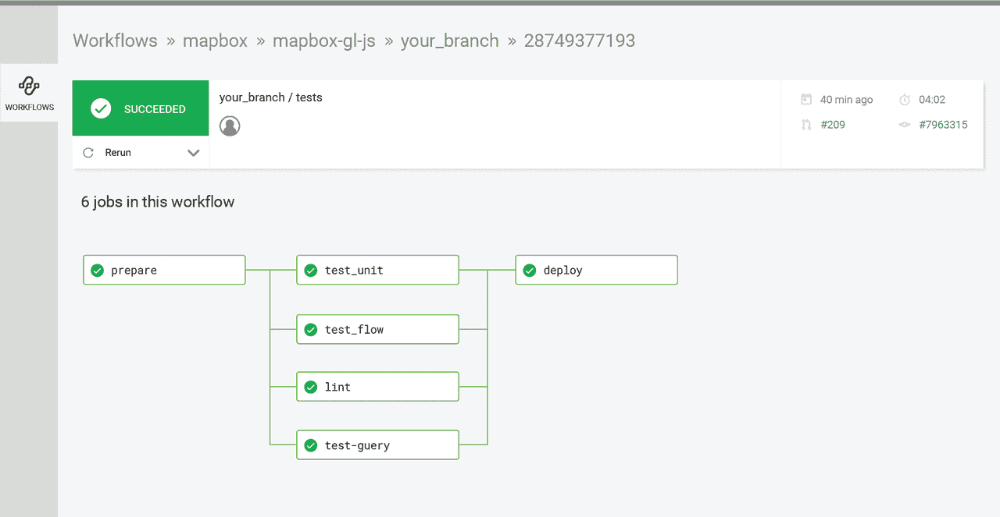

# 工作流程-作业编排| CircleCI

> 原文：<https://circleci.com/blog/wide-world-of-workflows-job-orchestration/>

我们构建了工作流，让团队可以自由地以他们选择的任何方式运行他们的构建。工作流支持大量的定制，但是也需要做出许多决定:您应该选择顺序作业还是并行作业？你应该如何处理跨多种语言的测试？如果测试失败，您应该设置任何自动操作吗？

我们希望展示工作流可以为您做的许多事情中的一些。但是，我们并不只是告诉您如何设置配置，而是想向您展示真正的开发团队现在是如何使用工作流来发布应用程序的。因此，我们梳理了许多使用 CircleCI 2.0 的开源项目，以便让您访问这些团队正在使用的真实配置文件。如果你看到对你的团队有用的东西，你会知道它是如何建立的。

我们将这些例子分成三种类型的任务，其中有一个额外的帖子:

1.  工作协调(此职位)
2.  [多执行者](https://circleci.com/blog/wide-world-of-workflows-multi-executor-support/)
3.  [控制](https://circleci.com/blog/wide-world-of-workflows-control/)
4.  [我们如何在 CircleCI 使用工作流程](https://circleci.com/blog/wide-world-of-workflows-how-we-build-our-docker-convenience-images/)

在接下来的四篇博文中，我们将带您了解工作流的各种配置以及团队使用它们的原因。

## 工作流基础

对于不熟悉工作流的人，我们来定义一些关键术语:

*   工作流定义工作(如构建、测试、部署)如何运行的一组规则，给予团队对软件开发过程的细粒度控制
*   作业是步骤的集合和运行它们的执行环境
*   单步执行可执行命令

好了，让我们来看看一些工作流程！

## 开源示例

我们要探索的第一个概念是作业编排，或者说，设置您的作业是顺序运行还是并行运行。这两者都有很好的理由，所以让我们探讨一些例子。

### 例 1: [Artsy](https://github.com/artsy/force/blob/master/.circleci/config.yml)

 *见 Artsy 的 config.yml [这里](https://github.com/artsy/force/blob/master/.circleci/config.yml)。*

这是顺序工作流的一个例子(尽管不完全是顺序的——它们并行运行它们的`deploy_heroku`和`build`任务)。他们的工作流包含一个简单的构建-测试-部署序列，在此序列中，他们在部署到生产环境之前先部署到试运行环境。如果您有兴趣在构建和部署之前运行您的测试，或者从部署到试运行和生产，这是一个很好的例子。顺序运行的一个好处是，如果您在部署到登台时发现了问题，您可以在进一步操作之前解决该问题。使用顺序作业，您可以获得增量反馈，并可以在任何阶段进行更改。

 *见 Mapbox 的 config.yml [这里](https://github.com/mapbox/mapbox-gl-js/blob/master/circle.yml)。*

在这个例子中，Mapbox 跨多个作业运行测试，以获得更快的反馈。他们同时运行集成测试、单元测试和代码 lint 测试，以便在合并到主测试和部署之前获得不同测试套件的反馈。这将推荐给那些希望通过一次推送运行所有测试来优化测试套件总运行时间的团队。对于大多数团队来说，这是一个很好的选择。

一些附加说明:

如果您听说过术语扇入和扇出，我们已经讨论过它们的作用了！在 Mapbox 的例子中，他们从`prepare`作业开始工作流，然后分散到并行运行的测试套件中，然后再回到`deploy`作业中。

如果我的测试失败了怎么办？

无论您选择并行运行还是顺序运行，如果您遇到一个或多个作业失败的问题，您会怎么做？

有几个选项:

*   *从头重新运行:*您可以使用相同的提交来触发新的工作流，从而从头重新运行您的工作流。
*   *从失败重新运行:*如果您认为您有一个不可靠的测试，或者您有一个没有正确部署的作业，您不必重新运行整个工作流。相反，只要从失败的工作开始。

使用作业协调选项可以更快地获得关于哪些工作正常、哪些工作失败的反馈，以便您可以快速做出更改并继续发货。在我们博客系列的下一篇文章中，我们将会看到使用[多执行者工作流](https://circleci.com/blog/wide-world-of-workflows-multi-executor-support/)的开源项目。