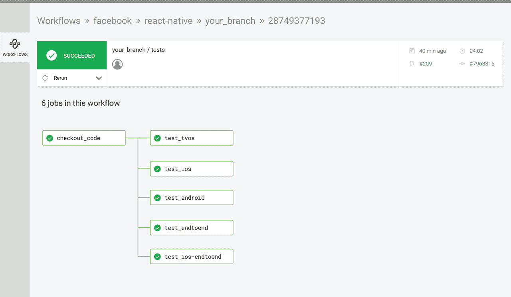
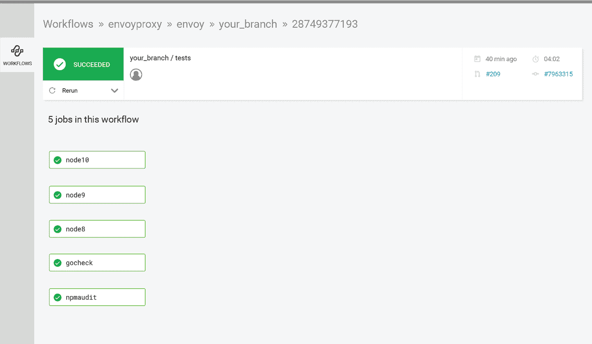

# 工作流-多执行者| CircleCI

> 原文：<https://circleci.com/blog/wide-world-of-workflows-multi-executor-support/>

在我们的[上一篇文章](https://circleci.com/blog/wide-world-of-workflows-job-orchestration/)中，我们讨论了并行和顺序作业编排，以及为什么团队可能会选择其中之一。在本帖中，我们将深入探讨多执行器工作流。

## 我们所说的多遗嘱执行人是什么意思？

我们有时称之为多平台支持，这意味着您可以灵活地在 Linux 或 macOS 等不同平台上运行您的作业。工作流为团队提供了相同的模块性，以便在相同的工作流中运行不同的语言。此外，它们允许您从多个资源类中进行选择，以适合您的工作。

## 什么是资源类？

资源类使您能够为每个作业配置 CPU 和 RAM。这意味着您可以选择所需的电量。我们经常听到客户说，内存限制会导致他们的测试失败，或者导致他们的构建过程变得非常慢，或者耗尽他们的 RAM，从而导致浏览器崩溃。有了资源类，你可以在需要的地方选择一个大容器，在不需要的地方选择一个小容器。

 *见脸书的 [config.yml](https://circleci.com/docs/sample-config/) [此处](https://github.com/facebook/react-native/tree/master/.circleci)。*

脸书 React 的仪表板是跨多个平台运行作业的工作流[的例子。在检查完代码后，他们正在 Android、iOS、tvOS 上运行测试，并运行端到端测试。这有助于团队同时从不同平台获得反馈。对于上下文，在 CircleCI 1.0 中，您必须将其中的每一个作为不同的构建来运行，但现在通过工作流的组合和在作业中启用不同的平台，您可以一次推送并在多个平台上测试。如果您的团队正在构建跨多个平台的应用程序，这将是一个不错的选择。](https://circleci.com/docs/api-job-trigger/)

给 Android 开发者的特别提示:脸书 React 在更大的机器上运行他们的工作，以考虑 Android 开发经常带来更多内存需求的事实。这项工作运行在一个比其他工作更大的机器上。

 *见特使代理的 config.yml [此处](https://github.com/envoyproxy/envoy/tree/master/.circleci)。*

Envoy Proxy 是团队如何利用多平台工作流从不同平台的不同语言获得反馈的另一个例子。只需轻轻一推，他们就可以跨多个平台(macOS 和 Linux)进行测试。他们使用或大或小的资源类，并在不同的环境中进行测试，以查看跨平台的工作是否如预期的那样。使用 CircleCI 资源类，您可以同时在一个大机器和一个小机器上运行——因为对所有作业使用一个大机器并不总是最明智的选择。在这个例子中，Envoy Proxy 的所有 Linux 作业都使用 XL 资源，而其中一个计算不太密集的作业使用一个小的资源类。现在使用这种多平台工作流，他们可以一次推送，同时在两个平台上构建，同时还可以跨所有工作进行测试。

我们已经看了几个例子，展示了团队如何跨多种语言、操作系统运行，以及如何利用各种资源类来适应特定的工作。

在我们的下一篇文章中，我们将探索[流程控制](https://circleci.com/blog/wide-world-of-workflows-control/):在你的工作流程中使用过滤和批准的不同方式。