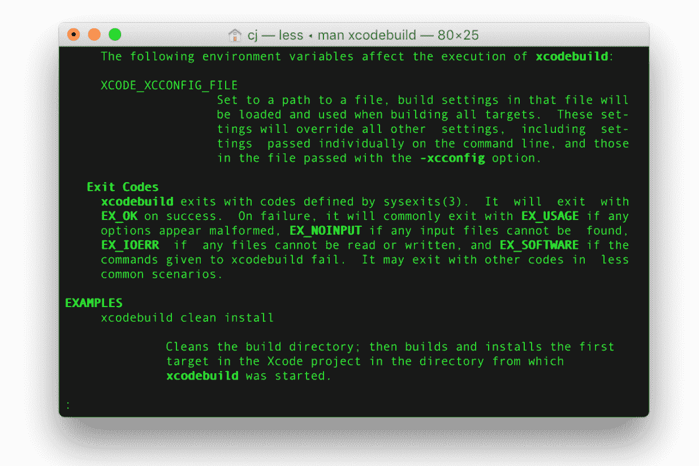
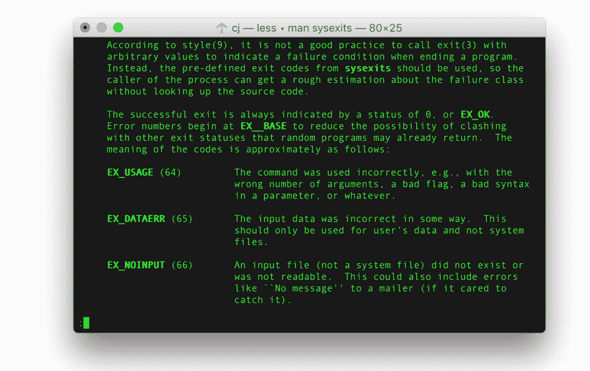

# xcodebuild -退出代码 65 | CircleCI

> 原文：<https://circleci.com/blog/xcodebuild-exit-code-65-what-it-is-and-how-to-solve-for-ios-and-macos-builds/>

## `xcodebuild`退出代码 65:

这四个字吓到了任何 CI 系统经验的 iOS 和 macOS 开发者。你们中的一些人可能在使用 Xcode 的时候已经看到了，但是没有意识到，因为 Xcode 对你们隐藏了那些错误代码。

为了防止`xcodebuild`返回没有任何错误信息的退出代码，我们必须理解退出代码 65 实际上指的是什么。

如果你在你选择的终端模拟器中输入`man xcodebuild`并滚动到(几乎)底部，你会在用法示例前看到这一小段:



这个小提示将我们带到了`sysexits`手册页。像 HTTP 状态码 200 OK，404 Not Found 或者 [418 我是茶壶](https://en.wikipedia.org/wiki/Hyper_Text_Coffee_Pot_Control_Protocol)，常见的可执行返回码都定义在`sysexits.h`头文件中。常见的退出代码是退出代码 65 或错误数据输入。



知道了这一点，我们就可以研究为什么`xcodebuild`似乎喜欢用代码 65 退出。

`xcodebuild`无疑是一个复杂的软件，本质上是类固醇上的`make` (1)。它决定了你的项目或工作空间的结构，并将所有的东西连同正确的标志一起交给编译器。日志中的单个命令的长度可以从 50 个字符到填满在 27 英寸 iMac 上以全屏模式运行的整个 Safari 窗口。

如果事情没有按照预期的方式进行(这种情况经常发生)，它将返回退出代码 65。最令人沮丧的是`xcodebuild`很少为它无法处理的问题留下任何上下文。我们在[与其中一种情况斗争了将近一年](https://discuss.circleci.com/t/xcode-exit-code-65/4284/13)。

每当`xcodebuild`执行完它的一个动作(清理、构建、测试、分析等等)，下一个动作就会立即执行，没有任何准备。此时，启动固定超时计数器。如果您的硬件不够快，在 iOS 模拟器有机会完全启动之前，这些超时将达到 0。

这个问题在一些设置中变得更加严重，因为 iOS 模拟器会在后台线程上启动，如果另一个线程中有更重要的事情发生，它会被降低优先级。一旦超时值达到 0，`xcodebuild`就会尝试几次连接 iOS 模拟器，但都失败了。这是因为`xcodebuild`坐在编译好的二进制和模拟器之间，所以不知道底层硬件的速度，也不一定能恢复。

在您的本地机器上，您可以通过翻白眼、叹气并再次按下 CMD+U 来解决这个问题。但是在 CircleCI 上，我们的系统关闭了所有的东西并回收了你上一次构建运行的虚拟机。

在正常的开发工作流程中，没有 Xcode 通用的派生数据文件夹或其他文件。工作目录将不存在，也不会运行任何 iOS 模拟器。在 CircleCi 上开始一个新的构建时，我们会面临同样的问题,`xcodebuild`可能无法从未知状态中恢复并返回退出代码 65。

缓解这一问题的最佳方法是借助工具的命令行工具，尽早启动 iOS 模拟器。这将引导 iOS 模拟器并立即返回，因此`xcodebuild`可以开始编译您的代码。我们通常建议与依赖步骤分开进行，以提醒您未来的自己/同事这是一个至关重要的构建步骤——就像通过 Carthage 获取依赖或更新 fastlane 一样重要。

```
dependencies:
  pre:
    - xcrun instruments -w 'iPhone 7 (10.3)' || sleep 15 
```

这个`sleep 15`很重要，有两个原因:它给 iOS 模拟器一些完全启动的喘息空间，并返回一个 0 退出代码。在不使用`set -o pipefail`的情况下将命令链接在一起时，将返回最后一个命令的退出代码，并忽略之前命令的代码。CircleCI 查找构建步骤的退出代码以确定成功/失败。排除睡眠命令将意味着`xcrun instruments`将返回一个非零退出代码，因为`-t`(模板)标志没有通过。

希望这个对臭名昭著的`xcodebuild`退出代码 65 的解释能让你对为什么`xcodebuild`会做这些事情有所了解。每当你看到这个代码，`xcodebuild`就遇到了一个不可恢复的问题。我们将继续与苹果的开发者工具团队紧密合作，使开发者工具链更快、更稳定。